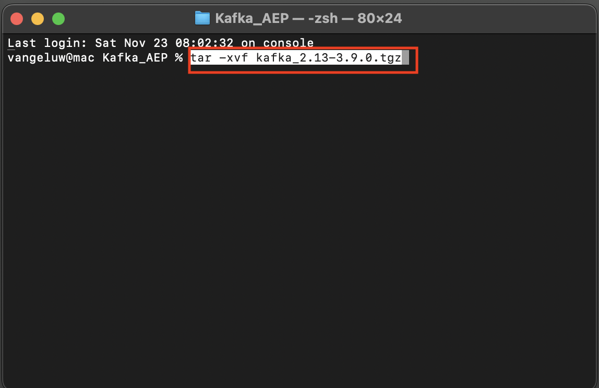

# 2.6.2 Instalar e configurar o cluster Kafka

## Baixar Apache Kafka

Acesse [https://kafka.apache.org/downloads](https://kafka.apache.org/downloads) e baixe a versão mais recente lançada. Selecione a versão binária mais recente, neste caso **3.9.0**. O download será iniciado.

Crie uma pasta na área de trabalho chamada **Kafka_AEP** e coloque o arquivo baixado nesse diretório.

Abra uma janela do **Terminal** clicando com o botão direito do mouse em sua pasta e clicando em **Novo Terminal na Pasta**.

Execute este comando na janela Terminal para descompactar o arquivo baixado:

`tar -xvf kafka_2.13-3.9.0.tgz`

>[!NOTE]
>
>Verifique se o comando acima corresponde à versão do arquivo que você baixou. Se sua versão for mais recente, será necessário atualizar o comando acima para corresponder a essa versão.

Você verá isto:

Depois de descompactar esse arquivo, você terá um diretório como este:

E nesse diretório, você verá estes subdiretórios:

Volte para a janela do Terminal. Digite o seguinte comando:

`cd kafka_2.13-3.9.0`

>[!NOTE]
>
>Verifique se o comando acima corresponde à versão do arquivo que você baixou. Se sua versão for mais recente, será necessário atualizar o comando acima para corresponder a essa versão.

Em seguida, insira o comando `bin/kafka-topics.sh`.

Você deverá ver essa resposta. Isso significa que o Kafka está instalado corretamente e que o Java está funcionando bem. (Lembrete: você precisa do JDK Java 23 instalado para que isso funcione!). Você pode ver qual versão do Java foi instalada usando o comando `java -version`.)

## Iniciar o Kafka

Para iniciar o Kafka, você precisará iniciar o Kafka Zookeeper e o Kafka, nesta ordem.

Abra uma janela do **Terminal** clicando com o botão direito do mouse na sua pasta **kafka_2.13-3.9.0** e clicando em **Novo Terminal na Pasta**.

Digite este comando:

`bin/zookeeper-server-start.sh config/zookeeper.properties`

Você verá isto:

Mantenha essa janela aberta enquanto você passa por esses exercícios!

Abra outra nova janela do **Terminal** clicando com o botão direito do mouse na sua pasta **kafka_2.13-3.9.0** e clicando em **Novo Terminal na Pasta**.

Digite este comando:

`bin/kafka-server-start.sh config/server.properties`

Você verá isto:

Mantenha essa janela aberta enquanto você passa por esses exercícios!

## Criar um tópico do Kafka

Abra uma janela do **Terminal** clicando com o botão direito do mouse na sua pasta **kafka_2.13-3.9.0** e clicando em **Novo Terminal na Pasta**.

Digite este comando para criar um novo tópico do Kafka com o nome **aeptest**. Este tópico será usado para testes neste exercício.

`bin/kafka-topics.sh --create --topic aeptest --bootstrap-server localhost:9092`

Você verá uma confirmação:

Digite este comando para criar um novo tópico do Kafka com o nome **aep**. Este tópico será usado pelo Adobe Experience Platform Sink Connector, que será configurado nos próximos exercícios.

`bin/kafka-topics.sh --create --topic aep --bootstrap-server localhost:9092`

Você verá uma confirmação semelhante:

## Produzir eventos

Volte para a janela Terminal na qual você criou seu primeiro tópico do Kafka e digite o seguinte comando:

`bin/kafka-console-producer.sh --broker-list 127.0.0.1:9092 --topic aeptest`

Você verá isso. Toda nova linha seguida do pressionamento do botão Enter resultará no envio de uma nova mensagem para o tópico **aeptest**.

Digite `Hello AEP` e pressione Enter. O primeiro evento foi enviado para a instância local do Kafka, para o tópico **aeptest**.

Digite `Hello AEP again.` e pressione Enter.

Digite `AEP Data Collection is the best.` e pressione Enter.

Agora você produziu 3 eventos no tópico **aeptest**. Esses eventos agora podem ser consumidos por um aplicativo que pode precisar desses dados.

No teclado, clique em `Control` e `C` ao mesmo tempo para fechar o produtor.

## Eventos de consumo

Na mesma janela Terminal que você usou para produzir eventos, digite o seguinte comando:

`bin/kafka-console-consumer.sh --bootstrap-server 127.0.0.1:9092 --topic aeptest --from-beginning`

Em seguida, você verá todas as mensagens produzidas no exercício anterior para o tópico **aeptest**, exibidas no consumidor. É assim que o Apache Kafka funciona: um produtor cria eventos em um pipeline e um consumidor consome esses eventos.

No teclado, clique em `Control` e `C` ao mesmo tempo para fechar o produtor.

Neste exercício, você passou por todas as noções básicas para configurar um cluster Kafka local, criar um tópico Kafka, produzir eventos e consumir eventos.

O objetivo deste módulo é simular o que aconteceria se uma organização real já tivesse implementado um cluster Apache Kafka e quisesse transmitir dados de seu cluster Kafka para o Adobe Experience Platform.

Para facilitar essa implementação, um Conector de coletor do Adobe Experience Platform foi criado e pode ser implementado usando o Kafka Connect. Você pode encontrar a documentação do Adobe Experience Platform Sink Connector aqui: [https://github.com/adobe/experience-platform-streaming-connect](https://github.com/adobe/experience-platform-streaming-connect).

Nos próximos exercícios, você implementará tudo o que precisa para usar esse Conector do Adobe Experience Platform Sink de dentro de seu próprio cluster Kafka local.

Feche a janela do terminal.

Você concluiu este exercício.

## Próximas etapas

Ir para [2.6.3 Configurar ponto de extremidade da API HTTP no Adobe Experience Platform](./ex3.md){target="_blank"}

Voltar para [Transmitir dados do Apache Kafka para o Adobe Experience Platform](./aep-apache-kafka.md){target="_blank"}

Voltar para [Todos os módulos](./../../../../overview.md){target="_blank"}
