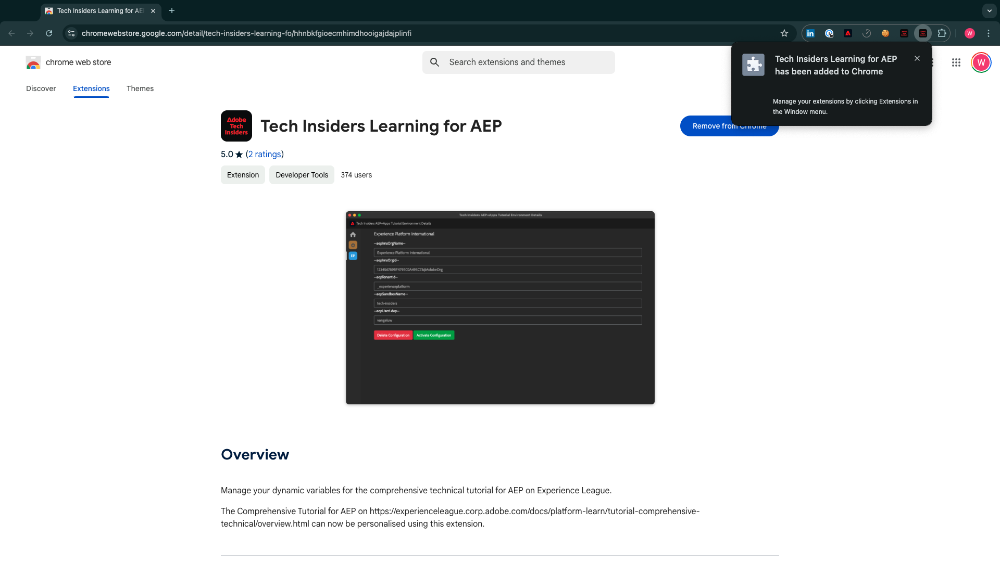
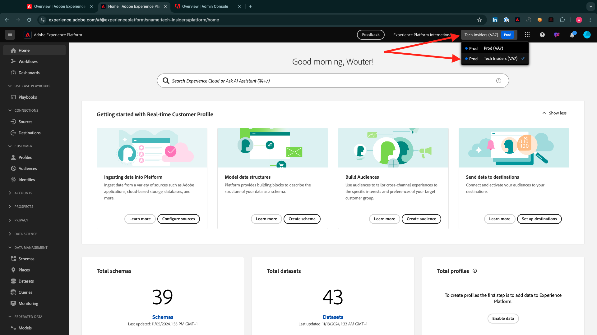

# Introdução

Você precisa ter os seguintes aplicativos instalados no computador antes de seguir este tutorial:

- Adobe Creative Cloud
- Photoshop 2025
- Postman

## 1. Instale a extensão Chrome para a documentação do Experience League

### Sobre a extensão do Chrome

A documentação se tornou genérica para que possa ser facilmente reutilizada por qualquer pessoa, usando qualquer instância de Adobe.
Para tornar a documentação reutilizável, **As Variáveis de ambiente** foram introduzidas na documentação, o que significa que você encontrará os **espaços reservados** abaixo na documentação. Cada espaço reservado é uma variável específica de um ambiente específico, e a extensão do Chrome alterará essa variável para que você possa copiar facilmente o código e o texto das páginas de tutorial e colá-los nas várias interfaces de usuário que você usará como parte do tutorial.

Um exemplo desses valores pode ser encontrado abaixo. Atualmente, esses valores ainda não podem ser usados, mas assim que você instalar e ativar a extensão do Chrome, verá essas variáveis mudarem para um texto normal que pode ser copiado e reutilizado.

| Nome | Chave |
|:-------------:| :---------------:|
| ID organizacional IMS | `--aepImsOrgId--` |
| ID do locatário da AEP | `--aepTenantId--` |
| Nome da sandbox da AEP | `--aepSandboxName--` |
| LDAP do perfil do aluno | `--aepUserLdap--` |

Como exemplo, na captura de tela abaixo, você pode ver uma referência a `aepTenantId`.

Depois que a extensão for instalada, esse mesmo texto será alterado automaticamente para refletir os valores específicos da instância.

### Instalar a extensão do Chrome

Para instalar essa extensão do Chrome, abra o navegador Chrome e vá para: [https://chromewebstore.google.com/detail/tech-insiders-learning-fo/hhnbkfgioecmhimdhooigajdajplinfi](https://chromewebstore.google.com/detail/tech-insiders-learning-fo/hhnbkfgioecmhimdhooigajdajplinfi). Você verá isso.

Clique em **Adicionar ao Chrome**.

Você verá isso. Clique em **Adicionar extensão**.

A extensão será instalada e você verá uma notificação semelhante.

No menu **extensões**, clique no ícone de **peça do quebra-cabeça** e fixe a extensão **Aprendizado da Plataforma - Configuração** no menu de extensão.

### Configurar a extensão do Chrome

Vá para [https://experienceleague.adobe.com/en/docs/platform-learn/tutorial-comprehensive-technical/overview](https://experienceleague.adobe.com/en/docs/platform-learn/tutorial-comprehensive-technical/overview) e clique no ícone de extensão para abri-lo.

Você então verá esse pop-up. Clique no ícone **+**.

Insira os valores, conforme indicado abaixo, que estão relacionados à sua instância do Adobe Experience Platform.

Se você não tiver certeza de quais valores inserir para esses campos, siga a orientação abaixo.

**Nome da Organização IMS da AEP**

Ao fazer logon na instância do Adobe Experience Platform em [https://platform.adobe.com/](https://platform.adobe.com/), você encontrará o nome da instância no canto superior direito da tela.

**ID da Organização IMS da AEP**

A ID da organização IMS é o identificador exclusivo da instância do Adobe Experience Cloud e é referenciada em vários locais neste tutorial.

A localização da ID organizacional IMS pode ser feita de várias maneiras. Caso não tenha certeza, consulte um dos administradores de sistema da sua instância para encontrar a ID.

Talvez você possa encontrá-lo indo até [Admin Console](https://https://adminconsole.adobe.com/), onde você pode encontrá-lo como parte da URL.

Você também pode encontrá-las acessando **Gerenciamento de Dados > Consultas** no menu da AEP, onde você pode encontrá-las em **Nome de usuário**.

Copie e cole a parte **@AdobeOrg** junto com a ID.

**ID do locatário da AEP**

Sua ID de locatário é o identificador exclusivo da instância da AEP da sua organização. Ao fazer logon na instância do Adobe Experience Platform em [https://platform.adobe.com/](https://platform.adobe.com/), você encontrará a ID do locatário na URL.

Ao inseri-lo na extensão do Chrome, você deve garantir que um sublinhado seja adicionado como prefixo. Portanto, neste exemplo, **experienceplatform** torna-se **_experienceplatform**.

**Nome da sandbox da AEP**

O nome da sandbox é o nome do ambiente que você usará na instância da AEP. Ao fazer logon na instância do Adobe Experience Platform em [https://platform.adobe.com/](https://platform.adobe.com/), você encontrará a ID do locatário na URL.

Antes de pegar o nome da sandbox do URL, você deve se certificar de que está na sandbox que deve ser usada para este tutorial. Você pode alternar para a sandbox direita clicando no menu do alternador de sandbox no canto superior direito da tela.

Neste exemplo, o Nome da sandbox da AEP é **tech-insiders**.

**Seu LDAP**

Este é o nome de usuário que será usado como parte do tutorial. Neste exemplo, o LDAP é baseado no endereço de email desse usuário. O endereço de email é **vangeluw@adobe.com**, portanto, o LDAP se torna **vangeluw**.

O LDAP é usado para garantir que a configuração que você fará esteja vinculada a você e não entre em conflito com outros usuários que possam estar usando a mesma instância e sandbox que você está usando.

Seus valores devem ser semelhantes a estes.
Finalmente, clique em **Criar novo**.

No menu esquerdo da extensão, você verá um novo ícone com as iniciais do seu ambiente. Clique nele. Em seguida, você verá o mapeamento entre as **Variáveis de ambiente** e os valores específicos da instância do Adobe Experience Platform. Clique em **Ativar configuração**.

Depois de ativar sua configuração, você verá um ponto verde ao lado das iniciais do ambiente. Isso significa que seu ambiente agora está ativo.

### Verificar conteúdo do tutorial

Como teste, vá para [esta página](https://experienceleague.adobe.com/en/docs/platform-learn/tutorial-comprehensive-technical/datadistiller/module51/ex3).

Agora você deve ver que todas as **Variáveis de ambiente** foram substituídas por seus valores verdadeiros, com base no ambiente ativado na extensão do Chrome.

Agora você deve ter uma exibição semelhante à mostrada abaixo, onde a variável de ambiente `aepTenantId` foi substituída pela sua ID de locatário real da AEP, que neste caso é **_experienceplatform**.

>[!NOTE]
>
>Obrigado por investir seu tempo aprendendo tudo o que há para saber sobre o Adobe Experience Platform e seus aplicativos. Em caso de dúvidas, envie um email para **techinsiders@adobe.com** para compartilhar comentários gerais sobre sugestões para conteúdo futuro. Entre em contato diretamente com o Tech Insiders.

[Voltar a todos os módulos](../../overview.md)
