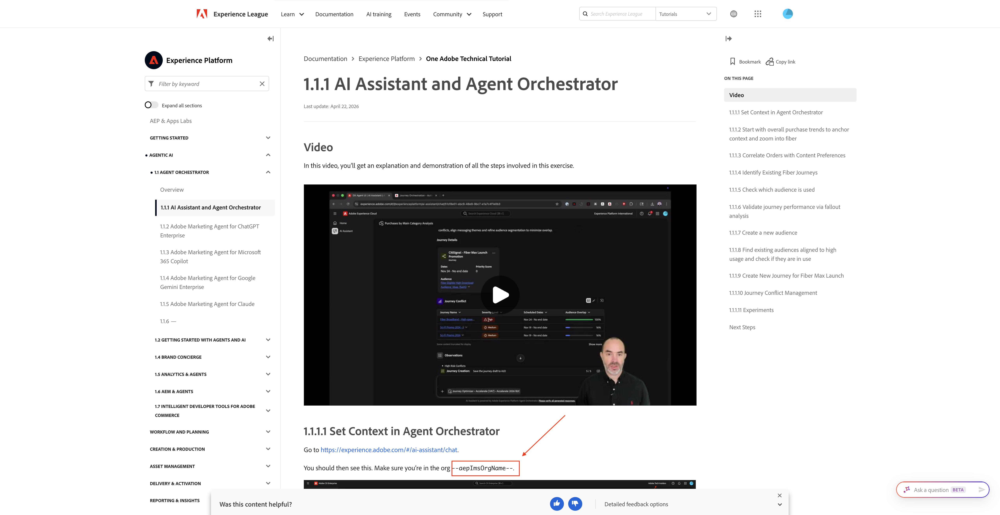
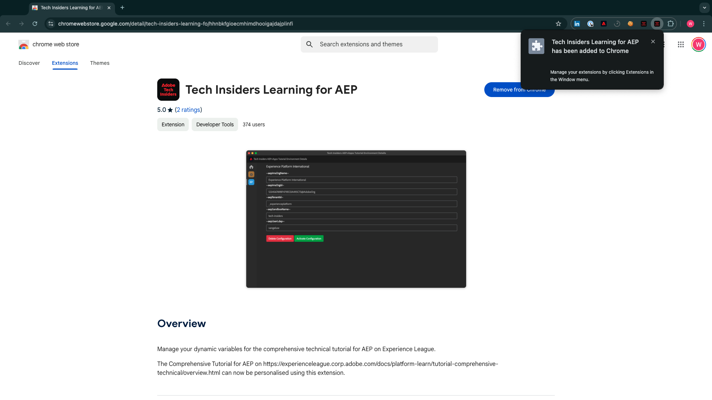
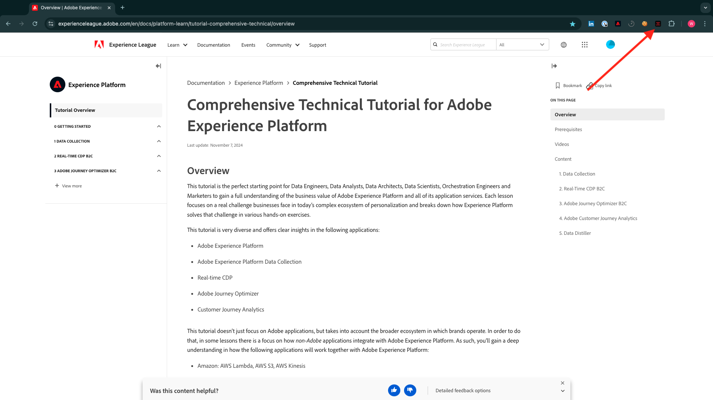
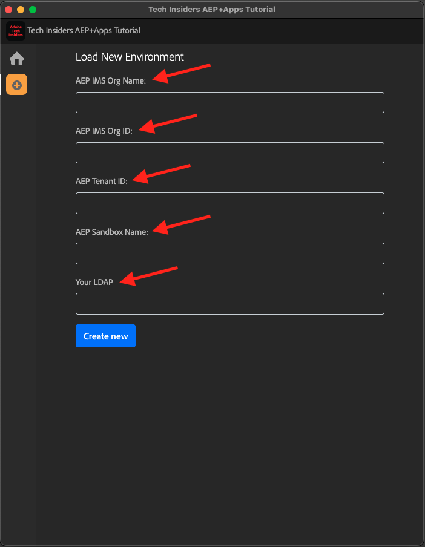

# Instalar a extensão Chrome para a documentação do Experience League

## Sobre a extensão do Chrome

Este tutorial foi tornado genérico para que possa ser facilmente reutilizado por qualquer pessoa, usando qualquer instância do Adobe Experience Cloud.

Para tornar a documentação reutilizável, **As Variáveis de ambiente** foram introduzidas no tutorial, o que significa que você encontrará os **espaços reservados** abaixo na documentação. Cada espaço reservado é uma variável específica de um ambiente específico, e a extensão do Chrome alterará essa variável para que você possa copiar facilmente o código e o texto das páginas de tutorial e colá-los nas várias interfaces de usuário que você usará como parte do tutorial.

Um exemplo desses valores pode ser encontrado abaixo. Atualmente, esses valores ainda não podem ser usados, mas assim que você instalar e ativar a extensão do Chrome, verá essas variáveis mudarem para um texto normal que pode ser copiado e reutilizado.

| Nome | Chave | Exemplo |
|:-------------:| :---------------:| :---------------:|
| ID organizacional IMS | `--aepImsOrgId--` | `907075E95BF479EC0A495C73@AdobeOrg` |
| Nome da organização IMS | `--aepImsOrgName--` | `Adobe Tech Insiders` |
| ID do locatário do AEP | `--aepTenantId--` | `_experienceplatform` |
| Nome da sandbox da AEP | `--aepSandboxName--` | `one-adobe` |
| LDAP do perfil do aluno | `--aepUserLdap--` | `vangeluw` |

Como exemplo, na captura de tela abaixo, você pode ver uma referência a `aepImsOrgName`.

Depois que a extensão for instalada, esse mesmo texto será alterado automaticamente para refletir os valores específicos da instância.

## Instalar a extensão do Chrome

Para instalar essa extensão do Chrome, abra o navegador Chrome e vá para: [https://chromewebstore.google.com/detail/tech-insiders-learning-fo/hhnbkfgioecmhimdhooigajdajplinfi](https://chromewebstore.google.com/detail/tech-insiders-learning-fo/hhnbkfgioecmhimdhooigajdajplinfi){target="_blank"}. Você verá isso.

Clique em **Adicionar ao Chrome**.

Você verá isso. Clique em **Adicionar extensão**.

A extensão será instalada e você verá uma notificação semelhante.

No menu **extensões**, clique no ícone de **peça do quebra-cabeça** e fixe a extensão **Aprendizado da Plataforma - Configuração** no menu de extensão.

## Configurar a extensão do Chrome

Vá para [https://experienceleague.adobe.com/en/docs/platform-learn/tutorial-comprehensive-technical/overview](https://experienceleague.adobe.com/en/docs/platform-learn/tutorial-comprehensive-technical/overview){target="_blank"} e clique no ícone de extensão para abri-lo.

Você então verá esse pop-up. Clique no ícone **+**.

Insira os valores, conforme indicado abaixo, que estão relacionados à sua instância do Adobe Experience Platform.

Se você estiver participando de um dos eventos abaixo, use os valores abaixo conforme indicado.

| Nome | Laboratórios técnicos de parceiros em Nova Orleans | Workshop presencial de insiders técnicos | Ativação sob demanda de Tech Insiders |
|:-------------:| :---------------:| :---------------:|:---------------:|
| ID organizacional IMS | `907075E95BF479EC0A495C73@AdobeOrg` | `907075E95BF479EC0A495C73@AdobeOrg` | `0B6930256441790E0A495FFE@AdobeOrg` |
| Nome da organização IMS | `Adobe Tech Insiders` | `Adobe Tech Insiders` | `CXO Enablement Training LAB` |
| ID do locatário do AEP | `_experienceplatform` | `_experienceplatform` | `_acsultimatesupport` |
| Nome da sandbox da AEP | `one-adobe` | `one-adobe` | `one-adobe` |
| LDAP do perfil do aluno | `XXX` | `XXX` | `XXX` |

**LDAP do Perfil do Aluno**

Este é o nome de usuário que será usado como parte do tutorial. Neste exemplo, o LDAP é baseado no endereço de email desse usuário. Se o endereço de email for **vangeluw@adobe.com**, o LDAP será **vangeluw**.

Se você estiver participando do evento Partner Tech Labs em Nova Orleans, siga a mesma lógica e use a primeira parte de seu endereço de email como LDAP.

O LDAP é usado para garantir que a configuração que você fará esteja vinculada a você e não entre em conflito com outros usuários que possam estar usando a mesma instância e sandbox que você está usando.

Seus valores devem ser semelhantes a esses.
Finalmente, clique em **Criar novo**.

No menu esquerdo da extensão, você verá um novo ícone com as iniciais do seu ambiente. Clique nele. Em seguida, você verá o mapeamento entre as **Variáveis de ambiente** e os valores específicos da instância do Adobe Experience Platform. Clique em **Ativar configuração**.

Depois de ativar sua configuração, você verá um ponto verde ao lado das iniciais do ambiente. Isso significa que seu ambiente agora está ativo.

## Verificar conteúdo do tutorial

Como teste, vá para [esta página](https://experienceleague.adobe.com/en/docs/platform-learn/tutorial-one-adobe/agents/agents1/ex1){target="_blank"}.

Agora você deve ver que todas as **Variáveis de ambiente** desta página foram substituídas por seus valores verdadeiros, com base no ambiente ativado na extensão do Chrome.

Agora você deve ter uma exibição semelhante à abaixo, onde a variável de ambiente `aepSandboxName` foi substituída pelo seu Nome de sandbox real do AEP, que neste caso é **one-adobe**.

## Próximas etapas

Vá para [Aplicativos a serem instalados](./ex2.md){target="_blank"}

Volte para [Introdução - IA de agente](./getting-started-agentic-ai.md){target="_blank"}

Voltar para [Todos os módulos](./../../../overview.md){target="_blank"}
