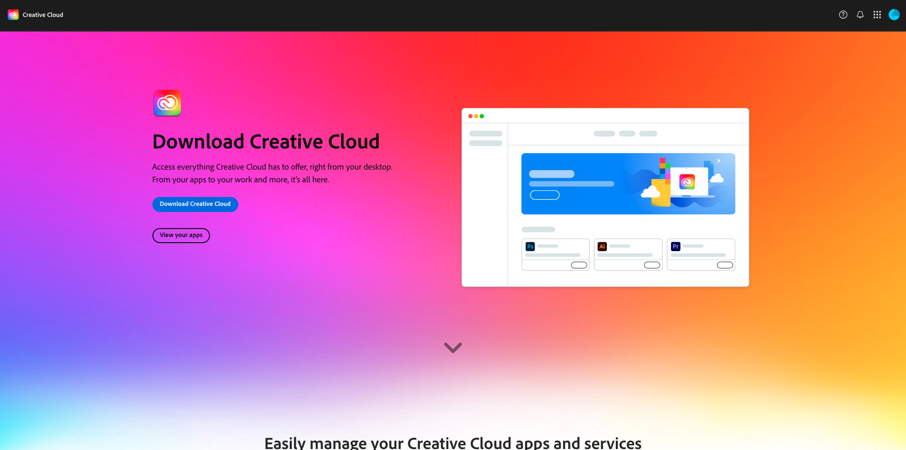
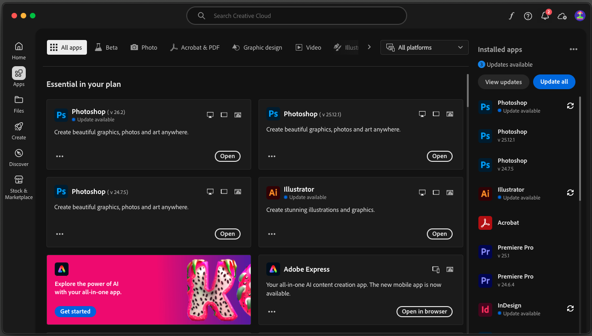

# Aplicativos a serem instalados

Abaixo está uma visão geral dos aplicativos que você precisará ter instalados em seu computador antes de iniciar o tutorial.

## Adobe Creative Cloud

Vá para [https://creativecloud.adobe.com/apps/download/creative-cloud](https://creativecloud.adobe.com/apps/download/creative-cloud){target="_blank"} e clique em **Baixar o Creative Cloud**.

## Adobe Photoshop

Abra o aplicativo **Adobe Creative Cloud**, vá para **Aplicativos**. Instale o Photoshop no computador.

## Código do Visual Studio

Vá para [https://code.visualstudio.com/](https://code.visualstudio.com/){target="_blank"}, baixe e instale o **Visual Studio Code**.

## Editor de texto

Se você não tiver um aplicativo Editor de Texto, acesse [https://www.sublimetext.com/](https://www.sublimetext.com/){target="_blank"} e baixe e instale este Editor de Texto.

## Conta do GitHub

Se você ainda não tiver uma conta do GitHub, acesse [https://github.com/](https://github.com/){target="_blank"} e clique em **Inscrever-se**. Use seu email pessoal e crie sua conta.

## GitHub Desktop

Vá para [https://desktop.github.com/download/](https://desktop.github.com/download/){target="_blank"}, baixe e instale o **Github Desktop**.

Você concluiu o módulo Introdução.

## Próximas etapas

Ir para [Usar seu site da AEM e sandbox da AEP](./ex3.md){target="_blank"}

Volte para [Introdução - IA de agente](./getting-started-agentic-ai.md){target="_blank"}

Voltar para [Todos os módulos](./../../../overview.md){target="_blank"}./images
