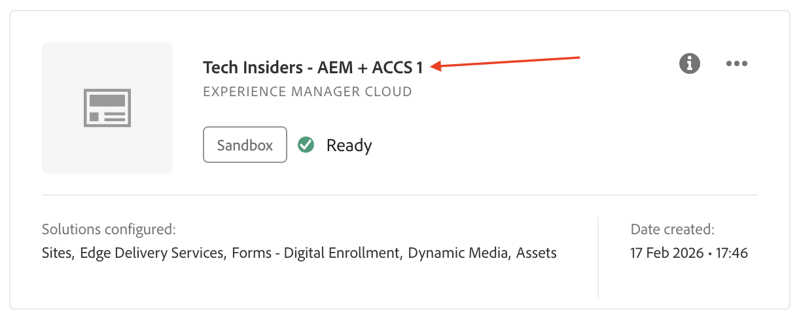
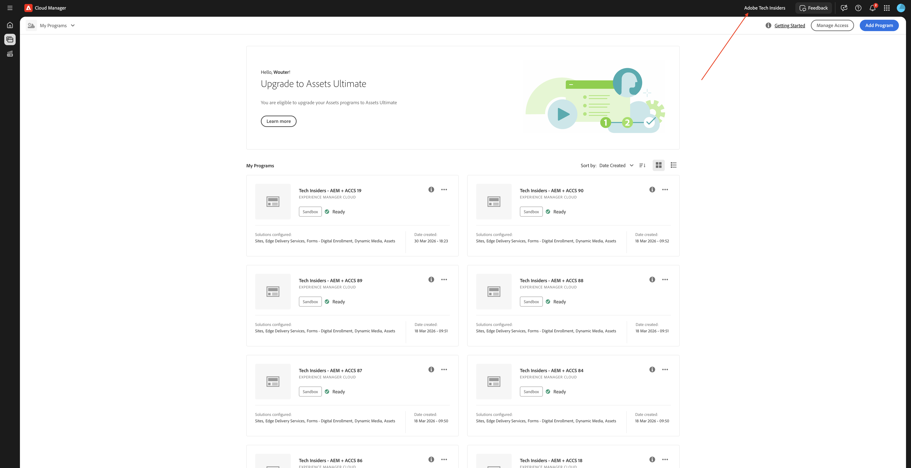
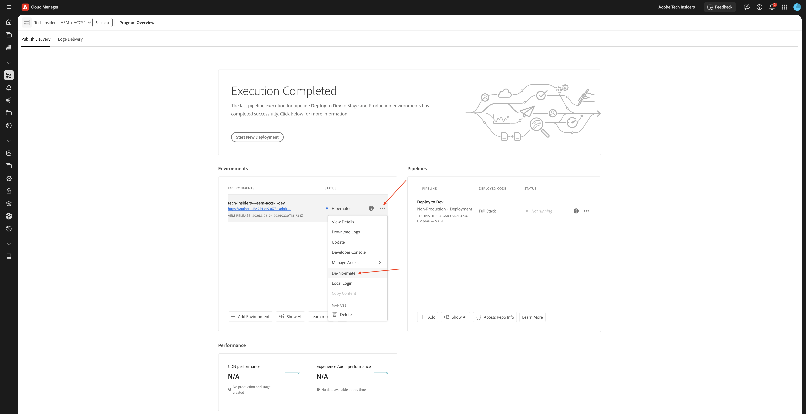
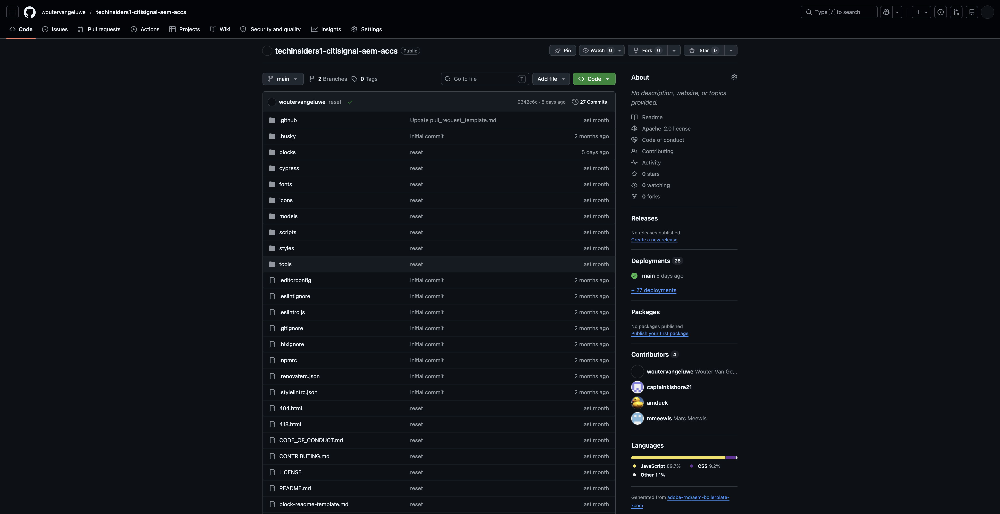
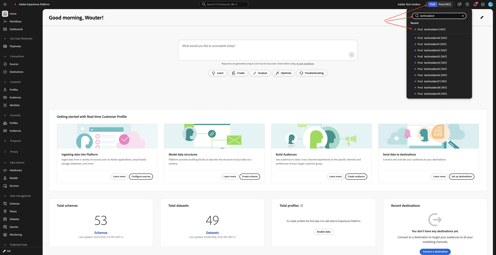

# Use seu site da AEM e a sandbox da AEP

Ao usar os Laboratórios técnicos de IA do Agentic, você usará um programa existente do AEM as a Cloud Service com o Edge Delivery Services. Este programa do AEM as a Cloud Service usando o Edge Delivery Services foi criado para você e já está disponível no início dos Laboratórios técnicos.

## Seu número

Quando você tinha acesso ao ambiente de ativação, um número era atribuído a você. Esse número indicou qual programa do AEM as a Cloud Service você precisa usar e também indica qual sandbox da AEP você precisa usar para o Brand Concierge Tech Lab.

>[!IMPORTANT]
>
>Se você ainda não recebeu esse email, não será possível executar as etapas abaixo. É necessário aguardar até receber o email abaixo antes de acessar os aplicativos Adobe abaixo.

## Seu programa do AEM

>[!NOTE]
>
>Todas as capturas de tela abaixo estão usando o número 1 somente para fins de ilustração. Você precisa usar o número atribuído a você como parte do email recebido ao percorrer as etapas abaixo.

Seu programa do AEM usa o número atribuído a você em seu nome. O nome do programa AEM deve ser um dos seguintes:

- **`Tech Insiders - AEM + ACCS X`** onde X representa o número que foi atribuído a você.
- **`Tech Insiders On Demand - AEM + ACCS X`** onde X representa o número que foi atribuído a você.
- **`--aepUserLdap-- - CitiSignal AEM+ACCS`**, neste caso, você não tem um número porque está usando seu próprio programa AEM que você mesmo criou.

Você pode acessar e encontrar seu programa do AEM acessando [https://experience.adobe.com/cloud-manager/landing.html](https://experience.adobe.com/cloud-manager/landing.html). Verifique se o ambiente selecionado é **`--aepImsOrgName--`**. Você pode verificar isso no canto superior direito da tela.

### Cancelamento da hibernação do programa do AEM

O programa do AEM usado é um programa &quot;sandbox&quot;. As sandboxes da AEM hibernarão automaticamente depois de não serem usadas por algumas horas, o que significa que será necessário cancelar a hibernação dessas sandboxes antes de usá-las. Para cancelar a hibernação de um programa, acesse [https://experience.adobe.com/cloud-manager/landing.html](https://experience.adobe.com/cloud-manager/landing.html). Clique em para abrir o programa.

Você deverá ver isso. Clique nos 3 pontos **...** e selecione **Cancelar hibernação**.

Clique em **Enviar**. O cancelamento da hibernação leva de 10 a 15 minutos.

### Repositório GitHub para seu programa AEM

Cada programa do AEM está usando o Edge Delivery Services para implantar seu site. Isso significa que o código do site é hospedado em um repositório GitHub. O repositório GitHub foi criado para você e pode ser acessado acessando:

**https://github.com/woutervangeluwe/techinsidersX-citisignal-aem-accs**, em que você deve substituir X pelo seu número.

Seu repositório GitHub deve ter esta aparência.

Como parte do processo de integração antes do início das sessões do Tech Lab, você deverá fornecer seu nome de usuário no GitHub. Ao fornecer seu nome de usuário do GitHub, você será adicionado como colaborador ao repositório do GitHub anexado ao seu site para que possa fazer alterações nele.

### Acessar seu site

Para acessar seu site, você pode usar estes URLs padrão:

- **`https://main--techinsidersX-citisignal-aem-accs--woutervangeluwe.aem.page/`**
- **`https://main--techinsidersX-citisignal-aem-accs--woutervangeluwe.aem.live/`**

Você precisa substituir o X nesses URLs pelo número que foi atribuído a você.

Além disso, um nome de domínio personalizado foi criado para cada site, que você pode acessar usando este URL:

- **`https://techinsidersX.adobedemosystem.com/`**

Você precisa substituir o X nesses URLs pelo número que foi atribuído a você.

Você poderá ver seu site, que é semelhante a este:

## Sua sandbox da AEP

>[!NOTE]
>
>Todas as capturas de tela abaixo estão usando o número 1 somente para fins de ilustração. Você precisa usar o número atribuído a você como parte do email recebido ao percorrer as etapas abaixo.

Para o Brand Concierge Tech Lab, é necessário usar uma sandbox específica do AEP. Esta sandbox da AEP é chamada: **techinsidersX**, em que é necessário substituir o X pelo número atribuído a você.

Ir para [https://platform.adobe.com](https://platform.adobe.com). No canto superior direito da tela, abra a lista suspensa para selecionar sua sandbox.

Você só precisa usar essa sandbox para o Brand Concierge Tech Lab.

## Próximas etapas

Volte para [Introdução - IA de agente](./getting-started-agentic-ai.md){target="_blank"}

Voltar para [Todos os módulos](./../../../overview.md){target="_blank"}./images
