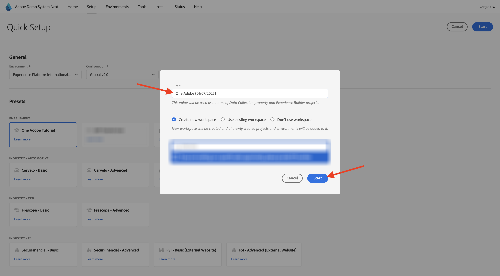

# Use o Sistema de demonstração ao lado para configurar a propriedade do cliente da Coleção de dados da Adobe Experience Platform

Para visualizar os aprendizados neste tutorial e possibilitar que você teste sua configuração em um ambiente seguro, este tutorial está usando as ferramentas Demo System Next do Adobe. Para aproveitar ao máximo esse tutorial, sua instância do AEP precisa ser configurada para ser integrada ao Sistema de demonstração em seguida.

Depois de ter acesso ao Sistema de demonstração em seguida, continue com as etapas abaixo.

Vá para [https://dsn.adobe.com/](https://dsn.adobe.com/){target="_blank"} e navegue até **Instalação**.

Na lista suspensa **Ambiente**, selecione sua instância e sandbox.

Em seguida, selecione a predefinição **Usuário do tutorial do AEP**.

Em seguida, clique em **Iniciar**.

Na janela pop-up, digite um nome para as propriedades da Coleção de dados e os projetos do Experience Builder. Use esta convenção de nomenclatura: **Uma Adobe (DD/MM/AAAA)**. INFO: seu LDAP será anexado automaticamente. Não é necessário adicioná-lo você mesmo.

Clique em **Start**.

Você verá este pop-up, que mostra o progresso ao criar projetos de site e aplicativo móvel e suas propriedades de coleção de dados.

Depois que o processo de configuração rápida for concluído, você terá:

- 1 projeto da web, que possibilita o uso de um site de demonstração com uma marca de demonstração telco
- 1 projeto de aplicativo móvel, que possibilita o uso de um aplicativo móvel de demonstração com uma marca de demonstração telco
- 1 projeto de aplicativo CX, que possibilita o uso de um aplicativo da central de atendimento com uma marca de demonstração telco
- 1 Propriedade de coleção de dados para a Web, que você usará para coletar dados do site
- 1 Propriedade de coleção de dados para dispositivos móveis, que você usará para coletar dados do aplicativo móvel

Mantenha essa tela aberta como você precisará dela nas próximas etapas.

## Próximas etapas

Ir para [Criar sua Sequência de Dados](./ex3.md){target="_blank"}

Volte para [Introdução](./getting-started.md){target="_blank"}

Voltar para [Todos os módulos](./../../../overview.md){target="_blank"}