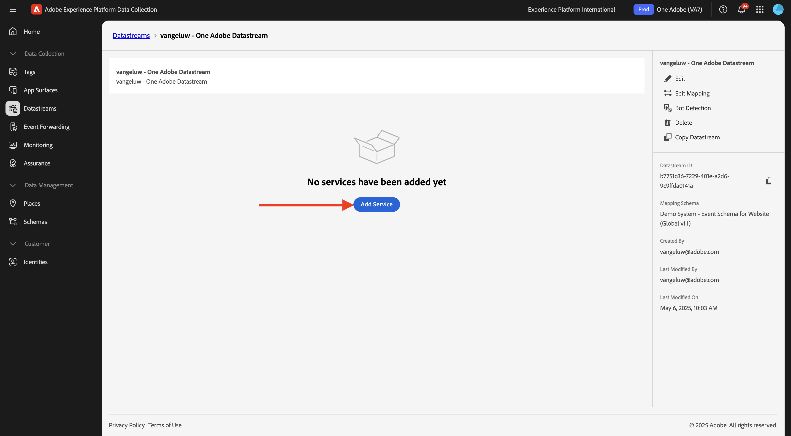
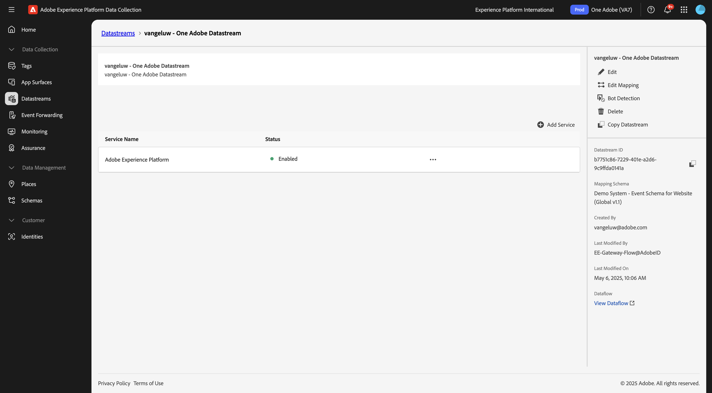

# Criar fluxo de dados

Ir para [https://experience.adobe.com/#/data-collection/](https://experience.adobe.com/#/data-collection/){target="_blank"}.

No menu esquerdo, clique em **[!UICONTROL Marcas]**. Após o exercício anterior, você agora tem três propriedades de Coleção de dados: uma para Web, uma para dispositivos móveis e uma para o aplicativo CX.

Essas propriedades estão quase prontas para serem usadas, mas antes de começar a coletar dados usando essas propriedades, é necessário configurar um fluxo de dados. Você obterá mais informações sobre o conceito de sequência de dados e o que significa em um exercício posterior no módulo Coleção de dados.

Por enquanto, siga estas etapas.

## Criar a sequência de dados para a Web

Clique em **[!UICONTROL Datastreams]**.

No canto superior direito da tela, selecione o nome da sandbox, que deve ser `--aepSandboxName--`.

Clique em **[!UICONTROL Nova sequência de dados]**.

Para o **[!UICONTROL Nome]** e para a descrição opcional, digite `--aepUserLdap-- - One Adobe Datastream`. Para **Esquema de Mapeamento**, selecione **Sistema de Demonstração - Esquema de Evento para Site (Global v1.1)**. Clique em **Salvar**.

Você verá isso. Clique em **Adicionar Serviço**.

Selecione o serviço **[!UICONTROL Adobe Experience Platform]**, que irá expor campos adicionais. Você verá isso.

Para Conjunto de Dados de Evento, selecione **Sistema de Demonstração - Conjunto de Dados de Evento para Site (Global v1.1)** e para Conjunto de Dados de Perfil, selecione **Sistema de Demonstração - Conjunto de Dados de Perfil para Site (Global v1.1)**. Clique em **Salvar**.

Agora vocês verão isto.

No menu esquerdo, clique em **[!UICONTROL Marcas]**.

Filtre os resultados da pesquisa para ver as propriedades da Coleção de dados. Abra a propriedade de **Web** clicando nela.

Você verá isso. Clique em **Extensões**.

Primeiro, clique na extensão Adobe Experience Platform Web SDK e em **Configurar**.

Você verá isso. Consulte o menu **Datastreams** e verifique se a sandbox correta está selecionada, que no seu caso deve ser `--aepSandboxName--`.

Abra a lista suspensa **Datastreams** e selecione a Datastream criada anteriormente.

Selecione sua **Sequência de dados** em todos os três ambientes diferentes. Em seguida, clique em **Salvar**.

Vá para **Fluxo de Publicação**.

Clique em **...** para **Principal** e em **Editar**.

Clique em **Adicionar todos os recursos alterados** e em **Salvar e criar para desenvolvimento**.

As alterações estão sendo publicadas e estarão prontas em alguns minutos, após os quais você verá o ponto verde ao lado de **Principal**.

## Criar a sequência de dados para dispositivos móveis

Ir para [https://experience.adobe.com/#/data-collection/](https://experience.adobe.com/#/data-collection/){target="_blank"}.

Clique em **[!UICONTROL Datastreams]**.

No canto superior direito da tela, selecione o nome da sandbox, que deve ser `--aepSandboxName--`.

Clique em **[!UICONTROL Nova sequência de dados]**.

Para o **[!UICONTROL Nome Amigável]**, e para a descrição opcional, digite `--aepUserLdap-- - One Adobe Datastream (Mobile)`. Para **Esquema de Mapeamento**, selecione **Sistema de Demonstração - Esquema de Evento para Aplicativo Móvel (Global v1.1)**. Clique em **Salvar**.

Clique em **[!UICONTROL Salvar]**.

Você verá isso. Clique em **Adicionar Serviço**.

Selecione o serviço **[!UICONTROL Adobe Experience Platform]**, que irá expor campos adicionais. Você verá isso.

Para o Conjunto de Dados de Evento, selecione **Sistema de Demonstração - Conjunto de Dados de Evento para Aplicativo Móvel (Global v1.1)** e, para o Conjunto de Dados de Perfil, selecione **Sistema de Demonstração - Conjunto de Dados de Perfil para Aplicativo Móvel (Global v1.1)**. Clique em **Salvar**.

Você verá isso.

A sequência de dados agora está pronta para ser usada na propriedade do Cliente da coleção de dados da Adobe Experience Platform para dispositivos móveis.

Vá para **Tags** e filtre os resultados da pesquisa para ver suas duas propriedades de Coleção de dados. Abra a propriedade de **Celular** clicando nela.

Você verá isso. Clique em **Extensões**.

Clique na extensão **Adobe Experience Platform Edge Network** e em **Configurar**.

Você verá isso. Agora é necessário selecionar a sandbox e a sequência de dados corretas que você acabou de configurar. A sandbox a ser usada é `--aepSandboxName--` e a sequência de dados é chamada `--aepUserLdap-- - One Adobe Datastream (Mobile)`.

Para o **domínio do Edge Network**, use o domínio padrão.

Clique em **Salvar** para salvar as alterações.

Vá para **Fluxo de Publicação**.

Clique no **...** ao lado de **Principal** e em **Editar**.

Clique em **Adicionar todos os recursos alterados** e em **Salvar e criar para desenvolvimento**.

As alterações estão sendo publicadas e estarão prontas em alguns minutos, após os quais você verá o ponto verde ao lado de **Principal**.

## Próximas etapas

Ir para [Usar o site](./ex4.md){target="_blank"}

Volte para [Introdução](./getting-started.md){target="_blank"}

Voltar para [Todos os módulos](./../../../overview.md){target="_blank"}