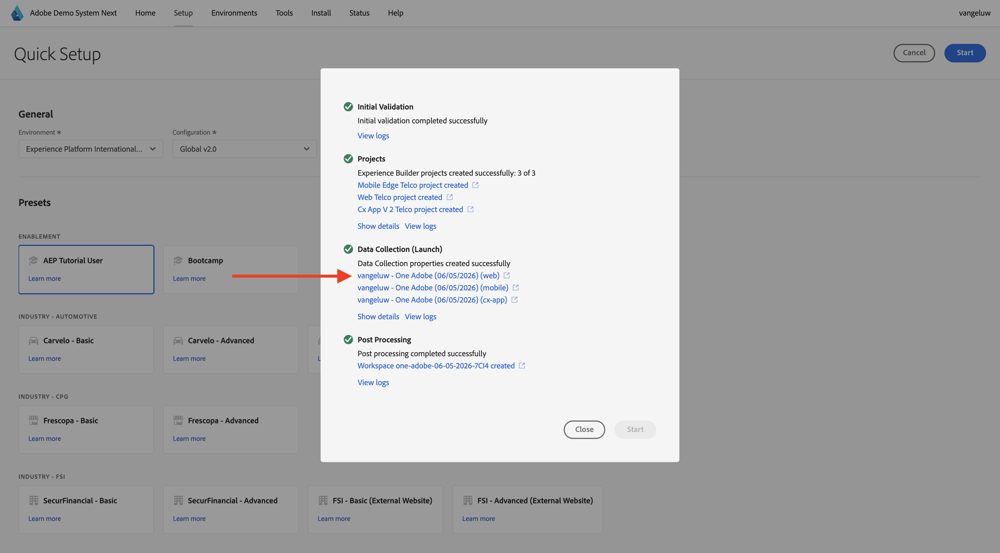

# Usar o site

Após o exercício anterior, você teve esse resultado. Clique para abrir o **projeto da Web Telco** criado para você.

Caso tenha fechado acidentalmente a janela do navegador ou em sessões futuras, você também poderá acessar o projeto do site acessando [https://dsn.adobe.com/](https://dsn.adobe.com/){target="_blank"}. Depois de fazer logon com sua Adobe ID, você verá isso. Clique nos 3 pontos **...** do projeto do site e clique em **Editar**.

Você verá isso. Clique em **Integrações**.

Na página **Integrações**, é necessário selecionar a propriedade Coleção de dados criada no exercício anterior. Para fazer isso, clique em **Selecionar ambiente**.

Clique em **Selecionar** na propriedade de Coleção de Dados criada na etapa anterior, chamada `--aepUserLdap-- - One Adobe (DD/MM/YYYY) (web)`. Clique em **Salvar**.

Você verá isso. Clique em **Executar** para abrir o site de demonstração.

Você verá seu site de demonstração aberto. Selecione o URL e copie-o para a área de transferência.

Abra uma nova janela incógnita do navegador.

Cole o URL do site de demonstração que você copiou na etapa anterior. Você será solicitado a fazer logon usando sua Adobe ID.

Selecione o tipo de conta e conclua o processo de logon.

Em seguida, você verá seu site carregado em uma janela incógnita do navegador. Para cada demonstração, será necessário usar uma janela do navegador nova e incógnita para carregar o URL do site de demonstração.

## Próximas etapas

Ir para [Usar o aplicativo móvel](./ex5.md){target="_blank"}

Volte para [Introdução](./getting-started.md){target="_blank"}

Voltar para [Todos os módulos](./../../../overview.md){target="_blank"}