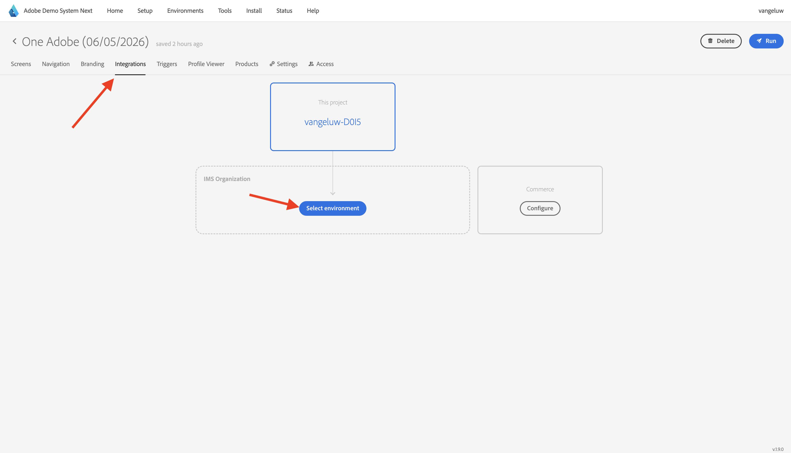

# Usar o aplicativo móvel

## Baixar o aplicativo

Vá para [https://dsn.adobe.com/install](https://dsn.adobe.com/install){target="_blank"} no computador e vá para **Versão do Beta**. Faça logon usando sua Adobe ID e você verá isso.

Use o aplicativo **Câmera** no smartphone para instalar o aplicativo móvel para o SO do dispositivo. Para esta habilitação, você precisa instalar a versão **0.6.1** (ou posterior) que usa o Adobe Experience Platform Mobile SDK.

>[!NOTE]
>
>Depois de instalar o aplicativo pela primeira vez em um dispositivo iOS, você poderá receber uma mensagem de erro ao tentar abrir o aplicativo que diz: **Desenvolvedor corporativo não confiável**. Para corrigir isso, você precisa ir para **Configurações > Geral > VPN &amp; Device Management > Adobe Systems Inc.** e clicar em **Confiar na Adobe Systems Inc.**.

Após verificar o código QR, selecione **Instalar**.

Depois que o aplicativo for instalado, você o encontrará na tela inicial do dispositivo. Clique no ícone para abrir o aplicativo.

Depois de fazer logon, você verá uma notificação solicitando sua permissão para enviar notificações. Enviaremos notificações como parte do tutorial, então clique em **Permitir**.

Você verá a página inicial do aplicativo. Vá para **Configurações**.

Nas configurações, você verá que, atualmente, um **Projeto público** está carregado no aplicativo. Clique em **Projeto personalizado**.

Agora você pode carregar um projeto personalizado. Clique no código QR para carregar facilmente seu projeto.

Após o exercício anterior, você teve esse resultado. Clique para abrir o **projeto Telco do Mobile Edge** que foi criado para você.

Caso tenha fechado acidentalmente a janela do navegador ou para futuras sessões de demonstração ou capacitação, você também pode acessar o projeto do seu site em [https://dsn.adobe.com](https://dsn.adobe.com){target="_blank"}. Depois de fazer logon com sua Adobe ID, você verá isso. Clique nos três pontos **...** no projeto de aplicativo móvel e clique em **Editar**.

Na página **Integrações**, é necessário selecionar a propriedade Coleção de dados criada no exercício anterior. Para fazer isso, clique em **Selecionar ambiente**.

Clique em **Selecionar** na propriedade de Coleção de Dados criada na etapa anterior, chamada `--aepUserLdap - One Adobe (DD/MM/YYYY) (mobile)`. Em seguida, clique em **Salvar**.

Você verá isso. Em seguida, clique em **Executar**.

Você verá este pop-up, que contém um código QR. Digitalize este código QR de dentro do aplicativo móvel.

Você verá sua ID de projeto sendo carregada no aplicativo, depois disso você poderá clicar em **Alternar**.

Você deverá ver a marca de demonstração **CitiSignal** sendo carregada. Seu aplicativo está pronto para ser usado.

## Próximas etapas

Vá para [Configurar seu projeto do Adobe I/O](./ex6.md){target="_blank"}

Volte para [Introdução](./getting-started.md){target="_blank"}

Voltar para [Todos os módulos](./../../../overview.md){target="_blank"}