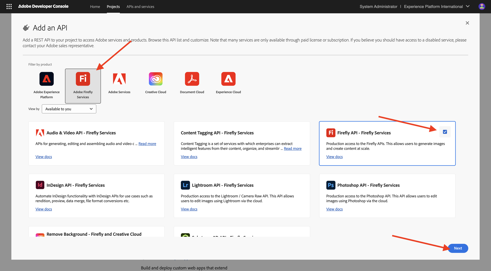
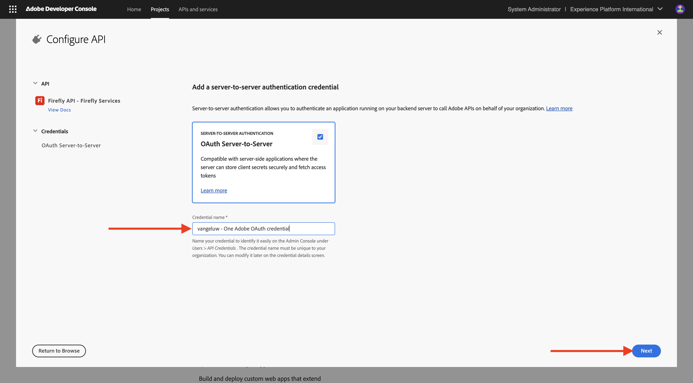

# Configurar o projeto do Adobe I/O

## Criar seu projeto do Adobe I/O

Neste exercício, o Adobe I/O é usado para consultar vários endpoints do Adobe. Siga estas etapas para configurar o Adobe I/O.

Ir para [https://developer.adobe.com/console/home](https://developer.adobe.com/console/home){target="_blank"}.

{zoomable="yes"}

Selecione a instância correta no canto superior direito da tela. Sua instância é `--aepImsOrgName--`.
Em seguida, selecione **Criar novo projeto**.

{zoomable="yes"}

### API de serviços da Firefly

Você deverá ver isso. Selecione **+ Adicionar ao Projeto** e escolha **API**.

{zoomable="yes"}

Sua tela deve ter esta aparência.

{zoomable="yes"}

Selecione **Creative Cloud** e escolha **Firefly - Firefly Services**, depois selecione **Próximo**.

{zoomable="yes"}

Forneça um nome para a credencial: `--aepUserLdap-- - One Adobe OAuth credential`e selecione **Avançar**.

{zoomable="yes"}

Selecione o perfil padrão **Configuração Padrão de Serviços da Firefly** e selecione **Salvar API Configurada**.

{zoomable="yes"}

Você deverá ver isso.

{zoomable="yes"}

### API do Photoshop Services

Selecione **+ Adicionar ao Projeto** e **API**.

{zoomable="yes"}

Selecione **Creative Cloud** e escolha **Photoshop - Firefly Services**. Selecione **Próximo**.

{zoomable="yes"}

Selecione **Próximo**.

{zoomable="yes"}

Em seguida, é necessário selecionar um perfil de produto que defina quais permissões estão disponíveis para essa integração.

Selecione **Configuração Padrão dos Serviços Firefly** e **Configuração Padrão dos Serviços Creative Cloud Automation**.

Selecione **Salvar API configurada**.

{zoomable="yes"}

Você deverá ver isso.

{zoomable="yes"}

### API do Adobe Experience Platform

Selecione **+ Adicionar ao Projeto** e **API**.

{zoomable="yes"}

Selecione **Adobe Experience Platform** e escolha **API Experience Platform**. Selecione **Próximo**.

{zoomable="yes"}

Selecione **Próximo**.

{zoomable="yes"}

Em seguida, é necessário selecionar um perfil de produto que defina quais permissões estão disponíveis para essa integração.

Selecione **Adobe Experience Platform - Todos os usuários - PROD**.

Selecione **Salvar API configurada**.

{zoomable="yes"}

Você deverá ver isso.

{zoomable="yes"}

### Nome do projeto

Clique no nome do projeto.

{zoomable="yes"}

Selecione **Editar Projeto**.

{zoomable="yes"}

Digite um nome amigável para a integração: `--aepUserLdap-- One Adobe tutorial`e selecione **Salvar**.

{zoomable="yes"}

A configuração do projeto do Adobe I/O foi concluída.

{zoomable="yes"}

## Próximas etapas

Ir para [Opção 1: configuração do Postman](./ex7.md){target="_blank"}

Ir para [Opção 2: configuração PostBuster](./ex8.md){target="_blank"}

Volte para [Introdução](./getting-started.md){target="_blank"}

Voltar para [Todos os módulos](./../../../overview.md){target="_blank"}