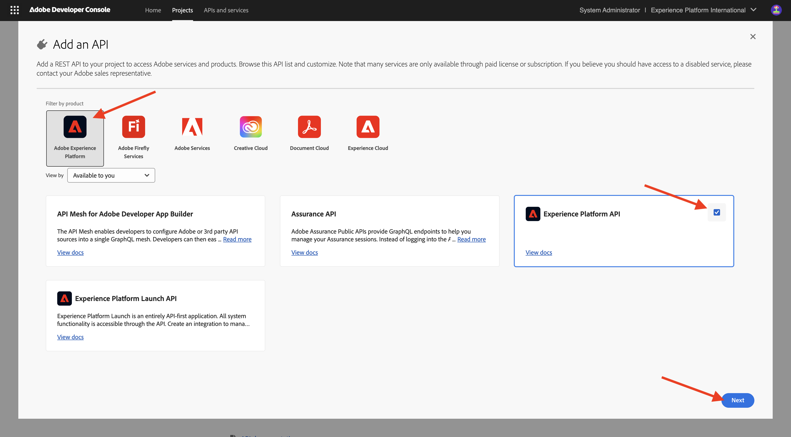
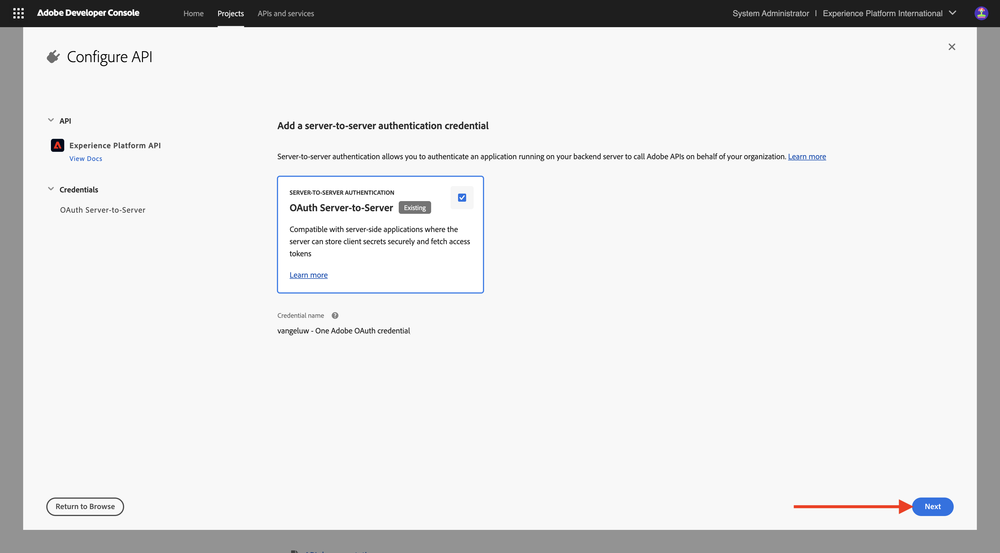
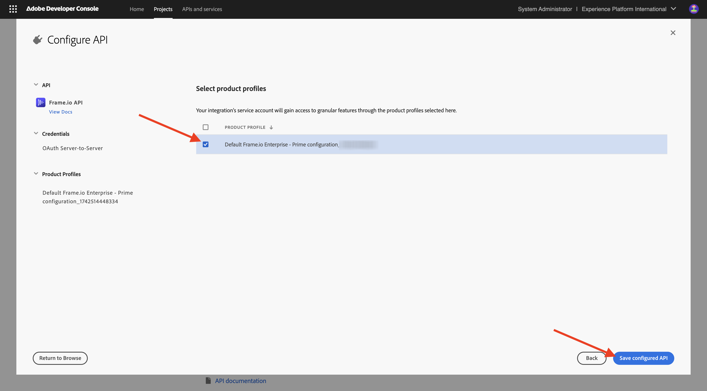

# Configurar o projeto do Adobe I/O

## Vídeo

Neste vídeo, você receberá uma explicação e uma demonstração de todas as etapas envolvidas neste exercício.

>[!VIDEO](https://video.tv.adobe.com/v/3476494?quality=12&learn=on)

## Criar seu projeto do Adobe I/O

Neste exercício, o Adobe I/O é usado para consultar vários endpoints do Adobe. Siga estas etapas para configurar o Adobe I/O.

Ir para [https://developer.adobe.com/console/home](https://developer.adobe.com/console/home){target="_blank"}.

Selecione a instância correta no canto superior direito da tela. Sua instância é `--aepImsOrgName--`.

>[!NOTE]
>
> A captura de tela abaixo mostra uma organização específica sendo selecionada. Quando você estiver assistindo a este tutorial, é muito provável que sua organização tenha um nome diferente. Quando se inscreveu neste tutorial, você recebeu os detalhes do ambiente que devem ser usados. Siga estas instruções.

Em seguida, selecione **Criar novo projeto**.

### API do Firefly Services

>[!IMPORTANT]
>
>Dependendo do caminho de aprendizado selecionado, talvez você não tenha acesso à API do Firefly Services. Você só terá acesso à API do Firefly Services se estiver no Caminho de Aprendizado **Firefly**, **Workfront Fusion**, **ALL** ou quando estiver participando de um **workshop presencial**. Você pode pular esta etapa se não estiver em um desses caminhos de aprendizagem.

Você deverá ver isso. Selecione **+ Adicionar ao Projeto** e escolha **API**.

Selecione **Adobe Firefly Services** e escolha **Firefly - Firefly Services**, depois selecione **Próximo**.

Forneça um nome para a credencial: `--aepUserLdap-- - One Adobe OAuth credential` e selecione **Avançar**.

Selecione o perfil padrão **Configuração padrão do Firefly Services** e selecione **Salvar API configurada**.

Você deverá ver isso.

### API do Photoshop Services

>[!IMPORTANT]
>
>Dependendo do caminho de aprendizado selecionado, talvez você não tenha acesso à API do Photoshop Services. Você só terá acesso à API do Photoshop Services se estiver no Caminho de Aprendizado **Firefly**, **Workfront Fusion**, **ALL** ou quando estiver participando de um **workshop presencial**. Você pode pular esta etapa se não estiver em um desses caminhos de aprendizagem.
>
Selecione **+ Adicionar ao Projeto** e **API**.

Selecione **Adobe Firefly Services** e escolha **Photoshop - Firefly Services**. Selecione **Próximo**.

Selecione **Próximo**.

Em seguida, é necessário selecionar um perfil de produto que defina quais permissões estão disponíveis para essa integração.

Selecione **Configuração padrão do Firefly Services** e **Configuração padrão dos Serviços de Automação da Creative Cloud**.

Selecione **Salvar API configurada**.

Você deverá ver isso.

### API do Adobe Experience Platform

>[!IMPORTANT]
>
>Dependendo do caminho de aprendizado selecionado, talvez você não tenha acesso à API do Adobe Experience Platform. Você só terá acesso à API do Adobe Experience Platform se estiver no caminho de aprendizado **AEP + Aplicativos**, **TODOS** ou quando estiver participando de um **workshop presencial**. Você pode pular esta etapa se não estiver em um desses caminhos de aprendizagem.

Selecione **+ Adicionar ao Projeto** e **API**.

Selecione **Adobe Experience Platform** e escolha **API Experience Platform**. Selecione **Próximo**.

Selecione **Próximo**.

Em seguida, é necessário selecionar um perfil de produto que defina quais permissões estão disponíveis para essa integração.

Selecione **Adobe Experience Platform - Todos os usuários - PROD**.

>[!NOTE]
>
>O nome do Perfil de produto do AEP depende de como o ambiente foi configurado. Se você não vir o perfil de produto mencionado acima, talvez tenha um perfil de produto chamado **Acesso total à produção padrão**. Caso não tenha certeza de qual escolher, pergunte ao administrador do sistema da AEP.

Selecione **Salvar API configurada**.

Você deverá ver isso.

### API Frame.io

>[!IMPORTANT]
>
>Dependendo do caminho de aprendizagem selecionado, talvez você não tenha acesso à API Frame.io. Você só terá acesso à API do Frame.io se estiver no caminho de aprendizado **Workfront Fusion**, **ALL** ou quando estiver participando de um **workshop presencial**. Você pode pular esta etapa se não estiver em um desses caminhos de aprendizagem.

Selecione **+ Adicionar ao Projeto** e **API**.

Selecione **Creative Cloud** e escolha **API Frame.io**. Selecione **Próximo**.

Selecione **Autenticação de Servidor para Servidor** e clique em **Avançar**.

Selecione **Servidor a servidor OAuth** e clique em **Avançar**.

Em seguida, é necessário selecionar um perfil de produto que defina quais permissões estão disponíveis para essa integração.

Selecione **Frame.io Padrão Enterprise - Configuração do Prime** e clique em **Salvar API Configurada**.

Você deverá ver isso.

### Nome do projeto

Clique no nome do projeto.

{zoomable="yes"}

Selecione **Editar Projeto**.

{zoomable="yes"}

Digite um nome amigável para a integração: `--aepUserLdap-- One Adobe tutorial` e selecione **Salvar**.

{zoomable="yes"}

A configuração do projeto do Adobe I/O foi concluída.

{zoomable="yes"}

## Próximas etapas

Ir para [Opção 1: configuração do Postman](./ex7.md){target="_blank"}

Ir para [Opção 2: configuração PostBuster](./ex8.md){target="_blank"}

Volte para [Introdução](./getting-started.md){target="_blank"}

Voltar para [Todos os módulos](./../../../overview.md){target="_blank"}
