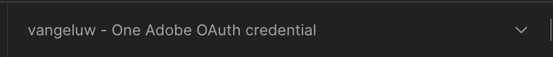

# Opção 1: usar o Postman

>[!IMPORTANT]
>
>Se você for um funcionário da Adobe, siga as instruções para [instalar o PostBuster](./ex8.md)!

## Download de ambiente do Postman

Vá para [https://developer.adobe.com/console/home](https://developer.adobe.com/console/home){target="_blank"} e abra o projeto.

{zoomable="yes"}

Clique na API **Firefly - Serviços da Firefly**. Em seguida, clique em **Baixar para Postman** e escolha **Servidor a Servidor OAuth** para baixar um ambiente do Postman.

{zoomable="yes"}

## Autenticação do Postman para o Adobe I/O

Baixe e instale a versão relevante do Postman para seu sistema operacional em [Downloads da Postman](https://www.postman.com/downloads/){target="_blank"}.

{zoomable="yes"}

Inicie o aplicativo.

No Postman, há dois conceitos: Ambientes e Coleções.

O arquivo de ambiente contém todas as variáveis de ambiente mais ou menos consistentes. No ambiente, você encontrará informações como o IMSOrg do seu ambiente do Adobe, além de credenciais de segurança como a ID do cliente e outras. Você baixou o arquivo de ambiente durante a configuração do Adobe I/O anteriormente e ele é nomeado como **`oauth_server_to_server.postman_environment.json`**.

A coleção contém várias solicitações de API que podem ser usadas. Usaremos 2 coleções

- 1 coleção para autenticação no Adobe I/O
- 1 Coleta para os exercícios neste módulo

Baixe o [postman-ff.zip](./../../../assets/postman/postman-ff.zip) no desktop local.

{zoomable="yes"}

No arquivo **postman-ff.zip** estão os seguintes arquivos:

- `Adobe IO - OAuth.postman_collection.json`
- `FF - Firefly Services Tech Insiders.postman_collection.json`

Descompacte o **postman-ff.zip** e armazene os 2 arquivos a seguir em uma pasta na sua área de trabalho:

- `Adobe IO - OAuth.postman_collection.json`
- `FF - Firefly Services Tech Insiders.postman_collection.json`
- `oauth_server_to_server.postman_environment.json`

{zoomable="yes"}

No Postman, selecione **Importar**.

{zoomable="yes"}

Selecione **Arquivos**.

{zoomable="yes"}

Escolha os três arquivos da pasta e selecione **Abrir** e **Importar**.

{zoomable="yes"}

{zoomable="yes"}

Agora você tem tudo o que precisa no Postman para começar a interagir com os Serviços da Firefly por meio das APIs.

## Solicitar um token de acesso

Em seguida, para garantir que você esteja autenticado corretamente, é necessário solicitar um token de acesso.

Certifique-se de ter selecionado o ambiente correto antes de executar qualquer solicitação, verificando a lista suspensa Ambiente no canto superior direito. O Ambiente selecionado deve ter um nome semelhante a este, `--aepUserLdap-- One Adobe OAuth Credential`.

{zoomable="yes"}

O Ambiente selecionado deve ter um nome semelhante a este, `--aepUserLdap-- One Adobe OAuth Credential`.

{zoomable="yes"}

Agora que o ambiente e as coleções do Postman estão configurados e funcionando, você pode autenticar do Postman para o Adobe I/O.

Na coleção **Adobe IO - OAuth**, selecione a solicitação denominada **POST - Obter Token de Acesso** e selecione **Enviar**.

Aviso em **Parâmetros de Consulta**, duas variáveis são referenciadas, `API_KEY` e `CLIENT_SECRET`. Essas variáveis foram obtidas do ambiente selecionado, `--aepUserLdap-- One Adobe OAuth Credential`.

{zoomable="yes"}

Se for bem-sucedido, uma resposta contendo um token de portador, um token de acesso e uma janela de expiração será exibida na seção **Corpo** do Postman.

{zoomable="yes"}

Você deve ver uma resposta semelhante contendo as seguintes informações:

| Chave | Valor |
|:-------------:| :---------------:| 
| token_type | **portador** |
| access_token | **eyJhbGciOiJSUz...** |
| expires_in | **86399** |

O **bearer-token** do Adobe I/O tem um valor específico (o access_token muito longo) e uma janela de expiração, e agora é válido por 24 horas. Isso significa que, após 24 horas, se você quiser usar o Postman para interagir com as APIs do Adobe, precisará gerar um novo token executando essa solicitação novamente.

Seu ambiente do Postman agora está configurado e funcionando.

## Próximas etapas

Vá para [Aplicativos a serem instalados](./ex9.md){target="_blank"}

Volte para [Introdução](./getting-started.md){target="_blank"}

Voltar para [Todos os módulos](./../../../overview.md){target="_blank"}
