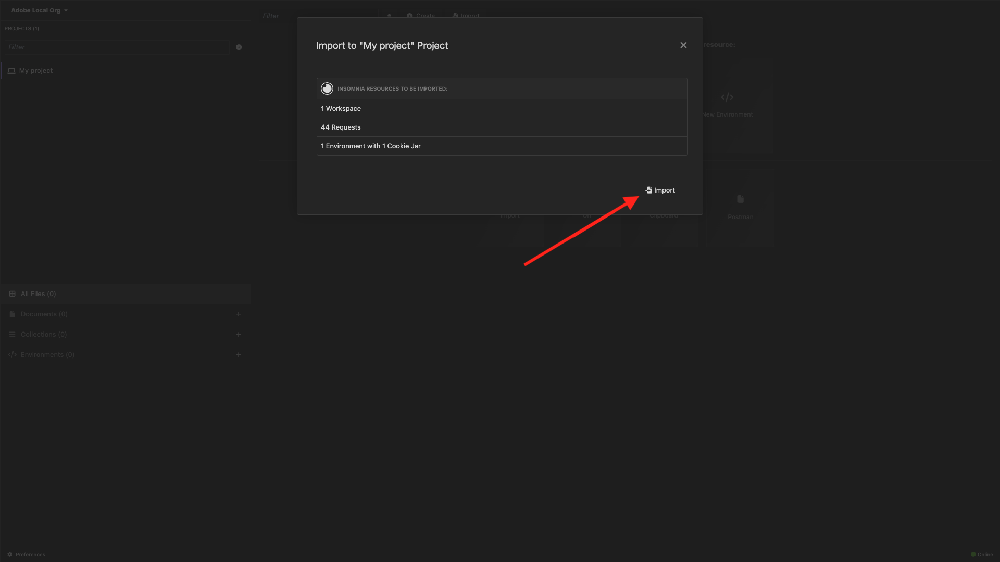

# Opção 2: configuração PostBuster

>[!IMPORTANT]
>
>Se você não for um funcionário da Adobe, siga as instruções para [instalar o Postman](./ex7.md){target="_blank"}. As instruções abaixo são destinadas apenas aos funcionários da Adobe.

## Vídeo

Neste vídeo, você receberá uma explicação e uma demonstração de todas as etapas envolvidas neste exercício.

>[!VIDEO](https://video.tv.adobe.com/v/3476496?quality=12&learn=on)

## Instalar PostBuster

Ir para [https://adobe.service-now.com/esc?id=adb_esc_kb_article&sysparm_article=KB0020542](https://adobe.service-now.com/esc?id=adb_esc_kb_article&sysparm_article=KB0020542){target="_blank"}.

Clique para baixar a versão mais recente do **PostBuster**.


Baixe a versão correta para seu sistema operacional.


Depois que o download for concluído e instalado, abra o PostBuster. Você deverá ver isso. Clique em **Importar**.


Baixe o [postbuster.json.zip](./../../../assets/postman/postbuster.json.zip){target="_blank"} e extraia-o na sua área de trabalho.


Clique em **Escolher um Arquivo**.


Selecione o arquivo **postbuster.json**. Clique em **Abrir**.


Você deverá ver isso. Clique em **Verificar**.


Clique em **Importar**.



Você deverá ver isso. Clique em para abrir a coleção importada.


Agora você vê sua coleção. Você ainda precisa configurar um ambiente para manter algumas variáveis de ambiente.


Clique em **Ambiente base** e no ícone **editar**.


Você deverá ver isso.


Copie o espaço reservado do ambiente abaixo e cole-o no **Ambiente base**, substituindo o que está lá.

```json
{
	"CLIENT_SECRET": "",
	"API_KEY": "",
	"ACCESS_TOKEN": "",
	"SCOPES": [
		"openid",
		"AdobeID",
		"read_organizations", 
		"additional_info.projectedProductContext", 
		"session",
		"ff_apis",
		"firefly_api",
		"frame.s2s.all"
	],
	"TECHNICAL_ACCOUNT_ID": "",
	"IMS": "ims-na1.adobelogin.com",
	"IMS_ORG": "",
	"access_token": "",
	"IMS_TOKEN": "",
	"AZURE_STORAGE_URL": "",
	"AZURE_STORAGE_CONTAINER": "",
	"AZURE_STORAGE_SAS_READ": "",
	"AZURE_STORAGE_SAS_WRITE": "",
	"FRAME_IO_BASE_URL": "https://api.frame.io",
	"FRAME_IO_ACCOUNT_ID": "",
	"FRAME_IO_WORKSPACE_ID": ""
}
```

Você deveria ficar com isso.


## Insira suas variáveis do Adobe I/O

Vá para [https://developer.adobe.com/console/home](https://developer.adobe.com/console/home){target="_blank"} e abra o projeto.


Vá para **Servidor a Servidor do OAuth**.


Agora é necessário copiar os seguintes valores do seu projeto do Adobe I/O e colá-los no ambiente de base do PostBuster.

- ID de cliente
- Segredo Do Cliente (Clique Em **Recuperar Segredo Do Cliente**)
- ID da conta técnica
- ID da organização (Role para baixo para encontrar a ID da organização)


Copie as variáveis acima uma por uma e cole-as no **Ambiente base** no PostBuster.

| Nome da variável no Adobe I/O | Nome da variável no ambiente de base do PostBuster |
|:-------------:| :---------------:| 
| ID de cliente | `API_KEY` |
| Segredo do cliente | `CLIENT_SECRET` |
| ID da conta técnica | `TECHNICAL_ACCOUNT_ID` |
| ID da organização | `IMS_ORG` |

Depois de copiar essas variáveis uma por uma, o ambiente de base do PostBuster deve ter esta aparência.

Clique em **Fechar**.


Na coleção **Adobe IO - OAuth**, selecione a solicitação denominada **POST - Obter Token de Acesso** e selecione **Enviar**.


Você deve ver uma resposta semelhante contendo as seguintes informações:

| Chave | Valor |
|:-------------:| :---------------:| 
| token_type | **portador** |
| access_token | **eyJhbGciOiJS...** |
| expires_in | **86399** |

O **bearer-token** do Adobe I/O tem um valor específico (o access_token muito longo) e uma janela de expiração, e agora é válido por 24 horas. Isso significa que, após 24 horas, se você quiser usar o Postman para interagir com as APIs do Adobe, precisará gerar um novo token executando essa solicitação novamente.


O ambiente PostBuster agora está configurado e funcionando. Você concluiu este exercício agora.

## Próximas etapas

Vá para [Aplicativos a serem instalados](./ex9.md){target="_blank"}

Volte para [Introdução](./getting-started.md){target="_blank"}

Voltar para [Todos os módulos](./../../../overview.md){target="_blank"}
