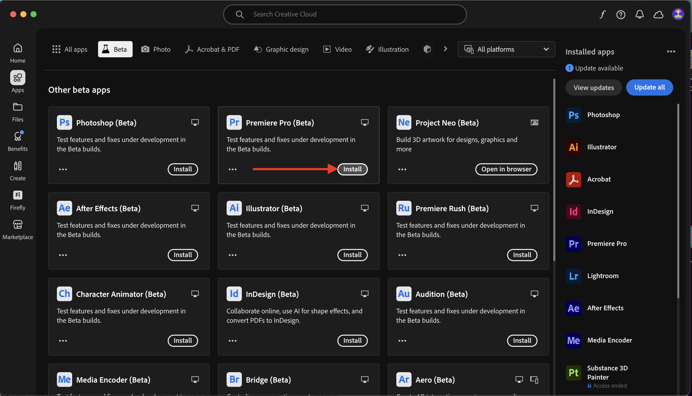

# Aplicativos a serem instalados

Abaixo está uma visão geral dos aplicativos que você precisará ter instalados em seu computador antes de iniciar o tutorial.

## Adobe Creative Cloud

Ir para [https://creativecloud.adobe.com/apps/download/creative-cloud](https://creativecloud.adobe.com/apps/download/creative-cloud){target="_blank"}.

## Adobe Photoshop

Abra o aplicativo **Adobe Creative Cloud**, vá para **Aplicativos**. Instale o Photoshop no computador.

## Adobe Illustrator

Abra o aplicativo **Adobe Creative Cloud**, vá para **Aplicativos**. Instale o Illustrator no computador.

## Adobe Premiere Pro

Instale a versão do Adobe Premiere Pro Beta em seu computador do [https://helpx.adobe.com/premiere-pro/using/premiere-pro-beta.html](https://helpx.adobe.com/premiere-pro/using/premiere-pro-beta.html)

Clique em **Abrir o Creative Cloud Desktop App**.

Clique em **Instalar** no cartão do aplicativo **Premiere Pro (Beta)**.

## Aplicativo de transferência Frame.io

Acesse [https://frame.io/transfer](https://frame.io/transfer) e baixe a versão do seu computador.

## Código do Visual Studio

Vá para [https://code.visualstudio.com/](https://code.visualstudio.com/){target="_blank"}, baixe e instale o **Visual Studio Code**.

## Editor de texto

Se você não tiver um aplicativo Editor de Texto, acesse [https://www.sublimetext.com/](https://www.sublimetext.com/){target="_blank"} e baixe e instale este Editor de Texto.

## Conta do GitHub

Se você ainda não tiver uma conta do GitHub, acesse [https://github.com/](https://github.com/){target="_blank"} e clique em **Inscrever-se**. Use seu email pessoal e crie sua conta.

## GitHub Desktop

Vá para [https://desktop.github.com/download/](https://desktop.github.com/download/){target="_blank"}, baixe e instale o **Github Desktop**.

## Explorador de Armazenamento do Azure

[Baixe o Microsoft Azure Storage Explorer para gerenciar seus arquivos](https://azure.microsoft.com/en-us/products/storage/storage-explorer#Download-4){target="_blank"}. Selecione a versão correta para seu sistema operacional específico, baixe-a e instale-a.

{zoomable="yes"}

Você concluiu o módulo Introdução.

## Próximas etapas

Volte para [Introdução](./getting-started.md){target="_blank"}

Volte para [Todos os módulos](./../../../overview.md){target="_blank"}./images
