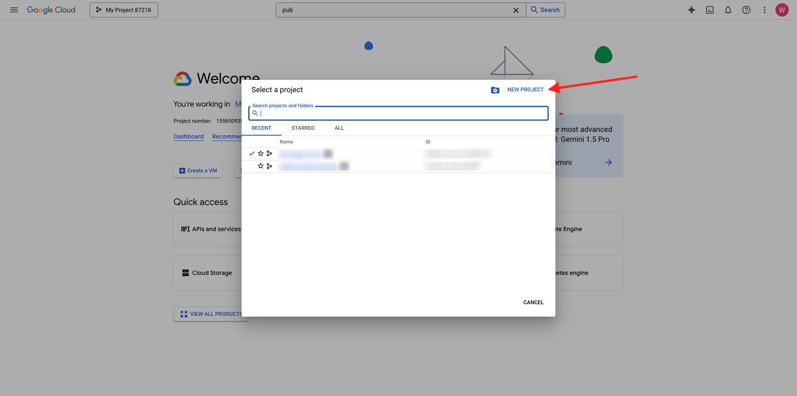
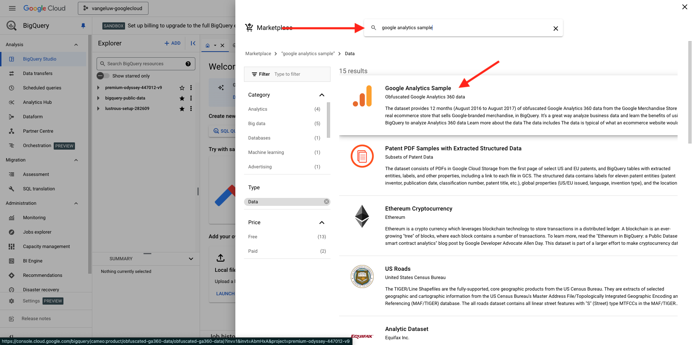
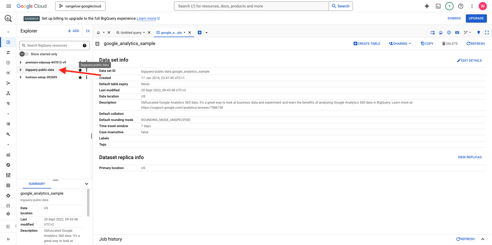

# 1.2.1 Comece a usar a Google Cloud Platform

>[!NOTE]
>
>Para este exercício, você precisa acessar um ambiente da Google Cloud Platform. Se você ainda não tiver acesso ao GCP, crie uma nova conta usando seu endereço de email pessoal.

## 1.2.1.1 Por que conectar o Google BigQuery ao Adobe Experience Platform para obter dados do Google Analytics

O Google Cloud Platform (GCP) é um conjunto de serviços de computação em nuvem pública oferecidos pela Google. A Google Cloud Platform inclui uma variedade de serviços hospedados para computação, armazenamento e desenvolvimento de aplicativos que são executados em hardware da Google.

O BigQuery é um desses serviços e está sempre incluído no Google Analytics 360. Os dados do Google Analytics são frequentemente amostrados quando tentamos obter dados diretamente deles (API, por exemplo). É por isso que a Google inclui o BigQuery para obter dados não amostrados, de modo que as marcas podem fazer análise avançada usando SQL e se beneficiar do poder do GCP.

Os dados do Google Analytics são carregados diariamente no BigQuery usando um mecanismo em lote. Dessa forma, não faz sentido usar essa integração GCP/BigQuery para casos de uso de personalização e ativação em tempo real.

Se uma marca quiser fornecer casos de uso de personalização em tempo real com base em dados do Google Analytics, ela poderá coletar esses dados no site com o Google Tag Manager e transmiti-los para a Adobe Experience Platform em tempo real.

O Conector GCP/BigQuery Source deve ser usado para...

- rastreie todo o comportamento do cliente no site e carregue esses dados no Adobe Experience Platform para análise, ciência de dados e casos de uso de personalização que não exigem ativação em tempo real.
- carregar dados históricos do Google Analytics na Adobe Experience Platform, novamente para análise e casos de uso de ciência de dados

## 1.2.1.2 Sua conta da Google

>[!NOTE]
>
>Para este exercício, você precisa acessar um ambiente da Google Cloud Platform. Se você ainda não tiver acesso ao GCP, crie uma nova conta usando seu endereço de email pessoal.

## 1.2.1.3 Selecionar ou criar um projeto

Ir para [https://console.cloud.google.com/](https://console.cloud.google.com/).

Em seguida, clique em **Selecionar um projeto** ou clique em um projeto existente.

Se você ainda não tiver um projeto, clique em **NOVO PROJETO**. Se você já tiver um projeto, poderá optar por selecionar esse projeto e prosseguir para a próxima etapa.

Nomeie o projeto seguindo esta convenção de nomenclatura. Clique em **CRIAR**.

| Convenção |
| ----------------- |
| `--aepUserLdap---googlecloud` |

Aguarde até que a notificação na parte superior direita da tela informe que a criação foi concluída. Em seguida, clique em **SELECIONAR PROJETO**.

Em seguida, vá para a barra de pesquisa na parte superior da tela e digite **BigQuery**. Selecione o primeiro resultado.

O objetivo desse módulo é obter dados do Google Analytics no Adobe Experience Platform. Para fazer isso, você precisa começar com dados fictícios em um conjunto de dados do Google Analytics.

Clique em **+ Adicionar** e, em seguida, clique em **Conjuntos de dados públicos** no menu direito.

Você verá esta janela:

Insira o termo de pesquisa **Amostra de Google Analytics** na barra de pesquisa e clique no primeiro resultado da pesquisa.

Você verá a tela a seguir com uma descrição do conjunto de dados. Clique em **EXIBIR CONJUNTO DE DADOS**.

Você será redirecionado para o BigQuery, onde verá este conjunto de dados **bigquery-public-data** no **Explorer**.

No **Explorer**, você deve ver várias tabelas. Sinta-se à vontade para explorá-los. Vá para `google_analytics_sample`.

Clique para abrir a tabela `ga_sessions`.

Antes de continuar com o próximo exercício, anote os seguintes itens em um arquivo de texto separado no seu computador:

| Credencial | Nomenclatura | Exemplo |
| ----------------- |-------------| -------------|
| Nome do projeto | `--aepUserLdap---googlecloud` | vangeluw-googlecloud |
| ID do projeto | random | possible-bee-447102-h3 |

Você pode encontrar seu Nome do Projeto e ID do Projeto clicando no **Nome do Projeto** na barra de menu superior:

Em seguida, você verá sua ID do projeto no lado direito:

Agora você pode migrar para o próximo exercício, em que as mãos ficarão sujas ao consultar os dados do Google Analytics.

## Próximas etapas

Ir para [1.2.2 Criar sua primeira consulta no BigQuery](./ex2.md){target="_blank"}

Retorne para [Assimilar e analisar dados do Google Analytics no Adobe Experience Platform com o Conector de Source do BigQuery](./customer-journey-analytics-bigquery-gcp.md){target="_blank"}

Voltar para [Todos os módulos](./../../../../overview.md){target="_blank"}
