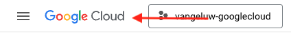

# 1.2.3 Conectar o GCP e o BigQuery ao Adobe Experience Platform

## Objetivos

- Explore a API e os serviços na Google Cloud Platform
- Estar familiarizado com o OAuth Playground para testar APIs do Google
- Crie sua primeira conexão do BigQuery no Adobe Experience Platform

## Contexto

A Adobe Experience Platform fornece um conector em **Fontes** que ajudará você a trazer conjuntos de dados do BigQuery para a Adobe Experience Platform. Esse conector de dados é baseado na API do Google BigQuery. Portanto, é importante preparar corretamente a Plataforma de nuvem do Google e o ambiente do BigQuery para receber chamadas de API da Adobe Experience Platform.

Para configurar o Conector do Source do BigQuery no Adobe Experience Platform, você precisará desses 4 valores:

- projeto
- clientId
- clientSecret
- refreshToken

Até agora você só tem o primeiro, a **ID do Projeto**. Esse valor de **ID do projeto** é uma ID aleatória que foi gerada pela Google quando você criou seu projeto BigQuery durante o exercício 12.1.

Copie a ID do projeto em um arquivo de texto separado.

| Credencial | Nomenclatura | Exemplo |
| ----------------- |-------------| -------------|
| ID do projeto | random | possible-bee-447102-h3 |

Você pode verificar sua ID de projeto a qualquer momento clicando em seu **Nome do projeto** na barra de menu superior:

Você verá a ID do projeto no lado direito:

Neste exercício, você aprenderá a obter os outros 3 campos obrigatórios:

- clientId
- clientSecret
- refreshToken

## 1.2.3.1 Plataforma de autenticação da Google

Para iniciar, volte para a página inicial da Google Cloud Platform. Para fazer isso, basta clicar no logotipo no canto superior esquerdo da tela.

Quando você estiver na página inicial, pesquise por **Google Auth Platform** na barra de pesquisa. Clique no primeiro resultado para abri-lo.

Você verá agora a página inicial da **Plataforma de Autenticação da Google**. Clique em **GET INICIADO**.

Para o **Nome do aplicativo**, use este:

| Nomenclatura | Exemplo |
| ----------------- |-------------| 
| `--aepUserLdap-- - AEP BigQuery Connector` | vangeluw - Conector do AEP BigQuery |

Selecione seu endereço de email para o campo **Email de suporte ao usuário**.

Clique em **AVANÇAR**.

Selecione **Externo** e clique em **PRÓXIMO**.

Digite seu endereço de email e clique em **AVANÇAR**.

Marque a caixa de seleção e clique em **CONTINUAR**. Em seguida, clique em **CRIAR**.

## 1.2.3.2 Criar cliente OAuth

Clique em **CRIAR CLIENTE OAUTH**.

Você verá isso.

Selecione **Aplicativo web**.

Vários novos campos aparecerão. Agora é necessário inserir o **Nome** da ID de Cliente OAuth e também inserir os **URIs de redirecionamento autorizados**.

Para o campo **Nome**, use este:

| Campo | Valor | Exemplo |
| ----------------- |-------------| -------------| 
| Nome | ldap - Conector AEP BigQuery | vangeluw - Conector do Platform BigQuery |

Clique em **+ ADICIONAR URI** em **URIs de redirecionamento autorizados**. Adicione o novo URI abaixo.

| Campo | Valor |
| ----------------- |-------------| 
| URIs de redirecionamento autorizados | https://developers.google.com/oauthplayground |

O campo **URIs de redirecionamento autorizados** é muito importante porque você precisará dele mais tarde para obter o RefreshToken necessário para concluir a configuração do Conector de Source do BigQuery no Adobe Experience Platform.

Clique em **Criar**.

Sua ID de cliente OAuth foi criada. Clique para ver agora a ID do cliente e a senha do cliente.

Em seguida, você verá os valores de ID do cliente e Segredo do cliente.

Copie estes dois campos e cole-os em um arquivo de texto na sua área de trabalho. Você sempre pode acessar essas credenciais em um estágio posterior, mas é mais fácil salvá-las em um arquivo de texto ao lado da ID do projeto do BigQuery.

Para recapitular a configuração do BigQuery Source Connector no Adobe Experience Platform, agora você já tem esses valores disponíveis:

| Credenciais do BigQuery Connector | Valor |
| ----------------- |-------------| 
| ID do projeto | sua própria ID do projeto (por exemplo,: possible-bee-447102-h3) |
| clientid | yourclientid |
| cilentsecret | yourclientsecret |

Em seguida, você precisa publicar seu aplicativo OAuth. Vá para **Público** e clique em **PUBLICAR APLICATIVO**.

Clique em **CONFIRM**.

O **refreshToken** ainda está ausente. O refreshToken é um requisito por motivos de segurança. No mundo das APIs, os tokens normalmente expiram a cada 24 horas. Portanto, o **refreshToken** é necessário para atualizar o token de segurança a cada 24 horas, para que a instalação do Source Connector possa continuar se conectando à Google Cloud Platform e ao BigQuery.

## 1.2.3.3 API do BigQuery e o refreshToken

Há muitas maneiras de obter um refreshToken para acessar as APIs da Google Cloud Platform. Uma dessas opções é, por exemplo, usar o Postman.
No entanto, o Google criou algo mais fácil de testar e reproduzir com suas APIs, uma ferramenta chamada **Playground do OAuth 2.0**.

Para acessar o **Playground do OAuth 2.0**, vá para [https://developers.google.com/oauthplayground](https://developers.google.com/oauthplayground).

Você verá a página inicial do **Playground** do OAuth 2.0.

Clique no ícone de **engrenagem** na parte superior direita da tela. Verifique se as configurações são as mesmas que você pode ver na imagem acima.

Marque a caixa de seleção: **Usar suas próprias credenciais do OAuth**

Dois campos serão exibidos.

Preencha os campos após esta tabela:

| Configurações da API do Playground | Suas credenciais da API do Google |
| ----------------- |-------------| 
| ID do cliente OAuth | sua ID do cliente (no arquivo de texto da área de trabalho) |
| Segredo do cliente OAuth | seu próprio Segredo do cliente (no arquivo de texto da área de trabalho) |

Depois de preencher suas credenciais, clique em **Fechar**.

No menu esquerdo, você pode ver todas as APIs do Google disponíveis. Procure a **API do BigQuery v2** e clique nela para abri-la.

Em seguida, selecione o escopo conforme indicado na imagem abaixo. É necessário clicar em cada uma das APIs disponíveis, e uma marca de seleção será exibida para cada API selecionada.

Em seguida, clique em **Autorizar APIs**.

Clique no endereço de email usado para configurar o GCP e o BigQuery.

Você verá um grande aviso: **Este aplicativo não foi verificado**. Isso está acontecendo porque seu Conector da Platform BigQuery ainda não foi revisado formalmente, portanto, a Google não sabe se é um aplicativo autêntico ou não.

Clique em **Avançado**.

Em seguida, clique em **Ir para —aepUserLdap— - Conector do AEP BigQuery (não seguro)**.

Você verá um aviso de segurança para acesso. Clique em **Selecionar tudo**.

Role para baixo e clique em **Continuar**.

Agora você será redirecionado para o Playground OAuth 2.0 e verá isso. Clique em **Código de autorização do Exchange para tokens**.

Após alguns segundos, a exibição **Etapa 2 - Código de autorização do Exchange para tokens** será fechada automaticamente, e você verá **Etapa 3 - Configurar solicitação para API**.

Você precisa voltar para a **Etapa 2 do código de autorização do Exchange para tokens**, portanto, clique na **Etapa 2 do código de autorização do Exchange para tokens** novamente para visualizar o **Atualizar token**.

Você verá agora o **token de atualização**.

Copie o **token de atualização** e cole-o no arquivo de texto na área de trabalho junto com as outras Credenciais do BigQuery Source Connector:

| Credenciais do BigQuery Source Connector | Valor |
| ----------------- |-------------| 
| ID do projeto | sua própria ID de projeto aleatória (por exemplo,: apt-summer-273608) |
| clientid | yourclientid |
| cilentsecret | yourclientsecret |
| refreshtoken | yourrefreshtoken |

Em seguida, vamos configurar seu Source Connector no Adobe Experience Platform.

## 1.2.3.5 - Conectar a Platform com sua própria tabela do BigQuery

Faça logon no Adobe Experience Platform acessando esta URL: [https://experience.adobe.com/platform](https://experience.adobe.com/platform).

Depois de fazer logon, você chegará à página inicial do Adobe Experience Platform.

Antes de continuar, você precisa selecionar uma **sandbox**. A sandbox a ser selecionada é chamada ``--aepSandboxName--``. Depois de selecionar a sandbox apropriada, você verá a alteração da tela e agora estará em sua sandbox dedicada.

No menu esquerdo, vá para Origens. Você verá a página inicial de **Fontes**. No menu **Fontes**, clique em **Bancos de dados**. Clique no cartão **Google BigQuery**. Em seguida, clique em **Configurar**.

Agora você deve criar uma nova conexão.

Clique em **Nova conta**. Agora é necessário preencher todos os campos abaixo, com base na configuração que você fez no GCP e no BigQuery.

Vamos começar nomeando a conexão:

Use esta convenção de nomenclatura:

| Credenciais do BigQuery Connector | Valor | Exemplo |
| ----------------- |-------------| -------------| 
| Nome da conta | `--aepUserLdap-- - BigQuery Connection` | vangeluw - Conexão BigQuery |
| Descrição | `--aepUserLdap-- - BigQuery Connection` | vangeluw - Conexão BigQuery |

Você terá isto:

Em seguida, preencha os detalhes do GCP e da API do BigQuery **Autenticação de conta** que você armazenou em um arquivo de texto na sua área de trabalho:

| Credenciais do BigQuery Connector | Valor |
| ----------------- |-------------| 
| ID do projeto | sua própria ID de projeto aleatória (por exemplo,: possible-bee-447102-h3) |
| clientId | ... |
| clientSecret | ... |
| refreshToken | ... |

Os detalhes da **Autenticação da Conta** agora devem ter esta aparência. Clique em **Conectar à origem**.

Se os detalhes da **Autenticação da Conta** foram preenchidos corretamente, você verá agora uma confirmação visual de que a conexão está funcionando corretamente, ao ver a confirmação **Conectado**. Clique em **Next**.

Agora você verá o conjunto de dados do BigQuery criado no exercício anterior.

Muito bem! No próximo exercício, você carregará dados dessa tabela e os mapeará em relação a um esquema e conjunto de dados na Adobe Experience Platform.

## Próximas etapas

Ir para [1.2.4 Carregar dados do BigQuery no Adobe Experience Platform](./ex4.md){target="_blank"}

Retorne para [Assimilar e analisar dados do Google Analytics no Adobe Experience Platform com o Conector de Source do BigQuery](./customer-journey-analytics-bigquery-gcp.md){target="_blank"}

Voltar para [Todos os módulos](./../../../../overview.md){target="_blank"}
