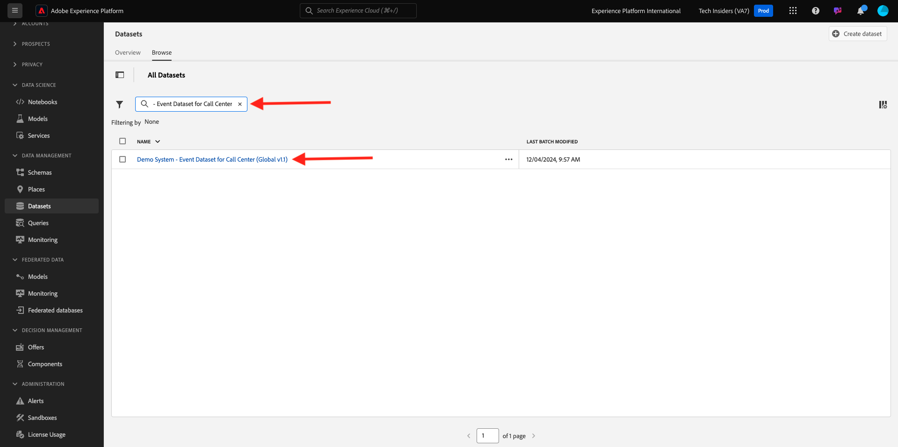
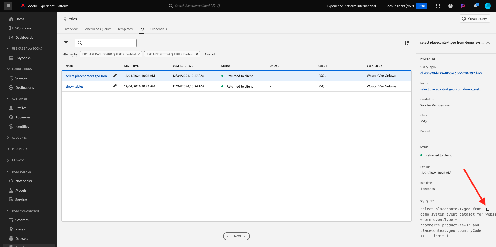
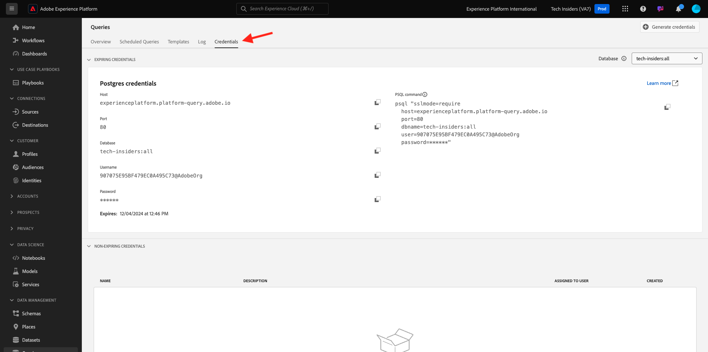

# 2.1.2 Introdução

## Conhecimento da interface do usuário do Adobe Experience Platform

Ir para [Adobe Experience Platform](https://experience.adobe.com/platform). Depois de fazer logon, você chegará à página inicial do Adobe Experience Platform.

Antes de continuar, você precisa selecionar uma **sandbox**. A sandbox a ser selecionada é chamada ``--aepSandboxName--``. Depois de selecionar a [!UICONTROL sandbox] apropriada, você verá a alteração da tela e agora estará na [!UICONTROL sandbox] dedicada.

## Explorar dados na plataforma

Trazer dados de diferentes canais é uma tarefa difícil para qualquer marca. E neste exercício, os clientes do Citi Signal estão se envolvendo com o Citi Signal em seu site, em seu aplicativo móvel, os dados de compra são coletados pelo sistema de ponto de venda do Citi Signal, e eles têm dados de CRM e Fidelidade. O Citi Signal está usando o Adobe Analytics e o Adobe Launch para capturar dados em seu site, aplicativo móvel e sistema de PDV, de modo que esses dados já estão fluindo para o Adobe Experience Platform. Vamos começar explorando todos os dados para o Citi Signal que já existe no Adobe Experience Platform.

No menu esquerdo, vá para **Conjuntos de dados**.

O Citi Signal está transmitindo dados para a Adobe Experience Platform e esses dados estão disponíveis no conjunto de dados `Demo System - Event Dataset for Website (Global v1.1)`. Pesquisar por `Demo System - Event Dataset for Website`.

Os dados de Interação do Callcenter do Citi Signal são capturados no conjunto de dados `Demo System - Event Dataset for Call Center (Global v1.1)`. Pesquisar dados de `Demo System - Event Dataset for Call Center` na caixa de pesquisa. Clique no nome do conjunto de dados para abri-lo.

Depois de clicar no conjunto de dados, você terá uma visão geral da atividade do conjunto de dados, como lotes assimilados e com falha. Clique em **Visualizar Conjunto de Dados** para ver uma amostra dos dados armazenados no conjunto de dados `Demo System - Event Dataset for Call Center (Global v1.1)`.

O painel esquerdo mostra a estrutura do esquema para esse conjunto de dados e, no lado direito, você verá uma amostra dos dados que foram assimilados.

Clique em **Fechar** para fechar a janela **Visualizar Conjunto de Dados**.

## Introdução ao Serviço de consulta

O Serviço de consulta é acessado clicando em **Consultas** no menu esquerdo.

Ao acessar o **Log**, você verá a página Lista de Consultas, que fornece uma lista de todas as consultas executadas nesta organização, com as mais recentes no topo.

Clique em qualquer consulta SQL na lista e observe os detalhes fornecidos no painel direito.

Você pode rolar a janela para ver a consulta inteira ou clicar no ícone destacado abaixo para copiar a consulta inteira para o bloco de notas. Não é necessário copiar a consulta neste momento.

Não é possível ver apenas as consultas que foram executadas, essa interface do usuário permite criar novos conjuntos de dados a partir de consultas. Esses conjuntos de dados podem ser vinculados ao Perfil do cliente em tempo real da Adobe Experience Platform ou podem ser usados como entrada para o Adobe Experience Platform Data Science Workspace.

## Conectar o cliente PSQL ao serviço de consulta

O Serviço de consulta oferece suporte a clientes com um driver para PostgreSQL. Nesta etapa, usaremos o PSQL, uma interface de linha de comando, e o Power BI ou o Tableau. Vamos nos conectar ao PSQL.

Clique em **Credenciais**.

Você verá a tela abaixo. A tela fornece informações do servidor e credenciais para autenticação no Serviço de consulta. Por enquanto, nos concentraremos no lado direito da tela que contém um comando connect para PSQL. Clique no botão copiar para copiar o comando para a área de transferência.

Para Windows: abra a linha de comando pressionando a tecla Windows e digitando cmd e clicando no resultado do Prompt de comando.

Para o macOS: abra o terminal.app por meio da pesquisa em destaque:

Cole o comando connect que você copiou da interface do usuário do Serviço de consulta e pressione Enter na janela de prompt de comando:

Windows:

MacOS:

Agora você está conectado ao Serviço de consulta usando PSQL.

Nos próximos exercícios, haverá bastante interação com essa janela. Nos referiremos a ele como sua **interface de linha de comando PSQL**.

Agora você está pronto para começar a enviar consultas.

## Próximas etapas

Ir para [2.1.3 Usando o Serviço de Consulta](./ex3.md){target="_blank"}

Voltar para o [Serviço de consulta](./query-service.md){target="_blank"}

Voltar para [Todos os módulos](./../../../../overview.md){target="_blank"}
