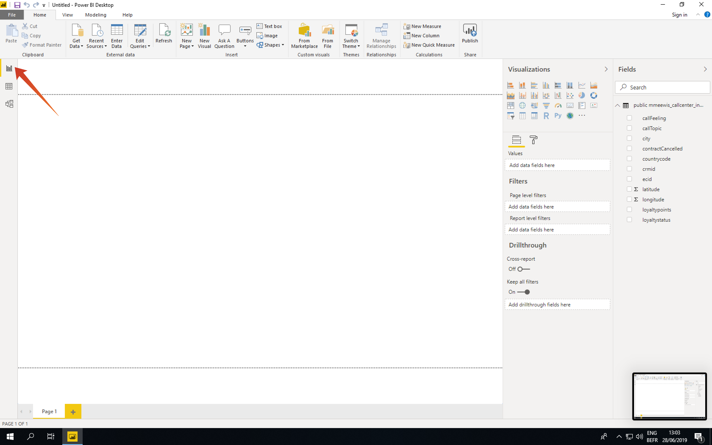

# 2.1.6 Serviço de consulta e Power BI

Abra o Microsoft Power BI Desktop.

Clique em **Obter Dados**.

Pesquise por **postgres** (1), selecione **Postgres** (2) na lista e **Connect** (3).

Vá para o Adobe Experience Platform, para **Consultas** e para **Credenciais**.

Na página **Credenciais** do Adobe Experience Platform, copie o **Host** e cole-o no campo **Servidor**, copie o **Banco de Dados** e cole-o no campo **Banco de Dados** do Power BI e clique em OK (2).

>[!IMPORTANT]
>
>Certifique-se de incluir a porta **:80** no final do valor Server porque o Serviço de Consulta não usa atualmente a porta PostgreSQL padrão de 5432.

Na próxima caixa de diálogo, preencha o Nome de usuário e a Senha com o Nome de usuário e a Senha encontrados nas **Credenciais** de Consultas no Adobe Experience Platform.

Na caixa de diálogo Navegador, coloque seu **LDAP** no campo de pesquisa (1) para localizar seus conjuntos de dados CTAS e marque a caixa ao lado de cada (2). Em seguida, clique em Carregar (3).

Verifique se a guia (1) **Relatório** está selecionada.

Selecione o mapa (1) e, depois de adicioná-lo à tela de relatórios, aumente o mapa (2).

Em seguida, precisamos definir as medidas e as dimensões. Para isso, arraste os campos da seção **campos** para os espaços reservados correspondentes (localizados em **visualizações**), conforme indicado abaixo:

Como medida, usaremos uma contagem de **customerId**. Arraste o campo **crmid** da seção **fields** para o espaço reservado **Size**:

Finalmente, para fazer uma análise de **callTopic**, vamos arrastar o campo **callTopic** para o espaço reservado de **filtros de nível de página** (talvez seja necessário rolar a tela na seção **visualizações**);

Selecione/desmarque **callTopics** para investigar:

Você terminou este exercício agora.

## Próximas etapas

Ir para [2.1.8 API do Serviço de Consulta](./ex8.md){target="_blank"}

Voltar para o [Serviço de consulta](./query-service.md){target="_blank"}

Voltar para [Todos os módulos](./../../../../overview.md){target="_blank"}
