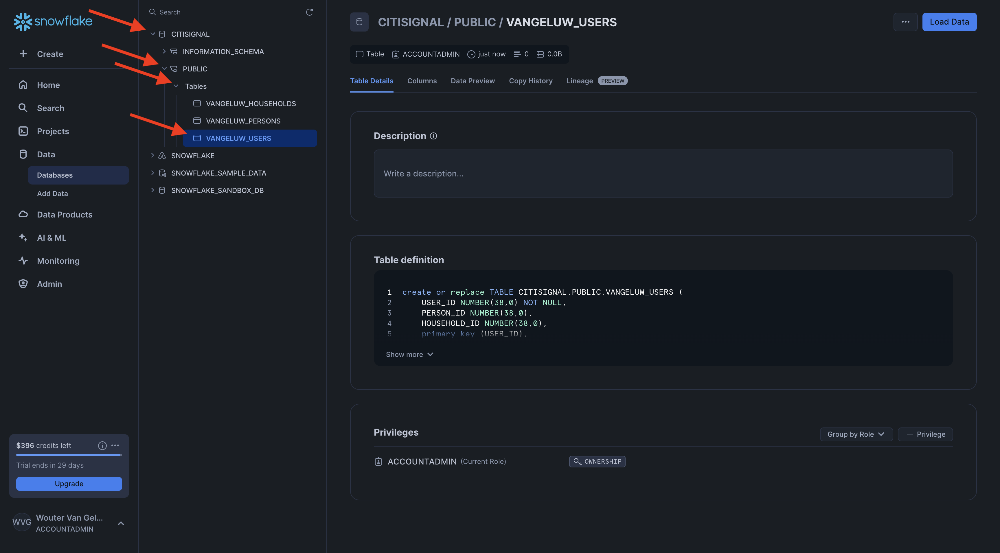

# 3.1.1 Configurar o ambiente Snowflake

## 3.1.1.1 Criar sua conta

Ir para [https://snowflake.com](https://snowflake.com). Clique em **INICIAR GRATUITAMENTE**.


Insira seus detalhes e clique em **Continuar**.


Insira seus detalhes, escolha seu provedor de nuvem e clique em **Introdução**.


Insira seus detalhes ou clique em **Ignorar** (x2).


Você verá isso. Verifique seu email e clique no email de confirmação enviado para você.


Clique no link do email de confirmação para ativar sua conta e definir seu nome de usuário e senha. Clique em **Introdução**. Você precisará usar esse nome de usuário e senha no próximo exercício.


Você será conectado ao Snowflake. Clique em **Ignorar por agora**.


## 3.1.1.2 Criar o banco de dados

Vá para **Dados > Bancos de dados**. Clique em **+ Banco de Dados**.


Use o nome **CITISIGNAL** para o banco de dados. Clique em **CRIAR**.


## 3.1.1.3 Criar tabelas

Agora você pode começar a criar suas tabelas no Snowflake. Você encontrará scripts abaixo para executar o para criar suas tabelas.

### Tabela CK_PERSONS

Clique em **+ Criar**, em **Tabela** e em **Padrão**.


Você verá isso. Copie a consulta abaixo e cole-a no Snowflake. Selecione o banco de dados **CITISIGNAL** no canto superior esquerdo da tela antes de criar a tabela.

```sql
create or replace TABLE CITISIGNAL.PUBLIC.CK_PERSONS (
	PERSON_ID NUMBER(38,0) NOT NULL,
	NAME VARCHAR(255),
	AGE NUMBER(38,0),
	EMAIL VARCHAR(255),
	PHONE_NUMBER VARCHAR(20),
	GENDER VARCHAR(10),
	OCCUPATION VARCHAR(100),
	ISATTMOBILESUB BOOLEAN,
	primary key (PERSON_ID)
);
```

Clique em **Criar tabela**.


Depois que o script for executado, você poderá encontrar sua tabela em **Bancos de dados > CITISIGNAL > PÚBLICO**.


### Tabela CK_HOUSEHOLDS

Clique em **+ Criar**, em **Tabela** e em **Padrão**.


Você verá isso. Copie a consulta abaixo e cole-a no Snowflake. Selecione o banco de dados **CITISIGNAL** no canto superior esquerdo da tela antes de criar a tabela.

```sql
create or replace TABLE CITISIGNAL.PUBLIC.CK_HOUSEHOLDS (
	HOUSEHOLD_ID NUMBER(38,0) NOT NULL,
	ADDRESS VARCHAR(255),
	CITY VARCHAR(100),
	STATE VARCHAR(50),
	POSTAL_CODE VARCHAR(20),
	COUNTRY VARCHAR(100),
	ISELIGIBLEFORFIBER BOOLEAN,
	PRIMARY_PERSON_ID NUMBER(38,0),
	ISFIBREENABLED BOOLEAN,
	primary key (HOUSEHOLD_ID)
);
```

Clique em **Criar tabela**.


Depois que o script for executado, você poderá encontrar sua tabela em **Bancos de dados > CITISIGNAL > PÚBLICO**.


### Tabela CK_USERS

Clique em **+ Criar**, em **Tabela** e em **Padrão**.


Você verá isso. Copie a consulta abaixo e cole-a no Snowflake. Selecione o banco de dados **CITISIGNAL** no canto superior esquerdo da tela antes de criar a tabela.

```sql
create or replace TABLE CITISIGNAL.PUBLIC.CK_USERS (
	USER_ID NUMBER(38,0) NOT NULL,
	PERSON_ID NUMBER(38,0),
	HOUSEHOLD_ID NUMBER(38,0),
	primary key (USER_ID),
	foreign key (PERSON_ID) references CITISIGNAL.PUBLIC.CK_PERSONS(PERSON_ID),
	foreign key (HOUSEHOLD_ID) references CITISIGNAL.PUBLIC.CK_HOUSEHOLDS(HOUSEHOLD_ID)
);
```

Clique em **Criar tabela**.


Depois que o script for executado, você poderá encontrar sua tabela em **Bancos de dados > CITISIGNAL > PÚBLICO**.



### Tabela CK_MONTHLY_DATA_USAGE

Clique em **+ Criar**, em **Tabela** e em **Padrão**.


Você verá isso. Copie a consulta abaixo e cole-a no Snowflake. Selecione o banco de dados **CITISIGNAL** no canto superior esquerdo da tela antes de criar a tabela.

```sql
create or replace TABLE CITISIGNAL.PUBLIC.CK_MONTHLY_DATA_USAGE (
	USAGE_ID NUMBER(38,0) NOT NULL autoincrement start 1 increment 1 noorder,
	USER_ID NUMBER(38,0),
	MONTH DATE,
	DATA_USAGE_GB NUMBER(10,2),
	primary key (USAGE_ID)
);
```

Clique em **Criar tabela**.


Depois que o script for executado, você poderá encontrar sua tabela em **Bancos de dados > CITISIGNAL > PÚBLICO**.


### Tabela CK_MOBILE_DATA_USAGE

Clique em **+ Criar**, em **Tabela** e em **Padrão**.


Você verá isso. Copie a consulta abaixo e cole-a no Snowflake. Selecione o banco de dados **CITISIGNAL** no canto superior esquerdo da tela antes de criar a tabela.


```sql
create or replace TABLE CITISIGNAL.PUBLIC.CK_MOBILE_DATA_USAGE (
	USAGE_ID NUMBER(38,0) NOT NULL autoincrement start 1 increment 1 noorder,
	USER_ID NUMBER(38,0),
	DATE DATE,
	TIME TIME(9),
	APP_NAME VARCHAR(255),
	DATA_USAGE_MB NUMBER(10,2),
	NETWORK_TYPE VARCHAR(50),
	DEVICE_TYPE VARCHAR(50),
	COUNTRY_CODE VARCHAR(10),
	primary key (USAGE_ID)
);
```

Clique em **Criar tabela**.


Depois que o script for executado, você poderá encontrar sua tabela em **Bancos de dados > CITISIGNAL > PÚBLICO**.


Todas as tabelas foram criadas.


## 3.1.1.4 Assimilar dados de amostra

Agora é possível começar a carregar dados de amostra no banco de dados.

...

Você concluiu a configuração no Snowflake.


Próxima Etapa: [3.1.2 Criar esquemas, modelo de dados e links](./ex2.md)

[Voltar ao módulo 3.1](./fac.md)

[Voltar a todos os módulos](../../../overview.md)
