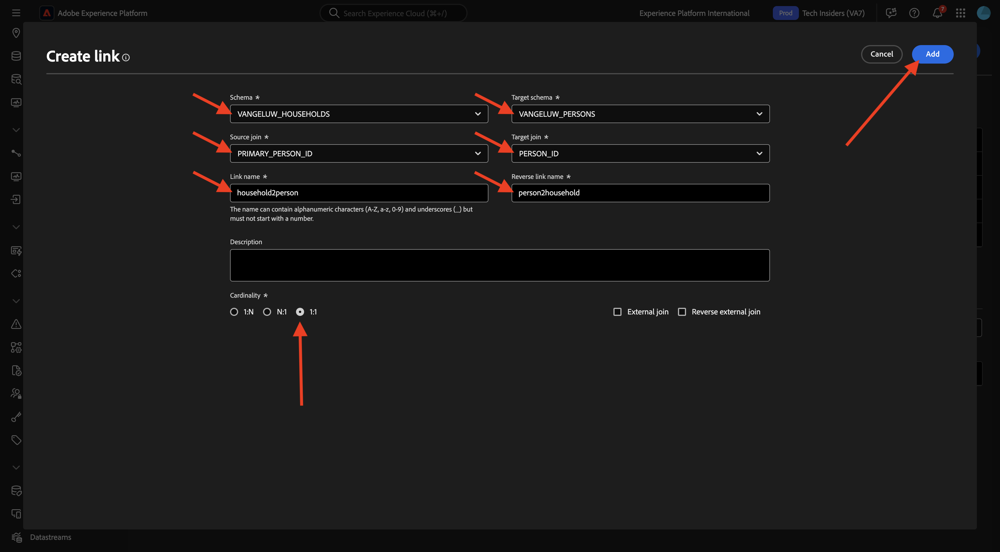

# 3.1.2 Criar esquemas, modelo de dados e links

Agora você pode configurar o banco de dados federado no Adobe Experience Platform.

Faça logon no Adobe Experience Platform acessando esta URL: [https://experience.adobe.com/platform](https://experience.adobe.com/platform).

Depois de fazer logon, você chegará à página inicial do Adobe Experience Platform.

Antes de continuar, você precisa selecionar uma **sandbox**. A sandbox a ser selecionada é chamada ``--aepSandboxName--``. Depois de selecionar a sandbox apropriada, você verá a alteração da tela e agora estará em sua sandbox dedicada.

## 3.1.2.1 Configurar um banco de dados federado na AEP

Clique em **Federated databases** no menu esquerdo. Em seguida, clique em **Adicionar banco de dados federado**.

Como um **Rótulo**, use `--aepUserLdap-- - CitiSignal Snowflake` e, para o tipo, escolha **Snowflake**.

Em detalhes, você precisa preencher suas credenciais, que serão assim:

**Servidor**:

No Snowflake, vá para **Admin > Contas**. Clique no 3 **...** ao lado da sua conta e clique em **Gerenciar URLs**.

Você verá isso. Copie a **URL atual** e cole-a no campo **Servidor** na AEP.

**Usuário**: o nome de usuário criado anteriormente, no exercício 1.3.1.1
**Senha**: a senha que você criou anteriormente, no exercício 1.3.1.1
**Banco de dados**: usar **CITISIGNAL**

Então, finalmente, vocês deveriam ter isto. Clique em **Testar Conexão**. Se o teste for bem-sucedido, clique em **Implantar Funções**, o que criará funções no lado do Snowflake que são necessárias para o mecanismo de fluxo de trabalho.

Depois que a conexão for testada com sucesso e as funções forem implantadas, sua configuração será armazenada.

Volte para o menu **Federated databases** e você verá sua conexão lá.

## 3.1.2.2 Criar esquemas na AEP

No menu esquerdo, clique em **Modelos** e vá para **Esquemas**. Clique em **Criar esquema**.

Selecione o banco de dados federado e clique em **+ Adicionar tabelas**.

Você verá isso. Selecione as 5 tabelas criadas no Snowflake antes de:

- `--aepUserLdap--_HOUSEHOLDS`
- `--aepUserLdap--_MOBILE_DATA_USAGE`
- `--aepUserLdap--_MONTHLY_DATA_USAGE`
- `--aepUserLdap--_PERSONS`
- `--aepUserLdap--_USERS`

Clique em **Adicionar**.

O AEP carregará as informações de cada tabela e as mostrará na interface do usuário.

Para cada tabela, é possível:

- alterar o rótulo do schema
- adicionar uma descrição
- renomear todos os campos e definir sua visibilidade
- selecionar a chave primária para o esquema

Para este exercício, não são necessárias alterações.

Clique em **Criar**.

Você verá isso. Você pode clicar em qualquer schema e revisar as informações. Como exemplo, clique em **—aepUserLdap—_PERSONS**.

Você verá isso, com a capacidade de editar a configuração. Clique em **Dados** para ver uma amostra dos dados que estão no banco de dados do Snowflake.

Você verá uma amostra dos dados.

## 3.1.2.3 Criar um modelo na AEP

No menu esquerdo, vá para **Modelos** e, em seguida, vá para **Modelo de dados**. Clique em **Criar modelo de dados**.

Para o rótulo, use `--aepUserLdap-- - CitiSignal Snowflake Data Model`. Clique em **Criar**.

Clique em **Adicionar esquemas**.

Selecione seus esquemas e clique em **Adicionar**.

Você verá isso. Clique em **Salvar**.

### USUÁRIOS - PESSOAS

Agora é possível começar a definir links entre esquemas. Para começar a definir um link, você precisa clicar em **Criar links**.

Primeiro, vamos definir o vínculo entre a tabela `--aepUserLdap--_USERS` e `--aepUserLdap--_PERSONS`.

Clique em **Adicionar**.

### FAMÍLIAS - PESSOAS

Você estará de volta aqui. Clique em **Criar links** para criar outro link.

Em seguida, vamos definir o vínculo entre a tabela `--aepUserLdap--_HOUSEHOLDS` e `--aepUserLdap--_PERSONS`.

### USUÁRIOS - MONTHLY_DATA_USAGE

Você estará de volta aqui. Clique em **Criar links** para criar outro link.

Em seguida, vamos definir o vínculo entre a tabela `--aepUserLdap--_USERS` e `--aepUserLdap--_MONTHLY_DATA_USAGE`.

### USUÁRIOS - FAMÍLIAS

Você estará de volta aqui. Clique em **Criar links** para criar outro link.

Em seguida, vamos definir o vínculo entre a tabela `--aepUserLdap--_USERS` e `--aepUserLdap--_HOUSEHOLDS`.

### USUÁRIOS - MOBILE_DATA_USAGE

Você estará de volta aqui. Clique em **Criar links** para criar outro link.

Em seguida, vamos definir o vínculo entre a tabela `--aepUserLdap--_USERS` e `--aepUserLdap--_MOBILE_DATA_USAGE`.

Você deverá ver isso. Clique em **Salvar**.

A configuração no AEP está concluída. Agora você pode começar a usar seus dados federados em uma composição de público-alvo federado.

Próxima Etapa: [3.1.3 Criar uma composição federada](./ex3.md)

[Voltar ao módulo 3.1](./fac.md)

[Voltar a todos os módulos](../../../overview.md)
