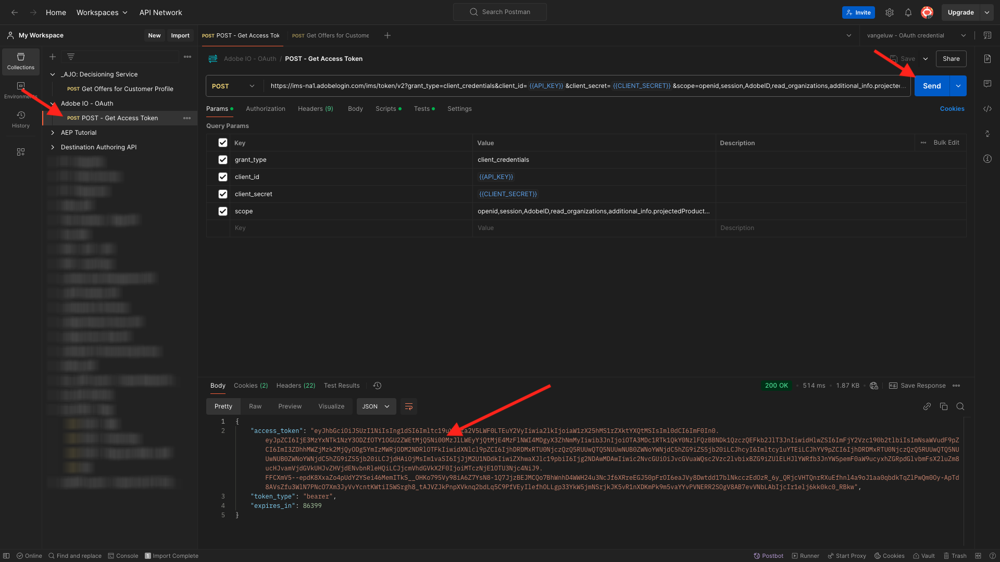

# 3.3.6 Testar sua decisão usando a API

## 3.3.6.1 Trabalhar com a API do Offer Decisioning usando o Postman

Baixe [esta Coleção do Postman para Offer Decisioning](./../../../assets/postman/postman_offer-decisioning.zip) na área de trabalho e descompacte-a. Você terá isto:

Agora você tem este arquivo na área de trabalho:

- `_AJO- Decisioning Service.postman_collection.json`

Você precisará usar o Postman novamente para este exercício.

Abra o Postman e importe o arquivo `_AJO- Decisioning Service.postman_collection.json`. Em seguida, você terá essa coleção disponível no Postman.

Agora você tem tudo o que precisa no Postman para começar a interagir com o Adobe Experience Platform por meio das APIs.

Antes de poder usar as APIs abaixo, certifique-se de reautenticar usando a coleção **Adobe IO - OAuth** que você configurou no Exercício 2.1.3.

### 3.3.6.2 Obter ofertas para o perfil do cliente

Clique para abrir a solicitação **POST - Obter ofertas para o Perfil do cliente**. A primeira coisa a ser atualizada é a variável **Cabeçalho** para **x-sandbox-name**. Você deve defini-lo como `--aepSandboxName--`.

Para essa solicitação, há vários campos que precisam ser atualizados. Ir para **Corpo**.

- **xdm:placementId**
- **xdm:activityId**
- **xdm:id**
- **xdm:itemCount** (altere para um valor de escolha)

O campo **xdm:activityId** precisa ser preenchido. Você pode recuperá-lo na interface do usuário do Adobe Experience Platform, conforme indicado abaixo.

O campo **[!UICONTROL xdm:placementId]** precisa ser preenchido. Você pode recuperá-lo na interface do usuário do Adobe Experience Platform, conforme indicado abaixo. No exemplo abaixo, você pode ver o placementId para o posicionamento **[!UICONTROL Web - Image]**.

Para o campo **xdm:id**, insira o endereço de email do perfil do cliente para o qual você deseja solicitar uma oferta. Depois que todos os valores forem definidos como desejado, clique em **[!UICONTROL Enviar]**.

Por fim, você verá o resultado de que tipo de oferta personalizada e quais ativos precisam ser exibidos para esse cliente. Neste exemplo, 2 itens foram solicitados e, como você pode ver, 2 ofertas personalizadas foram retornadas. 1 oferta para o Apple Watch e outra oferta para o Galaxy Watch 7.

Você concluiu este exercício agora.

Próxima etapa: [Resumo e benefícios](./summary.md)

[Voltar ao módulo 3.3](./offer-decisioning.md)

[Voltar a todos os módulos](./../../../overview.md)
