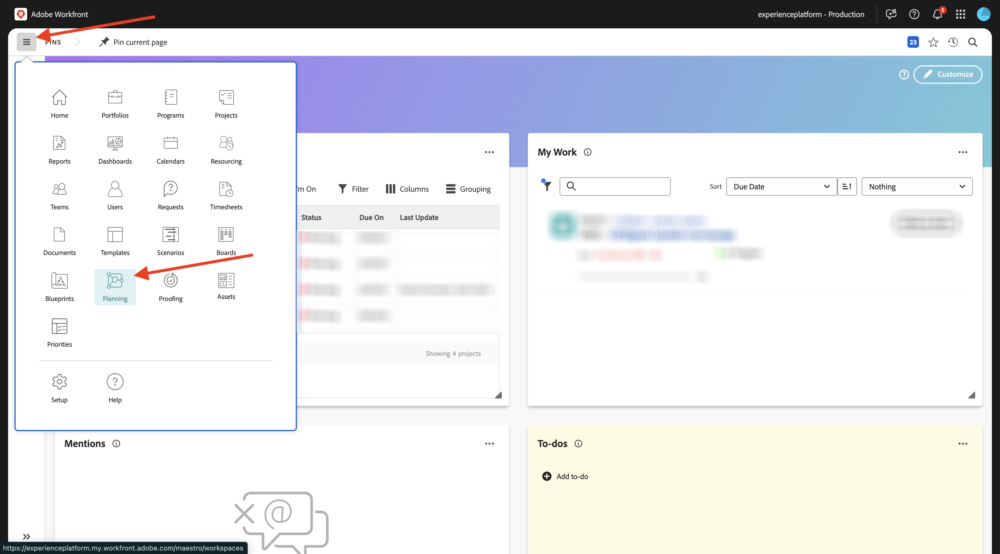
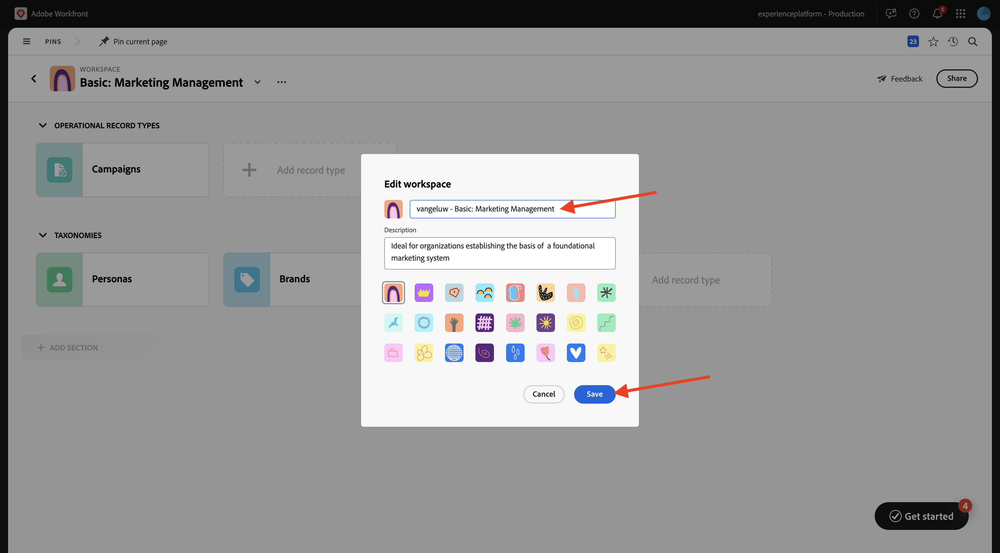
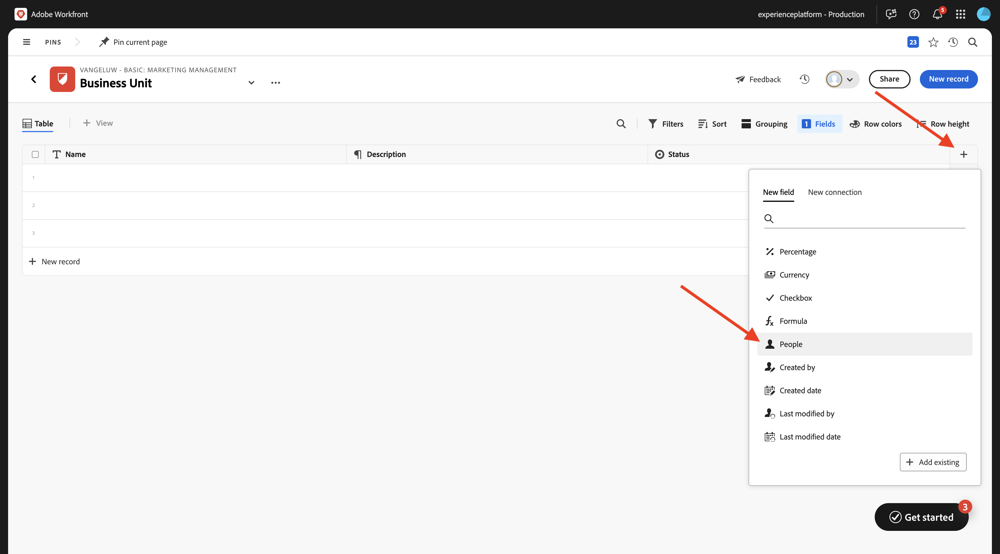
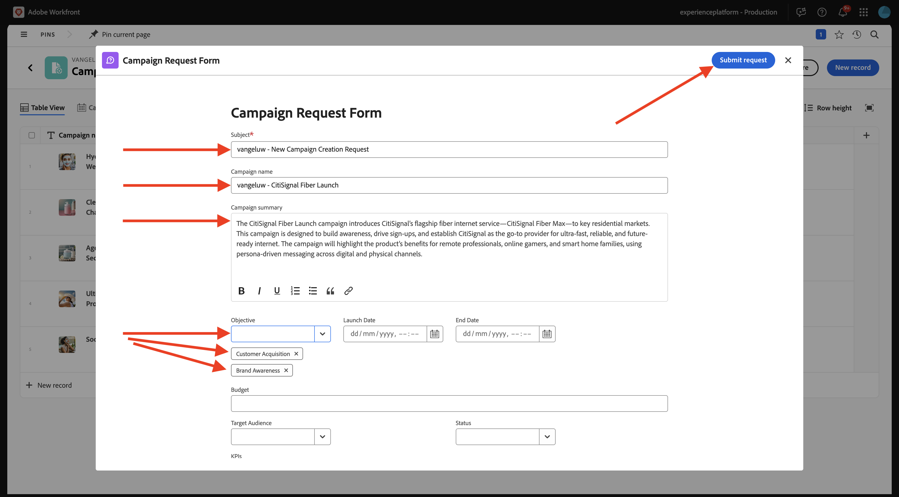
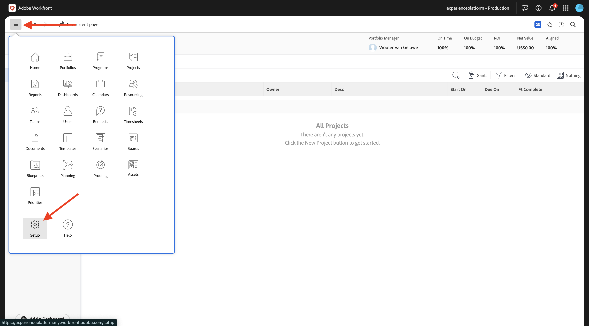
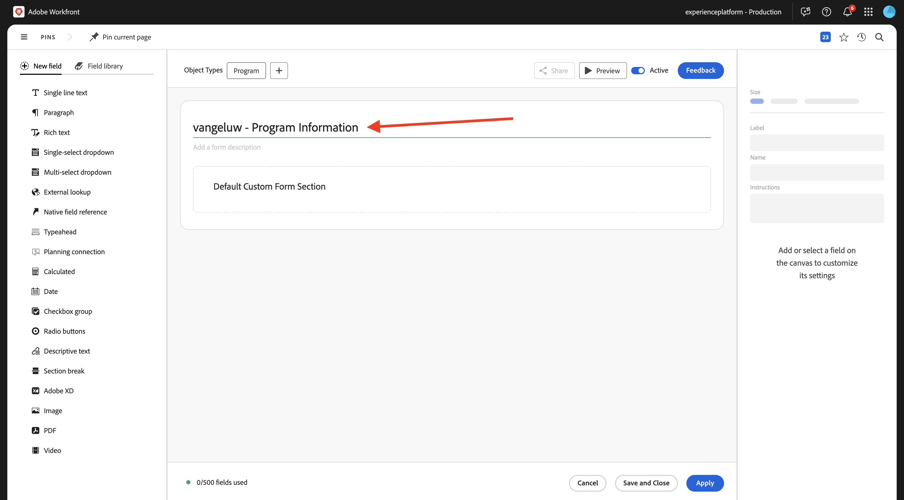
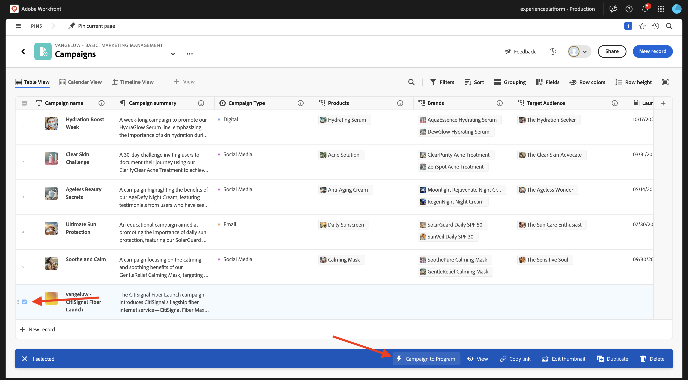

# 1.1.1 Introdução ao Workfront Planning

## Terminologia de Planejamento do Workfront 1.1.1.1

A seguir estão os principais objetos e conceitos do Workfront Planning:

| Termo | Explicação |
| --- | ---|
| **Workspace** | Uma coleção de tipos de registro que define o ciclo de vida operacional de uma determinada organização. Um espaço de trabalho é o quadro de trabalho de uma unidade organizacional. |
| **Tipo de Registro** | O nome dos tipos de objetos no Workfront Planning. Os tipos de registro preenchem espaços de trabalho. Ao contrário do Workfront Workflow, em que os tipos de objeto são predefinidos, no Workfront Planning você pode criar seus próprios tipos de objeto. |
| **Registro** | Uma instância de um tipo de registro. |
| **Modelo do Workspace** | Você pode criar um espaço de trabalho usando modelos predefinidos. Você pode usar os tipos de registro e campos predefinidos incluídos em um modelo ou pode adicionar os seus próprios. |
| **Campos** | Os campos são atributos que podem ser adicionados aos tipos de registro. Os campos contêm informações sobre o tipo de registro. |

>[!NOTE]
>
>Há limitações para quantos objetos do Workfront Planning você pode criar. Para obter mais informações, consulte a visão geral das limitações de objetos do Adobe Workfront Planning.

Agora você vai colocar a mão na massa e começar a criar alguns desses objetos você mesmo.

## 1.1.1.2 Workspace, Tipo de Registro, Campos

Ir para [https://experience.adobe.com/](https://experience.adobe.com/){target="_blank"}. Clique para abrir o **Workfront**.


No Workfront, clique em para abrir o menu e selecione **Planning**.



Você deverá ver isso. Clique em **Criar Workspace**.


Clique em **Usar modelo** para o modelo **Gerenciamento básico de marketing**.


Um novo espaço de trabalho foi criado. Antes de continuar, é necessário alterar o nome do espaço de trabalho. Clique nos 3 pontos **...** e selecione **Editar**.


Altere o nome para `--aepUserLdap-- - Basic: Marketing Management`. Clique em **Salvar**.



Você deveria ficar com isso.


## 1.1.1.3 Taxonomias: Tipo De Registro E Campos

Em **Taxonomias**, clique em **+ Adicionar tipo de registro** e selecione **Adicionar manualmente**.


Você deverá ver o pop-up **Adicionar tipo de registro**.


Atualize as seguintes informações na guia **Aparência**:

- Substituir **Tipo de registro sem título** por `Business Unit`.
- Descrição: `Defines which BU is leading campaign planning.`.
- Selecione uma cor e uma forma para o ícone de sua escolha

Clique em **Salvar**.


Clique para abrir o tipo de registro **Unidade de Negócios** recém-criado.


Agora você verá uma exibição de tabela vazia, pois seu tipo de registro recém-criado ainda não tem nenhum campo definido.


Clique no botão suspenso no campo **Data de Início** e selecione **Excluir**.


Clique em **Excluir**.


Clique no botão suspenso no campo **Data final** e selecione **Excluir**.


Clique em **Excluir**.


Em seguida, clique no ícone **+** para adicionar um novo campo. Role para baixo na lista de tipos de campos disponíveis e selecione **Pessoas**.



Defina o **Nome** do campo como `Business Unit Lead` e defina a descrição do campo como `Business Unit Lead responsible for budget and resources (VP, Head).`

Clique em **Salvar**.


Agora você criou um novo tipo de registro e excluiu e criou campos. Volte para a tela de visão geral do Workspace clicando na seta no canto superior esquerdo.


Você deverá ver isso.


## 1.1.1.4 Tipos de Registros Operacionais: Campos

Clique para abrir **Campanhas**.


Clique no ícone **+** para criar um novo campo. Selecione **Nova conexão** e **Personas**.


Deixe as configurações padrão em vigor. Clique em **Criar**.


Selecione **Ignorar**.


O novo campo é mostrado na exibição de tabela.


## 1.1.1.5 Criar um Formulário de Solicitação

Na tela de visão geral Campanhas, clique nos 3 pontos **...** e selecione **Criar formulário de solicitação**.


Altere o nome para `Campaign Request Form`. Clique em **Salvar**.


No momento, não é necessário fazer alterações no formulário. Você o usará sem alterações. Primeiro, clique em **Salvar** e depois em **Publicar**.


Clique na seta no canto superior esquerdo para voltar à tela Visão geral da solicitação do Forms.


Clique na seta no canto superior esquerdo para voltar à tela Visão geral das Campanhas.


## 1.1.1.6 Enviar um novo registro usando o Formulário de solicitação

Na tela de visão geral das Campanhas, clique em **+ Novo Registro**.


Selecione **Enviar uma solicitação** e clique em **Continuar**.


Defina o **Assunto** como `--aepUserLdap-- - New Campaign Creation Request`.

Defina o **Nome da campanha** como `--aepUserLdap-- - CitiSignal Fiber Launch`.

Defina o **Resumo da campanha** como:

```
The CitiSignal Fiber Launch campaign introduces CitiSignal’s flagship fiber internet service—CitiSignal Fiber Max—to key residential markets. This campaign is designed to build awareness, drive sign-ups, and establish CitiSignal as the go-to provider for ultra-fast, reliable, and future-ready internet. The campaign will highlight the product’s benefits for remote professionals, online gamers, and smart home families, using persona-driven messaging across digital and physical channels.
```

Clique em **Enviar solicitação**.



Clique em **X** para fechar o pop-up.


Você deve ver a campanha recém-criada na visão geral.


## 1.1.1.7 Criar Portfolio e formulário personalizado

Na próxima etapa, você criará uma automação que obterá informações da campanha criada no Workfront Planning e que usará essas informações no Workfront para criar um programa. Antes de criar a automação, há duas coisas para configurar no Workfront primeiro: um portfólio e um formulário personalizado.

Para criar o portfólio, abra o menu e clique em **Portfólios**.


Clique em **+ Novo Portfolio**.


Defina o nome do portfólio para `--aepUserLdap-- - Marketing`.


Em seguida, abra o menu e clique em **Configuração** para criar o formulário personalizado.



No menu esquerdo, vá para **Forms Personalizado**, para **Forms** e clique em **+ Novo formulário personalizado**.


Selecione **Programa** e clique em **Continuar**.


Altere o nome do formulário para `--aepUserLdap-- - Program Information`.



Em seguida, vá para **Biblioteca de Campos** e pesquise por `budget`. Arraste e solte o campo existente **Budget** no formulário.

Clique em **Aplicar**.


A configuração do formulário personalizado foi salva.


## 1.1.1.8 Criar uma Automação

Com o portfólio e o formulário personalizado criados, agora é possível criar a automação.

Clique para abrir o menu e selecione **Planning**.


Clique para abrir o espaço de trabalho criado antes, chamado `--aepUserLdap-- - Basic: Marketing Management`.


Clique para abrir **Campanhas**.


Na tela de visão geral Campanhas, clique nos 3 pontos **...** e selecione **Gerenciar Automações**.


Clique em **Nova automação**.


Defina o nome da Automação como `Campaign to Program`.

Defina a descrição como `This automation will convert a Planning Campaign record to a Workfront Program.`

Clique em **Salvar**.


Defina a **Ação** como **Criar programa**. Clique em **+ Adicionar campo conectado**.


Selecione o **Portfólio de programas**: `--aepUserLdap-- - Marketing`.

Selecione este **Formulário personalizado**: `--aepUserLdap-- Program information`.

Clique em **Salvar**.


Você deverá ver isso. Clique na seta para voltar para a tela Visão geral das campanhas.


Marque a caixa de seleção na frente da campanha que você criou anteriormente. Em seguida, clique em **Campaign to Program** automation.



Após alguns segundos, você verá uma confirmação de que a automação foi concluída com êxito. Isso significa que, com base no objeto Campaign no Workfront Planning, um Programa foi criado no Workfront.


Para verificar o Programa no Workfront, abra o menu e clique em **Portfólios**.


Abra seu portfólio, que deve se chamar `--aepUserLdap-- - Marketing`.


Vá para **Programas** e você deverá ver o programa que acabou de ser criado pela automação que você configurou.


Próxima Etapa: [1.2.2 A SER DEFINIDA](./ex1.md){target="_blank"}

Voltar para [Introdução ao Workfront Planning](./wfplanning.md){target="_blank"}

[Voltar para Todos os Módulos](./../../../overview.md){target="_blank"}
