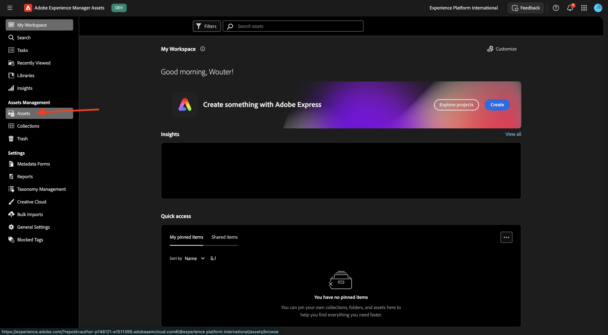
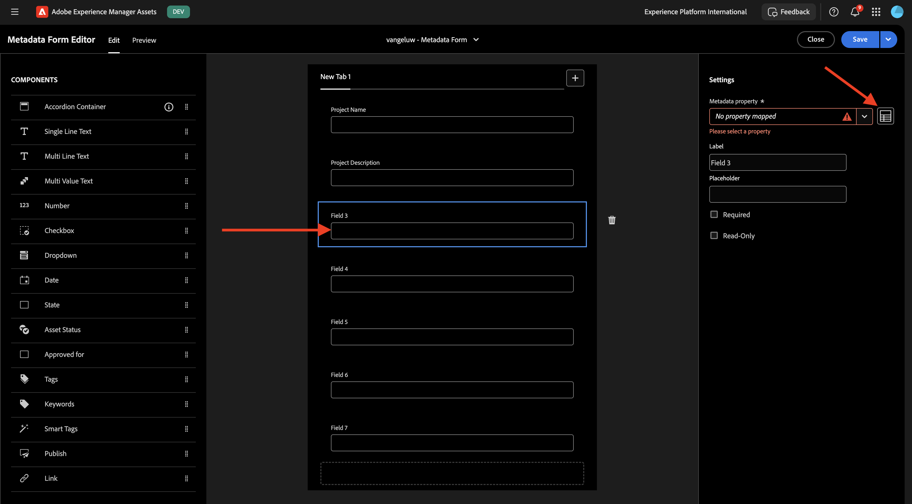
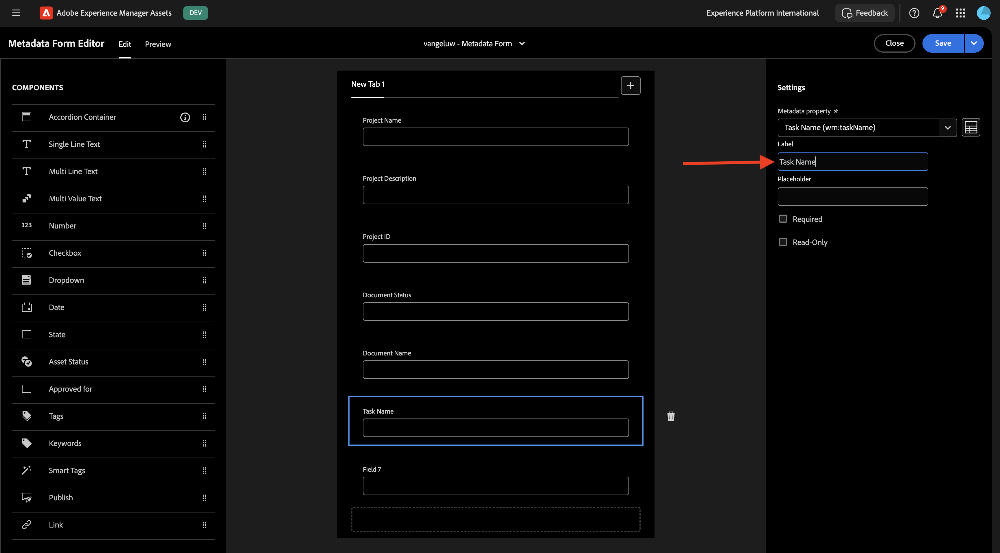

# 1.2.1 Integração de metadados do Workfront + AEM Assets CS

>[!IMPORTANT]
>
>Para concluir este exercício, você precisa ter acesso a um ambiente de trabalho do AEM Assets CS Author.
>
>Há duas opções a serem consideradas:
>
>- Se você estiver participando do workshop de Ativação técnica da GenStudio para CSC, seus instrutores criaram um ambiente de autor do AEM Assets CS para você. Verifique com eles qual é o nome e como proceder.
>
>- Se você estiver seguindo o caminho completo do tutorial do One Adobe, vá para o exercício [Adobe Experience Manager Cloud Service &amp; Edge Delivery Services](./../../../modules/asset-mgmt/module2.1/aemcs.md){target="_blank"}. Siga as instruções aqui e você terá acesso a esse ambiente.

>[!IMPORTANT]
>
>Se você tiver configurado anteriormente um Programa AEM CS com um ambiente AEM Assets CS, pode ser que sua sandbox AEM CS tenha hibernado. Considerando que a deshibernação de uma sandbox desse tipo leva de 10 a 15 minutos, seria uma boa ideia iniciar o processo de deshibernação agora para que você não precise aguardar mais tarde.

## Terminologia de fluxo de trabalho do Workfront 1.2.1.1

A seguir estão os principais objetos e conceitos do Workfront:

| Nome | Última atualização |
| ---------------------- | ------------ | 
| Portfólio | Uma coleção de projetos com características unificadoras. Esses projetos geralmente competem pelos mesmos recursos, orçamento ou período. |
| Programa | Um subconjunto em um portfólio, em que projetos semelhantes podem ser agrupados para alcançar um benefício bem definido. |
| Projeto | Uma grande quantidade de trabalho que deve ser concluída dentro de um período específico e deve usar um orçamento e número de recursos específicos. Para torná-lo gerenciável, divida o projeto em uma série de tarefas. Concluir todas as tarefas resulta na conclusão do projeto. |
| Modelo de projeto | Você pode usar modelos de projeto para capturar a maioria dos processos, informações e configurações repetíveis associados aos projetos em sua organização. Depois de criar modelos, você pode anexá-los a projetos existentes ou usá-los para criar novos projetos. |
| Tarefa | Uma atividade que deve ser executada como uma etapa para atingir uma meta final (concluir o projeto). Tarefas nunca podem existir independentemente. Eles sempre fazem parte de um projeto. |
| Atribuição | Um usuário, função de trabalho ou equipe atribuída a um problema ou tarefa. Projetos, portfólios ou programas não podem ter atribuições. |
| Documento/Versão | Qualquer arquivo anexado a um objeto no Workfront. Sempre que o mesmo documento for carregado no mesmo objeto, um número de versão será atribuído a ele. Os usuários podem exibir e alterar várias opções de uma versão anterior de um documento. |
| Aprovação | Um determinado item de trabalho, como uma tarefa, um documento ou uma folha de horas, pode exigir que um supervisor ou outro usuário faça logoff no item de trabalho. Esse processo de aprovação é chamado de aprovação. |

Ir para [https://experience.adobe.com/](https://experience.adobe.com/){target="_blank"}. Clique para abrir o **Workfront**.

Você verá isso.

## 1.2.1.1 Configurar a integração do AEM Assets

Clique no ícone **menu** e selecione **Instalação**.

No menu esquerdo, role até **Documentos** e clique em **Experience Manager Assets**. Clique em **+ Adicionar integração com o Experience Manager**.

Para o nome da sua integração, use `--aepUserLdap-- - CitiSignal AEM`.

Abra a lista suspensa **repositório do Experience Manager** e selecione sua instância do AEM CS, que deve ser chamada `--aepUserLdap-- - CitiSignal`.

Em **Metadados**, configure o seguinte mapeamento:

| Campo do Workfront | Campo do Experience Manager Assets |
| --------------- | ------------------------------ | 
| **Documento** > **Nome** | **wm:documentName** |
| **Projeto** > **Nome** | **wm:projectName** |
| **Projeto** > **Descrição** | **wm:projectDescription** |
| **Solicitação de documentos** > **Status** | **wm:wm:documentStatus** |
| **Tarefa** > **Nome** | **wm:taskName** |
| **Tarefa** > **Descrição** | **wm:taskDescription** |
| **Projeto** > **ID** | **wm:projectId** |

Habilite o comutador para **Sincronizar metadados do objeto**.

Clique em **Salvar**.

Sua integração do Workfront com o AEM Assets CS está configurada.

## 1.2.1.2 Configurar a integração de metadados com o AEM Assets

Em seguida, é necessário configurar o AEM Assets CS para que os campos de metadados do ativo no Workfront sejam compartilhados com o AEM Assets CS.

Para fazer isso, vá para [https://experience.adobe.com/](https://experience.adobe.com/). Clique em **Experience Manager Assets**.

Clique para selecionar seu ambiente AEM Assets, que deve ser nomeado como `--aepUserLdap-- - CitiSignal dev`.

Você deverá ver isso. No menu esquerdo, vá para **Assets**.

Em seguida, clique em **Criar pasta**.

Nomeie sua pasta `--aepUserLdap-- - CitiSignal Fiber Launch Assets` e clique em **Criar**.

Em seguida, vá para **Metadata Forms** no menu esquerdo e clique em **Criar**.

Use o nome `--aepUserLdap-- - Metadata Form` e clique em **Criar**.

Adicione 7 novos campos **Texto de linha única** ao formulário e selecione o primeiro campo. Em seguida, clique no ícone **Esquema** ao lado do campo **Propriedade de metadados** para o primeiro campo.

Você então verá esse pop-up. No campo de pesquisa, digite `wm:project` e selecione o campo **Nome do Projeto**. Clique em **Selecionar**.

Altere o rótulo do campo para `Project Name`. Clique em **Salvar**.

Vá para o segundo campo e clique no ícone **Esquema** ao lado do campo **Propriedade de metadados**.

No campo de pesquisa, insira `wm:project` e selecione o campo **Descrição do Projeto**. Clique em **Selecionar**.

Altere o rótulo do campo para `Project Description`.

Em seguida, selecione o terceiro campo e clique novamente no ícone **Esquema** ao lado do campo **Propriedade de metadados**.

Você verá esse pop-up novamente. No campo de pesquisa, digite `wm:project` e selecione o campo **ID do Projeto**. Clique em **Selecionar**.

Altere o rótulo do campo para `Project ID`.

Em seguida, selecione o quarto campo e clique novamente no ícone **Esquema** ao lado do campo **Propriedade de metadados**.

Você verá esse pop-up novamente. No campo de pesquisa, digite `wm:document` e selecione o campo **ID do Projeto**. Clique em **Selecionar**.

Altere o rótulo do campo para `Document Status`.

Em seguida, selecione o quinto campo e clique no ícone **Esquema** ao lado do campo **Propriedade de metadados** novamente.

Você verá esse pop-up novamente. No campo de pesquisa, digite `wm:document` e selecione o campo **ID do Projeto**. Clique em **Selecionar**.

Altere o rótulo do campo para `Document Name`.

Em seguida, selecione o sexto campo e clique novamente no ícone **Esquema** ao lado do campo **Propriedade de metadados**.

Você verá esse pop-up novamente. No campo de pesquisa, digite `wm:task` e selecione o campo **Nome da Tarefa**. Clique em **Selecionar**.

Altere o rótulo do campo para `Task Name`.

Em seguida, selecione o sétimo campo e clique no ícone **Esquema** ao lado do campo **Propriedade de metadados** novamente.

Você verá esse pop-up novamente. No campo de pesquisa, digite `wm:task` e selecione o campo **Descrição da Tarefa**. Clique em **Selecionar**.

Altere o rótulo do campo para `Task Description`.

Altere o **Nome da guia** no formulário para `--aepUserLdap-- - Workfront Metadata`.

Clique em **Salvar** e **Fechar**.

Seu **Formulário de Metadados** está configurado.

Em seguida, é necessário atribuir o Formulário de metadados à pasta criada anteriormente. Marque a caixa de seleção do formulário de metadados e clique em **Atribuir às pastas**.

Selecione sua pasta, que deve se chamar `--aepUserLdap-- - CitiSignal Fiber Launch Assets`. Clique em **Atribuir**.

O formulário de metadados agora está atribuído à sua pasta com sucesso.

Próxima Etapa: [1.2.2 Revisão com o Workfront](./ex2.md){target="_blank"}

Voltar para o [Gerenciamento de Fluxo de Trabalho com o Adobe Workfront](./workfront.md){target="_blank"}

[Voltar para Todos os Módulos](./../../../overview.md){target="_blank"}
