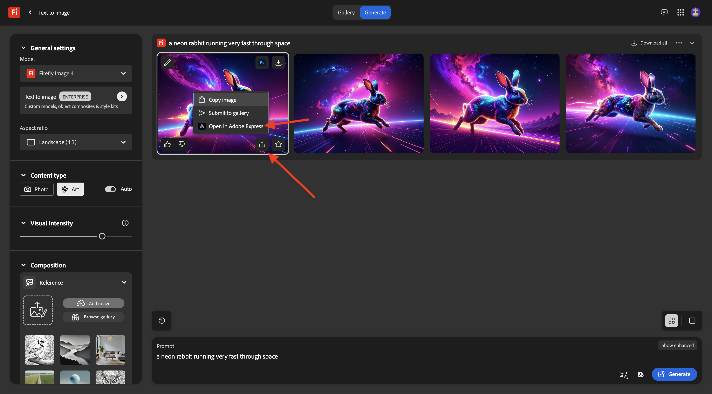
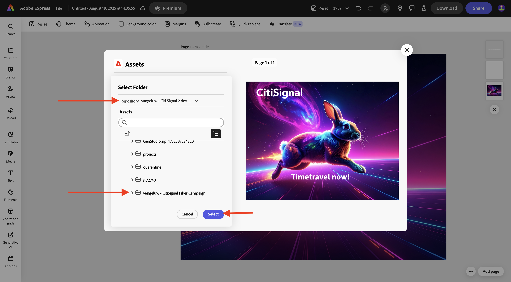

# 1.2.2 Prova com o Workfront

>[!IMPORTANT]
>
>Se você tiver configurado anteriormente um Programa AEM CS com um ambiente AEM Assets CS, pode ser que sua sandbox AEM CS tenha hibernado. Considerando que a deshibernação de uma sandbox desse tipo leva de 10 a 15 minutos, seria uma boa ideia iniciar o processo de deshibernação agora para que você não precise aguardar mais tarde.

## 1.2.2.1 Criar um Novo Fluxo de Aprovação

Volte para **Adobe Workfront**. Clique no ícone **menu** e selecione **Revisão**.

Vá para **Workflows**, clique em **+ Novo** e selecione **Novo modelo**.

Defina o **Nome do modelo** como `--aepUserLdap-- - Approval Workflow` e defina o **Proprietário do modelo** como você mesmo.

Role para baixo e, em **Estágios** > **Estágio 1**, altere a função de **Criador de provas** para **Revisor e Aprovador**. Você também pode adicionar qualquer outra pessoa, por exemplo, adicionar a si mesmo selecionando seu usuário e definindo a **Função** de **Revisor e Aprovador**.

Clique em **Criar**.

O fluxo de trabalho básico de aprovação agora está pronto para ser usado.

## 1.2.2.2 Habilitar o Workfront Blueprint

Na próxima etapa, você criará um novo projeto usando um modelo. A Adobe Workfront fornece vários blueprints disponíveis que precisam ser ativados.

Para o caso de uso do CitiSignal, o blueprint **Integrated Campaign Execution** é o que você precisa usar.

Para instalar esse blueprint, abra o menu e selecione **Blueprints**.

Selecione o filtro **Marketing** e role para baixo para encontrar o blueprint **Execução de campanha integrada**. Clique em **Instalar**.

Clique em **Continuar**.

Clique em **Instalar como está...**.

Você deverá ver isso. A instalação pode levar alguns minutos.

Após alguns minutos, o blueprint será instalado.

## 1.2.2.3 Criar um novo projeto

Abra o **menu** e vá para **Programas**.

Clique no programa que você criou antes, chamado `--aepUserLdap-- CitiSignal Fiber Launch`.

>[!NOTE]
>
>Você criou um programa como parte do exercício no [Workfront Planning](./../module1.1/ex1.md) com a automação que criou e executou. Se você ainda não tiver feito isso, poderá encontrar as instruções lá.

No seu programa, vá para **Projetos**. Clique em **+ Novo projeto** e selecione **Novo projeto do modelo**.

Selecione o modelo **Integrated Campaign Execution** e clique em **Usar modelo**.

Você deverá ver isso. Altere o nome para `--aepUserLdap-- - CitiSignal Fiber Launch Winter 2026` e clique em **Criar projeto**.

Seu projeto foi criado. Vá para **Detalhes do projeto**.

Vá para **Detalhes do projeto**. Clique para selecionar o texto atual em **Descrição**.

Defina a descrição como `The CitiSignal Fiber Launch project is used to plan the upcoming launch of CitiSignal Fiber.`

Clique em **Salvar alterações**.

Seu projeto está pronto para ser usado.

As tarefas e dependências no projeto foram criadas com base no modelo escolhido e definido como. proprietário do projeto. O status do projeto foi definido como **Planning**. Você pode alterar o status do projeto selecionando outro valor na lista.

## 1.2.2.4 Criar uma nova tarefa

Passe o mouse sobre a tarefa **Começar a Criar Modelos de Design** e clique nos 3 pontos **...**.

Selecione a opção **Inserir tarefa abaixo**.

Digite este nome para sua tarefa: `Create layout using approved assets and copy`.

Defina o campo **Atribuições** para a função **Designer**.
Defina o campo **Duração** para **5 dias**.
Definir a predecessora do campo como **9**.
Insira uma data para os campos **Início em** e **Conclusão em**.

Clique em outro lugar na tela para salvar a nova tarefa.

Você deverá ver isso. Clique na tarefa para abri-la.

Vá para **Detalhes da tarefa** e defina o campo **Descrição** como: `This task is used to track the progress of the creation of the assets for the CitiSignal Fiber Launch Campaign.`

Clique em **Salvar alterações**.

Você deverá ver isso. Clique no campo **Projeto** para voltar ao seu projeto.

No modo de exibição **Projeto**, vá para **Balanceador de Carga de Trabalho**.

Clique em **Atribuições em massa**.

Selecione a **Atribuição de função** do **Designer** e clique no campo **Usuário a ser atribuído**. Isso mostrará todos os usuários que têm uma função do **Designer** na sua instância do Workfront. Nesse caso, selecione o usuário fictício **Melissa Jenkins**.

Clique em **Atribuir**. O usuário que você selecionou será atribuído agora às tarefas do projeto que estão vinculadas à função **Designer**.

As tarefas agora estão atribuídas. Clique em **Tarefas** para voltar para a página de visão geral de **Tarefas**.

Clique na tarefa que você criou, chamada
**Criar layout usando ativos aprovados e copiar**.

Agora você começará a trabalhar nessa tarefa como parte desse exercício. Você pode ver que Melissa Jenkins está atribuída a esta tarefa no momento. Para alterar isso para você mesmo, clique no campo **Atribuições** e selecione **Atribuir a mim**.

Clique em **Salvar**.

Clique em **Trabalhar nisto**.

Você deverá ver isso.

Como parte dessa tarefa, você precisa criar uma nova imagem e carregá-la como um documento no Workfront. Agora você mesmo criará esse ativo usando o Adobe Express.

## 1.2.2.5 Criar ativo com Adobe Firely Services e Adobe Express

Ir para [https://firefly.adobe.com/](https://firefly.adobe.com/){target="_blank"}. Digite o prompt `a neon rabbit running very fast through space` e clique em **Gerar**.

Você verá várias imagens sendo geradas. Escolha a imagem de que você mais gosta, clique no ícone **Compartilhar** na imagem e selecione **Abrir no Adobe Express**.

Em seguida, você verá a imagem que acabou de gerar ficar disponível no Adobe Express para edição. Agora é necessário adicionar o logotipo CitiSignal na imagem. Para fazer isso, vá para **Marcas**.

Você deverá ver um modelo de marca CitiSignal. que foi criado no GenStudio for Performance Marketing aparecem no Adobe Express. Clique para selecionar um modelo de marca que tenha `CitiSignal` em seu nome.

Vá para **Logotipos** e clique no logotipo **branco** do Citisignal para soltá-lo na imagem.

Posicione o logotipo do CitiSignal na parte superior da imagem, não muito longe do meio.

Ir para **Texto**.

Clique em **Adicionar seu texto**.

Insira o texto `Timetravel now!`, altere a cor e o tamanho da fonte, defina o texto como **Negrito** para ter uma imagem semelhante a esta.

Em seguida, clique em **Compartilhar**.

Selecione **AEM Assets**.

Altere o nome do arquivo para `CitiSignal - Neon Rabbit - Timetravel now!`.
Clique em **Selecionar pasta**.

Selecione o repositório do AEM Assets CS, que deve se chamar `--aepUserLdap-- - CitiSignal` e selecione a pasta `--aepUserLdap-- - CitiSignal Fiber Campaign`. Clique em **Selecionar**.

Você deverá ver isso. Clique em **Carregar 1 ativo**. Sua imagem será carregada no AEM Assets CS.

## 1.2.2.6 Adicione um novo Documento à sua Tarefa e inicie o fluxo de aprovação

Volte para a tela **Detalhes da tarefa**. Ir para **Documentos**. Clique em **+ Adicionar novo** e selecione seu repositório do AEM Assets CS, que deve ser nomeado como `--aepUserLdap-- - CitiSignal`.

Clique duas vezes para abrir a pasta `--aepUserLdap-- CitiSignal Fiber Campaign`.

Selecione o arquivo criado na etapa anterior, denominado **CitiSignal - Neon rabbit - Timetravel Now!.ping**. Clique em **Selecionar**.

{width="50px" align="left"}

Você deveria ficar com isso. Passe o mouse sobre o documento carregado. Clique em **Criar prova** e escolha **Prova avançada**.

Na janela **nova prova**, selecione **Automatizado** e, em seguida, selecione o modelo de fluxo de trabalho criado anteriormente, que deve ser nomeado como `--aepUserLdap-- - Approval Workflow`. Clique em **Criar prova**.

Clique em **Abrir prova**

Agora você pode revisar a prova. Selecione **Adicionar comentário** para adicionar um comentário que exija que o documento seja alterado.

Insira seu comentário e clique em **Postar**. Em seguida, clique em **Tomar uma decisão**.

Selecione **Alterações necessárias** e clique em **tomar uma decisão**.

Retorne à sua **Tarefa** e ao **Documento**. Você verá que o texto **Alterações necessárias** também aparece lá.

Agora é necessário fazer alterações de design, o que será feito no Adobe Express.

## 1.2.2.7 Fazer alterações de design no Adobe Express

Vá para [https://new.express.adobe.com/your-stuff/files](https://new.express.adobe.com/your-stuff/files) e abra a imagem criada anteriormente novamente.

Altere o texto do CTA para `Get On Board Now!`.

Clique em **Compartilhar** e selecione **AEM Assets**.

Insira o nome `CitiSignal - Neon Rabbit - Get On Board Now!` e clique em **Selecionar pasta** para selecionar uma pasta de destino.

Selecione o repositório do AEM Assets CS, que deve se chamar `--aepUserLdap-- - CitiSignal` e selecione a pasta `--aepUserLdap-- - CitiSignal Fiber Campaign`. Clique em **Selecionar**.

Clique em **carregar 1 ativo**.

O novo ativo agora é criado e armazenado no AEM Assets.

## 1.2.2.8 Adicione uma nova versão do documento à sua tarefa

Na Visualização de tarefa no Adobe Workfront, selecione o arquivo de imagem antigo que não foi aprovado. Em seguida, clique em **+ Adicionar novo**, selecione **Versão** e selecione seu repositório do AEM Assets CS, que deve ser nomeado como `--aepUserLdap-- - CitiSignal`.

Navegue até a pasta `--aepUserLdap-- CitiSignal Fiber Campaign` e selecione o arquivo `CitiSignal - Neon Rabit - Get On Board Now!.png`. Clique em **Selecionar**.

Você deveria ficar com isso. Clique em **Criar prova** e selecione novamente **Prova avançada**.

Você verá isso. O **modelo de fluxo de trabalho** agora está pré-selecionado, pois a Workfront presume que o fluxo de trabalho de aprovação anterior ainda é válido. Clique em **Criar prova**.

Selecione **Abrir Prova**.

Agora você pode ver duas versões do arquivo próximas uma da outra. Clique no botão **Comparar provas**.

Você deverá ver ambas as versões da imagem próximas uma da outra. Clique em **Tomar decisão**.

Selecione **Aprovado** e clique em **Tomar decisão** novamente.

Feche a exibição **Comparar provas** fechando a versão esquerda da imagem. Clique no **Nome da Tarefa** para voltar para a visão geral da Tarefa.

Você voltará à exibição Tarefa, com um ativo aprovado. Esse ativo agora precisa ser compartilhado na AEM Assets.

Selecione o documento aprovado. Clique no ícone de **Seta de compartilhamento** e selecione sua integração com o AEM Assets, que deve se chamar `--aepUserLdap-- - CitiSignal AEM`.

Clique duas vezes na pasta criada anteriormente, que deve se chamar `--aepUserLdap-- - CitiSignal Fiber Launch Assets`.

Clique em **Selecionar pasta**.

Após 1-2 minutos, seu documento será publicado no AEM Assets. Você verá um ícone do AEM ao lado do nome do documento.

Clique em **Marcar como concluído** para concluir esta tarefa.

Você deverá ver isso.

## 1.2.2.9 Exibir seu arquivo no AEM Assets

Vá para sua pasta no AEM Assets CS, chamada `--aepUserLdap-- - CitiSignal Fiber Launch Assets`.

Selecione a imagem e escolha **Detalhes**.

Em seguida, você verá o Formulário de metadados que criou anteriormente, com os valores que foram preenchidos automaticamente pela integração entre o Workfront e o AEM Assets.

Voltar para o [Gerenciamento de Fluxo de Trabalho com o Adobe Workfront](./workfront.md){target="_blank"}

[Voltar para Todos os Módulos](./../../../overview.md){target="_blank"}
