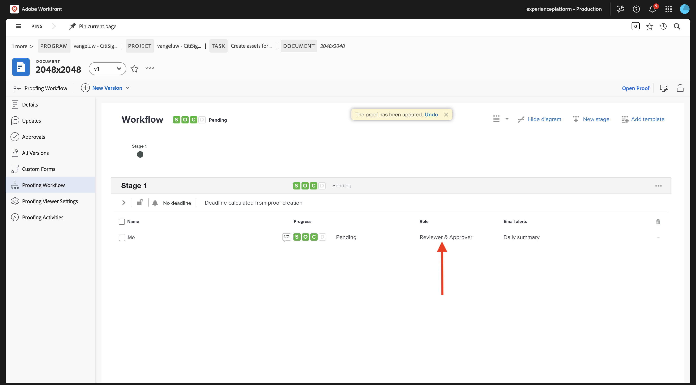

# 1.2.2 Prova com o Workfront

>[!IMPORTANT]
>
>Se você tiver configurado anteriormente um Programa AEM CS com um ambiente AEM Assets CS, pode ser que sua sandbox AEM CS tenha hibernado. Considerando que a deshibernação de uma sandbox desse tipo leva de 10 a 15 minutos, seria uma boa ideia iniciar o processo de deshibernação agora para que você não precise aguardar mais tarde.

## 1.2.2.1 Criar um Novo Fluxo de Aprovação

Volte para **Adobe Workfront**. Clique no ícone **menu** e selecione **Revisão**.

Vá para **Workflows**, clique em **+ Novo** e selecione **Novo modelo**.

Defina o **Nome do modelo** como `--aepUserLdap-- - Approval Workflow` e defina o **Proprietário do modelo** como você mesmo.

Role para baixo e, em **Estágios** > **Estágio 1**, adicione-se com a **Função** do **Revisor e Aprovador**.

Clique em **Criar**.

O fluxo de trabalho básico de aprovação agora está pronto para ser usado.

## 1.2.2.2 Criar um novo projeto

Abra o **menu** e vá para **Programas**.

Clique no programa que você criou antes, chamado `--aepUserLdap-- CitiSignal Fiber Launch`.

>[!NOTE]
>
>Você criou um programa como parte do exercício no [Workfront Planning](./../module1.1/ex1.md) com a automação que criou e executou. Se você ainda não tiver feito isso, poderá encontrar as instruções lá.

No seu programa, vá para **Projetos**. Clique em **+ Novo projeto** e selecione **Novo projeto**.

Você deverá ver isso. Altere o nome para `--aepUserLdap-- - CitiSignal Fiber Launch`.

Vá para **Detalhes do projeto**. Clique em **+Adicionar** em **Descrição**.

Defina a descrição como `The CitiSignal Fiber Launch project is used to plan the upcoming launch of CitiSignal Fiber.`

Clique em **Salvar alterações**.

Seu projeto foi criado.

## 1.2.2.3 Criar uma nova tarefa

Vá para **Tarefas** e clique em **+ Nova Tarefa**.

Digite este nome para sua tarefa: `Create assets for Fiber campaign`.

Definir o campo **Descrição** como: `This task is used to track the progress of the creation of the assets for the CitiSignal Fiber Launch Campaign.`

Clique em **Criar tarefa**.

Você deverá ver isso.

Na coluna **Atribuição**, adicione seu próprio nome.

A tarefa será atribuída a você.

## 1.2.2.4 Adicionar um novo Documento à sua Tarefa passar pelo fluxo de aprovação

Clique no logotipo **Workfront** para voltar à página de visão geral. Você deverá ver o projeto que acabou de criar aparecer na visão geral. Clique no projeto para abri-lo.

Em **Tarefas**, clique em para abrir a tarefa.

Ir para **Documentos**. Clique em **+ Adicionar novo** e selecione **Documento**.

Baixe [este arquivo](./images/2048x2048.png) na área de trabalho.

{width="50px" align="left"}

Selecione o arquivo **2048x2048.png** e clique em **Abrir**.

Você deveria ficar com isso. Passe o mouse sobre o documento carregado. Clique em **Criar prova** e escolha **Prova avançada**.

Na janela **nova prova**, selecione **Automatizado** e, em seguida, selecione o modelo de fluxo de trabalho criado anteriormente, que deve ser nomeado como `--aepUserLdap-- - Approval Workflow`. Clique em **Criar prova**.

Clique em **Trabalhar nisto**.

Clique em **Abrir prova**

Agora você pode revisar a prova. Selecione **Adicionar comentário** para adicionar um comentário que exija que o documento seja alterado.

Insira seu comentário e clique em **Postar**. Clique em **Fechar**.

Em seguida, você precisa alterar sua função de **Revisor** para **Revisor e Aprovador**. Para fazer isso, volte para a sua Tarefa e clique em **Fluxo de trabalho de revisão**.

Altere sua função de **Revisor** para **Revisor e Aprovador**.

Volte para Tarefa e abra a prova novamente. Agora você vê um novo botão, **Tomar decisão**. Clique nele.

Selecione **Alterações necessárias** e clique em **tomar uma decisão**.

Retorne à sua **Tarefa** e ao **Documento**. Agora é necessário carregar uma segunda imagem que considere os comentários fornecidos.

Baixe [este arquivo](./images/2048x2048_buynow.png) na área de trabalho.

{width="50px" align="left"}

Na exibição Tarefa, selecione o arquivo de imagem antigo que não foi aprovado. Em seguida, clique em **+ Adicionar novo**, selecione **Versão** e selecione **Documento**.

Selecione o arquivo **2048x2048_buynow.png** e clique em **Abrir**.

Você deveria ficar com isso. Clique em **Criar prova** e selecione novamente **Prova avançada**.

Você verá isso. O **modelo de fluxo de trabalho** agora está pré-selecionado, pois a Workfront presume que o fluxo de trabalho de aprovação anterior ainda é válido. Clique em **Criar prova**.

Selecione **Abrir Prova**.

Agora você pode ver duas versões do arquivo próximas uma da outra.

Clique em **Tomar decisão**, selecione **Aprovado** e clique novamente em **Tomar decisão**.

Clique no **Nome da Tarefa** para voltar para a visão geral da Tarefa.

Você voltará à exibição Tarefa, com um ativo aprovado. Esse ativo agora precisa ser compartilhado na AEM Assets.

Selecione o documento aprovado. Clique no ícone de **Seta de compartilhamento** e selecione sua integração com o AEM Assets, que deve se chamar `--aepUserLdap-- - CitiSignal AEM`.

Clique duas vezes na pasta criada anteriormente, que deve se chamar `--aepUserLdap-- - CitiSignal Fiber Launch Assets`.

Clique em **Selecionar pasta**.

Após 1-2 minutos, seu documento será publicado no AEM Assets. Você verá um ícone do AEM ao lado do nome do documento.

Clique em **Marcar como concluído** para concluir esta tarefa.

Você deverá ver isso.

## 1.2.2.5 Exibir seu arquivo no AEM Assets

Vá para sua pasta no AEM Assets CS, chamada `--aepUserLdap-- - CitiSignal Fiber Launch Assets`.

Selecione a imagem e escolha **Detalhes**.

Em seguida, você verá o Formulário de metadados que criou anteriormente, com os valores que foram preenchidos automaticamente pela integração entre o Workfront e o AEM Assets.

Voltar para o [Gerenciamento de Fluxo de Trabalho com o Adobe Workfront](./workfront.md){target="_blank"}

[Voltar para Todos os Módulos](./../../../overview.md){target="_blank"}
