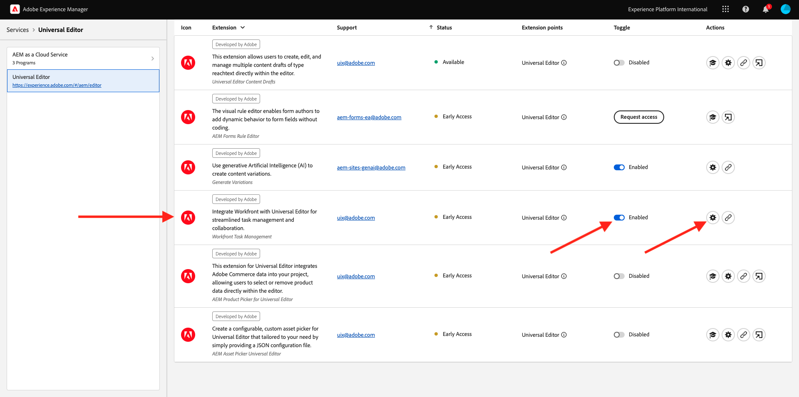

# 1.2.4 Workfront + AEM Sites

Faça logon no Adobe Workfront em [https://experienceplatform.my.workfront.com/](https://experienceplatform.my.workfront.com/){target="_blank"}.

Então você vê isso.

## 1.2.4.1 Configurar a integração do AEM Sites

>[!NOTE]
>
>Este plug-in está atualmente no modo **Acesso antecipado** e ainda não está disponível para o público geral.
>
>Este plug-in pode já estar instalado na instância do Workfront que você está usando. Se ele já estiver instalado, você poderá revisar as instruções abaixo, mas não será necessário alterar nada em sua configuração.

Ir para [https://experience.adobe.com/#/@experienceplatform/aem/extension-manager/universal-editor](https://experience.adobe.com/#/@experienceplatform/aem/extension-manager/universal-editor){target="_blank"}.

Verifique se a **alternância** deste plug-in está definida como **Habilitada**. Em seguida, clique no ícone de **engrenagem**.

Você verá um pop-up de **Configuração de extensão**. Configure os campos a seguir para usar este plug-in.

| Chave | Valor |
| --------------- | ------------------------------ | 
| **`IMS_ENV`** | **PRODUÇÃO** |
| **`WORKFRONT_INSTANCE_URL`** | **https://experienceplatform.my.workfront.com** |
| **`SHOW_CUSTOM_FORMS`** | **&#39;{&quot;previewUrl&quot;: true, &quot;publishUrl&quot;: true}&#39;** |

Clique em **Salvar**.

Volte para a interface do usuário do Workfront e clique no ícone de 9 pontos **hambúrguer**. Selecione **Instalação**.

No menu esquerdo, vá para **Forms Personalizado** e selecione **Formulário**. Clique em **+ Novo formulário personalizado**.

Selecione **Tarefa** e clique em **Continuar**.

Você verá um formulário personalizado vazio. Insira o nome do formulário `Content Fragment & Integration ID`.

Arraste e solte um novo campo **Texto de linha única** sobre a tela.

Configure o novo campo da seguinte maneira:

- **Rótulo**: **Fragmento do conteúdo**
- **Nome**: **`aem_workfront_integration_content_fragment`**

Adicione um novo campo **Texto de linha única** à tela e configure o novo campo desta forma:

- **Rótulo**: **ID de Integração**
- **Nome**: **`aem_workfront_integration_id`**

Clique em **Aplicar**.

Agora é necessário configurar um segundo formulário personalizado. Clique em **+ Novo formulário personalizado**.

Selecione **Tarefa** e clique em **Continuar**.

Você verá um formulário personalizado vazio. Insira o nome do formulário `Preview & Publish URL`.

Arraste e solte um novo campo **Texto de linha única** sobre a tela.

Configure o novo campo da seguinte maneira:

- **Rótulo**: **Visualizar URL**
- **Nome**: **`aem_workfront_integration_preview_url`**

Adicione um novo campo **Texto de linha única** à tela e configure o novo campo desta forma:

- **Rótulo**: **Publicar URL**
- **Nome**: **`aem_workfront_integration_publish_url`**

Clique em **Aplicar**.

Em seguida, você deve ter dois formulários personalizados disponíveis.

Próxima Etapa: [1.2.2 Revisão com o Workfront](./ex2.md){target="_blank"}

Voltar para o [Gerenciamento de Fluxo de Trabalho com o Adobe Workfront](./workfront.md){target="_blank"}

[Voltar para Todos os Módulos](./../../../overview.md){target="_blank"}
