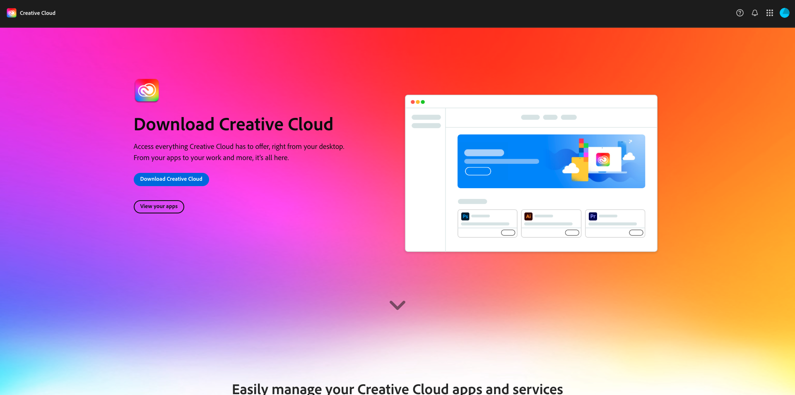

# Trabalho prévio

Abaixo está uma visão geral do pré-trabalho necessário antes de participar de um workshop ao vivo.

## 1. Instalar o Adobe Creative Cloud

Ir para [https://creativecloud.adobe.com/apps/download/creative-cloud](https://creativecloud.adobe.com/apps/download/creative-cloud).

## 2. Photoshop

Abra o aplicativo **Adobe Creative Cloud**, vá para **Aplicativos**. Instale o Photoshop no computador.

## 3. API

>[!NOTE]
>
>Se você for um funcionário da Adobe, siga as instruções aqui para baixar e instalar o [PostBuster](./postbuster.md)

Ir para [https://www.postman.com/downloads/](https://www.postman.com/downloads/).

Baixe e instale a versão relevante do Postman para seu sistema operacional.

Faça logon no Postman usando sua conta pessoal.

## 4. Código do Visual Studio

Vá para [https://code.visualstudio.com/](https://code.visualstudio.com/){target="_blank"}, baixe e instale o **Visual Studio Code**.

## 5. Um editor de texto de escolha

Se você não tiver um aplicativo Editor de Texto, acesse [https://www.sublimetext.com/](https://www.sublimetext.com/){target="_blank"} e baixe e instale este Editor de Texto.

## 6. Conta do GitHub

Se você ainda não tiver uma conta do GitHub, vá para [https://github.com/](https://github.com/){target="_blank"} e clique em **Inscrever-se**. Use seu email pessoal e crie sua conta.

## 7. GitHub Desktop

Vá para [https://desktop.github.com/download/](https://desktop.github.com/download/){target="_blank"}, baixe e instale o **Github Desktop**.

>[!NOTE]
>
>{width="50px" align="left"}
>
>Em caso de dúvidas, envie um email para **techinsiders@adobe.com** para compartilhar comentários gerais sobre sugestões para conteúdo futuro. Entre em contato diretamente com o Tech Insiders.

[Voltar a todos os módulos](./overview.md)
