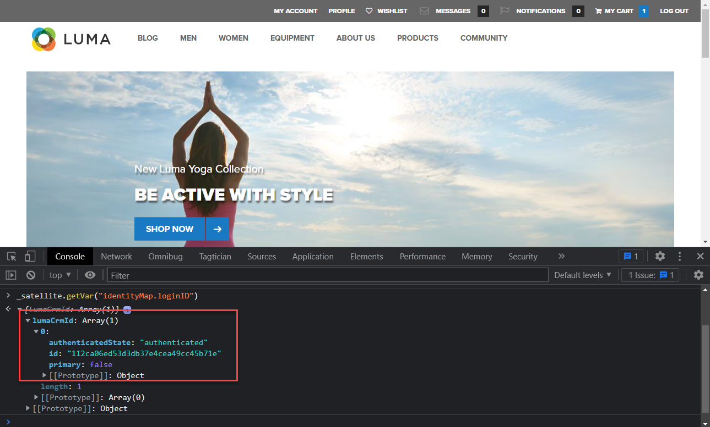

# Criar identidades

Saiba como capturar identidades com o SDK da Web do Experience Platform. Capturar dados de identidade não autenticados e autenticados no [Site de demonstração Luma](https://luma.enablementadobe.com/content/luma/us/en.html). Saiba como usar os elementos de dados criados anteriormente para coletar dados autenticados com um tipo de elemento de dados do SDK da Web da plataforma chamado de Mapa de identidade.

Há quatro novos tipos de elementos de dados introduzidos pela extensão de tags do SDK da Web da Platform:

1. ID de mesclagem de eventos
1. Mapa de identidade
1. Variable
1. Objeto XDM

Esta lição se concentra no elemento de dados do Mapa de identidade. Você mapeia elementos de dados contendo uma ID de usuário autenticada e um status de autenticação para o XDM.

## Objetivos de aprendizagem

No final desta lição, você poderá:

* Entender a diferença entre a ID de Experience Cloud (ECID) e a ID de dispositivo primário
* Entender a diferença entre IDs não autenticadas e autenticadas
* Criar um elemento de dados do mapa de identidade

## Pré-requisitos

Você entende o que é uma camada de dados, familiarizado com o [Site de demonstração Luma](https://luma.enablementadobe.com/content/luma/us/en.html){target="_blank"} camada de dados e saiba como fazer referência a elementos de dados em tags. Você deve ter concluído as seguintes etapas anteriores no tutorial:

* [Configurar um esquema XDM](configure-schemas.md)
* [Configurar um namespace de identidade](configure-identities.md)
* [Configurar uma sequência de dados](configure-datastream.md)
* [Extensão SDK da Web instalada na propriedade da tag](install-web-sdk.md)
* [Criar elementos de dados](create-data-elements.md)

>[!IMPORTANT]
>
>A variável [Extensão do Experience Cloud ID Service](https://exchange.adobe.com/experiencecloud.details.100160.adobe-experience-cloud-id-launch-extension.html) não é necessário ao implementar o SDK da Web da Adobe Experience Platform, pois a funcionalidade do Serviço de ID é incorporada no SDK da Web da plataforma.

## Experience Cloud ID

A variável [ID Experience Cloud (ECID)](https://experienceleague.adobe.com/docs/experience-platform/identity/ecid.html?lang=en) é um namespace de identidade compartilhada usado em aplicativos Adobe Experience Platform e Adobe Experience Cloud. A ECID fornece a base para a identidade do cliente e é a identidade padrão para propriedades digitais. Isso torna a ECID o identificador ideal para rastrear o comportamento não autenticado do usuário, pois ela está sempre presente.


<!-- FYI I commented this out because it was breaking the build - Jack
>[!TIP]
>
> When you use the Experience Platform Web SDK to set up Adobe applications on your digital properties, the ECID is generated at the Adobe Edge server level. As such, ECID is not viewable on the client-side network request payload. You can view the ECID by seeing the Preview tab of the network request, or by using the [Adobe Experience Platform Debugger Edge Trace](set-up-analytics.md#experience-cloud-id-validation).
>
-->

Leia mais sobre como [As ECIDs são rastreadas usando o SDK da Web da plataforma](https://experienceleague.adobe.com/docs/experience-platform/edge/identity/overview.html?lang=en).

As ECIDs são definidas usando uma combinação de cookies primários e Rede de borda da plataforma. Por padrão, os cookies primários são definidos pelo SDK da Web. Para levar em conta as restrições do navegador na duração do cookie, você pode optar por definir e gerenciar seus próprios cookies primários. Elas são chamadas de IDs de dispositivos primários (FPIDs).

## ID de dispositivo próprio (FPID)

Os FPIDs são cookies primários _você define o usando seus próprios servidores da Web_ que o Adobe usa para definir a ECID, em vez de usar o cookie próprio definido pelo SDK da Web. Os cookies primários são mais eficazes quando são definidos usando um servidor que aproveita um registro DNS A (para IPv4) ou registro AAAA (para IPv6), em vez de um CNAME DNS ou código JavaScript.

Depois que um cookie FPID é definido, seu valor pode ser buscado e enviado para o Adobe conforme os dados do evento são coletados. Os FPIDs coletados são usados como seeds para gerar ECIDs na Platform Edge Network, que continuam sendo os identificadores padrão nos aplicativos Adobe Experience Cloud.

Leia mais sobre [IDs de dispositivo próprio no SDK da Web da plataforma](https://experienceleague.adobe.com/docs/experience-platform/edge/identity/first-party-device-ids.html?lang=pt-BR)

>[!CAUTION]
>
> O FPID é uma maneira alternativa de gerar a ECID usando um cookie definido pelos servidores da Web. Não é usado para identificar usuários autenticados.

## ID autenticada

Como observado acima, todos os visitantes das suas propriedades digitais recebem uma ECID por Adobe ao usar o SDK da Web da plataforma. Isso torna a ECID a identidade padrão para rastrear comportamentos digitais não autenticados.

Você também pode enviar uma ID de usuário autenticada para que a Platform possa criar [Gráficos de identidade](https://experienceleague.adobe.com/docs/platform-learn/tutorials/identities/understanding-identity-and-identity-graphs.html?lang=pt-BR), o Target poderá definir seu Terceiro. Isso é feito usando o [!UICONTROL Mapa de identidade] tipo de elemento de dados.

Para criar o [!UICONTROL Mapa de identidade] elemento de dados:

1. Ir para **[!UICONTROL Elementos de dados]** e selecione **[!UICONTROL Adicionar elemento de dados]**

1. **[!UICONTROL Nome]** o elemento de dados `identityMap.loginID`

1. Como a variável **[!UICONTROL Extensão]**, selecione `Adobe Experience Platform Web SDK`

1. Como a variável **[!UICONTROL Tipo de elemento de dados]**, selecione `Identity map`

1. Isso solicita uma área de tela à direita dentro da **[!UICONTROL Interface da coleção de dados]** para configurar a identidade:

   

1. Como a variável  **[!UICONTROL Namespace]**, selecione o `lumaCrmId` que você criou anteriormente na variável [Configurar identidades](configure-identities.md) lição.

   >[!NOTE]
   >
   >    Se você não vir o seu `lumaCrmId` , verifique se você também o criou na sandbox de produção padrão. Atualmente, somente os namespaces criados na sandbox de produção padrão são exibidos na lista suspensa namespace.

1. Depois que a variável **[!UICONTROL Namespace]** for selecionada, uma ID deverá ser definida. Selecione o `user.profile.attributes.username` elemento de dados criado anteriormente no [Criar elementos de dados](create-data-elements.md#create-data-elements-to-capture-the-data-layer) lição, que captura uma ID quando os usuários estão conectados ao site Luma.

   <!--  >[!TIP]
    >
    >You can verify the **[!UICONTROL Luma CRM ID]** is collected in a data element on the web property by going to the [Luma Demo site](https://luma.enablementadobe.com/content/luma/us/en.html), logging in, [switching the tag environment](validate-with-debugger.md#use-the-experience-platform-debugger-to-map-to-your-tag-property) to your own, and typing `_satellite.getVar("user.profile.attributes.username")` in the web browser developer console.
    >
    >   
    -->

1. Como a variável **[!UICONTROL Estado autenticado]**, selecione **[!UICONTROL Autenticado]**
1. Selecionar **[!UICONTROL Principal]**

1. Selecionar **[!UICONTROL Salvar]**

   

>[!TIP]
>
> Adobe recomenda enviar identidades que representam uma pessoa, como `Luma CRM Id`, como a [!UICONTROL principal] identidade.
>
> Se o mapa de identidade contiver o identificador de pessoa (por exemplo, `Luma CRM Id`), o identificador de pessoa se tornará o [!UICONTROL principal] identidade. Caso contrário, `ECID` torna-se o [!UICONTROL principal] identidade.


<!--
1. Once the data element is configured in **[!UICONTROL Data Collection interface]**, it can be tested on the Luma web property like any other Data Element. Enter the following script in the browser developer console
   
   
   ```
   _satellite.getVar('identityMap.loginID')
   ```  

   
   
   >[!NOTE]
   >
   >ECID identifier will NOT populate in the Data Element, as this is configured already with Platform Web SDK.   
-->

Ao final dessas etapas, você deve ter os seguintes elementos de dados criados:

| Elementos de dados da extensão CORE | Elementos de dados do SDK da Web da plataforma |
-----------------------------|-------------------------------
| `cart.orderId` | `identityMap.loginID` |
| `page.pageInfo.hierarchie1` | `xdm.variable.content` |
| `page.pageInfo.pageName` | |
| `page.pageInfo.server` | |
| `user.profile.attributes.loggedIn` | |
| `user.profile.attributes.username` | |

Com esses elementos de dados implementados, você estará pronto para começar a enviar dados para a Platform Edge Network por meio do objeto XDM criando uma regra nas tags.

[Próximo: ](create-tag-rule.md)

>[!NOTE]
>
>Obrigado por investir seu tempo aprendendo sobre o Adobe Experience Platform Web SDK. Se você tiver dúvidas, quiser compartilhar feedback geral ou tiver sugestões sobre conteúdo futuro, compartilhe-as nesta [Publicação de discussão da comunidade do Experience League](https://experienceleaguecommunities.adobe.com/t5/adobe-experience-platform-launch/tutorial-discussion-implement-adobe-experience-cloud-with-web/td-p/444996)
