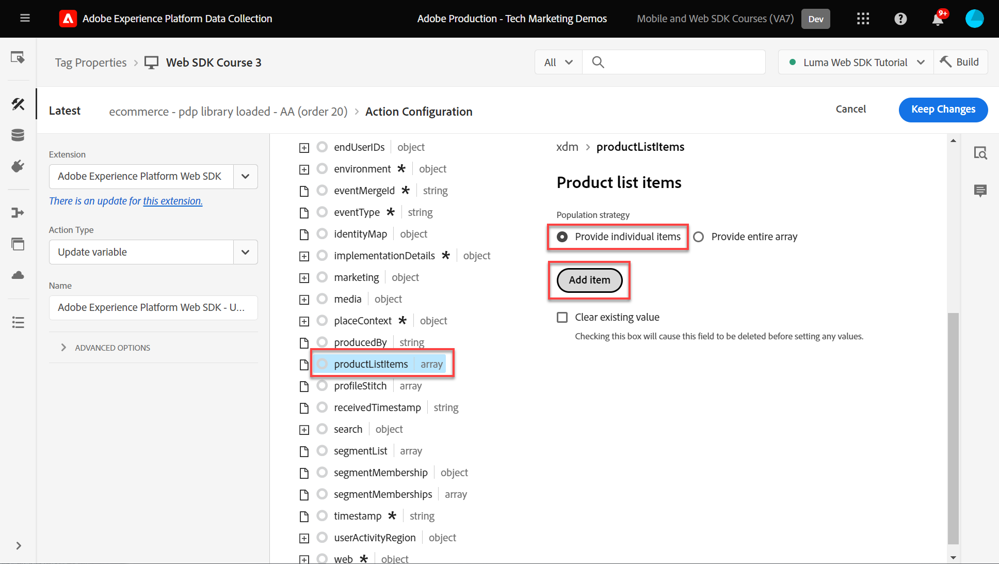
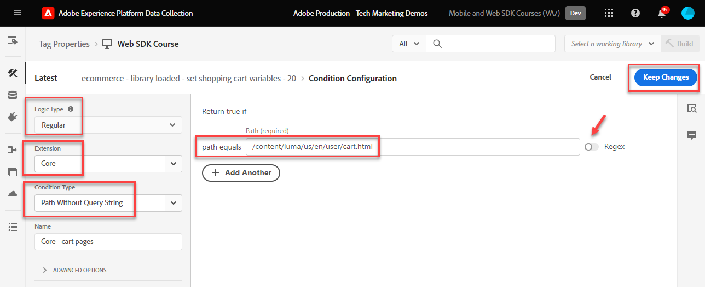

# Criar regras de tag

Saiba como enviar eventos para a Rede de borda da Platform com seu objeto XDM usando regras de tag. Uma regra de tag é uma combinação de eventos, condições e ações que instrui a propriedade de tag a fazer algo.

>[!NOTE]
>
> Para fins de demonstração, os exercícios desta lição baseiam-se no exemplo usado durante a [Criar identidades](create-identities.md) etapa; enviar uma ação de evento XDM para capturar conteúdo e identidades dos usuários na [Site de demonstração Luma](https://luma.enablementadobe.com/content/luma/us/en.html).

## Objetivos de aprendizagem

No final desta lição, você poderá:

* Usar uma convenção de nomenclatura para gerenciar regras nas tags
* Enviar um evento XDM usando os tipos de ação Atualizar variável e Enviar evento em uma regra de tag
* Publicar uma regra de tag em uma biblioteca de desenvolvimento

## Pré-requisitos

Você está familiarizado com as tags de Coleção de dados e a [Site de demonstração Luma](https://luma.enablementadobe.com/content/luma/us/en.html)e você deve ter concluído as seguintes lições anteriores no tutorial:

* [Configurar um esquema XDM](configure-schemas.md)
* [Configurar um namespace de identidade](configure-identities.md)
* [Configurar uma sequência de dados](configure-datastream.md)
* [Extensão SDK da Web instalada na propriedade da tag](install-web-sdk.md)
* [Criar elementos de dados](create-data-elements.md)
* [Criar identidades](create-identities.md)

## Convenções de nomenclatura

Para gerenciar melhor as regras nas tags, é recomendável seguir uma convenção de nomenclatura padrão. Este tutorial usa uma convenção de nomenclatura de três partes:

* [**localização**] - [**evento**] - [**ferramenta**] (**sequência**)

onde;

1. **localização** é a página ou páginas no site em que a regra é acionada
1. **evento** é o acionador da regra
1. **ferramenta** é o aplicativo ou aplicativos específicos usados na etapa de ação dessa regra
1. **sequência** é a ordem na qual a regra deve ser acionada em relação a outras regras
<!-- minor update -->

## Criar regras de tag

Nas tags, as regras são usadas para executar ações (acionar chamadas) em várias condições. A extensão de tags do SDK da Web da Platform inclui duas ações que serão usadas nesta lição:

* **[!UICONTROL Atualizar variável]** mapeia elementos de dados para campos XDM
* **[!UICONTROL Enviar evento]** envia o objeto XDM para a Rede de borda do Experience Platform

Primeiro, definimos uma regra com o **[!UICONTROL Atualizar variável]** , que define uma &quot;configuração global&quot; de campos XDM que queremos enviar em cada página do site (por exemplo, o nome da página).

Em seguida, podemos definir regras adicionais com o **[!UICONTROL Atualizar variável]** Uma ação que complementará os campos XDM globais com campos adicionais que só estão disponíveis em determinadas condições (por exemplo, adicionar detalhes do produto nas páginas do produto).

Por fim, usaremos outra regra com o **[!UICONTROL Enviar evento]** ação que enviará o objeto XDM completo para a Rede de borda da Adobe Experience Platform.

### Atualizar regras de variáveis

#### Campos globais

Para criar uma regra de tag para os campos XDM globais:

1. Abra a propriedade da tag que você está usando neste tutorial

1. Ir para **[!UICONTROL Regras]** na navegação à esquerda

1. Selecione o **[!UICONTROL Criar nova regra]** botão

   

1. Atribua um nome à regra `all pages global content variables - page bottom - AA (order 1)`

1. No **[!UICONTROL Eventos]** , selecione **[!UICONTROL Adicionar]**

   

1. Use o **[!UICONTROL Extensão principal]** e selecione `Page Bottom` como o **[!UICONTROL Tipo de evento]**

1. No **[!UICONTROL Nome]** campo, nomeie-o `Core - Page Bottom - order 1`. Isso ajuda a descrever o acionador com um nome significativo.

1. Selecionar **[!UICONTROL Avançado]** e insira `1` in **[!UICONTROL Pedido]**

   >[!NOTE]
   >
   > Quanto maior o número inserido, mais tarde na ordem geral de operações ele será acionado.

1. Selecionar **[!UICONTROL Manter alterações]** para retornar à tela principal da regra
   

1. No **[!UICONTROL Ações]** , selecione **[!UICONTROL Adicionar]**

1. Como a variável **[!UICONTROL Extensão]**, selecione **[!UICONTROL Adobe Experience Platform Web SDK]**

1. Como a variável **[!UICONTROL Tipo de ação]**, selecione **[!UICONTROL Atualizar variável]**

1. Como a variável **[!UICONTROL Elemento de dados]**, selecione o `xdm.variable.content` você criou na [Criar elementos de dados](create-data-elements.md) lição

   

Agora mapeie seu [!UICONTROL elementos de dados] para o [!UICONTROL schema] usado pelo seu objeto XDM.

>[!NOTE]
> 
> Você pode mapear para propriedades individuais ou objetos inteiros. Neste exemplo, você mapeia para propriedades individuais.

1. Role para baixo até alcançar a **`web`** objeto

1. Selecione para abri-lo

1. Mapeie os seguintes elementos de dados para o correspondente `web` Variáveis XDM

   * **`web.webPageDetials.name`** para `%page.pageInfo.pageName%`
   * **`web.webPageDetials.server`** para `%page.pageInfo.server%`
   * **`web.webPageDetials.siteSection`** para `%page.pageInfo.hierarchie1%`

1. Defina `web.webPageDetials.pageViews.value` como `1`

   

1. Em seguida, localize o `identityMap` no esquema e selecione-o

1. Mapear para o `identityMap.loginID` elemento de dados

   

1. Em seguida, localize o campo eventType e selecione-o

1. Insira o valor `web.webpagedetails.pageViews`

   >[!WARNING]
   >
   > Essa lista suspensa preenche o **`xdm.eventType`** no objeto XDM. Embora também seja possível digitar rótulos de forma livre neste campo, é altamente recomendável **não** pois tem efeitos adversos com a Platform.

   >[!TIP]
   >
   > Para entender quais valores devem ser preenchidos na variável `eventType` , você deve ir para a página do esquema e selecionar a `eventType` para exibir os valores sugeridos no painel direito.

   >[!TIP]
   >
   > Embora nenhuma `web.webPageDetials.pageViews.value` nem `eventType` definir como `web.webpagedetails.pageViews` são necessários para que o Adobe Analytics processe um sinal como uma exibição de página. É útil ter uma maneira padrão de indicar uma exibição de página para outros aplicativos downstream.

   

1. Selecionar **[!UICONTROL Manter alterações]** e depois **[!UICONTROL Salvar]** na próxima tela para concluir a criação da regra

#### Enriquecer o objeto XDM usando regras adicionais com a ação Atualizar variável

Você pode usar **[!UICONTROL Atualizar variável]**  em várias regras sequenciadas para enriquecer o objeto XDM antes de enviá-lo para o [!UICONTROL Rede de borda da plataforma].

>[!TIP]
>
>A ordem das regras determina qual regra é executada primeiro quando um evento é acionado. Se duas regras tiverem o mesmo tipo de evento, aquela com o número mais baixo será executada primeiro.
> 
>

##### Campos da página do produto

Comece rastreando as exibições do produto na página de detalhes do produto da Luma:

1. Selecionar **[!UICONTROL Adicionar regra]**
1. Nomear como  [!UICONTROL `ecommerce - pdp page bottom - AA (order 20)`]
1. Selecione o  em Evento para adicionar um novo acionador
1. Em **[!UICONTROL Extensão]**, selecione **[!UICONTROL Núcleo]**
1. Em **[!UICONTROL Tipo de evento]**, selecione **[!UICONTROL Page Bottom]**
1. Nomear como `Core - Page Bottom - order 20`
1. Selecione para abrir **[!UICONTROL Opções avançadas]**, digite `20`. Isso garante que a regra seja executada após a `all pages global content variables - page bottom - AA (order 1)` que define as variáveis de conteúdo globais, mas antes da variável `all pages send event - page bottom - AA (order 50)` que envia o evento XDM.

   

1. Em **[!UICONTROL Condições]**, selecione para **[!UICONTROL Adicionar]**
1. Sair **[!UICONTROL Tipo de lógica]** as **[!UICONTROL Regular]**
1. Sair **[!UICONTROL Extensões]** as **[!UICONTROL Núcleo]**
1. Selecionar **[!UICONTROL Tipo de condição]** as **[!UICONTROL Caminho sem cadeia de caracteres de consulta]**
1. À direita, ative a opção **[!UICONTROL Regex]** alternar
1. Em **[!UICONTROL caminho igual a]** set `/products/`. Para o site de demonstração Luma, ele garante que a regra seja acionada somente nas páginas do produto
1. Selecionar **[!UICONTROL Manter alterações]**

   

1. Em **[!UICONTROL Ações]** selecionar **[!UICONTROL Adicionar]**
1. Selecionar **[!UICONTROL Adobe Experience Platform Web SDK]** extensão
1. Selecionar **[!UICONTROL Tipo de ação]** as **[!UICONTROL Atualizar variável]**
1. Role para baixo até `commerce` e selecione para abri-lo.
1. Abra o **[!UICONTROL productViews]** object e set **[!UICONTROL value]** para `1`

   

   >[!TIP]
   >
   >A configuração commerce.productViews.value=1 no XDM mapeia automaticamente para o `prodView` evento no Analytics

1. Role para baixo e selecione `productListItems` matriz
1. Selecionar **[!UICONTROL Fornecer itens individuais]**
1. Selecionar **[!UICONTROL Adicionar item]**

   

   >[!CAUTION]
   >
   >A variável **`productListItems`** é um `array` tipo de dados para que espere que os dados entrem como uma coleção de elementos. Devido à estrutura da camada de dados do site de demonstração Luma e como é possível visualizar apenas um produto de cada vez no site Luma, você adiciona itens individualmente. Ao implementar o em seu próprio site, dependendo da estrutura da camada de dados, talvez você possa fornecer um storage inteiro.

1. Selecione para abrir **[!UICONTROL Item 1]**
1. Mapear **`productListItems.item1.SKU`** para `%product.productInfo.sku%`

   

1. Localizar `eventType` e defina-o como `commerce.productViews`

1. Selecionar **[!UICONTROL Manter alterações]**

1. Selecionar **[!UICONTROL Salvar]** para salvar a regra

### Campos do carrinho de compras

Você pode mapear toda a matriz para um objeto XDM, desde que a matriz corresponda ao formato do esquema XDM. O elemento de dados do código personalizado `cart.productInfo` você criou loops anteriores por meio da variável `digitalData.cart.cartEntries` objeto de camada de dados no Luma e traduz no formato necessário do `productListItems` objeto do esquema XDM.

Para ilustrar, consulte a comparação abaixo da camada de dados do site Luma (esquerda) com o elemento de dados traduzido (direita):

Compare o elemento de dados com o `productListItems` estrutura (dica, deve corresponder).

>[!IMPORTANT]
>
>Observe como as variáveis numéricas são convertidas, com valores de string na camada de dados, como `price` e `qty` reformatada para números no elemento de dados. Esses requisitos de formato são importantes para a integridade dos dados na Platform e são determinados durante o [configurar schemas](configure-schemas.md) etapa. No exemplo, **[!UICONTROL quantidade]** usa o **[!UICONTROL Integer]** tipo de dados.
> 

Agora, vamos mapear nosso array para o objeto XDM&quot;

1. Crie uma nova regra chamada `ecommerce - cart page bottom - AA (order 20)`
1. Selecione o  em Evento para adicionar um novo acionador
1. Em **[!UICONTROL Extensão]**, selecione **[!UICONTROL Núcleo]**
1. Em **[!UICONTROL Tipo de evento]**, selecione **[!UICONTROL Page Bottom]**
1. Nomear como `Core - Page Bottom - order 20`
1. Selecione para abrir **[!UICONTROL Opções avançadas]**, digite `20`
1. Selecionar **[!UICONTROL Manter alterações]**

   

1. Em **[!UICONTROL Condições]**, selecione para **[!UICONTROL Adicionar]**
1. Sair **[!UICONTROL Tipo de lógica]** as **[!UICONTROL Regular]**
1. Sair **[!UICONTROL Extensões]** as **[!UICONTROL Núcleo]**
1. Selecionar **[!UICONTROL Tipo de condição]** as **[!UICONTROL Caminho sem cadeia de caracteres de consulta]**
1. À direita, **não** habilitar o **[!UICONTROL Regex]** alternar
1. Em **[!UICONTROL caminho igual a]** set `/content/luma/us/en/user/cart.html`. Para o site de demonstração Luma, ele garante que a regra seja acionada somente na página do carrinho
1. Selecionar **[!UICONTROL Manter alterações]**

   

1. Em **[!UICONTROL Ações]** selecionar **[!UICONTROL Adicionar]**
1. Selecionar **[!UICONTROL Adobe Experience Platform Web SDK]** extensão
1. Selecionar **[!UICONTROL Tipo de ação]** as **[!UICONTROL Atualizar variável]**
1. Role para baixo até `commerce` e selecione para abri-lo.
1. Abra o **[!UICONTROL productListViews]** object e set **[!UICONTROL value]** para `1`

   

   >[!TIP]
   >
   >A configuração commerce.productListViews.value=1 no XDM mapeia automaticamente para o `scView` evento no Analytics

1. Role para baixo e selecione **[!UICONTROL productListItems]** matriz

1. Selecionar **[!UICONTROL Fornecer todo o array]**

1. Mapear para **`cart.productInfo`** elemento de dados

1. Selecionar `eventType` e definida como `commerce.productListViews`

1. Selecionar **[!UICONTROL Manter alterações]**

1. Selecionar **[!UICONTROL Salvar]** para salvar a regra

Crie duas outras regras para finalização e compra seguindo o mesmo padrão, com as diferenças abaixo:

**Nome da regra**: `ecommerce - checkout page bottom - AA (order 20)`

* **[!UICONTROL Condição]**: /content/luma/us/en/user/checkout.html
* Defina `eventType` como `commerce.checkouts`
* Definir **Evento de comércio XDM**: commerce.checkout.value para `1`

  >[!TIP]
  >
  >É equivalente à configuração `scCheckout` evento no Analytics

**Nome da regra**: `ecommerce - purchase page bottom - AA (order 20)`

* **[!UICONTROL Condição]**: /content/luma/us/en/user/checkout/order/thank-you.html
* Defina `eventType` como `commerce.purchases`
* Definir **Evento de comércio XDM**: commerce.purchases.value para `1`

  >[!TIP]
  >
  >É equivalente à configuração `purchase` evento no Analytics

Existem etapas adicionais para capturar todas as `purchase` variáveis de evento:

1. Abertura **[!UICONTROL comércio]** objeto
1. Abra o **[!UICONTROL pedido]** objeto
1. Mapa **[!UICONTROL purchaseID]** para o `cart.orderId` elemento de dados
1. Definir **[!UICONTROL currencyCode]** ao valor codificado `USD`

   

   >[!TIP]
   >
   >É equivalente à configuração `s.purchaseID` e `s.currencyCode` variáveis no Analytics

1. Role para baixo e selecione **[!UICONTROL productListItems]** matriz
1. Selecionar **[!UICONTROL Fornecer todo o array]**
1. Mapear para **`cart.productInfo.purchase`** elemento de dados
1. Selecionar **[!UICONTROL Salvar]**

Quando terminar, você deverá ver as seguintes regras criadas.

### Enviar evento

Agora que você definiu as variáveis, é possível criar a segunda regra para enviar o objeto XDM para a Rede de borda da Platform com o **[!UICONTROL Enviar evento]** tipo de ação.

1. À direita, selecione para **[!UICONTROL Adicionar regra]** para criar outra regra

1. Atribua um nome à regra `all pages send event - page bottom - AA (order 50)`

1. No **[!UICONTROL Eventos]** , selecione **[!UICONTROL Adicionar]**

1. Use o **[!UICONTROL Extensão principal]** e selecione `Page Bottom` como o **[!UICONTROL Tipo de evento]**

1. No **[!UICONTROL Nome]** campo, nomeie-o `Core - Page Bottom - order 50`. Isso ajuda a descrever o acionador com um nome significativo.

1. Selecionar **[!UICONTROL Avançado]** e insira `50` in **[!UICONTROL Pedido]**. Isso garantirá que a segunda regra seja acionada depois da primeira regra definida para acionar como `1`.

1. Selecionar **[!UICONTROL Manter alterações]** para retornar à tela principal da regra
   

1. No **[!UICONTROL Ações]** , selecione **[!UICONTROL Adicionar]**

1. Como a variável **[!UICONTROL Extensão]**, selecione  **[!UICONTROL Adobe Experience Platform Web SDK]**

1. Como a variável  **[!UICONTROL Tipo de ação]**, selecione  **[!UICONTROL Enviar evento]**

1. Como a variável **[!UICONTROL XDM]**, selecione o `xdm.variable.content` elemento de dados criado na lição anterior

1. Selecionar **[!UICONTROL Manter alterações]** para retornar à tela principal da regra

   
1. Selecionar **[!UICONTROL Salvar]** para salvar a regra

   

## Publicar a regra em uma biblioteca

Em seguida, publique a regra no ambiente de desenvolvimento para que você possa verificar se funciona.

Para criar uma biblioteca:

1. Ir para **[!UICONTROL Fluxo de publicação]** na navegação à esquerda

1. Selecionar **[!UICONTROL Adicionar biblioteca]**

   
1. Para o **[!UICONTROL Nome]**, insira `Luma Web SDK Tutorial`
1. Para o **[!UICONTROL Ambiente]**, selecione `Development`
1. Selecionar  **[!UICONTROL Adicionar todos os recursos alterados]**

   >[!NOTE]
   >
   >    Além da extensão do SDK da Web da Adobe Experience Platform e da `all pages global content variables - page bottom - AA (order 50)` regra, você verá os componentes de tag criados nas lições anteriores. A extensão principal contém o JavaScript básico exigido por todas as propriedades de tag da Web.

1. Selecionar **[!UICONTROL Salvar e criar para desenvolvimento]**

   

A biblioteca pode levar alguns minutos para ser criada e, quando estiver concluída, exibirá um ponto verde à esquerda do nome da biblioteca:

Como você pode ver no [!UICONTROL Fluxo de publicação] há muito mais no processo de publicação, que está além do escopo deste tutorial. Este tutorial usa apenas uma única biblioteca no ambiente de desenvolvimento do.

Agora você está pronto para validar os dados na solicitação usando o Adobe Experience Platform Debugger.

[Próxima ](validate-with-debugger.md)

>[!NOTE]
>
>Obrigado por investir seu tempo aprendendo sobre o Adobe Experience Platform Web SDK. Se você tiver dúvidas, quiser compartilhar feedback geral ou tiver sugestões sobre conteúdo futuro, compartilhe-as nesta [Publicação de discussão da comunidade do Experience League](https://experienceleaguecommunities.adobe.com/t5/adobe-experience-platform-launch/tutorial-discussion-implement-adobe-experience-cloud-with-web/td-p/444996)
