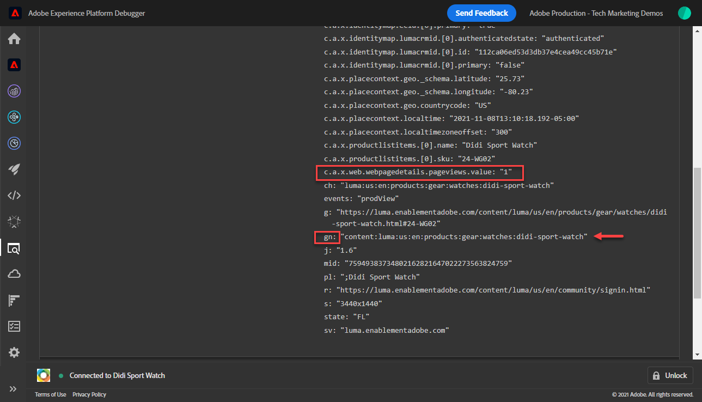
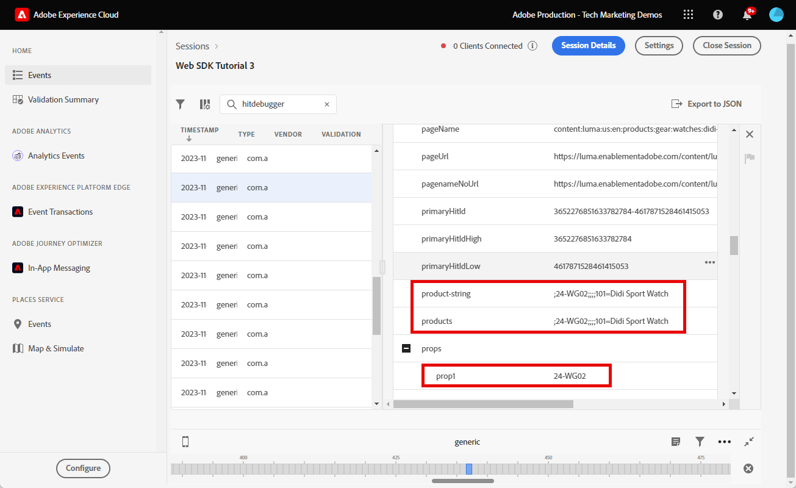

# Configurar o Adobe Analytics com o SDK da Web da plataforma

Saiba como configurar o Adobe Analytics usando o [Experience Platform Web SDK](https://experienceleague.adobe.com/docs/platform-learn/data-collection/web-sdk/overview.html), crie regras de tag para enviar dados ao Adobe Analytics e valide se o Analytics está capturando dados conforme esperado.

[Adobe Analytics](https://experienceleague.adobe.com/docs/analytics.html?lang=pt-BR) O é um aplicativo líder do setor que faz você ser capaz de entender seus clientes como pessoas e de orientar seus negócios com informações de inteligência de clientes.

## Objetivos de aprendizagem

No final desta lição, você poderá:

* Configurar um esquema XDM para o Adobe Analytics
* Entender a diferença entre variáveis XDM mapeadas automaticamente e manualmente para o Analytics
* Configurar um fluxo de dados para ativar o Adobe Analytics
* Substituir uma sequência de dados para enviar dados a outro conjunto de relatórios do Adobe Analytics
* Mapear elementos de dados de matriz individuais ou inteiros para o objeto XDM
* Use o tipo de ação Atualizar regra variável para empilhar várias regras em um evento XDM
* Capturar exibições de página no Adobe Analytics com o objeto XDM
* Capturar dados de comércio eletrônico com o objeto XDM para a cadeia de caracteres do produto Adobe Analytics
* Definir um eVar de merchandising de sintaxe do produto usando o XDM
* Valide se as variáveis do Adobe Analytics são definidas com o objeto XDM usando o Experience Platform Debugger
* Usar as regras de processamento do Adobe Analytics para definir variáveis personalizadas
* Validar dados capturados pela Adobe Analytics usando o Adobe Experience Platform Assurance
* A validação de dados é capturada pelo Adobe Analytics usando Relatórios em tempo real

## Pré-requisitos

Você está familiarizado com tags, Adobe Analytics e [Site de demonstração Luma](https://luma.enablementadobe.com/content/luma/us/en.html){target="_blank"} funcionalidade de logon e compra.

Você precisa de pelo menos uma ID de conjunto de relatórios de teste/desenvolvimento. Se você não tiver um conjunto de relatórios de teste/desenvolvimento que pode ser usado para este tutorial, [crie um](https://experienceleague.adobe.com/docs/analytics/admin/manage-report-suites/new-report-suite/t-create-a-report-suite.html).

Você deve ter concluído todas as etapas das seções anteriores no tutorial:

* Configuração inicial
   * [Configurar um esquema XDM](configure-schemas.md)
   * [Configurar um namespace de identidade](configure-identities.md)
   * [Configurar uma sequência de dados](configure-datastream.md)
* Configuração de tags
   * [Instalação da extensão do SDK da Web](install-web-sdk.md)
   * [Criar elementos de dados](create-data-elements.md)
   * [Criar identidades](create-identities.md)
   * [Criar uma regra de tag](create-tag-rule.md)
   * [Validar com o Adobe Experience Platform Debugger](validate-with-debugger.md)

Também é necessário [Ativar o acesso do usuário ao Adobe Experience Platform Assurance](https://experienceleague.adobe.com/docs/experience-platform/assurance/user-access.html) para que você possa validar seus dados do Adobe Analytics com o Adobe Experience Platform Assurance.

## Esquemas XDM e variáveis do Analytics

Parabéns! Você já configurou um esquema compatível com o Adobe Analytics no [Configurar um esquema](configure-schemas.md) lição! No entanto, para o Adobe Analytics, há duas abordagens gerais para definir o XDM do Adobe Analytics.

<!-- Implementing Platform Web SDK should be as product-agnostic as possible. For Adobe Analytics, mapping eVars, props, and events doesn't occur during schema creation, nor during the tag rules configuration as it has been done traditionally. Instead, every XDM key-value pair becomes a Context Data Variable that maps to an Analytics variable in one of two ways: 

1. Automatically mapped variables using reserved XDM fields
1. Manually mapped variables using Analytics Processing Rules

To understand what XDM variables are auto-mapped to Adobe Analytics, please see [Variables automatically mapped in Analytics](https://experienceleague.adobe.com/docs/experience-platform/edge/data-collection/adobe-analytics/automatically-mapped-vars.html?lang=en). Any variable that is not auto-mapped must be manually mapped. -->

1. **XDM independente de produto**: manter um esquema XDM de par de valor-chave semântico e usar [Regras de processamento do Adobe Analytics](https://experienceleague.adobe.com/docs/analytics/admin/admin-tools/manage-report-suites/edit-report-suite/report-suite-general/c-processing-rules/processing-rules.html) para mapear os campos XDM para eVars, props e assim por diante.

   >[!IMPORTANT]
   >
   > Todos os campos no esquema XDM se tornam disponíveis para o Adobe Analytics como Variáveis de dados de contexto com o seguinte prefixo `a.x.`. Por exemplo, `a.x.web.webinteraction.region`

1. **XDM específico do Analytics**: use um grupo de campos do Adobe Analytics criado com propósitos específicos no esquema XDM chamado `Adobe Analytics ExperienceEvent Template`

A abordagem que o Adobe viu dos clientes preferir é a **XDM específico do Analytics**, pois ignora a etapa de mapeamento na interface das Regras de processamento do Adobe Analytics. As etapas desta lição usam o **XDM específico do Analytics** abordagem.

## Mapeamento do XDM para o Adobe Analytics

Muitos campos XDM são mapeados automaticamente para variáveis do Analytics.

O esquema criado na variável [Configurar um esquema](configure-schemas.md) A lição contém algumas variáveis mapeadas automaticamente para o Analytics, conforme descrito nesta tabela:

| Variáveis mapeadas automaticamente do XDM para o Analytics | variável do Adobe Analytics |
|-------|---------|
| `identitymap.ecid.[0].id` | mid |
| `web.webPageDetails.name` | s.pageName |
| `web.webPageDetails.server` | s.server |
| `web.webPageDetails.siteSection` | s.channel |
| `commerce.productViews.value` | prodView |
| `commerce.productListViews.value` | scView |
| `commerce.checkouts.value` | scCheckout |
| `commerce.purchases.value` | Aquisição |
| `commerce.order.currencyCode` | s.currencyCode |
| `commerce.order.purchaseID` | s.purchaseID |
| `productListItems[].SKU` | s.products=;nome do produto;;; (principal - consulte a Observação abaixo) |
| `productListItems[].name` | s.products=;nome do produto;;;; (fallback - consulte a Observação abaixo) |
| `productListItems[].quantity` | s.products=;;quantidade do produto;;; |
| `productListItems[].priceTotal` | s.product=;;;preço do produto;; |

>[!NOTE]
>
>As seções individuais da cadeia de caracteres do produto Analytics são definidas por meio de diferentes variáveis XDM na `productListItems` objeto.
>Em 18 de agosto de 2022, `productListItems[].SKU` tem prioridade para mapear para o nome do produto na variável s.products.
>O valor definido como `productListItems[].name` é mapeado para o nome do produto somente se `productListItems[].SKU` não existe. Caso contrário, ele não será mapeado e estará disponível nos dados de contexto.
>Não defina uma cadeia de caracteres vazia ou nula como  `productListItems[].SKU`. Isso tem o efeito indesejado de mapear para o nome do produto na variável s.products.

Para obter a lista mais atualizada de mapeamentos, consulte [Mapeamento de variável do Analytics no Adobe Experience Edge](https://experienceleague.adobe.com/docs/experience-platform/edge/data-collection/adobe-analytics/automatically-mapped-vars.html?lang=pt-BR).

Para variáveis XDM que não são mapeadas automaticamente, use `Adobe Analytics ExperienceEvent Template` grupo de campos conforme detalhado na próxima seção abaixo.


## Configurar o fluxo de dados

O SDK da Web da Platform envia dados do seu site para a Rede de borda da Platform. Seu fluxo de dados informa à Platform Edge Network para qual de seus conjuntos de relatórios da Adobe Analytics encaminhar esses dados.

1. Ir para [Coleta de dados](https://experience.adobe.com/#/data-collection){target="blank"} interface
1. Na navegação à esquerda, selecione **[!UICONTROL Datastreams]**
1. Selecione o criado anteriormente `Luma Web SDK: Development Environment` sequência de dados

   

1. Selecionar **[!UICONTROL Adicionar serviço]**
   
1. Selecionar **[!UICONTROL Adobe Analytics]** como o **[!UICONTROL Serviço]**
1. Insira o  **[!UICONTROL ID do conjunto de relatórios]** do seu conjunto de relatórios de desenvolvimento
1. Selecionar **[!UICONTROL Salvar]**

   

   >[!TIP]
   >
   >Adicionar mais conjuntos de relatórios selecionando **[!UICONTROL Adicionar conjunto de relatórios]** é equivalente à marcação de vários conjuntos.

>[!WARNING]
>
>Neste tutorial, você só configura o conjunto de relatórios do Adobe Analytics para o seu ambiente de desenvolvimento. Ao criar fluxos de dados para seu próprio site, você criaria fluxos de dados adicionais e conjuntos de relatórios para seus ambientes de preparo e produção.

### Configurar uma substituição do conjunto de relatórios de sequência de dados

Talvez você queira alterar para quais dados do conjunto de relatórios do Adobe Analytics são enviados quando os visitantes estão em determinadas páginas. Para definir uma configuração de substituição de fluxo de dados para o Adobe Analytics:

1. Edite o **[!UICONTROL Adobe Analytics]** abrindo o menu shish-kabab e selecionando **[!UICONTROL Editar]**

   

1. Selecione o **[!UICONTROL Opções avançadas]** para abrir **[!UICONTROL Substituições do conjunto de relatórios]**

1. Selecione os conjuntos de relatórios que você deseja substituir. Nesse caso, `Web SDK Course Dev` e `Web SDK Course Stg`

1. Selecione Salvar

   

Posteriormente nesta lição, você [crie uma regra para enviar uma exibição de página para um conjunto de relatórios diferente com substituição de sequência de dados](setup-analytics.md###send-a-page-view-to-a-different-report-suite-with-datastream-override).

## Criar elementos de dados adicionais de comércio eletrônico

Em seguida, capture dados adicionais da camada de dados do Luma e envie-os para a Rede de borda da Platform. Embora a lição se concentre em requisitos comuns do Adobe Analytics, todos os dados capturados podem ser facilmente enviados para outros destinos com base na configuração do fluxo de dados. Por exemplo, se você concluiu a lição do Adobe Experience Platform, os dados adicionais capturados nesta lição também serão enviados para a Platform.

Durante a lição Criar elementos de dados, você [elementos de dados JavaScript criados](create-data-elements.md#create-data-elements-to-capture-the-data-layer) que capturou o conteúdo e os detalhes de identidade. Agora você cria elementos de dados adicionais para capturar dados de comércio eletrônico. Como a variável [Site de demonstração Luma](https://luma.enablementadobe.com/content/luma/us/en.html){target="_blank"} O usa diferentes estruturas de camada de dados para páginas de detalhes do produto e produtos no carrinho. Você deve criar elementos de dados separados para cada cenário. Use elementos de dados de código personalizado para coletar o que você precisa da camada de dados do Luma, que pode ou não ser necessária ao implementar no seu próprio site. Nesse caso, você deve percorrer uma variedade de itens do carrinho de compras para coletar detalhes específicos de cada produto. Use os trechos de código fornecidos abaixo:

1. Abra a propriedade de tag que você está usando no tutorial

1. Ir para **[!UICONTROL Elementos de dados]**

1. Selecionar **[!UICONTROL Adicionar elemento de dados]**

1. Nomear como **`product.productInfo.sku`**

1. Use o **[!UICONTROL Custom Code]** **[!UICONTROL Tipo de elemento de dados]**

1. Deixe caixas de seleção para **[!UICONTROL Forçar valor de minúsculas]** e **[!UICONTROL Texto limpo]** desmarcado

1. Sair `None` como o **[!UICONTROL Duração do armazenamento]** já que esse valor é diferente em cada página

1. Selecionar **[!UICONTROL Abrir editor]**

   

1. Copie e cole o código a seguir


   ```javascript
   var cart = digitalData.product;
   var cartItem;
   cart.forEach(function(item){
   cartItem = item.productInfo.sku;
   });
   return cartItem;
   ```

1. Selecionar **[!UICONTROL Salvar]** para salvar o código personalizado

1. Selecionar **[!UICONTROL Salvar]** para salvar o elemento de dados

Siga as mesmas etapas para criar esses elementos de dados adicionais:

* **`product.productInfo.title`**

  ```javascript
  var cart = digitalData.product;
  var cartItem;
  cart.forEach(function(item){
  cartItem = item.productInfo.title;
  });
  return cartItem;
  ```

<!--* **`product.productInfo.name`**

    ```javascript
    var cart = digitalData.product;
    var cartItem;
    cart.forEach(function(item){
    cartItem = item.productInfo.name;
    });
    return cartItem;
    ```-->

<!--* **`cart.productInfo`**

    ```javascript
    var cart = digitalData.cart.cartEntries; 
    var cartItem = [];
    cart.forEach(function(item, index, array){
    var qty;
    if(window.location.pathname.includes("thank-you.html")){
    qty = parseInt(item.qty);
    }else{
    qty = "";
    }
    var price = parseInt(item.price);
    cartItem.push({
    "SKU": item.sku,
    "quantity": qty,
    "priceTotal": price
    });
    });
    return cartItem; 
    ```-->

* **`cart.productInfo`**

  ```javascript
  var cart = digitalData.cart.cartEntries; 
  var cartItem = [];
  cart.forEach(function(item, index, array){
  cartItem.push({
  "SKU": item.sku
  });
  });
  return cartItem; 
  ```

* **`cart.productInfo.purchase`**

  ```javascript
  var cart = digitalData.cart.cartEntries; 
  var cartItem = [];
  cart.forEach(function(item, index, array){
  var qty = parseInt(item.qty);
  var price = parseInt(item.price);
  cartItem.push({
  "SKU": item.sku,
  "quantity": qty,
  "priceTotal": price
  });
  });
  return cartItem; 
  ```

  >[!TIP]
  >
  > Este trecho de código contém uma configuração eVar 1 personalizada usada durante a lição eVars de merchandising do produto

Depois de adicionar esses elementos de dados e criar os anteriores no [Criar elementos de dados](create-data-elements.md) , você deve ter os seguintes elementos de dados:

| Elementos de dados |
-----------------------------|
| `cart.orderId` |
| `cart.productInfo` |
| `cart.productInfo.purchase` |
| `identityMap.loginID` |
| `page.pageInfo.hierarchie1` |
| `page.pageInfo.pageName` |
| `page.pageInfo.server` |
| `product.productInfo.sku` |
| `product.productInfo.title` |
| `user.profile.attributes.loggedIn` |
| `user.profile.attributes.username` |
| `xdm.variable.content` |

<!-- 
>[!IMPORTANT]
>
>In this tutorial, you will create a different XDM object for each event. That means you must remap variables that would be considered to be "globally" available on every hit, such as page name and identityMap. However, you may [Merge Objects](https://experienceleague.adobe.com/docs/experience-platform/tags/extensions/adobe/core/overview.html#merged-objects) or use [Mapping Tables](https://exchange.adobe.com/experiencecloud.details.103136.mapping-table.html) to manage your XDM objects more efficiently in a real-life situation. For this lesson, the global variables are considered as:
>
>* **[!UICONTROL identityMap]** to capture the authenticated ID as per the [Create Identity Map Data Element](create-data-elements.md#create-identity-map-data-element) exercise in the [Create Data Elements](create-data-elements.md) lesson.
>* **[!UICONTROL web]** object to capture content as per the [content XDM object](create-data-elements.md#map-content-data-elements-to-XDM-Schema-individually) exercise in the [Create Data Elements](create-data-elements.md) lesson on every data element above. 
-->

## Criar regras adicionais

No [Criar uma regra de tag](create-tag-rule.md) lição, você configura uma `all pages global content variables - page bottom - AA (order 1)` regra que [criou um objeto XDM de linha de base usando o **[!UICONTROL Atualizar variável]** **[!UICONTROL tipos de ação]**](create-tag-rule.md#create-tag-rule). Os exercícios a seguir enriquecem esse objeto XDM para capturar dados adicionais específicos de determinadas páginas.

### Incrementar visualizações de página

Como agora você está enviando dados para o Adobe Analytics, também deve mapear um campo XDM extra para indicar que um beacon deve ser processado como uma exibição de página do Analytics.

1. Abra o `all pages global content variables - page bottom - AA (order 1)` regra
1. Role para baixo e selecione para abrir até `web.webPageDetails`
1. Selecione para abrir o **[!UICONTROL pageViews]** objeto
1. Definir **[!UICONTROL value]** para `1`
1. Selecionar **[!UICONTROL Manter alterações]**

   

   >[!TIP]
   >
   >Este campo equivale a enviar uma **`s.t()`** sinal de exibição de página do Analytics `AppMeasurement.js`. Para um beacon de clique em links, defina o `webInteraction.linkClicks.value` para `1`


### Enviar uma exibição de página para um conjunto de relatórios diferente com substituição de sequência de dados

Crie uma regra para enviar uma chamada de exibição de página adicional para um conjunto de relatórios diferente. Use o recurso de substituição de fluxo de dados para alterar o conjunto de relatórios de uma página usando o **[!UICONTROL Enviar evento]** Ação.

1. Crie uma nova regra, nomeie-a `homepage report suite override - page bottom - AA (order 51)`

1. Selecione o sinal de mais em **[!UICONTROL Evento]** para adicionar um novo acionador

1. Em **[!UICONTROL Extensão]**, selecione **[!UICONTROL Núcleo]**

1. Em **[!UICONTROL Tipo de evento]**, selecione **[!UICONTROL Page Bottom]**

1. Nomear como `Core - Page Bottom - order 51`

1. Selecione para abrir **[!UICONTROL Opções avançadas]**, digite `51`. Isso garante que a regra seja executada após a `all pages global content variables - page bottom - AA (order 50)` que define o XDM da linha de base com o **[!UICONTROL Atualizar variável]** tipo de ação.

   

1. Em **[!UICONTROL Condições]**, selecione para **[!UICONTROL Adicionar]**

1. Sair **[!UICONTROL Tipo de lógica]** as **[!UICONTROL Regular]**

1. Sair **[!UICONTROL Extensões]** as **[!UICONTROL Núcleo]**

1. Selecionar **[!UICONTROL Tipo de condição]** as **[!UICONTROL Caminho sem cadeia de caracteres de consulta]**

1. À direita, deixe a janela **[!UICONTROL Regex]** alternância desativada

1. Em **[!UICONTROL caminho igual a]** set `/content/luma/us/en.html`. Para o site de demonstração Luma, ele garante que a regra seja acionada somente na página inicial

1. Selecionar **[!UICONTROL Manter alterações]**

   

1. Em **[!UICONTROL Ações]** selecionar **[!UICONTROL Adicionar]**

1. Como a variável **[!UICONTROL Extensão]**, selecione **[!UICONTROL Adobe Experience Platform Web SDK]**

1. Como a variável **[!UICONTROL Tipo de ação]**, selecione **[!UICONTROL Enviar evento]**

1. Como a variável **[!UICONTROL Tipo]**, selecione `web.webpagedetails.pageViews`

1. Como a variável **[!UICONTROL Dados XDM]**, selecione o `xdm.variable.content` você criou na [Criar elementos de dados](create-data-elements.md) lição

   

1. Role para baixo até **[!UICONTROL Substituições das configurações de fluxo de dados]** seção

1. Deixe a **[!UICONTROL Desenvolvimento]** selecionada.

   >[!TIP]
   >
   >    Essa guia determina em qual ambiente de tags ocorre a substituição. Para esse exercício, você só especifica o ambiente de desenvolvimento, mas quando implantá-lo na produção, lembre-se de também fazer isso no **[!UICONTROL Produção]** ambiente.


1. Selecione o **[!UICONTROL Sequência de dados]**, neste caso `Luma Web SDK: Development Environment`

1. Em **[!UICONTROL Conjuntos de relatórios]**, selecione o site de relatório para o qual deseja usar a substituição. Nesse caso, `tmd-websdk-course-stg`.


>[!TIP]
>
>A lista de conjuntos de relatórios mostrada aqui é determinada pelo parâmetro [configurar uma substituição do conjunto de relatórios de sequência de dados](configure-datastream.md###configure-a-datastream-report-suite-override) etapa. Adicionar conjunto de relatórios seria equivalente à marcação de vários conjuntos.

1. Selecionar **[!UICONTROL Manter alterações]**

1. E **[!UICONTROL Salvar]** sua regra

   

### Enriquecer o objeto XDM usando a variável Update

Usar o **[!UICONTROL Atualizar variável]** tipo de ação é possível criar regras adicionais para enriquecer o &quot;conteúdo global XDM&quot; antes que ele seja enviado para o [!UICONTROL Rede de borda da plataforma]. Faça isso sequenciando as novas regras antes da variável `all pages send event - page bottom - AA (order 50)` que envia o evento [!UICONTROL Rede de borda da plataforma].

>[!TIP]
>
>A ordem das regras determina qual regra é executada primeiro quando um evento é acionado. Se duas regras tiverem o mesmo tipo de evento, aquela com o número mais baixo será executada primeiro.
> 
>

## Definir a cadeia de caracteres do produto

Antes de mapear para a string do produto, é importante entender que há dois objetos principais no esquema XDM usados para capturar dados de comércio eletrônico que têm relacionamentos especiais com o Adobe Analytics:

1. A variável `commerce` conjuntos de objetos eventos do Analytics, como `prodView`, `scView`, e `purchase`
1. A variável `productListItems` conjuntos de objetos dimensões do Analytics, como `productID`.

Consulte [Coletar dados de comércio e produtos](https://experienceleague.adobe.com/docs/experience-platform/edge/data-collection/collect-commerce-data.html?lang=en) para obter mais detalhes.


Comece rastreando as exibições do produto na página de detalhes do produto da Luma.

1. Na navegação à esquerda, selecione **[!UICONTROL Regras]** e selecione **[!UICONTROL Adicionar regra]**
1. Nomear como  [!UICONTROL `ecommerce - pdp page bottom - AA (order 20)`]
1. Em **[!UICONTROL Extensão]**, selecione **[!UICONTROL Núcleo]**
1. Em **[!UICONTROL Tipo de evento]**, selecione **[!UICONTROL Page Bottom]**
1. Nomear como `Core - Page Bottom - order 20`
1. Selecione para abrir **[!UICONTROL Opções avançadas]**, digite `20`. Isso garante que a regra seja executada após a `all pages global content variables - page bottom - AA (order 1)` que define as variáveis de conteúdo globais, mas antes da variável `all pages send event - page bottom - AA (order 50)` que envia o evento XDM.

   

1. Em **[!UICONTROL Condições]**, selecione para **[!UICONTROL Adicionar]**
1. Sair **[!UICONTROL Tipo de lógica]** as **[!UICONTROL Regular]**
1. Sair **[!UICONTROL Extensões]** as **[!UICONTROL Núcleo]**
1. Selecionar **[!UICONTROL Tipo de condição]** as **[!UICONTROL Caminho sem cadeia de caracteres de consulta]**
1. À direita, ative a opção **[!UICONTROL Regex]** alternar
1. Em **[!UICONTROL caminho igual a]** set `/products/`. Para o site de demonstração Luma, ele garante que a regra seja acionada somente nas páginas do produto
1. Selecionar **[!UICONTROL Manter alterações]**

   

1. Em **[!UICONTROL Ações]** selecionar **[!UICONTROL Adicionar]**
1. Selecionar **[!UICONTROL Adobe Experience Platform Web SDK]** extensão
1. Selecionar **[!UICONTROL Tipo de ação]** as **[!UICONTROL Atualizar variável]**
1. Role para baixo até `commerce` e selecione para abri-lo.
1. Abra o **[!UICONTROL productViews]** object e set **[!UICONTROL value]** para `1`

   

   >[!TIP]
   >
   >A configuração commerce.productViews.value=1 no XDM mapeia automaticamente para o `prodView` evento no Analytics

Também é importante entender que você pode **[!UICONTROL fornecer atributos individuais]** a campos XDM individuais ou **[!UICONTROL fornecer um array inteiro]** para um objeto XDM.


### Mapear atributos individuais para um objeto XDM

Devido à estrutura da camada de dados no Luma, você pode mapear para variáveis individuais para capturar dados na página de detalhes do produto do site de demonstração do Luma.

1. Role para baixo e selecione `productListItems` matriz
1. Selecionar **[!UICONTROL Fornecer itens individuais]**
1. Selecionar **[!UICONTROL Adicionar item]**

   

   >[!CAUTION]
   >
   >A variável **`productListItems`** é um `array` tipo de dados para que espere que os dados entrem como uma coleção de elementos. Devido à estrutura da camada de dados do site de demonstração Luma e como é possível visualizar apenas um produto de cada vez no site Luma, você adiciona itens individualmente. Ao implementar o em seu próprio site, dependendo da estrutura da camada de dados, talvez você possa fornecer um storage inteiro.

1. Selecione para abrir **[!UICONTROL Item 1]**
1. Mapear **`productListItems.item1.SKU`** para `%product.productInfo.sku%`

   

1. Localizar `eventType` e defina-o como `commerce.productViews`

1. Não selecione Manter alterações ainda

### Definir um eVar de merchandising na cadeia de caracteres do produto

Ao usar o `Adobe Analytics ExperienceEvent Template` grupo de campos para definir o esquema XDM, você pode mapear variáveis para eVars de merchandising ou eventos na string do produto. Isso também é conhecido como configuração **Merchandising da sintaxe do produto**. Observe a `_experience` objeto em `productListItems` > `Item 1`. Definir qualquer variável neste [!UICONTROL objeto] define eVars ou Eventos de sintaxe do produto.

1. Selecione para abrir `_experience > analytics > customDimensions > eVars > eVar1`

1. Defina o **[!UICONTROL Valor]** para `%product.productInfo.title%`

1. Selecionar **[!UICONTROL Manter alterações]**

   

1. Selecionar **[!UICONTROL Salvar]** para salvar a regra

<!--
1. The **[!UICONTROL Type]** field has a drop-down list of values to choose from. Select `[!UICONTROL commerce.productViews]`

    [!TIP]
    >
    >The value selected here has no effect on how data is mapped to Analytics, however it is recommended to thoughtfully apply this variable, as it is used in Adobe Experience Platform's segment builder interface. The value selected is available to use in the `[!UICONTROL c.a.x.eventtype]` context data variable downstream.

1. Under **[!UICONTROL XDM Data]**, select the `[!UICONTROL xdm.commerce.prodView]` XDM object data element
1. Select **[!UICONTROL Keep Changes]**

    

1. Your rule should look similar to the below. Select **[!UICONTROL Save]**

     -->


### Mapear uma matriz inteira para um objeto XDM

Como observado anteriormente, o site de demonstração da Luma usa uma estrutura de camada de dados diferente para os produtos no carrinho. O elemento de dados do código personalizado `cart.productInfo` você criou loops anteriores por meio da variável `digitalData.cart.cartEntries` objeto de camada de dados e traduz no esquema de objeto XDM necessário. O novo formato **deve corresponder exatamente** o schema definido pelo `productListItems` objeto do esquema XDM.

Para ilustrar, consulte a comparação abaixo da camada de dados do site Luma (esquerda) com o elemento de dados traduzido (direita):


Compare o elemento de dados com o `productListItems` estrutura (dica, deve corresponder).

>[!IMPORTANT]
>
>Observe como as variáveis numéricas são convertidas, com valores de string na camada de dados, como `price` e `qty` reformatada para números no elemento de dados. Esses requisitos de formato são importantes para a integridade dos dados na Platform e são determinados durante o [configurar schemas](configure-schemas.md) etapa. No exemplo, **[!UICONTROL quantidade]** usa o **[!UICONTROL Integer]** tipo de dados.
> 

Agora volte a mapear o objeto XDM para uma matriz inteira. Repita as mesmas etapas da criação de `ecommerce - pdp page bottom - AA (order 20)` regra:

1. Nomear como  [!UICONTROL `ecommerce - cart page bottom - AA (order 20)`]
1. Em **[!UICONTROL Extensão]**, selecione **[!UICONTROL Núcleo]**
1. Em **[!UICONTROL Tipo de evento]**, selecione **[!UICONTROL Page Bottom]**
1. Nomear como `Core - Page Bottom - order 20`
1. Selecione para abrir **[!UICONTROL Opções avançadas]**, digite `20`
1. Selecionar **[!UICONTROL Manter alterações]**

   

1. Em **[!UICONTROL Condições]**, selecione para **[!UICONTROL Adicionar]**
1. Sair **[!UICONTROL Tipo de lógica]** as **[!UICONTROL Regular]**
1. Sair **[!UICONTROL Extensões]** as **[!UICONTROL Núcleo]**
1. Selecionar **[!UICONTROL Tipo de condição]** as **[!UICONTROL Caminho sem cadeia de caracteres de consulta]**
1. À direita, **não** habilitar o **[!UICONTROL Regex]** alternar
1. Em **[!UICONTROL caminho igual a]** set `/content/luma/us/en/user/cart.html`. Para o site de demonstração Luma, ele garante que a regra seja acionada somente na página do carrinho
1. Selecionar **[!UICONTROL Manter alterações]**

   

1. Em **[!UICONTROL Ações]** selecionar **[!UICONTROL Adicionar]**
1. Selecionar **[!UICONTROL Adobe Experience Platform Web SDK]** extensão
1. Selecionar **[!UICONTROL Tipo de ação]** as **[!UICONTROL Atualizar variável]**
1. Role para baixo até `commerce` e selecione para abri-lo.
1. Abra o **[!UICONTROL productListViews]** object e set **[!UICONTROL value]** para `1`

   

   >[!TIP]
   >
   >A configuração commerce.productListViews.value=1 no XDM mapeia automaticamente para o `scView` evento no Analytics

<!--1. Create an **[!UICONTROL XDM object]** **[!UICONTROL Data Element Type]** named **`xdm.commerce.cartView`**
1. Select the same Platform sandbox and XDM schema you are using for this tutorial
1. Open the **[!UICONTROL commerce]** object
1. Open the **[!UICONTROL productListViews]** object and set `value` to `1`

    >[!TIP]
    >
    >This step is equivalent to setting `scView` event in Analytics -->

1. Role para baixo e selecione **[!UICONTROL productListItems]** matriz

1. Selecionar **[!UICONTROL Fornecer todo o array]**

1. Mapear para **`cart.productInfo`** elemento de dados

1. Selecionar `eventType` e definida como `commerce.productListViews`

1. Selecionar **[!UICONTROL Manter alterações]**

1. Selecionar **[!UICONTROL Salvar]** para salvar a regra

Crie duas outras regras para finalização e compra seguindo o mesmo padrão, com as diferenças abaixo:

**Nome da regra**: `ecommerce - checkout page bottom - AA (order 20)`

* **[!UICONTROL Condição]**: /content/luma/us/en/user/checkout.html
* Defina `eventType` como `commerce.checkouts`
* Definir **Evento de comércio XDM**: commerce.checkout.value para `1`

  >[!TIP]
  >
  >É equivalente à configuração `scCheckout` evento no Analytics

**Nome da regra**: `ecommerce - purchase page bottom - AA (order 20)`

* **[!UICONTROL Condição]**: /content/luma/us/en/user/checkout/order/thank-you.html
* Defina `eventType` como `commerce.purchases`
* Definir **Evento de comércio XDM**: commerce.purchases.value para `1`

  >[!TIP]
  >
  >É equivalente à configuração `purchase` evento no Analytics

Existem etapas adicionais para capturar todas as `purchase` variáveis de evento:

1. Abertura **[!UICONTROL comércio]** objeto
1. Abra o **[!UICONTROL pedido]** objeto
1. Mapa **[!UICONTROL purchaseID]** para o `cart.orderId` elemento de dados
1. Definir **[!UICONTROL currencyCode]** ao valor codificado `USD`

   

   >[!TIP]
   >
   >É equivalente à configuração `s.purchaseID` e `s.currencyCode` variáveis no Analytics


1. Role para baixo e selecione **[!UICONTROL productListItems]** matriz
1. Selecionar **[!UICONTROL Fornecer todo o array]**
1. Mapear para **`cart.productInfo.purchase`** elemento de dados
1. Selecionar **[!UICONTROL Salvar]**

Quando terminar, você deverá ver as seguintes regras criadas.


<!--
## Create additional rules for Platform Web SDK

With the **[!UICONTROL Update variabl]**e and **[!UICONTROL Send Event]** Action Types of Platform Web SDK, its possible to sequence the **[!UICONTROL Send Event]** action to trigger after all **[!UICONTROL Update variable]** action types run. This is called Rule Stacking, and you use it to customize the baseline XDM created depending on the type of page you are on.  

In this exercise, you create individual rules per e-commerce event and use conditions so the rules fire on the right pages. 

Repeat the same for all other e-commerce events using the following parameters:

**Rule name**: cart view - library load - AA

* **[!UICONTROL Event Type]**: Library Loaded (Page Top)
* **[!UICONTROL Condition]**: /content/luma/us/en/user/cart.html
* **Type value under Web SDK - Send Action**: commerce.productListViews
* **XDM data for Web SDK - Send Action:** `%xdm.commerce.cartView%`

**Rule name**: checkout - library load - AA

* **[!UICONTROL Event Type]**: Library Loaded (Page Top)
* **[!UICONTROL Condition]** /content/luma/us/en/user/checkout.html
* **Type for Web SDK - Send Action**: commerce.checkouts
* **XDM data for Web SDK - Send Action:** `%xdm.commerce.checkout%`

**Rule name**: purchase - library load - AA

* **[!UICONTROL Event Type]**: Library Loaded (Page Top)
* **[!UICONTROL Condition]** /content/luma/us/en/user/checkout/order/thank-you.html
* **Type for Web SDK - Send Action**: commerce.purchases
* **XDM data for Web SDK - Send Action:** `%xdm.commerce.purchase%`
-->


## Criar seu ambiente de desenvolvimento

Adicione os novos elementos de dados e regras à `Luma Web SDK Tutorial` e recriar seu ambiente de desenvolvimento.

Parabéns! A próxima etapa é validar a implementação do Adobe Analytics por meio do SDK da Web do Experience Platform.

## Validar o SDK da Web da Adobe Analytics para plataforma

No [Depurador](validate-with-debugger.md) lição, você aprendeu a inspecionar a solicitação XDM do lado do cliente com o Platform Debugger e o console do desenvolvedor do navegador, que é semelhante à depuração de um `AppMeasurement.js` Implementação do Analytics. Você também aprendeu a validar solicitações do lado do servidor do Platform Edge Network enviadas para aplicativos Adobe e como visualizar uma carga útil totalmente processada usando o Assurance.

Para validar se o Analytics está capturando dados corretamente por meio do SDK da Web do Experience Platform, você deve seguir duas etapas adicionais para:

1. Valide como os dados são processados pelo objeto XDM na Platform Edge Network, usando o recurso Edge Trace do depurador Experience Platform
1. Validar como os dados são processados pelo Analytics usando Regras de processamento e Relatórios em tempo real
1. Validar como os dados são totalmente processados pelo Analytics usando o Adobe Experience Platform Assurance

### Usar o Edge Trace

Saiba como validar se o Adobe Analytics está capturando a ECID, as exibições de página, a sequência de caracteres do produto e os eventos de comércio eletrônico com o recurso Edge Trace do Experience Platform Debugger.

### Validação da ID do Experience Cloud

1. Vá para a [Site de demonstração Luma](https://luma.enablementadobe.com/content/luma/us/en.html){target="_blank"} e use o Experience Platform Debugger para [alterne a propriedade da tag no site para sua própria propriedade de desenvolvimento](validate-with-debugger.md#use-the-experience-platform-debugger-to-map-to-your-tags-property)


   >[!WARNING]
   >
   >Antes de continuar, verifique se você está conectado ao site Luma.  Se você não estiver conectado, o site Luma não permitirá que você faça check-out.
   >
   > 1. No Luma, selecione o botão de logon na parte superior direita e use credenciais **u: `test@adobe.com` p: test** para autenticar
   >
   > 1. Você será redirecionado automaticamente para a [Página do produto Didi Sport Watch](https://luma.enablementadobe.com/content/luma/us/en/products/gear/watches/didi-sport-watch.html#24-WG02) no carregamento da próxima página

1. Para ativar o Edge Trace, vá para o Experience Platform Debugger, na navegação à esquerda, selecione **[!UICONTROL Logs]**, em seguida, selecione a **[!UICONTROL Edge]** e selecione **[!UICONTROL Conectar]**

   

1. Ficará vazio por enquanto

   

1. Atualize o [Página do produto Didi Sport Watch](https://luma.enablementadobe.com/content/luma/us/en/products/gear/watches/didi-sport-watch.html#24-WG02) e verifique o Experience Platform Debugger novamente, você deverá ver os dados aparecerem. A linha que começa com **[!UICONTROL Mapeamento automático do Analytics]** é o sinal do Adobe Analytics
1. Selecione para abrir as opções `[!UICONTROL mappedQueryParams]` e a segunda lista suspensa para exibir as variáveis do Analytics

   

   >[!TIP]
   >
   >A segunda lista suspensa corresponde à ID do conjunto de relatórios do Analytics para a qual você está enviando dados. Ele deve corresponder ao seu próprio conjunto de relatórios, não ao da captura de tela.

1. Role para baixo para encontrar `[!UICONTROL c.a.x.identitymap.ecid.[0].id]`. É uma variável de dados de contexto que captura a ECID
1. Continue rolando para baixo até visualizar o Analytics `[!UICONTROL mid]` variável. Ambas as IDs correspondem à ID de Experience Cloud do dispositivo.

   

   >[!NOTE]
   >
   >Depois de fazer logon, valide a ID autenticada `112ca06ed53d3db37e4cea49cc45b71e` para o usuário **`test@adobe.com`** também é capturado na variável `[!UICONTROL c.a.x.identitymap.lumacrmid.[0].id]`

### Substituições do conjunto de relatórios

Acima, você configurou uma substituição de sequência de dados para o [Página inicial do Luma](https://luma.enablementadobe.com/content/luma/us/en.html).  Para validar essa configuração

1. Procurar uma linha com **[!UICONTROL Configuração da sequência de dados após a substituição foi aplicada.]**. Aqui você encontra o conjunto de relatórios principal e os conjuntos de relatórios adicionais que foram configurados para substituições do conjunto de relatórios.

   

1. Role para baixo até a linha que começa com **[!UICONTROL Mapeamento automático do Analytics]**  e verificar se o `[!UICONTROL reportSuiteIds]` mostra o conjunto de relatórios especificado nas configurações de substituição

   

### Exibições da página de conteúdo

Volte para o [Página do produto Didi Sport Watch](https://luma.enablementadobe.com/content/luma/us/en/products/gear/watches/didi-sport-watch.html#24-WG02).  Desta vez, você valida se as exibições de página de conteúdo foram capturadas pelo Analytics.

1. Procure `[!UICONTROL c.a.x.web.webpagedetails.pageviews.value]=1`. Ele lhe diz: `s.t()` o sinal de exibição de página está sendo enviado para o Analytics
1. Role para baixo para ver a `[!UICONTROL gn]` variável. É a sintaxe dinâmica do Analytics para a variável `[!UICONTROL s.pageName]` variável. Ele captura o nome da página da camada de dados.

   

### Sequência de caracteres do produto e eventos de comércio eletrônico

Como você já está em uma página de produto, este exercício continua a usar o mesmo Edge Trace para validar se os dados do produto foram capturados pelo Analytics. A sequência de caracteres do produto e os eventos de comércio eletrônico são variáveis XDM mapeadas automaticamente para o Analytics. Contanto que você tenha mapeado para o `productListItem` Variável XDM enquanto [configuração de um esquema XDM para o Adobe Analytics](setup-analytics.md#configure-an-xdm-schema-for-adobe-analytics), a Platform Edge Network cuida do mapeamento dos dados para as variáveis de análise adequadas.

**Primeiro, valide se a variável `Product String` está definido**

1. Procure `[!UICONTROL c.a.x.productlistitems.][0].[!UICONTROL sku]`. A variável captura o valor do elemento de dados que você mapeou para o `productListItems.item1.sku` anteriormente nesta lição
1. Procure também `[!UICONTROL c.a.x.productlistitems.][0].[!UICONTROL _experience.analytics.customdimensions.evars.evar1]`. A variável captura o valor do elemento de dados para o qual você mapeou `productListItems.item1._experience.analytics.customdimensions.evars.evar1`
1. Role para baixo para ver a `[!UICONTROL pl]` variável. É a sintaxe dinâmica da variável da cadeia de caracteres do produto Analytics
1. Observe que o nome do produto da camada de dados é mapeado para a variável `[!UICONTROL c.a.x.productlistitems.][0].[!UICONTROL sku]` e a variável `[!UICONTROL product]` parâmetro da string de produção.  Além disso, o título do produto da camada de dados é mapeado para a evar1 de merchandising na string de produção.

   

   O Edge Trace trata `commerce` eventos ligeiramente diferentes de `productList` dimensões. Você não vê uma variável de dados de contexto mapeada da mesma forma que vê o nome do produto mapeado para `[!UICONTROL c.a.x.productlistitem.[0].name]` acima. Em vez disso, o Edge Trace mostra o mapeamento automático do evento final no Analytics `event` variável. A Platform Edge Network a mapeia adequadamente, desde que você mapeie para o XDM adequado `commerce` enquanto [configuração do esquema para o Adobe Analytics](setup-analytics.md#configure-an-xdm-schema-for-adobe-analytics); neste caso, o `commerce.productViews.value=1`.

1. De volta à janela Experience Platform Debugger, role para baixo até a `[!UICONTROL events]` , está definida como `[!UICONTROL prodView]`

1. Observe também `[!UICONTROL c.a.x.eventType]` está definida como `commerce.productViews` já que você está em uma página de produto.

   >[!TIP]
   >
   > A variável `ecommerce - pdp page bottom - AA (order 20)` a regra está substituindo o valor de `eventType` definido pelo `all pages global content variables - page bottom - AA (order 1)` como está definido para ser acionado posteriormente na sequência


   

**Validar se o restante dos eventos de comércio eletrônico e cadeias de caracteres de produtos estão definidos para o Analytics**

1. Adicionar [Didi Sport Watch](https://luma.enablementadobe.com/content/luma/us/en/products/gear/watches/didi-sport-watch.html#24-WG02) ao carrinho
1. Vá para a [Página de carrinho](https://luma.enablementadobe.com/content/luma/us/en/user/cart.html), verifique o Edge Trace para

   * `eventType` definir como `commerce.productListViews`
   * `[!UICONTROL events: "scView"]`, e
   * a cadeia de caracteres do produto está definida

   

1. Prossiga para o check-out, verifique o Edge Trace para

   * `eventType` definir como `commerce.checkouts`
   * `[!UICONTROL events: "scCheckout"]`, e
   * a cadeia de caracteres do produto está definida

   

1. Preencha apenas o **Nome** e **Sobrenome** no formulário de entrega e selecione **Continuar**. Na próxima página, selecione **Fazer pedido**
1. Na página de confirmação, verifique o Edge Trace para

   * `eventType` definir como `commerce.purchases`
   * Evento de compra sendo definido `[!UICONTROL events: "purchase"]`
   * Variável de código de moeda sendo definida `[!UICONTROL cc: "USD"]`
   * ID de compra sendo definida em `[!UICONTROL pi]`
   * Sequência de caracteres do produto `[!UICONTROL pl]` definição do nome do produto, quantidade e preço

   

## Regras de processamento e relatórios em tempo real

Agora que você validou os sinais do Analytics com o Edge Trace, também é possível validar se os dados são processados pelo Analytics usando os relatórios em tempo real. Antes de verificar os relatórios em tempo real, é necessário configurar as Regras de processamento do Analytics `props` conforme necessário.

### Regras de processamento para mapeamentos personalizados do Analytics

Neste exercício, você mapeia uma variável XDM para uma prop para que possa visualizá-la nos relatórios em tempo real. Siga estas mesmas etapas para qualquer mapeamento personalizado que precise ser feito para qualquer `eVar`, `prop`, `event`ou variável acessível por meio das Regras de processamento.

1. Na interface do usuário do Analytics, acesse [!UICONTROL Admin] > [!UICONTROL Ferramentas administrativas] > [!UICONTROL Conjuntos de relatórios]
1. Selecione o conjunto de relatórios de desenvolvimento/teste que você está usando no tutorial > [!UICONTROL Editar configurações] > [!UICONTROL Geral] > [!UICONTROL Regras de processamento]

   

1. Criar uma regra para **[!UICONTROL Substituir valor de]** `[!UICONTROL Product SKU (prop1)]` para `a.x.productlistitems.0.sku`. Lembre-se de adicionar a observação sobre o motivo de você estar criando a regra e nomear o título da regra. Selecionar **[!UICONTROL Salvar]**

   

   >[!IMPORTANT]
   >
   >Na primeira vez que você mapeia para uma regra de processamento, a interface do usuário não mostra as variáveis de dados de contexto do objeto XDM. Para corrigir isso, selecione qualquer valor, Salve e volte para editar. Todas as variáveis XDM agora devem aparecer.

1. Ir para [!UICONTROL Editar configurações] >  [!UICONTROL Tempo real]. Configure todos os três com os seguintes parâmetros mostrados abaixo para que você possa validar exibições de página de conteúdo, exibições de produtos e compras

   

1. Repita as etapas de validação e você verá que os relatórios em tempo real preenchem os dados adequadamente.

   **Exibições de página**
   

   **Visualizações do produto**
   

   **Compras**
   

1. Na interface do usuário do Workspace, crie uma tabela para visualizar o fluxo de comércio eletrônico completo do produto que você comprou

   

Para saber mais sobre como mapear campos XDM para variáveis do Analytics, consulte o vídeo [Mapear variáveis do SDK da Web no Adobe Analytics](https://experienceleague.adobe.com/docs/analytics-learn/tutorials/analysis-use-cases/internal-site-search/map-web-sdk-variables-into-adobe-analytics.html).

## Validar o Adobe Analytics usando o Adobe Experience Platform Assurance

O Adobe Experience Platform Assurance é um produto da Adobe Experience Cloud que ajuda a inspecionar, testar, simular e validar a maneira como você coleta dados ou disponibiliza experiências com seu site e aplicativo móvel.

Acima, você validou que a Adobe Analytics está capturando a ECID, as exibições de página, a sequência de produtos e os eventos de comércio eletrônico com o recurso Edge Trace do Experience Platform Debugger.  Você também validou esse mapeamento de prop1 usando Regras de processamento e relatórios em tempo real.  Em seguida, você valida esses mesmos eventos usando o Adobe Experience Platform Assurance.

>[!NOTE]
>
>Para validar os dados do Adobe Analytics com o Adobe Experience Platform Assurance, é necessário [Ativar o acesso do usuário ao Adobe Experience Platform Assurance](https://experienceleague.adobe.com/docs/experience-platform/assurance/user-access.html)

### Acessar o Adobe Experience Platform Assurance

Há várias maneiras de acessar o Assurance:

1. Garantia de acesso por meio do Adobe Experience Platform
1. Garantia de acesso por meio da coleta de dados da Adobe Experience Platform
1. Garantia de acesso por meio de registros no Adobe Experience Platform Debugger

Para Acessar o Assurance por meio do Adobe Experience Platform, role para baixo e selecione **[!UICONTROL Assurance]** no painel esquerdo, em **[!UICONTROL COLETA DE DADOS]**.  Selecione o **[!UICONTROL &quot;Tutorial 3 do SDK da Web&quot;]** sessão para acessar os eventos gerados na seção anterior.


Para Acessar o Assurance por meio da Coleta de Dados do Adobe Experience Platform, selecione **[!UICONTROL Assurance]** no painel esquerdo, em **[!UICONTROL COLETA DE DADOS]**.  Selecione o **[!UICONTROL &quot;Tutorial 3 do SDK da Web&quot;]** sessão para acessar os eventos gerados na seção anterior.\


Para Acessar o Assurance por meio do Adobe Experience Platform Debugger, vá para o Experience Platform Debugger, na navegação à esquerda, selecione **[!UICONTROL Logs]**, em seguida, selecione a **[!UICONTROL Edge]** e selecione **[!UICONTROL Conectar]**.  Depois que a conexão com a rede de borda for estabelecida, selecione o ícone de link externo\


No prazo de **[!UICONTROL &quot;Tutorial 3 do SDK da Web&quot;]** Centro de Sessão do Assurance **[!UICONTROL &quot;hitdebugger&quot;]** na Barra de pesquisa de eventos para filtrar os resultados para os dados de Adobe do Analytics pós-processados.


### Validação da ID do Experience Cloud com o Assurance

Para validar se o Adobe Analytics está capturando a ECID, selecione um beacon e abra a Carga.  O Fornecedor deste beacon deve ser **[!UICONTROL com.adobe.analytics.hitdebugger]**


Em seguida, role até **[!UICONTROL mcvisId]** para validar se a ECID foi capturada corretamente


### Validação de exibições de página de conteúdo com o Assurance

Usando o mesmo sinal, valide se as exibições de página de conteúdo estão mapeadas para a variável correta do Adobe Analytics.
Role para baixo até **[!UICONTROL pageName]** para validar que o `Page Name` foi capturado corretamente


### Validação de eventos de cadeia de caracteres do produto e comércio eletrônico com o Assurance

Após os mesmos casos de uso de validação usados ao validar com o Experience Platform Debugger acima, continue usando o mesmo sinal para validar o `Ecommerce Events` e a variável `Product String`.

1. Procure carga onde a variável **[!UICONTROL events]** contain `prodView`
   
1. Role para baixo até **[!UICONTROL sequência de caracteres do produto]** para validar o `Product String`.
   * Observe que `Product SKU` e `Merchandizing eVar1`.
1. Role para baixo e valide se `prop1`, que você configurou usando as regras de processamento na seção anterior, contém a variável `Product SKU`\
   

Continue a validar sua implementação revisando o carrinho, o checkout e os eventos de compra.

1. Procure carga onde a variável **[!UICONTROL events]** contain `scView` e validar a cadeia de caracteres do produto.
   
1. Procure carga onde a variável **[!UICONTROL events]** contain `scCheckout` e validar a cadeia de caracteres do produto.
   
1. Procure carga onde a variável **[!UICONTROL events]** contain `purchase`
   
1. Ao validar a variável `purchase` evento, observe que a variável `Product String` deve conter as `Product SKU`, `Product Quantity` , e `Product Total Price`.
1. Além disso, para a `purchase` validar que o `purchase-id` e/ou `purchaseId` estão definidas


Parabéns! Você conseguiu! Este é o fim da lição e agora você está pronto para implementar o Adobe Analytics com o SDK da Web da plataforma em seu próprio site.

[Próximo: ](setup-audience-manager.md)

>[!NOTE]
>
>Obrigado por investir seu tempo aprendendo sobre o Adobe Experience Platform Web SDK. Se você tiver dúvidas, quiser compartilhar feedback geral ou tiver sugestões sobre conteúdo futuro, compartilhe-as nesta [Publicação de discussão da comunidade do Experience League](https://experienceleaguecommunities.adobe.com/t5/adobe-experience-platform-launch/tutorial-discussion-implement-adobe-experience-cloud-with-web/td-p/444996)
