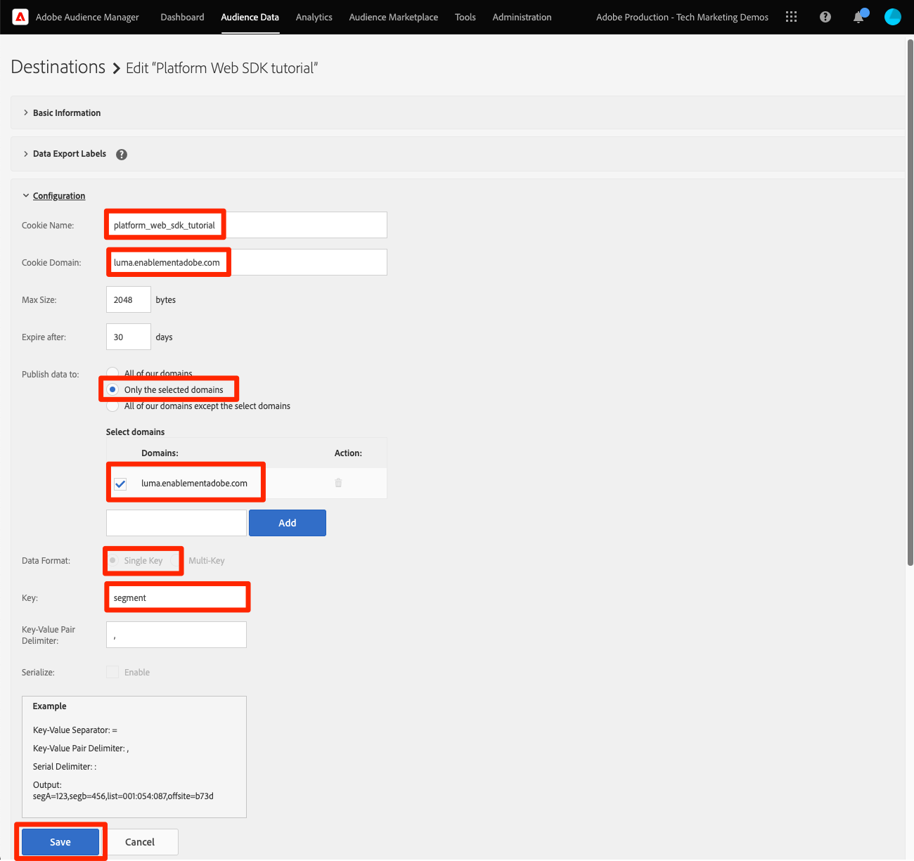
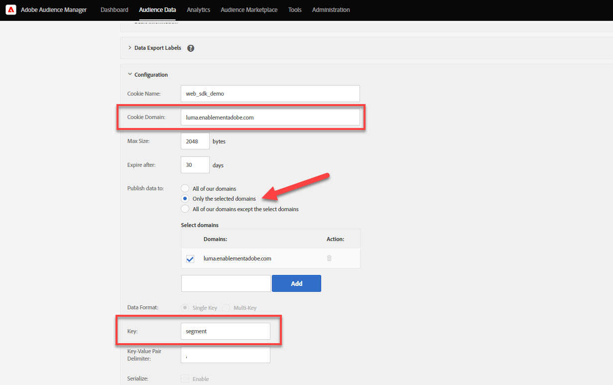

# Configurar o Audience Manager com o SDK da Web da plataforma

Saiba como configurar o Adobe Audience Manager usando o SDK da Web da plataforma e validar a implementação usando um destino de cookie.

[Adobe Audience Manager](https://experienceleague.adobe.com/docs/audience-manager.html?lang=pt-BR) O é a solução da Adobe Experience Cloud que fornece tudo o que é necessário para coletar informações comercialmente relevantes sobre os visitantes do site, criar segmentos comercializáveis e veicular publicidade e conteúdo direcionados ao público certo.

## Objetivos de aprendizagem

No final desta lição, você poderá:

* Configurar um fluxo de dados para habilitar o Audience Manager
* Ativar um destino de cookie no Audience Manager
* Valide a implementação do Audience Manager confirmando a qualificação de público-alvo com o Adobe Experience Platform Debugger

## Pré-requisitos

Para concluir esta lição, primeiro você deve:

* Conclua as lições anteriores nas seções Configuração inicial e Configuração de tags deste tutorial.
* Ter acesso ao Adobe Audience Manager e às permissões apropriadas para criar, ler e gravar características, segmentos e destinos. Para obter mais informações, consulte [Controle De Acesso Baseado Em Função Do Audience Manager](https://experienceleague.adobe.com/docs/audience-manager-learn/tutorials/setup-and-admin/user-management/setting-permissions-with-role-based-access-control.html?lang=en).

## Configurar o fluxo de dados

A implementação do Audience Manager usando o SDK da Web da Platform é diferente da implementação usando [encaminhamento pelo lado do servidor (SSF)](https://experienceleague.adobe.com/docs/analytics/admin/admin-tools/server-side-forwarding/ssf.html?lang=pt-BR). O encaminhamento pelo lado do servidor passa dados de solicitação Adobe Analytics para o Audience Manager. Uma implementação do SDK da Web da Platform passa dados XDM enviados para a Rede de borda da Platform para o Audience Manager. O Audience Manager está ativado na sequência de dados:

1. Ir para [Coleta de dados](https://experience.adobe.com/#/data-collection){target="blank"} interface
1. Na navegação à esquerda, selecione **[!UICONTROL Datastreams]**
1. Selecione o criado anteriormente `Luma Web SDK` sequência de dados

   

1. Selecionar **[!UICONTROL Adicionar serviço]**
   
1. Selecionar **[!UICONTROL Adobe Audience Manager]** como o **[!UICONTROL Serviço]**
1. Confirme que **[!UICONTROL Destinos de cookies ativados]** e **[!UICONTROL Destinos do URL habilitados]** estão selecionados
1. Selecionar **[!UICONTROL Salvar]**
   

## Criar uma fonte de dados

Em seguida, crie um [Fonte de dados](https://experienceleague.adobe.com/docs/audience-manager/user-guide/features/data-sources/datasources-list-and-settings.html?lang=en), uma ferramenta fundamental para organizar os dados no Audience Manager:

1. Vá para a [Audience Manager](https://experience.adobe.com/#/audience-manager/) interface
1. Selecionar **[!UICONTROL Dados de público-alvo]** no início da navegação
1. Selecione o **[!UICONTROL Fontes de dados]** no menu suspenso
1. Selecione o **[!UICONTROL Adicionar novo]** na parte superior da página Fontes de dados

   

1. Dê um nome amigável e uma descrição à Fonte de Dados. Para a configuração inicial, você pode nomear este`Platform Web SDK tutorial`.
1. Definir **[!UICONTROL Tipo de ID]** para **[!UICONTROL Cookie]**
1. No **[!UICONTROL Controles da exportação de dados]** , selecione **[!UICONTROL Sem restrição]**

   

1. **[!UICONTROL Salvar]** a Fonte de Dados

## Criar uma característica

Depois que a Fonte de dados for salva, configure uma [característica](https://experienceleague.adobe.com/docs/audience-manager/user-guide/features/traits/traits-overview.html?lang=pt-BR). As características são uma combinação de um ou mais sinais no Audience Manager. Crie uma característica para visitantes de página inicial.

>[!NOTE]
>
>Todos os dados XDM são enviados para o Audience Manager se estiverem ativados no fluxo de dados. No entanto, os dados podem levar 24 horas até estarem disponíveis no relatório Sinais não usados. Crie características explícitas para os dados XDM que deseja usar imediatamente no Audience Manager, conforme descrito neste exercício.

1. Selecionar **[!UICONTROL Dados de público-alvo]** >  **[!UICONTROL Características]**
1. Selecionar **[!UICONTROL Adicionar novo]** >  **[!UICONTROL Baseado em regras]** característica

   

1. Dê um nome e uma descrição amigáveis a sua característica, `Luma homepage view`
1. Selecione o **[!UICONTROL Fonte de dados]** você criou na seção anterior.
1. **[!UICONTROL Selecionar uma pasta]** no qual salvar sua característica no painel à direita. Talvez você queira criar uma pasta ao **selecionar o ícone +** ao lado de uma pasta pai existente. Você pode nomear esta nova pasta `Platform Web SDK tutorial`.
1. Expanda a **[!UICONTROL Expressão de característica]** acento circunflexo e selecione **[!UICONTROL Construtor de expressões]** Você deve fornecer um par de valores chave que signifique uma visita à página inicial.
1. Abra o [Página inicial do Luma](https://luma.enablementadobe.com/content/luma/us/en.html) (mapeado para a propriedade de tag ) e a variável **Depurador do SDK da Web da Platform** e atualiza a página.
1. Examine as Solicitações de rede e os detalhes do evento do SDK da Web da plataforma para encontrar a chave e o valor de nome para a página inicial.
   
1. Retorne ao Construtor de expressões na interface do usuário do Audience Manager e insira a chave como **`web.webPageDetails.name`** e o valor de **`content:luma:us:en`**. Essa etapa garante que você acione uma característica sempre que carregar a página inicial.
1. **[!UICONTROL Salvar]** a característica.

## Criar um segmento

A próxima etapa é criar um **segmento** e atribua sua característica recém-definida a esse segmento.

1. Selecionar **[!UICONTROL Dados de público-alvo]** no início da navegação e selecione **[!UICONTROL Segmentos]**
1. Selecionar **[!UICONTROL Adicionar novo]** na parte superior esquerda da página para abrir o construtor de segmentos
1. Dê um nome e uma descrição amigáveis ao seu segmento, como `Platform Web SDK - Homepage visitors`
1. **[!UICONTROL Selecionar uma pasta]** onde seu segmento será salvo no painel à direita. Talvez você queira criar uma pasta ao **selecionar o ícone +** ao lado de uma pasta pai existente. Você pode nomear esta nova pasta `Platform Web SDK tutorial`.
1. Adicione um código de integração, que, nesse caso, é um conjunto aleatório de números. 1. No âmbito do **[!UICONTROL Fonte de dados]** , selecione **[!UICONTROL Audience Manager]** e a fonte de dados criada anteriormente
1. Expanda a **[!UICONTROL Características]** e procure a característica que você criou
1. Selecionar **[!UICONTROL Adicionar característica]**.
1. Selecionar **[!UICONTROL Salvar]** na parte inferior da página

   

   

## Criar um destino

Em seguida, crie um **Destino baseado em cookie** usando o **Construtor de destinos**. O Construtor de destinos permite criar e gerenciar cookies, URL e destinos de servidor para servidor.

1. Abra o Construtor de destinos ao selecionar **[!UICONTROL Destinos]** no prazo de **Dados de público-alvo** menu na navegação superior
1. Selecionar **[!UICONTROL Criar destino]**
1. Insira um nome e uma descrição, `Platform Web SDK tutorial`
1. Como a variável **[!UICONTROL Categoria]**, selecione **[!UICONTROL Personalizado]**
1. Como a variável **[!UICONTROL Tipo]**, selecione **[!UICONTROL Cookie]**

   

1. Abra o **[!UICONTROL Configuração]** para inserir os detalhes sobre seu destino de cookie
1. Dê um nome amigável ao cookie, `platform_web_sdk_tutorial`
1. Como a variável **[!UICONTROL Domínio do cookie]**, adicione o domínio do site em que você está planejando a integração, para a entrada tutorial do domínio Luma, `luma.enablementadobe.com`
1. Como a variável **[!UICONTROL Publicar dados em]** selecione **[!UICONTROL Somente os domínios selecionados]**
1. Selecione seu domínio se ainda não tiver sido adicionado
1. Como a variável **[!UICONTROL Formato de dados]**, selecione **[!UICONTROL Tecla única]** e dê uma chave ao seu cookie. Para este tutorial, use `segment` como o valor principal.
1. Finalmente, selecione **[!UICONTROL Salvar]** para salvar os detalhes da configuração de destino.

   

<!--
   

   
-->

1. No **[!UICONTROL Mapeamentos de segmentos]** , use o **[!UICONTROL Pesquisar e adicionar segmentos]** recurso para procurar o seu criado anteriormente `Platform Web SDK - Homepage visitors` e selecione **[!UICONTROL Adicionar]**.

1. Depois de adicionar o segmento, uma janela pop-up é aberta, onde você deve fornecer um valor esperado para o cookie. Para este exercício, insira o valor &quot;hpvisitor&quot;.

1. Selecionar **[!UICONTROL Salvar]**

1. Selecionar **[!UICONTROL Concluído]**
   

O período de mapeamento de segmento requer algumas horas para ser ativado. Depois de concluído, você pode atualizar a interface do Audience Manager e ver que **Segmentos mapeados** lista atualizada.

## Validar o segmento

Algumas horas após a criação inicial do segmento, você pode validar se ele está funcionando corretamente.

Primeiro, confirme se você pode se qualificar para o segmento

1. Abra o [Página inicial do site de demonstração do Luma](https://luma.enablementadobe.com/content/luma/us/en.html) com ele mapeado para a propriedade de tag para se qualificar para o segmento recém-criado.
1. Abra o do navegador **ferramentas do desenvolvedor**  > **Rede** guia
1. Filtrar para a solicitação do SDK da Web da Platform usando `interact` como filtro de texto
1. Selecione uma chamada e abra a variável **Visualizar** para exibir os detalhes da resposta
1. Expanda a **carga útil** para visualizar os detalhes do cookie esperado, conforme configurado anteriormente no Audience Manager. Neste exemplo, você verá o nome do cookie esperado `platform_web_sdk_tutorial`.

   

1. Abra o **Aplicativo** e abra **Cookies** do **Armazenamento** menu.
1. Selecione o **`https://luma.enablementadobe.com`** domínio e confirme se seu cookie está escrito corretamente na lista

   

Por fim, abra o segmento na interface do Audience Manager e verifique se **Populações do segmento** aumentou:

Agora que concluiu esta lição, você deve ser capaz de ver como o SDK da Web da Platform transmite dados para o Audience Manager e pode definir um cookie próprio específico de segmento com um destino de cookie.

[Próximo: ](setup-target.md)

>[!NOTE]
>
>Obrigado por investir seu tempo aprendendo sobre o Adobe Experience Platform Web SDK. Se você tiver dúvidas, quiser compartilhar comentários gerais ou tiver sugestões sobre conteúdo futuro, compartilhe-as nesta [Publicação de discussão da comunidade do Experience League](https://experienceleaguecommunities.adobe.com/t5/adobe-experience-platform-launch/tutorial-discussion-implement-adobe-experience-cloud-with-web/td-p/444996)
