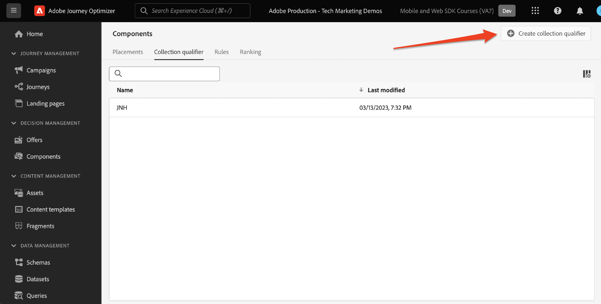

# Configurar o Gerenciamento de decisões com o SDK da Web da plataforma

Saiba como implementar a Gestão de decisões usando o SDK da Web da plataforma. Este guia aborda os pré-requisitos básicos da Gestão de decisões, as etapas detalhadas de configuração e um aprofundamento em um caso de uso centrado no status de fidelidade.

Ao seguir este tutorial, os usuários do Journey Optimizer estão equipados para aplicar efetivamente os recursos do offer decisioning, aprimorando a personalização e a relevância das interações com os clientes.


## Objetivos de aprendizagem

No final desta lição, você poderá:

* Entenda os conceitos principais da Gestão de decisões na Adobe Journey Optimizer e sua integração com o SDK da Web da Adobe Experience Platform.

* Saiba mais sobre o processo passo a passo de configuração do SDK da Web para o Offer Decisioning, garantindo uma integração perfeita com o Journey Optimizer.

* Explore um caso de uso detalhado centrado em ofertas de status de fidelidade, obtendo insights sobre como criar e gerenciar ofertas, decisões e disposições de maneira eficaz.

* Conheça os termos essenciais e suas implicações na estrutura da Gestão de decisões.

* Entenda o significado das regras de decisão, dos qualificadores de coleção e das ofertas substitutas no delivery da oferta certa ao usuário certo.

* Analise tópicos avançados, como simulações e coleta de dados de eventos personalizados, permitindo testar, validar e aprimorar seus mecanismos de delivery de ofertas.

## Pré-requisitos

Para concluir as lições desta seção, primeiro você deve:

* Certifique-se de que sua organização tenha acesso ao Adobe Journey Optimizer Ultimate (Journey Optimizer e Offer Decisioning) ou ao Adobe Experience Platform e ao complemento de serviço de aplicativo do Offer Decisioning.

* Concluir todas as lições para a configuração inicial do SDK da Web da Platform.

* Ative sua organização para o Edge Decisioning.

* Entenda como configurar um posicionamento e instanciar IDs de posicionamento e atividade no Escopo de decisão JSON.

## Limitações

Anote a seguinte limitação:

* No momento, as ofertas baseadas em eventos não são compatíveis com o Adobe Journey Optimizer. Se você criar uma regra de decisão com base em um evento, não poderá aplicá-la em uma oferta.

## Conceder acesso à Gestão de decisões

Para conceder acesso à funcionalidade Gestão de decisões, você deve criar uma **Perfil do produto** e atribua as permissões correspondentes aos usuários. [Saiba mais sobre como gerenciar usuários e permissões do Journey Optimizer nesta seção](https://experienceleague.adobe.com/docs/journey-optimizer/using/access-control/privacy/high-low-permissions.html?lang=en#decisions-permissions).

## Configurar o fluxo de dados

O offer decisioning deve ser ativado na variável **sequência de dados** antes que qualquer atividade do Gestão de decisões possa ser entregue pelo SDK da Web da plataforma.

Para configurar o Offer Decisioning no fluxo de dados:

1. Vá para a [Coleta de dados](https://experience.adobe.com/#/data-collection) interface.

1. Na navegação à esquerda, selecione **Datastreams**.

1. Selecione a sequência de dados do SDK da Web Luma criada anteriormente.

   

1. Selecionar **Editar** no prazo de **Serviço Adobe Experience Platform**.

   

1. Verifique a **Offer decisioning** caixa.

   

1. Selecione **Salvar**.

Isso garante que os eventos de entrada do Journey Optimizer sejam manipulados corretamente pelo **Adobe Experience Platform Edge**.

## Configurar o SDK para a Gestão de decisões

A Gestão de decisões requer etapas adicionais do SDK, dependendo do tipo de implementação do SDK da Web. Há duas opções disponíveis para configurar o SDK para a Gestão de decisões.

* Instalação independente do SDK
   1. Configure o `sendEvent` ação com o seu `decisionScopes`.

      ```javascript
      alloy("sendEvent", {
         ...
         "decisionScopes": [
            "[DECISION SCOPE 1]",
            "[DECISION SCOPE 2]"
         ]
      })
      ```

* Instalação de tags do SDK
   1. Vá para a interface da Coleção de dados.

   1. Na navegação à esquerda, selecione **Tags**.

      

   1. Selecione o **Propriedade da tag**.

   1. Crie seu **Regras**.
      * Adicionar um SDK da Web da plataforma **Enviar ação de evento** e adicionar as `decisionScopes` à configuração dessa ação.

   1. Criar e publicar um **Biblioteca** contendo todas as informações relevantes **Regras**, **Elementos de dados**, e **Extensões** você configurou o.

## Terminologia

Primeiro, você deve entender a terminologia usada na interface da Gestão de decisões.

* **Limite**: uma restrição que determina a frequência com que uma oferta é exibida. Dois tipos:
   * Total de limites: número máximo de vezes que uma oferta pode ser mostrada no público-alvo.
   * Limite de perfil: vezes que uma oferta pode ser mostrada a um usuário específico.
* **Coleções**: subconjuntos de ofertas agrupados por condições específicas definidas por um profissional de marketing, por exemplo, categoria de oferta.
* **Decisão**: lógica que determina a escolha de uma oferta.
* **Regra de decisão**: restrições nas ofertas para descobrir a elegibilidade de um usuário.
* **Oferta elegível**: uma oferta que corresponde às restrições predefinidas e pode ser exibida a um usuário.
* **Gerenciamento de decisão**: o sistema de criação e distribuição de ofertas personalizadas usando lógica de negócios e regras de decisão.
* **Ofertas substitutas**: a oferta padrão exibida quando um usuário não se qualifica para nenhuma oferta em uma coleção.
* **Oferta**: uma mensagem de marketing com possíveis regras de elegibilidade que determinam seus visualizadores.
* **Biblioteca de ofertas**: um repositório central que gerencia ofertas, decisões e regras associadas.
* **Ofertas personalizadas**: mensagens de marketing personalizadas adaptadas com base em restrições de qualificação.
* **Posicionamentos**: a configuração ou cenário em que uma oferta é exibida a um usuário.
* **Prioridade**: métrica de classificação para ofertas considerando várias restrições, como elegibilidade e limite.
* **Representações**: informações específicas do canal, por exemplo, local ou idioma, que orientam a exibição de uma oferta.

## Visão geral do caso de uso - Recompensas de fidelidade

Nesta lição, você implementa um exemplo de caso de uso do Loyalty Rewards para entender a Gestão de decisões usando o SDK da Web.

Esse caso de uso permite entender melhor como o Journey Optimizer pode ajudar a fornecer a melhor oferta aos seus clientes, utilizando a biblioteca de ofertas centralizada e o mecanismo de decisão de ofertas.

>[!NOTE]
>
> Como este tutorial é destinado aos implementadores, vale a pena observar que esta lição envolve um trabalho de interface substancial no Journey Optimizer. Embora essas tarefas de interface sejam normalmente tratadas por profissionais de marketing, pode ser benéfico para os implementadores obterem insights sobre o processo, mesmo que não sejam responsáveis pela criação de campanhas de gestão de decisões a longo prazo.

## Componentes

Antes de começar a criar as ofertas, você deve definir vários componentes de pré-requisito.

### Criar um posicionamento para ofertas de fidelidade

**Posicionamentos** são contêineres usados para exibir as ofertas. Neste exemplo, você cria um posicionamento na parte superior do site Luma.

A lista de disposições pode ser acessada no **Componentes** menu. Os filtros estão disponíveis para ajudá-lo a recuperar inserções de acordo com um canal ou conteúdo específico.


Para criar a disposição, siga estas etapas:

1. Clique em **Criar posicionamento**.

   

1. Defina as propriedades da disposição:
   * **Nome**: o nome do posicionamento. Vamos chamar o exemplo de posicionamento *&#39;Banner de página inicial&#39;*.
   * **Tipo de canal**: o canal para o qual a disposição é usada. Vamos usar *&#39;Web&#39;* já que as ofertas são exibidas no site da Luma.
   * **Tipo de conteúdo**: O tipo de conteúdo que a inserção tem permissão para exibir: Texto, HTML, Link de imagem ou JSON. Você pode usar *&#39;HTML&#39;* para a oferta.
   * **Descrição**: uma descrição do posicionamento (opcional).

   

1. Clique em **Salvar**.
1. Depois que a disposição é criada, ela é exibida na lista de disposições.
1. Selecione a linha que contém a nova disposição e anote a ID de disposição, pois isso pode ser necessário para configuração dentro do Escopo da decisão.

   

### Regras de decisão para status de fidelidade

**Regras de decisão** especifique as condições em que as ofertas são apresentadas. Neste exemplo, você cria regras de decisão para atender ofertas diferentes dependendo do status de Fidelidade de um usuário.

A lista de regras de decisão está acessível no **Componentes** menu.

Para criar as regras de decisão, siga estas etapas:

1. Navegue até a **Regras** e clique em **Criar regra**.

   

1. Vamos nomear a primeira regra &#39;*Regra de status de fidelidade ouro*&#39;. Você pode usar campos XDM para definir a regra. O ADOBE EXPERIENCE PLATFORM **Construtor de segmentos** O é uma interface intuitiva que pode ser usada para criar as condições da regra.

   

1. Clique em **Salvar** para confirmar a condição da regra.
1. O recém-salvo &#39;*Regra de status de fidelidade ouro*&#39; será exibido no **Lista de regras**. Selecione-a para exibir suas propriedades.

   

1. Agora crie as condições restantes da regra de oferta de fidelidade para o caso de uso.


### Qualificadores de Coleção

**Qualificadores de coleção** O permite organizar e pesquisar ofertas facilmente na biblioteca de ofertas. Neste exemplo, você adiciona qualificadores de coleção às ofertas do Loyalty Rewards para melhorar a organização da oferta.

A lista de qualificadores de coleta pode ser acessada na **Componentes** menu.

Para criar o qualificador de coleta do Loyalty Rewards, siga estas etapas:

1. Navegue até a **Qualificadores de coleção** e clique em **Criar qualificador de coleção**.

   

1. Vamos nomear o qualificador de coleção &#39;*Recompensas de fidelidade*&#39;

   

1. O novo qualificador de coleta agora deve ser exibido na variável **Qualificador de coleção** guia

## Ofertas

Agora é hora de criar as ofertas do Loyalty Rewards.

A lista de ofertas está acessível no **Ofertas** menu.


### Criação de ofertas para diferentes níveis de fidelidade

Comece criando ofertas personalizadas para as diferentes Camadas de fidelidade Luma.

Para criar a primeira **oferta**, siga estas etapas:

1. Clique em **Criar oferta** e selecione **Oferta personalizada**.

1. Vamos nomear a primeira oferta &#39;*Nível de fidelidade Luma - Ouro*&#39;. Você deve especificar uma data e hora de início/término para esta oferta. Você também deve associar a variável **qualificador de coleta** &#39;*Recompensas de fidelidade* para a oferta, permitindo que você se organize melhor dentro do **Biblioteca de ofertas**. Depois, clique em **Próxima**.

   

1. Agora você deve adicionar **representações** para definir onde a oferta é exibida. Vamos escolher o **canal da web**. Também vamos escolher o &#39;*Banner da página inicial*&#39; **inserção** você configurou anteriormente o. O selecionado **inserção** é do tipo HTML, para que você possa adicionar conteúdo HTML, JSON ou TEXT diretamente ao editor para criar a oferta usando o **Personalizado** botão de opção.

   

1. Edite o conteúdo da oferta diretamente com o **Editor de expressão**. Lembre-se de que você pode adicionar conteúdo HTML, JSON ou TEXT a essa disposição. Certifique-se de selecionar o **modo** na parte inferior do editor, dependendo do seu tipo de conteúdo. Você também pode pressionar **validar** para garantir que não haja erros.

   

1. Além disso, você pode usar o Editor de expressão para recuperar atributos armazenados no Adobe Experience Platform. Vamos adicionar o nome de um perfil ao conteúdo da oferta para personalizar melhor os membros de fidelidade em um nível 1:1.

   

1. Adicione restrições para mostrar apenas a oferta a perfis que se qualificam para o &#39;*Regra de status de fidelidade ouro*&#39;.

   

1. Quando terminar de revisar a oferta, clique em **Concluir**. Selecionar **Salvar e aprovar**.

Agora crie o restante das ofertas para os vários níveis de fidelidade da Luma

### Ofertas substitutas

Você ainda deseja disponibilizar uma oferta para visitantes que não sejam da Fidelidade Luma no site Luma. Para fazer isso, você pode configurar um **oferta substituta** para a campanha.

Para criar a oferta substituta, siga estas etapas:

1. Clique em **Criar oferta** e selecione **Oferta substituta**.
   <!--
      
   -->
1. Vamos nomear a oferta substituta &#39;*Fidelidade Não Luma*&#39;. Você também pode associar as variáveis criadas anteriormente **qualificador de coleta**,&quot;*Recompensas de fidelidade*&#39; para a oferta substituta para facilitar a organização da oferta.
   <!--
      
   -->
1. Adicione o conteúdo da oferta substituta à **Editor de expressão**. Lembre-se de que você pode adicionar conteúdo HTML, JSON ou TEXT a esse posicionamento. Certifique-se de selecionar o **modo** na parte inferior do editor, dependendo do seu tipo de conteúdo. Você também pode pressionar **validar** para garantir que não haja erros.
   <!--
      
   -->
1. Se tudo estiver configurado corretamente, clique em **Concluir** e depois **Salvar e aprovar**.
<!--
   
-->

## Decisões

**Decisões** são containers para ofertas que escolhem a melhor oferta disponível para um cliente, dependendo do target.

A lista de decisões está disponível no **Decisões** guia do **Ofertas** menu.
<!--
   
-->

### Criação de uma decisão para ofertas de fidelidade

Vamos criar uma decisão para o caso de uso de Recompensas de fidelidade Luma.

Para criar a decisão, siga estas etapas:

1. Clique em **Criar decisão**.
   <!--
      
   -->
1. Vamos chamar a decisão, &#39;*Ofertas de fidelidade da Luma em dezembro*&#39;. As ofertas devem ser executadas por 1 mês, então, vamos especificar isso aqui.
   <!--
      
   -->
1. Agora você deve definir o **escopos de decisão**. Selecione primeiro uma disposição. Você pode usar o &#39; criado anteriormente *Banner da página inicial*&#39;.
   <!--
      
   -->
1. Em seguida, você deve adicionar **critérios de avaliação** para o âmbito da decisão. Clique em **Adicionar** e escolha o &#39; criado anteriormente *Recompensas de fidelidade*&#39; **coleção** que contém todas as ofertas de fidelidade a serem consideradas.
   <!--
      
   -->
1. Dentro do &#39;*Recompensas de fidelidade*&#39;, você poderá usar o campo de qualificação para restringir o delivery de oferta a um subconjunto de visitantes do Luma. No entanto, nesse caso de uso, é desejável que cada visitante receba uma das ofertas. Lembre-se, você configurou um **oferta substituta** para todos os visitantes não fidelizados. Defina a qualificação como &quot;None&quot;.
   <!--
      
   -->
1. Além disso, você pode usar a variável **método de classificação** para selecionar a melhor oferta para cada visitante do Luma, se várias ofertas estiverem qualificadas para a combinação de usuário/posicionamento. Para esse caso de uso, você pode usar o **Prioridade da oferta** que usa os valores definidos nas ofertas para fornecer a melhor oferta.
   <!--
      
   -->
1. Agora adicione o **oferta substituta** da decisão. Lembre-se de que a oferta substituta é a oferta padrão exibida para visitantes da Luma se eles não se enquadrarem em nenhum dos públicos-alvo da Fidelidade Luma. Selecionar &#39;*Fidelidade Não Luma*&#39; da lista de ofertas substitutas disponíveis para o &#39;*Banner da página inicial* Posicionamento do &#39;.
   <!--
      
   -->
1. Antes de ativar a decisão, vamos analisar o escopo da decisão, a oferta substituta, visualizar as ofertas disponíveis e estimar os perfis qualificados. Quando tudo estiver bem, você pode clicar em **Concluir** e **Salvar e ativar**.
<!--
   
-->

## Simulações

Como prática recomendada, você deve validar a lógica de decisão da Fidelidade Luma para garantir que as ofertas corretas sejam entregues aos públicos-alvo de fidelidade corretos. Você pode fazer isso usando **perfis de teste**. Também é uma boa ideia testar as alterações nas ofertas por meio de perfis de teste antes de enviar novas versões de oferta para produção.

Para iniciar o teste, selecione a variável **Simulações** na guia **Ofertas** menu.

### Teste de ofertas de fidelidade

1. Selecione um perfil de teste para usar na simulação. Clique em **Gerenciar perfil**. [Para criar ou designar um novo perfil de teste para teste de oferta, siga este guia](https://experienceleague.adobe.com/docs/journeys/using/building-journeys/about-journey-building/creating-test-profiles.html?lang=en#create-test-profiles-csv).
   <!--
      
   -->
1. Adicione um ou mais perfis de teste à simulação e salve a seleção. Para o teste de caso de uso, verifique se você tem perfis de teste configurados para cada público-alvo de recompensas de fidelidade do Luma.
   <!--
      
   -->
1. Selecione o escopo de decisão a ser testado. Selecionar **Adicionar escopo da decisão**.
   <!--
      
   -->
1. Selecione o &#39; criado anteriormente *Banner da página inicial* Posicionamento do &#39;.
   <!--
      
   -->
1. As decisões disponíveis são exibidas, selecione a opção &#39; criada anteriormente *Ofertas de fidelidade da Luma em dezembro*&#39; e clique em **Adicionar**.
   <!--
      
   -->
1. Depois de selecionar um perfil de teste, clique em **Exibir resultados**. A melhor oferta disponível é exibida no perfil de teste selecionado para o &#39;*Ofertas de fidelidade da Luma em dezembro*&quot;.
   <!--
      
   -->
1. Selecione um perfil de teste diferente e clique em **Exibir resultados**. Idealmente, você deve ver uma oferta simulada diferente, correspondente ao nível de fidelidade do perfil de teste.

## Validação do Gerenciamento de decisão usando o Adobe Experience Platform Debugger

A variável **Adobe Experience Platform Debugger** A extensão do, disponível para o Chrome e o Firefox, analisa as páginas da Web para identificar problemas na implementação das soluções da Adobe Experience Cloud.

Você pode usar o depurador no site Luma para validar a lógica de decisão na produção. Esta é uma boa prática depois que o caso de uso de Recompensas de fidelidade estiver em execução, para garantir que tudo seja configurado corretamente.

[Saiba como configurar o depurador em seu navegador usando o guia aqui](https://experienceleague.adobe.com/docs/platform-learn/data-collection/debugger/overview.html?lang=en).

Para iniciar a validação usando o depurador:

1. Navegue até a página da Web do Luma com o posicionamento da oferta.
   <!--
      
   -->
1. Na página da Web, abra **Adobe Experience Platform Debugger**.
   <!--
      
   -->
1. Navegue até **Resumo**. Verifique se **ID da sequência de dados** corresponde ao **sequência de dados** in **Coleta de dados Adobe** para o qual você ativou o Offer Decisioning.
   <!--
      
   -->
1. Em **Soluções** navegue até o **Experience Platform Web SDK**.
   <!--
      
   -->
1. No prazo de **Configuração** guia, alternar em **Habilitar Depuração**. Isso permite o registro da sessão em um **Adobe Experience Platform Assurance** sessão.
   <!--
      
   -->
1. Você pode fazer logon no site com várias contas de fidelidade Luma e usar o depurador para validar as solicitações enviadas para o **Rede de borda Adobe Experience Platform**. Todas essas solicitações devem ser capturadas no **Assurance** para rastreamento de log.
<!--
   
-->

[Próximo: ](setup-consent.md)

>[!NOTE]
>
>Obrigado por investir seu tempo aprendendo sobre o Adobe Experience Platform Web SDK. Se você tiver dúvidas, quiser compartilhar feedback geral ou tiver sugestões sobre conteúdo futuro, compartilhe-as nesta [Publicação de discussão da comunidade do Experience League](https://experienceleaguecommunities.adobe.com/t5/adobe-experience-platform-launch/tutorial-discussion-implement-adobe-experience-cloud-with-web/td-p/444996)
