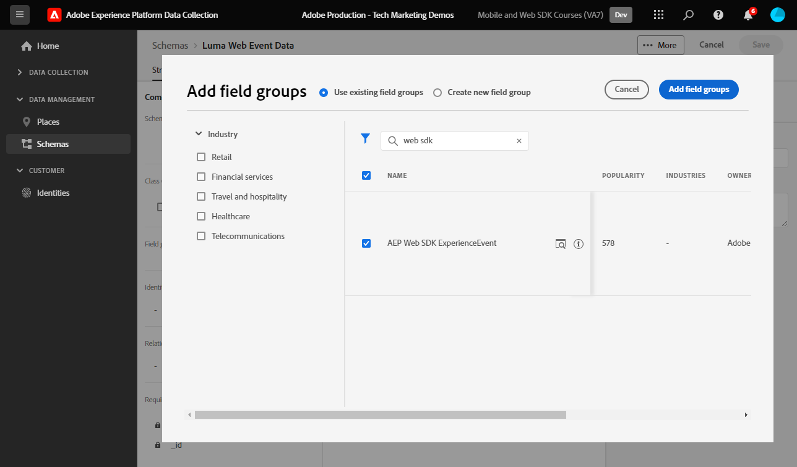

# Criar um esquema XDM para dados da Web

Saiba como criar um esquema XDM para dados da web na interface da Coleção de dados da Adobe Experience Platform.

Os esquemas do Experience Data Model (XDM) são os blocos fundamentais, os princípios e as práticas recomendadas para coletar dados no Adobe Experience Platform.

O SDK da Web da Platform usa o esquema para padronizar os dados de eventos da Web, enviá-los para o Edge Network da Platform e, por fim, encaminhar os dados para qualquer aplicativo Experience Cloud configurado no fluxo de dados. Essa etapa é crítica, pois define um modelo de dados padrão necessário para assimilar dados de experiência do cliente no Experience Platform e habilita serviços e aplicativos downstream baseados nesses padrões.

>[!NOTE]
>
>Um esquema XDM _não é necessário_ para implementar o Adobe Analytics, o Adobe Target ou o Adobe Audience Manager com o SDK da Web (os dados podem ser passados no objeto `data` em vez do objeto `xdm`, como você verá mais tarde). Um esquema XDM é necessário para as implementações mais eficientes de aplicativos nativos da plataforma, como Journey Optimizer, Real-time Customer Data Platform e Customer Journey Analytics. Embora você possa decidir não usar um esquema XDM em sua própria implementação, espera-se que faça isso como parte deste tutorial.

## Por que modelar os dados?

As empresas têm sua própria linguagem para se comunicar sobre seus domínios. As concessionárias de automóveis lidam com marcas, modelos e cilindros. As companhias aéreas lidam com números de voo, classe de serviço e atribuições de assentos. Alguns desses termos são exclusivos de uma empresa específica, alguns são compartilhados entre um setor vertical e alguns são compartilhados por quase todas as empresas. Para termos compartilhados entre um setor vertical ou até mais amplo, você pode começar a fazer coisas poderosas com seus dados ao nomear e estruturar esses termos de uma maneira comum.

Por exemplo, muitas empresas lidam com pedidos. E se, coletivamente, essas empresas decidissem modelar um pedido de maneira semelhante? Por exemplo, e se o modelo de dados consistisse em um objeto com uma propriedade `priceTotal` que representasse o preço total do pedido? E se esse objeto também tiver propriedades chamadas `currencyCode` e `purchaseOrderNumber`? Talvez o objeto da ordem contenha uma propriedade chamada `payments` que seria uma matriz de objetos de pagamento. Cada objeto representaria um pagamento para o pedido. Por exemplo, talvez um cliente tenha pago uma parte do pedido com um vale-presente e o restante com um cartão de crédito. Você pode começar a construir um modelo com esta aparência:

```json
{
  "order": {
    "priceTotal": 89.50,
    "currencyCode": "EUR",
    "purchaseOrderNumber": "JWN20192388410012",
    "payments": [
      {
        "paymentType": "gift_card",
        "paymentAmount": 50
      },
      {
        "paymentType": "credit_card",
        "paymentAmount": 39.50
      }
    ]
  }
}
```

Se todas as empresas que lidam com pedidos decidissem modelar seus dados de pedidos de maneira consistente para termos comuns no setor, coisas mágicas poderiam começar a acontecer. As informações poderiam ser trocadas de forma mais fluida dentro e fora da organização, em vez de interpretar e traduzir constantemente os dados (props e evars, alguém?). O aprendizado de máquina poderia entender mais facilmente o que seus dados _significam_ e fornecer insights acionáveis. As interfaces do usuário para encontrar dados relevantes podem se tornar mais intuitivas. Seus dados podem ser perfeitamente integrados a parceiros e fornecedores que estejam seguindo a mesma modelagem.

Esta é a meta do [Modelo de Dados de Experiência](https://business.adobe.com/products/experience-platform/experience-data-model.html) do Adobe. O XDM fornece modelagem prescritiva para dados comuns no setor, além de permitir estender o modelo para suas necessidades específicas. O Adobe Experience Platform é construído com base no XDM e, como tal, os dados enviados para o Experience Platform precisam estar no XDM. Em vez de pensar em onde e como você pode transformar seus modelos de dados atuais em XDM antes de enviar os dados para o Experience Platform, considere adotar o XDM de forma mais abrangente em toda a organização para que a tradução raramente precise ocorrer.


>[!NOTE]
>
> Para fins de demonstração, os exercícios nesta lição criam um esquema de exemplo para capturar o conteúdo exibido e os produtos comprados pelos clientes no [Site de demonstração da Luma](https://luma.enablementadobe.com/content/luma/us/en.html). Embora você possa usar essas etapas para criar um esquema diferente para suas próprias finalidades, recomenda-se seguir primeiro juntamente com a criação do esquema de exemplo para saber mais sobre os recursos do editor de esquema.

Para saber mais sobre esquemas XDM, assista à lista de reprodução [Modelar seus dados de experiência do cliente com XDM](https://experienceleague.adobe.com/en/playlists/experience-platform-model-your-customer-experience-data-with-xdm) ou consulte a [visão geral do sistema XDM](https://experienceleague.adobe.com/en/docs/experience-platform/xdm/home).

## Objetivos de aprendizagem

No final desta lição, você poderá:

* Criar um esquema XDM na interface da Coleção de dados
* Adicionar grupos de campos ao esquema XDM
* Criar esquemas XDM para dados de evento da Web usando práticas recomendadas

## Pré-requisitos

Todas as permissões de usuário e provisionamento necessárias para a Coleção de dados e o Adobe Experience Platform estão descritas na página [visão geral](overview.md).

## Criar um esquema do XDM

Os esquemas XDM são a maneira padrão de descrever dados no Experience Platform, permitindo que todos os dados em conformidade com os esquemas sejam reutilizados em uma organização sem conflitos ou até mesmo compartilhados entre várias organizações. Para saber mais, consulte as [noções básicas da composição de Esquema](https://experienceleague.adobe.com/en/docs/experience-platform/xdm/schema/composition).

Neste exercício, você criará um esquema XDM usando os grupos de campos de linha de base recomendados para capturar dados do evento da Web no [Site de demonstração Luma](https://luma.enablementadobe.com/content/luma/us/en.html){target="_blank"}:

1. Abrir a [interface de Coleção de Dados](https://launch.adobe.com/){target="_blank"}
1. Verifique se você está na sandbox correta. Localize a sandbox no canto superior direito

   >[!NOTE]
   >
   >Se você for o cliente de um aplicativo baseado em plataforma, como o Real-Time CDP ou o Journey Optimizer, recomendamos usar uma sandbox de desenvolvimento para este tutorial. Caso contrário, use a sandbox **[!UICONTROL Prod]**.

1. Vá para **[!UICONTROL Esquemas]** na navegação à esquerda
1. Selecione o botão **[!UICONTROL Criar Esquema]** na parte superior direita

   
1. Selecione **[!UICONTROL Evento de experiência]** na tela a seguir
1. Selecionar **[!UICONTROL Próximo]**

   

1. Insira o nome do esquema no campo **[!UICONTROL Nome para exibição do esquema]**, neste caso `Luma Web Event Data`

   >[!TIP]
   >
   >Uma convenção de nomenclatura comum para esquemas XDM é nomear o esquema após a origem dos dados.


1. Selecione Concluir

   

## Adicionar grupos de campos

Como observado anteriormente, o XDM é a estrutura principal que padroniza os dados de experiência do cliente, fornecendo estruturas e definições comuns para uso nos serviços downstream da Adobe Experience Platform. Ao seguir os padrões XDM, _todos os dados de experiência do cliente_ podem ser incorporados a uma representação comum. Essa abordagem permite obter insights valiosos das ações do cliente, definir públicos-alvo do cliente por meio de segmentos e expressar atributos do cliente para fins de personalização usando dados de várias fontes. Consulte [Práticas recomendadas para modelagem de dados](https://experienceleague.adobe.com/en/docs/experience-platform/xdm/schema/best-practices) para obter mais informações.

Quando possível, é recomendável usar grupos de campo existentes e aderir a um modelo independente de produto e convenções de nomenclatura. Para quaisquer dados específicos da sua organização que não se encaixem nos grupos de campos predefinidos acima, você pode criar um grupo de campos personalizado. Consulte [Criar um esquema usando o Editor de Esquemas](https://experienceleague.adobe.com/en/docs/experience-platform/xdm/tutorials/create-schema-ui#create) para obter etapas mais detalhadas sobre esquemas personalizados.

>[!TIP]
> 
>Neste exercício, você adiciona os grupos de campos predefinidos recomendados para a coleta de dados na Web: _**[!UICONTROL ExperienceEvent do SDK da Web da AEP]**_ e _**[!UICONTROL Evento de experiência do consumidor]**_.
>


1. Na seção **[!UICONTROL Grupos de campos]**, selecione **[!UICONTROL Adicionar]**

   

1. Pesquisar por [!UICONTROL `AEP Web SDK ExperienceEvent`]
1. Marque a caixa
1. Pesquisar por [!UICONTROL `Consumer Experience Event`]
1. Marque a caixa
1. Selecionar **[!UICONTROL Adicionar grupos de campos]**

   

Com ambos os grupos de campos, observe que você tem acesso aos pares de valores chave mais usados, necessários para a coleta de dados na Web. O [!UICONTROL nome para exibição] de cada campo aparece para os profissionais de marketing na interface do construtor de segmentos dos aplicativos baseados na Platform e você pode alterar o nome para exibição dos campos padrão para atender às suas necessidades. Também é possível remover campos indesejados. Ao clicar em qualquer nome de grupo de campos, a interface destaca quais agrupamentos de pares de valores chave pertencem a ele. No exemplo abaixo, você vê quais campos pertencem ao **[!UICONTROL Evento de experiência do consumidor]**.


Esta lição é apenas um ponto de partida. Ao criar seu próprio schema de eventos da Web, você deve explorar e documentar seus requisitos de negócios. Este processo é semelhante à criação de um [Documento de requisitos comerciais](https://experienceleague.adobe.com/en/docs/analytics-learn/tutorials/implementation/implementation-basics/creating-a-business-requirements-document) e uma [Referência de design de solução](https://experienceleague.adobe.com/en/docs/analytics-learn/tutorials/implementation/implementation-basics/creating-and-maintaining-an-sdr) para uma implementação do Adobe Analytics, mas deve incluir requisitos para _todos os destinatários de dados downstream_, como destinos de Plataforma, Destino e encaminhamento de eventos.


### O objeto identityMap

Há um campo especial usado para identificar usuários da Web chamado `[!UICONTROL identityMap]`.


É um objeto obrigatório para qualquer coleta de dados relacionada à Web, pois abriga a ID de Experience Cloud necessária para identificar usuários na Web. Também é fundamental para definir IDs internas do cliente para usuários autenticados. `[!UICONTROL identityMap]` é discutido mais na lição [Configurar identidades](configure-identities.md). Ele é incluído automaticamente em todos os esquemas que usam a classe **[!UICONTROL XDM ExperienceEvent]**.


>[!IMPORTANT]
>
> É possível habilitar o **[!UICONTROL Perfil]** para um esquema antes de salvá-lo. **Não** habilite-o neste momento. Depois que um esquema é ativado para Perfil, ele não pode ser desativado ou excluído sem redefinir toda a sandbox. Os campos também não podem ser removidos de esquemas neste ponto, embora seja possível [Descontinuar Campos na interface](https://experienceleague.adobe.com/en/docs/experience-platform/xdm/tutorials/field-deprecation-ui#deprecate). Essas implicações são importantes para ter em mente posteriormente quando você estiver trabalhando com seus próprios dados no ambiente de produção.
>
>
>Esta configuração é discutida mais detalhadamente durante a lição [Setup Experience Platform](setup-experience-platform.md).
>

Para concluir esta lição, selecione **[!UICONTROL Salvar]** na parte superior direita.


Agora, é possível fazer referência a esse esquema ao adicionar a extensão SDK da Web à propriedade da tag.


[Próximo: ](configure-identities.md)

>[!NOTE]
>
>Obrigado por investir seu tempo aprendendo sobre o Adobe Experience Platform Web SDK. Se você tiver dúvidas, quiser compartilhar comentários gerais ou tiver sugestões sobre conteúdo futuro, compartilhe-as nesta [postagem de Discussão da Comunidade Experience League](https://experienceleaguecommunities.adobe.com/t5/adobe-experience-platform-data/tutorial-discussion-implement-adobe-experience-cloud-with-web/td-p/444996)
