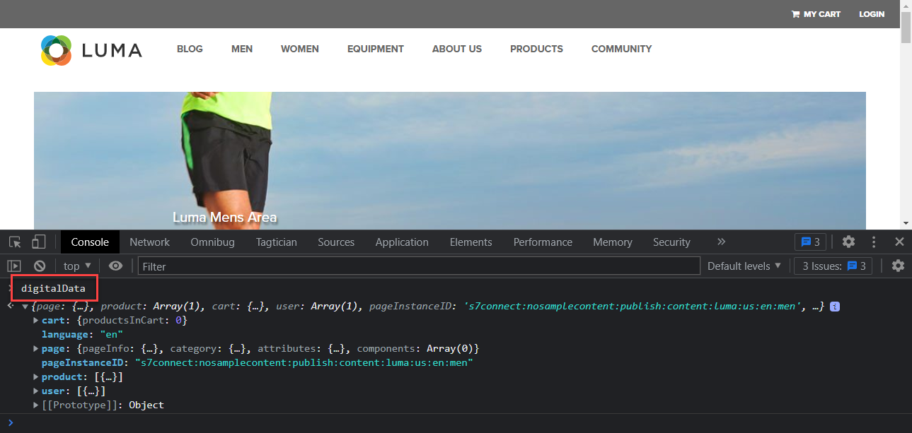

# Criar elementos de dados

Saiba como criar elementos de dados em tags para dados de conteúdo, comércio e identidade na [Site de demonstração Luma](https://luma.enablementadobe.com/content/luma/us/en.html). Em seguida, preencha os campos no esquema XDM com o tipo de elemento de dados Variável da extensão SDK da Web da plataforma.

## Objetivos de aprendizagem

No final desta lição, você poderá:

* Entender diferentes abordagens para mapear uma camada de dados para o XDM
* Criar elementos de dados para capturar dados
* Mapear elementos de dados para um objeto XDM


## Pré-requisitos

Você entende o que é uma camada de dados e concluiu as lições anteriores no tutorial:

* [Configurar um esquema XDM](configure-schemas.md)
* [Configurar um namespace de identidade](configure-identities.md)
* [Configurar uma sequência de dados](configure-datastream.md)
* [Extensão SDK da Web instalada na propriedade da tag](install-web-sdk.md)


>[!IMPORTANT]
>
>Os dados para esta lição vêm do `[!UICONTROL digitalData]` camada de dados no site Luma. Para visualizar a camada de dados, abra o console do desenvolvedor e digite `[!UICONTROL digitalData]` para ver a camada de dados completa disponível.


## Abordagens da camada de dados

Há várias maneiras de mapear dados da camada de dados para o XDM usando a funcionalidade de tags do Adobe Experience Platform. Abaixo estão alguns prós e contras de três abordagens diferentes. É possível combinar abordagens, se desejado:

1. Implementar o XDM na camada de dados
1. Mapear para XDM em tags
1. Mapear para XDM no fluxo de dados

>[!NOTE]
>
>Os exemplos neste tutorial seguem a abordagem Mapear para XDM em tags.


### Implementar o XDM na camada de dados

Essa abordagem envolve o uso do objeto XDM totalmente definido como a estrutura da camada de dados. Em seguida, mapeie toda a camada de dados para um elemento de dados de objeto XDM nas tags. Se sua implementação não estiver usando um gerenciador de tags, essa abordagem poderá ser ideal, pois você pode enviar dados para o XDM diretamente do aplicativo usando o [Comando sendEvent do XDM](https://experienceleague.adobe.com/en/docs/experience-platform/edge/fundamentals/tracking-events#sending-xdm-data). Se você usar tags, poderá criar um elemento de dados de código personalizado capturando toda a camada de dados como um objeto JSON de passagem para o XDM. Em seguida, mapeie o JSON de passagem para o campo do objeto XDM na Ação Enviar evento.

Veja abaixo um exemplo de como seria a camada de dados usando o formato da Camada de dados do cliente Adobe:

+++XDM no exemplo de Camada de dados

```JSON
window.adobeDataLayer.push({
"eventType": "web.webPageDetails.pageViews",
"web":{
         "webInteraction":{
            "linkClicks":{
               "id":"",
               "value":""
            },
            "URL":"",
            "name":"",
            "region":"",
            "type":""
         },
         "webPageDetails":{
            "pageViews":{
               "id":"",
               "value":"1"
            },
            "URL":"https://luma.enablementadobe.com/",
            "isErrorPage":"",
            "isHomePage":"",
            "name":"luma:home",
            "server":"enablementadobe.com",
            "siteSection":"home",
            "viewName":""
         },
         "webReferrer":{
            "URL":"",
            "type":""
         }
      }
});
```

+++

Pontos positivos

* Elimina etapas adicionais de remapeamento de variáveis de camada de dados para o XDM
* Pode ser mais rápido de implantar se a sua equipe de desenvolvimento possuir a tag de comportamento digital

Pontos negativos

* Confiança total na equipe de desenvolvimento e no ciclo de desenvolvimento para atualizar quais dados vão para o XDM
* Flexibilidade limitada, pois o XDM recebe a carga exata da camada de dados
* Não é possível usar recursos de tags incorporadas, como recursos de raspagem, persistência e implantação rápida
* Não é possível usar a camada de dados para pixels de terceiros
* Não há capacidade de transformar os dados entre a camada de dados e o XDM

### Mapear a camada de dados nas tags

Essa abordagem envolve o mapeamento de variáveis de camada de dados individuais OU objetos de camada de dados para elementos de dados em tags e, por fim, para o XDM. Essa é a abordagem tradicional de implementação usando um sistema de gerenciamento de tags.

#### Pontos positivos

* A abordagem mais flexível, pois você pode controlar variáveis individuais e transformar dados antes que eles cheguem ao XDM
* Pode usar acionadores de tags Adobe e a funcionalidade de refugo para transmitir dados ao XDM
* Pode mapear elementos de dados para pixels de terceiros no lado do cliente

#### Pontos negativos

* Demora para reconstruir a camada de dados como elementos de dados


>[!TIP]
>
> Camada de dados Google
> 
> Se sua organização já usa o Google Analytics e tem o objeto tradicional dataLayer do Google em seu site, você pode usar o [Extensão da camada de dados do Google](https://experienceleague.adobe.com/en/docs/experience-platform/tags/extensions/client/google-data-layer/overview) nas tags. Isso permite que você implante a tecnologia Adobe mais rapidamente, sem precisar solicitar suporte da sua equipe de TI. O mapeamento da camada de dados do Google para o XDM seguiria as mesmas etapas descritas acima.

### Mapear para XDM no fluxo de dados

Essa abordagem usa uma funcionalidade integrada à configuração de sequência de dados chamada [Preparação de dados para coleção de dados](https://experienceleague.adobe.com/en/docs/experience-platform/datastreams/data-prep) O e o ignoram o mapeamento de variáveis de camada de dados para o XDM nas tags.

#### Pontos positivos

* Flexível, pois é possível mapear variáveis individuais para o XDM
* Capacidade para [calcular novos valores](https://experienceleague.adobe.com/en/docs/experience-platform/data-prep/functions) ou [transformar tipos de dados](https://experienceleague.adobe.com/en/docs/experience-platform/data-prep/data-handling) de uma camada de dados antes de ela ir para o XDM
* Aproveitar um [Mapeamento da interface do usuário](https://experienceleague.adobe.com/docs/experience-platform/datastreams/data-prep.html#create-mapping) para mapear campos nos dados de origem para o XDM com uma interface de apontar e clicar

#### Pontos negativos

* Não é possível usar variáveis de camada de dados como elementos de dados para pixels de terceiros do lado do cliente, mas você pode usá-las com o encaminhamento de eventos
* Não é possível usar a funcionalidade de reaproveitamento do recurso de tags do Adobe Experience Platform
* A complexidade de manutenção aumenta se o mapeamento da camada de dados for feito em tags e na sequência de dados


>[!IMPORTANT]
>
>Como observado anteriormente, os exemplos neste tutorial seguem a abordagem Mapear para XDM em tags.

## Criar elementos de dados para capturar a camada de dados

Antes de criar o objeto XDM, crie o seguinte conjunto de elementos de dados para o [Site de demonstração Luma](https://luma.enablementadobe.com/content/luma/us/en.html){target="_blank"} camada de dados:

1. Ir para **[!UICONTROL Elementos de dados]** e selecione **[!UICONTROL Adicionar elemento de dados]** (ou **[!UICONTROL Criar novo elemento de dados]** se não houver elementos de dados existentes na propriedade tag )

   

1. Nomeie o elemento de dados `page.pageInfo.pageName`
1. Use o **[!UICONTROL Variável JavaScript]** **[!UICONTROL Tipo de elemento de dados]** para apontar para um valor na camada de dados do Luma: `digitalData.page.pageInfo.pageName`

1. Marque as caixas para **[!UICONTROL Forçar valor de minúsculas]** e **[!UICONTROL Texto limpo]** para padronizar o caso e remover espaços irrelevantes

1. Sair `None` como o **[!UICONTROL Duração do armazenamento]** já que esse valor é diferente em cada página

1. Selecionar **[!UICONTROL Salvar]**

   

Crie esses elementos de dados adicionais seguindo as mesmas etapas:

* **`page.pageInfo.server`**  mapeado para
  `digitalData.page.pageInfo.server`

* **`page.pageInfo.hierarchie1`**  mapeado para
  `digitalData.page.pageInfo.hierarchie1`

* **`user.profile.attributes.username`**  mapeado para
  `digitalData.user.0.profile.0.attributes.username`

* **`user.profile.attributes.loggedIn`** mapeado para
  `digitalData.user.0.profile.0.attributes.loggedIn`

* **`product.productInfo.sku`** mapeado para `digitalData.product.0.productInfo.sku`
<!--digitalData.product.0.productInfo.sku
    ```javascript
    var cart = digitalData.product;
    var cartItem;
    cart.forEach(function(item){
    cartItem = item.productInfo.sku;
    });
    return cartItem;
    ```
    -->
* **`product.productInfo.title`** mapeado para `digitalData.product.0.productInfo.title`
* **`cart.orderId`** mapeado para `digitalData.cart.orderId`
<!--
    ```javascript
    var cart = digitalData.product;
    var cartItem;
    cart.forEach(function(item){
    cartItem = item.productInfo.title;
    });
    return cartItem;
    ```
    -->
* **`product.category`** usando o **[!UICONTROL Custom Code]** **[!UICONTROL Tipo de elemento de dados]** e o seguinte código personalizado para analisar o URL do site para a categoria de nível superior:

  ```javascript
  var cat = location.pathname.split(/[/.]+/);
  if (cat[5] == 'products') {
     return (cat[6]);
  } else if (cat[5] != 'html') { 
     return (cat[5]);
  }
  ```

* **`cart.productInfo`** usando o seguinte código personalizado:

  ```javascript
  var cart = digitalData.cart.cartEntries; 
  var cartItem = [];
  cart.forEach(function(item, index, array){
  cartItem.push({
  "SKU": item.sku
  });
  });
  return cartItem; 
  ```

* **`cart.productInfo.purchase`** usando o seguinte código personalizado:

  ```javascript
  var cart = digitalData.cart.cartEntries; 
  var cartItem = [];
  cart.forEach(function(item, index, array){
  var qty = parseInt(item.qty);
  var price = parseInt(item.price);
  cartItem.push({
  "SKU": item.sku,
  "quantity": qty,
  "priceTotal": price
  });
  });
  return cartItem; 
  ```


>[!CAUTION]
>
>A variável [!UICONTROL Variável JavaScript] o tipo de elemento de dados trata as referências de matriz como pontos em vez de colchetes, de modo que fazer referência ao elemento de dados username como `digitalData.user[0].profile[0].attributes.username` **não funcionará**.

## Criar elemento de dados Variable

Depois de criar os elementos de dados, mapeie-os para o XDM usando o **[!UICONTROL Variável]** elemento de dados que define o esquema usado para o objeto XDM. Esse objeto deve estar em conformidade com o esquema XDM criado durante o [Configurar um esquema](configure-schemas.md) lição.

Para criar o elemento de dados Variable:

1. Selecionar **[!UICONTROL Adicionar elemento de dados]**
1. Nomeie seu elemento de dados `xdm.variable.content`. Recomenda-se adicionar um prefixo &quot;xdm&quot; aos Elementos de dados específicos do XDM para organizar melhor a propriedade da tag
1. Selecione o **[!UICONTROL Adobe Experience Platform Web SDK]** como o **[!UICONTROL Extensão]**
1. Selecione o **[!UICONTROL Variável]** como o **[!UICONTROL Tipo de elemento de dados]**
1. Selecione o Experience Platform apropriado **[!UICONTROL Sandbox]**
1. Selecione o apropriado **[!UICONTROL Esquema]**, neste caso `Luma Web Event Data`
1. Selecionar **[!UICONTROL Salvar]**

   


Ao final dessas etapas, você deve ter os seguintes elementos de dados criados:

| Elementos de dados da extensão principal | Elementos de dados da extensão SDK da Web da plataforma |
-----------------------------|-------------------------------
| `cart.orderId` | `xdm.variable.content` |
| `cart.productInfo` | |
| `cart.productInfo.purchase` | |
| `page.pageInfo.hierarchie1` | |
| `page.pageInfo.pageName` | |
| `page.pageInfo.server` | |
| `product.category` | |
| `product.productInfo.sku` | |
| `product.productInfo.title` | |
| `user.profile.attributes.loggedIn` | |
| `user.profile.attributes.username` | |

>[!TIP]
>
>Em um futuro [Criar regras de tag](create-tag-rule.md) lição, você aprenderá como a **[!UICONTROL Variável]** O elemento de dados permite empilhar várias regras em tags usando o **[!UICONTROL Atualizar tipo de ação variável]**.

Com esses elementos de dados implementados, você estará pronto para começar a enviar dados para o Platform Edge Network com uma regra de tags. Mas, primeiro, saiba mais sobre como coletar identidades com o SDK da Web.

[Próximo: ](create-identities.md)

>[!NOTE]
>
>Obrigado por investir seu tempo aprendendo sobre o Adobe Experience Platform Web SDK. Se você tiver dúvidas, quiser compartilhar feedback geral ou tiver sugestões sobre conteúdo futuro, compartilhe-as nesta [Publicação de discussão da comunidade do Experience League](https://experienceleaguecommunities.adobe.com/t5/adobe-experience-platform-launch/tutorial-discussion-implement-adobe-experience-cloud-with-web/td-p/444996)
