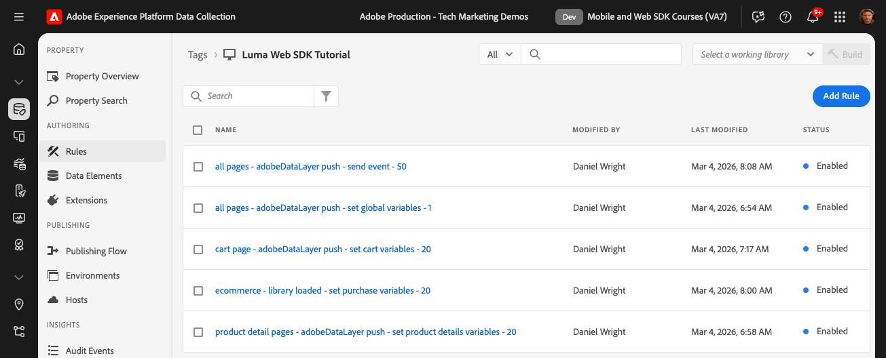

# Criar regras de tag

Saiba como enviar eventos para a Adobe Experience Platform Edge Network usando regras de tag. Uma regra de tag é uma combinação de eventos, condições e ações que instrui a propriedade de tag a fazer algo. Com o Platform Web SDK, as regras são usadas para enviar eventos para o Platform Edge Network com os dados corretos.

## Objetivos de aprendizagem

No final desta lição, você poderá:

* Usar uma convenção de nomenclatura para gerenciar regras nas tags
* Enviar um evento com campos XDM usando ações Atualizar variável e Enviar evento
* Empilhar vários conjuntos de campos XDM em várias regras
* Mapear elementos de dados de matriz individuais ou inteiros para o objeto XDM
* Publicar uma regra de tag em uma biblioteca de desenvolvimento

## Pré-requisitos

Você está familiarizado com as tags de Coleção de dados e o [site de demonstração do Luma](https://luma.enablementadobe.com) e concluiu as lições anteriores no tutorial:

* [Configurar um esquema XDM](configure-schemas.md)
* [Configurar um namespace de identidade](configure-identities.md)
* [Configurar uma sequência de dados](configure-datastream.md)
* [Instalação da extensão do SDK da Web](install-web-sdk.md)
* [Criar elementos de dados](create-data-elements.md)
* [Capturar identidades](create-identities.md)

## Convenções de nomenclatura

Para gerenciar regras em tags, é recomendável seguir uma convenção de nomenclatura padrão. Este tutorial usa uma convenção de nomenclatura de quatro partes:

* [**local**] - [**evento**] - [**finalidade**] - [**ordem**]

onde;

1. **local** é a(s) página(s) no site em que a regra é acionada
1. **evento** é o acionador da regra
1. **propósito** é a ação principal executada pela regra
1. **ordem** é a ordem na qual a regra deve ser acionada em relação a outras regras que compartilham o mesmo evento
<!-- minor update -->

## Adicionar extensão da camada de dados do cliente da Adobe

O site Luma usa uma camada de dados orientada por eventos chamada Camada de dados do cliente Adobe (ACDL). Sempre que ocorrer um evento de camada de dados, ele será enviado por push para a matriz `adobeDataLayer`. Este tutorial usa uma extensão de tags chamada Camada de dados do cliente da Adobe para aproveitar esses eventos e criar nossas regras.

Para adicionar a extensão:

1. Ir para **[!UICONTROL Extensões]**
1. Filtrar para **[!UICONTROL Camada de Dados de Clientes Adobe]**
1. Selecione **[!UICONTROL Instalar]**

   

1. Mantenha as configurações padrão
1. Selecione **[!UICONTROL Salvar]**

>[!NOTE]
>
> Não é necessário usar a Camada de dados de clientes Adobe para implementar o Experience Platform Web SDK. Muitos outros tipos de eventos são normalmente usados em implementações de tags (Biblioteca carregada, DOM Pronto, Janela carregada e assim por diante) para acionar regras.

## Criar regras de tag

Nas tags, as regras são usadas para executar ações, como definir variáveis e acionar chamadas de rede em várias condições. A extensão de tags da Experience Platform Web SDK inclui duas ações usadas em regras:

* A **[!UICONTROL variável de atualização]** mapeia elementos de dados para o XDM ou variáveis de dados
* **[!UICONTROL Enviar Evento]** faz a chamada de rede para enviar dados ao Experience Platform Edge Network

No restante desta lição:

1. Use a ação **[!UICONTROL Atualizar variável]** para definir uma &quot;configuração global&quot; de campos XDM.

1. Use a ação **[!UICONTROL Atualizar variável]** novamente para substituir nossa &quot;configuração global&quot; e contribuir com campos XDM adicionais em determinadas condições (por exemplo, adicionar detalhes do produto em páginas de produtos).

1. Use a ação **[!UICONTROL Enviar Evento]** para enviar os dados ao Adobe Experience Platform Edge Network.

Todas essas regras serão sequenciadas corretamente usando a opção &quot;[!UICONTROL order]&quot;.

Este vídeo fornece uma visão geral do processo:

>[!VIDEO](https://video.tv.adobe.com/v/3427710/?learn=on&enablevpops)

### Campos de configuração global

Para criar uma regra de tag para os campos XDM globais:

1. Abra a propriedade da tag que você está usando neste tutorial

1. Vá para **[!UICONTROL Regras]** na navegação à esquerda

1. Selecione o botão **[!UICONTROL Criar nova regra]**

   

1. Atribua um nome à regra `all pages - adobeDataLayer push - set global variables - 1`

1. Na seção **[!UICONTROL Eventos]**, selecione **[!UICONTROL Adicionar]**

   

1. Use a extensão **[!UICONTROL Camada de Dados de Clientes Adobe]** e selecione **[!UICONTROL Dados Enviados]** como o **[!UICONTROL Tipo de Evento]**

1. Selecione a lista suspensa **[!UICONTROL Avançado]** e digite `1` como **[!UICONTROL Pedido]**

   >[!NOTE]
   >
   > Quanto menor o número do pedido, mais cedo ele será executado. Portanto, damos à nossa &quot;configuração global&quot; um número de ordem baixo.

1. Ouvir **[!UICONTROL Todos os Eventos]**
1. Selecione **[!UICONTROL Manter alterações]** para retornar à tela de regra principal
   

1. Na seção **[!UICONTROL Ações]**, selecione **[!UICONTROL Adicionar]**

1. Como a **[!UICONTROL Extensão]**, selecione **[!UICONTROL Adobe Experience Platform Web SDK]**

1. Como o **[!UICONTROL Tipo de ação]**, selecione **[!UICONTROL Atualizar variável]**

1. Como o **[!UICONTROL Elemento de dados]**, selecione o `XDM Variable` criado na lição [Criar elementos de dados](create-data-elements.md)

   

1. Agora, especifique os campos XDM mapeando-os para valores apropriados:

   | Campo XDM | Mapear para |
   |---|---|
   | `eventType` | `Web Webpagedetails Page Views` (comece a digitar para ver os valores sugeridos) |
   | `identityMap` | `Identity Map` elemento de dados |
   | `web.webPageDetails.name` | `Page Name` elemento de dados |
   | `web.webPageDetails.pageViews.value` | `1` |

   >[!TIP]
   >
   > Os campos XDM não serão incluídos na solicitação de rede se o elemento de dados for nulo. Portanto, quando o usuário não estiver autenticado e o elemento de dados `Identity Map` for nulo, o objeto `identityMap` não será enviado. É por isso que podemos defini-la com segurança em nossa &quot;configuração global&quot;.

   >[!TIP]
   >
   > A configuração `web.webPageDetails.pageViews.value` fornece uma maneira padrão de indicar uma exibição de página para outros aplicativos downstream. Não é necessário que o Adobe Analytics processe uma chamada de rede como uma exibição de página.

1. Quando você terminar, seu `XDM Variable` será mais ou menos assim. Observe como os campos preenchidos e parcialmente preenchidos são indicados com os círculos azuis:
   
1. Selecione **[!UICONTROL Manter alterações]** e **[!UICONTROL Salvar]** a regra

### Campos da página do produto

Agora, comece a usar a **[!UICONTROL variável Update]** em regras sequenciadas adicionais para enriquecer o objeto XDM antes de enviá-lo para a [!UICONTROL Platform Edge Network].

>[!TIP]
>
>A ordem das regras determina qual regra é executada primeiro quando um evento é acionado. Se duas regras tiverem o mesmo tipo de evento, a regra com o número de ordem mais baixo será executada primeiro.
> 

Comece rastreando as exibições do produto na página de detalhes do produto da Luma:

1. Selecionar **[!UICONTROL Adicionar regra]**
1. Nomeie como [!UICONTROL `product detail pages - adobeDataLayer push - set product details variables - 20`]
1. Selecione o  em Evento para adicionar um novo gatilho
1. Em **[!UICONTROL Extensão]**, selecione **[!UICONTROL Camada de Dados de Clientes Adobe]**
1. Em **[!UICONTROL Tipo de evento]**, selecione **[!UICONTROL Dados enviados]**
1. Selecione para abrir as **[!UICONTROL Opções Avançadas]**, digite `20`. Este valor de ordem garante que a regra seja executada _após_ a regra de variáveis globais.
1. Ouvir um **[!UICONTROL Evento específico]**
1. Inserir `productView` como **[!UICONTROL Evento / Chave para registrar]**
1. Selecione **[!UICONTROL Manter alterações]**

   

1. Em **[!UICONTROL Ações]**, selecione **[!UICONTROL Adicionar]**
1. Selecione a extensão **[!UICONTROL Adobe Experience Platform Web SDK]**
1. Selecione o **[!UICONTROL Tipo de ação]** como **[!UICONTROL Atualizar variável]**
1. Selecione `XDM Variable` como o **[!UICONTROL Elemento de dados]**
1. Mapeie esses campos XDM para valores apropriados:

   | Campo XDM | Mapear para |
   |---|---|
   | `eventType` | `Commerce Product Views` (comece a digitar para ver os valores sugeridos) |
   | `commerce.productViews.value` | `1` |
   | `productListItems.name` | `Ecommerce Product Name` elemento de dados (Selecione **[!UICONTROL Fornecer itens individuais]** e **[!UICONTROL Adicionar Item]** primeiro ) |
   | `productListItems.sku` | `Ecommerce Product Id` elemento de dados |

1. Selecione **[!UICONTROL Manter alterações]**

1. Selecione **[!UICONTROL Salvar]** para salvar a regra

   >[!NOTE]
   >
   >Como essa regra tem uma ordem maior, ela substituirá o conjunto `eventType` na regra de &quot;configuração global&quot;. `eventType` pode conter apenas um valor e recomendamos configurá-lo com o evento mais valioso.

   >[!TIP]
   >
   >A configuração de commerce.productViews.value=1 no XDM mapeia automaticamente para o evento `prodView` no Analytics

### Campos do carrinho de compras

Você pode mapear toda a matriz para um objeto XDM, desde que a matriz corresponda ao formato do esquema XDM. O elemento de dados de código personalizado `Ecommerce Cart Products` criado anteriormente faz loop pelo objeto de camada de dados `adobeDataLayer.ecommerce.cart.items` no site da Luma e o traduz no formato necessário do objeto `productListItems` do esquema XDM.

Para ilustrar, consulte a comparação abaixo da camada de dados do site Luma (esquerda) com o elemento de dados traduzido (direita):

Compare o elemento de dados com a estrutura `productListItems` (dica, ele deve corresponder).

>[!NOTE]
>
> Você não poderá executar `_satellite.getVar('Ecommerce Cart Products')` neste ponto do tutorial.

>[!IMPORTANT]
>
>Ao mapear campos da camada de dados para o XDM, verifique se os campos correspondem ao tipo de dados do campo XDM. No exemplo acima, `quantity` e `priceTotal` devem ser números inteiros ou o registro não será assimilado na Platform.
> 

Agora, vamos mapear nossa matriz para o objeto XDM:

1. Crie uma nova regra chamada `cart page - adobeDataLayer push - set cart variables - 20`
1. Selecione o  em Evento para adicionar um novo gatilho
1. Em **[!UICONTROL Extensão]**, selecione **[!UICONTROL Camada de Dados de Clientes Adobe]**
1. Em **[!UICONTROL Tipo de evento]**, selecione **[!UICONTROL Dados enviados]**
1. Selecione para abrir as **[!UICONTROL Opções Avançadas]**, digite `20`. Este valor de ordem garante que a regra seja executada _após_ a regra de variáveis globais.
1. Ouvir um **[!UICONTROL Evento específico]**
1. Inserir `cartView` como **[!UICONTROL Evento / Chave para registrar]**
1. Selecione **[!UICONTROL Manter alterações]**

   

1. Em **[!UICONTROL Ações]**, selecione **[!UICONTROL Adicionar]**
1. Selecione a extensão **[!UICONTROL Adobe Experience Platform Web SDK]**
1. Selecione o **[!UICONTROL Tipo de ação]** como **[!UICONTROL Atualizar variável]**
1. Selecione `XDM Variable` como o **[!UICONTROL Elemento de dados]**
1. Mapeie esses campos XDM para valores apropriados:

   | Campo XDM | Mapear para |
   |---|---|
   | `eventType` | `Commerce Product List (Cart) Views` (comece a digitar para ver os valores sugeridos) |
   | `commerce.productListViews.value` | `1` |
   | `productListItems` | Elemento de dados `Ecommerce Cart Products` (selecione **[!UICONTROL Fornecer toda a matriz]** primeiro ) |

   >[!TIP]
   >
   >A configuração de commerce.productListViews.value=1 no XDM mapeia automaticamente para o evento `scView` no Analytics

1. Selecione **[!UICONTROL Manter alterações]**

1. Selecione **[!UICONTROL Salvar]** para salvar a regra

### Campos de confirmação de pedido

Crie outra regra para eventos de compra:

1. Crie uma nova regra chamada `order confirmation - adobeDataLayer push - set purchase variables -  20`
1. Selecione o  em Evento para adicionar um novo gatilho
1. Em **[!UICONTROL Extensão]**, selecione **[!UICONTROL Camada de Dados de Clientes Adobe]**
1. Em **[!UICONTROL Tipo de evento]**, selecione **[!UICONTROL Dados enviados]**
1. Selecione para abrir as **[!UICONTROL Opções Avançadas]**, digite `20`. Este valor de ordem garante que a regra seja executada _após_ a regra de variáveis globais.
1. Ouvir um **[!UICONTROL Evento específico]**
1. Inserir `purchase` como **[!UICONTROL Evento / Chave para registrar]**
1. Selecione **[!UICONTROL Manter alterações]**
1. Em **[!UICONTROL Ações]**, selecione **[!UICONTROL Adicionar]**
1. Selecione a extensão **[!UICONTROL Adobe Experience Platform Web SDK]**
1. Selecione o **[!UICONTROL Tipo de ação]** como **[!UICONTROL Atualizar variável]**
1. Selecione `XDM Variable` como o **[!UICONTROL Elemento de dados]**
1. Mapeie esses campos XDM para valores apropriados:

   | Campo XDM | Mapear para |
   |---|---|
   | `eventType` | `Commerce Purchases` (comece a digitar para ver os valores sugeridos) |
   | `commerce.productListViews.value` | `1` |
   | `commerce.order.purchaseID` | `Ecommerce Purchase Id` elemento de dados |
   | `commerce.order.currencyCode` | `USD` |
   | `productListItems` | `Ecommerce Cart Products` elemento de dados (Selecione **[!UICONTROL Fornecer toda a matriz]** primeiro ) |

   >[!TIP]
   >
   >A configuração `commerce.productListViews.value` como `1`, `commerce.order.purchaseID` e `commerce.order.currencyCode` no XDM mapeia automaticamente para as variáveis `purchase`, `s.purchaseID` e `s.currencyCode` no Analytics, respectivamente.

1. Selecione **[!UICONTROL Manter alterações]**
1. Selecione **[!UICONTROL Salvar]**

### Enviar regra de evento

Agora que você definiu as variáveis, é possível criar a regra para enviar o objeto XDM completo para o Platform Edge Network com a ação **[!UICONTROL Enviar evento]**.

1. Crie uma nova regra chamada `all pages - adobeDataLayer push - send event - 50`
1. Selecione o  em Evento para adicionar um novo gatilho
1. Em **[!UICONTROL Extensão]**, selecione **[!UICONTROL Camada de Dados de Clientes Adobe]**
1. Em **[!UICONTROL Tipo de evento]**, selecione **[!UICONTROL Dados enviados]**
1. Selecione para abrir as **[!UICONTROL Opções Avançadas]**, digite `50` (que provavelmente é o padrão). Este valor de ordem garante que a regra seja executada _após_ as regras de configuração de variável.
1. Ouvir um **[!UICONTROL Todos os Eventos]**
1. Selecione **[!UICONTROL Manter alterações]**
1. Em **[!UICONTROL Ações]**, selecione **[!UICONTROL Adicionar]**
1. Selecione a extensão **[!UICONTROL Adobe Experience Platform Web SDK]**
1. Selecione **[!UICONTROL Tipo de ação]** como **[!UICONTROL Enviar variável de evento]**

1. Como o **[!UICONTROL Tipo de ação]**, selecione **[!UICONTROL Enviar evento]**

1. Como o **[!UICONTROL XDM]**, selecione o elemento de dados `XDM Variable` criado na lição anterior

1. Selecione **[!UICONTROL Manter alterações]** para retornar à tela de regra principal

   
1. Selecione **[!UICONTROL Salvar]** para salvar a regra

   

Você deve ter as seguintes regras na propriedade:

## Publicar as regras em uma biblioteca

Em seguida, publique a regra no ambiente de desenvolvimento para que você possa verificar se funciona.

Para criar uma biblioteca:

1. Vá para **[!UICONTROL Fluxo de Publicação]** na navegação à esquerda

1. Selecione **[!UICONTROL Adicionar biblioteca]**

   
1. Para o **[!UICONTROL Nome]**, digite `Luma Web SDK Tutorial`
1. Para o **[!UICONTROL Ambiente]**, selecione `Development`
1. Selecione **[!UICONTROL Adicionar todos os recursos alterados]**

   >[!NOTE]
   >
   >    Você deve ver todos os componentes de tag criados nas lições anteriores. A extensão principal contém a JavaScript básica exigida por todas as propriedades de tag da Web.

1. Selecione **[!UICONTROL Salvar e criar para desenvolvimento]**

   

A biblioteca pode levar alguns minutos para ser criada e, quando estiver concluída, exibirá um ponto verde à esquerda do nome da biblioteca:

Como você pode ver na tela [!UICONTROL Fluxo de publicação], há muito mais no processo de publicação, que está além do escopo deste tutorial. Este tutorial usa apenas uma única biblioteca no ambiente de desenvolvimento do.

Agora você está pronto para validar os dados na solicitação usando o Adobe Experience Platform Debugger.

>[!NOTE]
>
>Obrigado por investir seu tempo aprendendo sobre o Adobe Experience Platform Web SDK. Se você tiver dúvidas, quiser compartilhar comentários gerais ou tiver sugestões sobre conteúdo futuro, compartilhe-as nesta [postagem de discussão da Comunidade Experience League](https://experienceleaguecommunities.adobe.com/adobe-experience-platform-18/tutorial-discussion-implement-adobe-experience-cloud-with-web-sdk-tutorial-248848)
