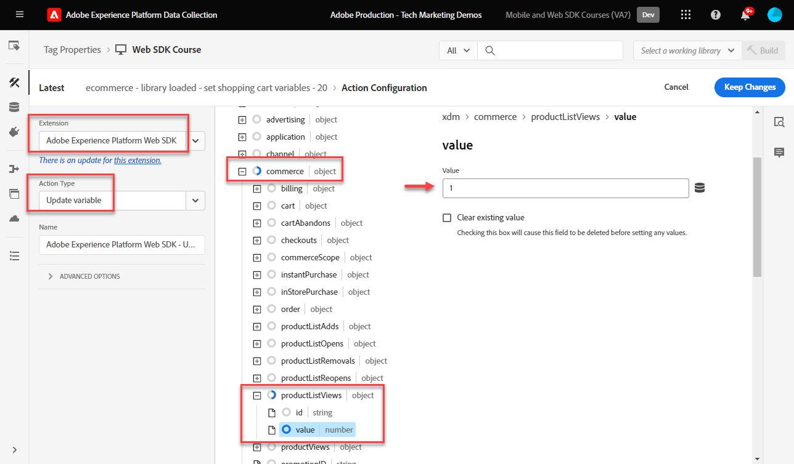
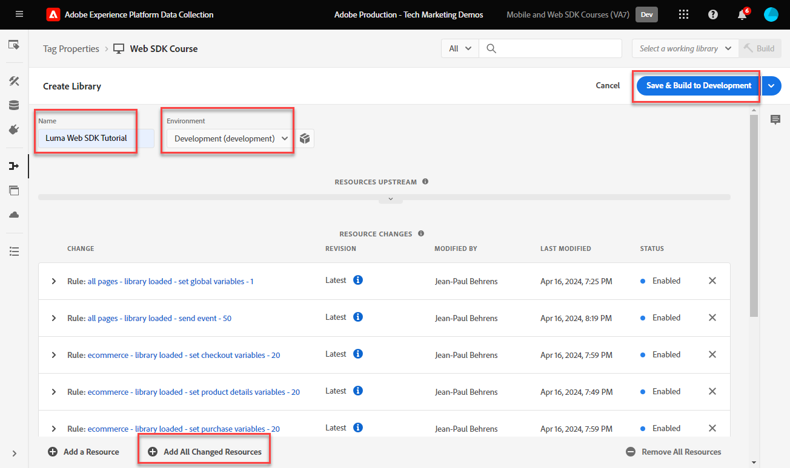

# Criar regras de tag

Saiba como enviar eventos para a Adobe Experience Platform Edge Network com seu objeto XDM usando regras de tag. Uma regra de tag é uma combinação de eventos, condições e ações que instrui a propriedade de tag a fazer algo. Com o Platform Web SDK, as regras são usadas para enviar eventos para o Platform Edge Network com os dados corretos.

>[!WARNING]
>
> O site do Luma usado neste tutorial deve ser substituído durante a semana de 16 de fevereiro de 2026. O trabalho realizado como parte deste tutorial pode não se aplicar ao novo site.

## Objetivos de aprendizagem

No final desta lição, você poderá:

* Usar uma convenção de nomenclatura para gerenciar regras nas tags
* Enviar um evento com campos XDM usando ações Atualizar variável e Enviar evento
* Empilhar vários conjuntos de campos XDM em várias regras
* Mapear elementos de dados de matriz individuais ou inteiros para o objeto XDM
* Publicar uma regra de tag em uma biblioteca de desenvolvimento

## Pré-requisitos

Você está familiarizado com as tags da Coleção de dados e o [site de demonstração Luma](https://luma.enablementadobe.com/content/luma/us/en.html) e concluiu as lições anteriores no tutorial:

* [Configurar um esquema XDM](configure-schemas.md)
* [Configurar um namespace de identidade](configure-identities.md)
* [Configurar uma sequência de dados](configure-datastream.md)
* [Instalação da extensão do SDK da Web](install-web-sdk.md)
* [Criar elementos de dados](create-data-elements.md)
* [Criar identidades](create-identities.md)

## Convenções de nomenclatura

Para gerenciar regras em tags, é recomendável seguir uma convenção de nomenclatura padrão. Este tutorial usa uma convenção de nomenclatura de cinco partes:

* [**local**] - [**evento**] - [**finalidade**] - [**ordem**]

onde;

1. **local** é a(s) página(s) no site em que a regra é acionada
1. **evento** é o acionador da regra
1. **propósito** é a ação principal executada pela regra
1. **ordem** é a ordem na qual a regra deve ser acionada em relação a outras regras
<!-- minor update -->

## Criar regras de tag

Nas tags, as regras são usadas para executar ações (acionar chamadas) em várias condições. A extensão de tags da Platform Web SDK inclui duas ações usadas nesta lição:

* A **[!UICONTROL variável de atualização]** mapeia elementos de dados para propriedades em um objeto XDM
* **[!UICONTROL Enviar evento]** envia o objeto XDM para o Experience Platform Edge Network

No restante desta lição:

1. Crie uma regra com a ação **[!UICONTROL Atualizar variável]** para definir uma &quot;configuração global&quot; de campos XDM.

1. Crie regras adicionais com a ação **[!UICONTROL Atualizar variável]** que substituem nossa &quot;configuração global&quot; e contribuem com campos XDM adicionais em determinadas condições (por exemplo, adicionar detalhes do produto nas páginas de produtos).

1. Crie outra regra com a ação **[!UICONTROL Enviar evento]**, que enviará o objeto XDM completo para o Adobe Experience Platform Edge Network.

Todas essas regras serão sequenciadas corretamente usando a opção &quot;[!UICONTROL order]&quot;.

Este vídeo fornece uma visão geral do processo:

>[!VIDEO](https://video.tv.adobe.com/v/3427710/?learn=on&enablevpops)

### Campos de configuração global

Para criar uma regra de tag para os campos XDM globais:

1. Abra a propriedade da tag que você está usando neste tutorial

1. Vá para **[!UICONTROL Regras]** na navegação à esquerda

1. Selecione o botão **[!UICONTROL Criar nova regra]**

   

1. Atribua um nome à regra `all pages - library loaded - set global variables - 1`

1. Na seção **[!UICONTROL Eventos]**, selecione **[!UICONTROL Adicionar]**

   

1. Use a **[!UICONTROL Extensão principal]** e selecione **[!UICONTROL Biblioteca carregada (Início da Página)]** como o **[!UICONTROL Tipo de evento]**

1. Selecione a lista suspensa **[!UICONTROL Avançado]** e digite `1` como **[!UICONTROL Pedido]**

   >[!NOTE]
   >
   > Quanto menor o número do pedido, mais cedo ele será executado. Portanto, damos à nossa &quot;configuração global&quot; um número de ordem baixo.

1. Selecione **[!UICONTROL Manter alterações]** para retornar à tela de regra principal
   

1. Na seção **[!UICONTROL Ações]**, selecione **[!UICONTROL Adicionar]**

1. Como a **[!UICONTROL Extensão]**, selecione **[!UICONTROL Adobe Experience Platform Web SDK]**

1. Como o **[!UICONTROL Tipo de ação]**, selecione **[!UICONTROL Atualizar variável]**

1. Como o **[!UICONTROL Elemento de dados]**, selecione o `xdm.variable.content` criado na lição [Criar elementos de dados](create-data-elements.md)

   

Agora, mapeie seus [!UICONTROL elementos de dados] para o [!UICONTROL esquema] usado pelo seu objeto XDM. Você pode mapear para propriedades individuais ou objetos inteiros. Neste exemplo, você mapeia para propriedades individuais:

1. Localize o campo eventType e selecione-o

1. Digite o valor `web.webpagedetails.pageViews`

   >[!TIP]
   >
   > Para entender quais valores devem ser preenchidos no campo `eventType`, vá para a página de esquema e selecione o campo `eventType` para exibir os valores sugeridos no painel direito. Você também pode inserir um novo valor, se necessário.
   > 

1. Em seguida, localize o objeto `identityMap` no esquema e selecione-o

1. Mapear para o elemento de dados `identityMap.loginID`

   

   >[!TIP]
   >
   > Os campos XDM não serão incluídos na solicitação de rede se o elemento de dados for nulo. Portanto, quando o usuário não estiver autenticado e o elemento de dados `identityMap.loginID` for nulo, o objeto `identityMap` não será enviado. É por isso que podemos defini-la em nossa &quot;configuração global&quot;.

1. Role para baixo até alcançar o objeto **`web`**

1. Selecione para abri-lo

1. Mapear os seguintes elementos de dados para as variáveis XDM `web` correspondentes

   * **`web.webPageDetials.name`** a `%page.pageInfo.pageName%`
   * **`web.webPageDetials.server`** a `%page.pageInfo.server%`
   * **`web.webPageDetials.siteSection`** a `%page.pageInfo.hierarchie1%`

1. Defina `web.webPageDetials.pageViews.value` como `1`

   

   >[!TIP]
   >
   > Embora nem o `eventType` definido como `web.webpagedetails.pageViews` nem o `web.webPageDetails.pageViews.value` sejam necessários para que o Adobe Analytics processe um beacon como uma exibição de página, é útil ter uma maneira padrão de indicar uma exibição de página para outros aplicativos downstream.

1. Selecione **[!UICONTROL Manter alterações]** e **[!UICONTROL Salvar]** a regra na próxima tela para concluir a criação da regra

### Campos da página do produto

Agora, comece a usar a **[!UICONTROL variável Update]** em regras sequenciadas adicionais para enriquecer o objeto XDM antes de enviá-lo para a [!UICONTROL Platform Edge Network].

>[!TIP]
>
>A ordem das regras determina qual regra é executada primeiro quando um evento é acionado. Se duas regras tiverem o mesmo tipo de evento, aquela com o número mais baixo será executada primeiro.
> 

Comece rastreando as exibições do produto na página de detalhes do produto da Luma:

1. Selecionar **[!UICONTROL Adicionar regra]**
1. Nomeie como [!UICONTROL `ecommerce - library loaded - set product details variables - 20`]
1. Selecione o  em Evento para adicionar um novo gatilho
1. Em **[!UICONTROL Extension]**, selecione **[!UICONTROL Core]**
1. Em **[!UICONTROL Tipo de evento]**, selecione **[!UICONTROL Biblioteca carregada (Início da Página)]**
1. Selecione para abrir as **[!UICONTROL Opções Avançadas]**, digite `20`. Este valor de ordem garante que a regra seja executada _após_ o `all pages - library loaded - set global variables - 1`, que define a configuração global.
1. Selecione **[!UICONTROL Manter alterações]**

   

1. Em **[!UICONTROL Condições]**, selecione **[!UICONTROL Adicionar]**
1. Deixar **[!UICONTROL Tipo Lógico]** como **[!UICONTROL Regular]**
1. Deixar **[!UICONTROL Extensão]** como **[!UICONTROL Núcleo]**
1. Selecione o **[!UICONTROL Tipo de Condição]** como **[!UICONTROL Caminho sem a Cadeia de Caracteres de Consulta]**
1. À direita, habilite a opção **[!UICONTROL Regex]**
1. Em **[!UICONTROL caminho igual a]**, defina `/products/`. Para o site de demonstração Luma, ele garante que a regra seja acionada somente nas páginas do produto
1. Selecione **[!UICONTROL Manter alterações]**

   

1. Em **[!UICONTROL Ações]**, selecione **[!UICONTROL Adicionar]**
1. Selecione a extensão **[!UICONTROL Adobe Experience Platform Web SDK]**
1. Selecione o **[!UICONTROL Tipo de ação]** como **[!UICONTROL Atualizar variável]**
1. Selecione `xdm.variable.content` como o **[!UICONTROL Elemento de dados]**
1. Role para baixo até o objeto `commerce`
1. Abra o objeto **[!UICONTROL productViews]** e defina o **[!UICONTROL valor]** como `1`

   

   >[!TIP]
   >
   >A configuração de commerce.productViews.value=1 no XDM mapeia automaticamente para o evento `prodView` no Analytics

1. Role para baixo até `eventType` e defina-o como `commerce.productViews`

   >[!NOTE]
   >
   >Como essa regra tem uma ordem maior, ela substituirá o conjunto `eventType` na regra de &quot;configuração global&quot;. `eventType` pode conter apenas um valor e recomendamos configurá-lo com o evento mais valioso.

1. Role para baixo até e selecione a matriz `productListItems`
1. Selecione **[!UICONTROL Fornecer itens individuais]**
1. Selecionar **[!UICONTROL Adicionar Item]**

   

   >[!CAUTION]
   >
   >O **`productListItems`** é um tipo de dados `array`, portanto espera que os dados entrem como uma coleção de elementos. Devido à estrutura da camada de dados do site de demonstração Luma e como é possível visualizar apenas um produto de cada vez no site Luma, você adiciona itens individualmente. Ao implementar o em seu próprio site, dependendo da estrutura da camada de dados, talvez você possa fornecer um storage inteiro.

1. Selecione para abrir o **[!UICONTROL Item 1]**
1. Mapear **`productListItems.item1.SKU`** para `%product.productInfo.sku%`

   

1. Selecione **[!UICONTROL Manter alterações]**

1. Selecione **[!UICONTROL Salvar]** para salvar a regra

### Campos do carrinho de compras

Você pode mapear toda a matriz para um objeto XDM, desde que a matriz corresponda ao formato do esquema XDM. O elemento de dados de código personalizado `cart.productInfo` criado anteriormente faz loop pelo objeto de camada de dados `digitalData.cart.cartEntries` no Luma e o traduz no formato necessário do objeto `productListItems` do esquema XDM.

Para ilustrar, consulte a comparação abaixo da camada de dados do site Luma (esquerda) com o elemento de dados traduzido (direita):

Compare o elemento de dados com a estrutura `productListItems` (dica, ele deve corresponder).

>[!IMPORTANT]
>
>Observe como as variáveis numéricas são convertidas, com valores de cadeia de caracteres na camada de dados, como `price` e `qty` reformatados em números no elemento de dados. Esses requisitos de formato são importantes para a integridade de dados na Platform e são determinados durante a etapa [configurar schemas](configure-schemas.md). No exemplo, **[!UICONTROL quantity]** usa o tipo de dados **[!UICONTROL Integer]**.
> 

Agora, vamos mapear nossa matriz para o objeto XDM:

1. Crie uma nova regra chamada `ecommerce - library loaded - set shopping cart variables - 20`
1. Selecione o  em Evento para adicionar um novo gatilho
1. Em **[!UICONTROL Extension]**, selecione **[!UICONTROL Core]**
1. Em **[!UICONTROL Tipo de evento]**, selecione **[!UICONTROL Biblioteca carregada (Início da Página)]**
1. Selecione para abrir as **[!UICONTROL Opções Avançadas]**, digite `20`
1. Selecione **[!UICONTROL Manter alterações]**

   

1. Em **[!UICONTROL Condições]**, selecione **[!UICONTROL Adicionar]**
1. Deixar **[!UICONTROL Tipo Lógico]** como **[!UICONTROL Regular]**
1. Deixar **[!UICONTROL Extensões]** como **[!UICONTROL Núcleo]**
1. Selecione o **[!UICONTROL Tipo de Condição]** como **[!UICONTROL Caminho sem a Cadeia de Caracteres de Consulta]**
1. À direita, **não** habilite a opção **[!UICONTROL Regex]**
1. Em **[!UICONTROL caminho igual a]**, defina `/content/luma/us/en/user/cart.html`. Para o site de demonstração Luma, ele garante que a regra seja acionada somente na página do carrinho
1. Selecione **[!UICONTROL Manter alterações]**

   

1. Em **[!UICONTROL Ações]**, selecione **[!UICONTROL Adicionar]**
1. Selecione a extensão **[!UICONTROL Adobe Experience Platform Web SDK]**
1. Selecione o **[!UICONTROL Tipo de ação]** como **[!UICONTROL Atualizar variável]**
1. Selecione `xdm.variable.content` como o **[!UICONTROL Elemento de dados]**
1. Role para baixo até o objeto `commerce` e selecione para abri-lo.
1. Abra o objeto **[!UICONTROL productListViews]** e defina o **[!UICONTROL valor]** como `1`

   

   >[!TIP]
   >
   >A configuração de commerce.productListViews.value=1 no XDM mapeia automaticamente para o evento `scView` no Analytics

1. Selecione `eventType` e defina como `commerce.productListViews`

1. Role para baixo até e selecione a matriz **[!UICONTROL productListItems]**

1. Selecione **[!UICONTROL Fornecer toda a matriz]**

1. Mapear para elemento de dados **`cart.productInfo`**

1. Selecione **[!UICONTROL Manter alterações]**

1. Selecione **[!UICONTROL Salvar]** para salvar a regra

Crie duas outras regras para finalização e compra seguindo o mesmo padrão, com as diferenças abaixo:

**Nome da regra**: `ecommerce  - library loaded - set checkout variables - 20`

1. **[!UICONTROL Condição]**: /content/luma/us/en/user/checkout.html
1. Defina `eventType` como `commerce.checkouts`
1. Defina `commerce.checkout.value` como `1`

   >[!TIP]
   >
   >Isso é equivalente à configuração do evento `scCheckout` no Analytics

**Nome da regra**: `ecommerce - library loaded - set purchase variables -  20`

1. **[!UICONTROL Condição]**: /content/luma/us/en/user/checkout/order/thank-you.html
1. Defina `eventType` como `commerce.purchases`
1. Defina `commerce.purchases.value` como `1`

   >[!TIP]
   >
   >Isso é equivalente à configuração do evento `purchase` no Analytics

1. Definir `commerce.order.purchaseID` para o elemento de dados `cart.orderId`
1. Defina `commerce.order.currencyCode` com o valor codificado `USD`

   

   >[!TIP]
   >
   >É equivalente à configuração de `s.purchaseID` e `s.currencyCode` variáveis no Analytics

1. Role para baixo até e selecione a matriz **[!UICONTROL productListItems]**
1. Selecione **[!UICONTROL Fornecer toda a matriz]**
1. Mapear para elemento de dados **`cart.productInfo.purchase`**
1. Selecione **[!UICONTROL Manter alterações]**
1. Selecione **[!UICONTROL Salvar]**

Quando terminar, você deverá ver as seguintes regras criadas.

### Enviar regra de evento

Agora que você definiu as variáveis, é possível criar a regra para enviar o objeto XDM completo para o Platform Edge Network com a ação **[!UICONTROL Enviar evento]**.

1. À direita, selecione **[!UICONTROL Adicionar regra]** para criar outra regra

1. Atribua um nome à regra `all pages - library loaded - send event - 50`

1. Na seção **[!UICONTROL Eventos]**, selecione **[!UICONTROL Adicionar]**

1. Use a **[!UICONTROL Extensão principal]** e selecione `Library Loaded (Page Top)` como o **[!UICONTROL Tipo de evento]**

1. Selecione a lista suspensa **[!UICONTROL Avançado]** e insira `50` em **[!UICONTROL Pedido]**. Isso garantirá que esta regra seja acionada depois de todas as outras regras configuradas (que tinham `1` ou `20` como sua [!UICONTROL Ordem]).

1. Selecione **[!UICONTROL Manter alterações]** para retornar à tela de regra principal
   

1. Na seção **[!UICONTROL Ações]**, selecione **[!UICONTROL Adicionar]**

1. Como a **[!UICONTROL Extensão]**, selecione **[!UICONTROL Adobe Experience Platform Web SDK]**

1. Como o **[!UICONTROL Tipo de ação]**, selecione **[!UICONTROL Enviar evento]**

1. Como o **[!UICONTROL XDM]**, selecione o elemento de dados `xdm.variable.content` criado na lição anterior

1. Selecione **[!UICONTROL Manter alterações]** para retornar à tela de regra principal

   
1. Selecione **[!UICONTROL Salvar]** para salvar a regra

   

## Publicar as regras em uma biblioteca

Em seguida, publique a regra no ambiente de desenvolvimento para que você possa verificar se funciona.

Para criar uma biblioteca:

1. Vá para **[!UICONTROL Fluxo de Publicação]** na navegação à esquerda

1. Selecione **[!UICONTROL Adicionar biblioteca]**

   
1. Para o **[!UICONTROL Nome]**, digite `Luma Web SDK Tutorial`
1. Para o **[!UICONTROL Ambiente]**, selecione `Development`
1. Selecione **[!UICONTROL Adicionar todos os recursos alterados]**

   >[!NOTE]
   >
   >    Você deve ver todos os componentes de tag criados nas lições anteriores. A extensão principal contém a JavaScript básica exigida por todas as propriedades de tag da Web.

1. Selecione **[!UICONTROL Salvar e criar para desenvolvimento]**

   

A biblioteca pode levar alguns minutos para ser criada e, quando estiver concluída, exibirá um ponto verde à esquerda do nome da biblioteca:

Como você pode ver na tela [!UICONTROL Fluxo de publicação], há muito mais no processo de publicação, que está além do escopo deste tutorial. Este tutorial usa apenas uma única biblioteca no ambiente de desenvolvimento do.

Agora você está pronto para validar os dados na solicitação usando o Adobe Experience Platform Debugger.

>[!NOTE]
>
>Obrigado por investir seu tempo aprendendo sobre o Adobe Experience Platform Web SDK. Se você tiver dúvidas, quiser compartilhar comentários gerais ou tiver sugestões sobre conteúdo futuro, compartilhe-as nesta [postagem de discussão da Comunidade Experience League](https://experienceleaguecommunities.adobe.com/t5/adobe-experience-platform-data/tutorial-discussion-implement-adobe-experience-cloud-with-web/td-p/444996)
