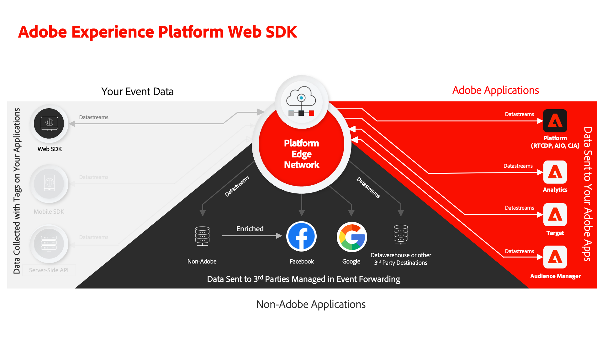

# Implementar a Adobe Experience Cloud com o tutorial do SDK da web

Saiba como implementar os aplicativos da Experience Cloud usando o SDK da web da Adobe Experience Platform. 

O Experience Platform Web SDK é uma biblioteca JavaScript do lado do cliente que permite aos clientes da Adobe Experience Cloud interagir com aplicativos da Adobe e serviços de terceiros por meio do Adobe Experience Platform Edge Network. Consulte a [Visão geral do Adobe Experience Platform Web SDK](https://experienceleague.adobe.com/pt-br/docs/experience-platform/edge/home) para obter informações mais detalhadas.

Este tutorial o orienta pela implementação do Platform Web SDK em um site de vendas de exemplo chamado Luma. O [site Luma](https://luma.enablementadobe.com/content/luma/us/en.html) tem uma camada de dados avançada e uma funcionalidade que permite a criação de uma implementação realista. Neste tutorial, você:

* Crie sua própria propriedade de tags, em sua própria conta, com uma implementação do Platform Web SDK para o site da Luma.
* Configure todos os recursos de coleta de dados para implementações do Web SDK, como sequências de dados, esquemas e namespaces de identidade.
* Adicione os seguintes aplicativos do Adobe Experience Cloud:
   * **[Adobe Experience Platform](setup-experience-platform.md)** (e aplicativos criados na Platform, como Adobe Real-Time Customer Data Platform, Adobe Journey Optimizer e Adobe Customer Journey Analytics)
   * **[Adobe Analytics](setup-analytics.md)**
   * **[Adobe Audience Manager](setup-audience-manager.md)**
   * **[Adobe Target](setup-target.md)**
* Implemente o encaminhamento de eventos para enviar os dados coletados pelo Web SDK para destinos que não sejam da Adobe.
* Valide sua própria implementação do Platform Web SDK usando o Experience Platform Debugger e o Assurance.

Após concluir este tutorial, você deve estar pronto para começar a implementar todos os seus aplicativos de marketing por meio do Platform Web SDK em seu próprio site!

>[!NOTE]
>
>Um tutorial de várias soluções semelhante está disponível para o [Mobile SDK](../tutorial-mobile-sdk/overview.md).

## Pré-requisitos

Todos os clientes da Experience Cloud podem usar o Platform Web SDK. Não é um requisito licenciar um aplicativo baseado em plataforma, como o Real-Time Customer Data Platform ou o Journey Optimizer, para usar o Web SDK.

Nessas lições, presume-se que você tenha uma conta do Adobe e as permissões necessárias para concluir as lições. Caso contrário, entre em contato com um administrador do Experience Cloud em sua empresa para obter acesso.

* Para **Coleção de Dados**, você deve ter:
   * **[!UICONTROL Plataformas]**—permissão para **[!UICONTROL Web]** e, se licenciada, **[!UICONTROL Edge]**
   * **[!UICONTROL Direitos de Propriedade]**—permissão para **[!UICONTROL Aprovar]**, **[!UICONTROL Desenvolver]**, **[!UICONTROL Editar Propriedade]**, **[!UICONTROL Gerenciar Ambientes]**, **[!UICONTROL Gerenciar Extensões]** e **[!UICONTROL Publicar]**,
   * **[!UICONTROL Direitos da Empresa]**—permissão para **[!UICONTROL Gerenciar Propriedades]**

     Para obter mais informações sobre permissões de marcas, consulte [a documentação](https://experienceleague.adobe.com/pt-br/docs/experience-platform/tags/admin/user-permissions).

* Para **Experience Platform**, você deve ter:

   * Acesso à sandbox **padrão**, **&quot;Prod&quot;**.
   * Acesso a **[!UICONTROL Gerenciar esquemas]** e **[!UICONTROL Exibir esquemas]** em **[!UICONTROL Modelagem de dados]**.
   * Acesso a **[!UICONTROL Gerenciar Namespaces de Identidade]** e **[!UICONTROL Exibir Namespaces de Identidade]** em **[!UICONTROL Identity Management]**.
   * Acesso a **[!UICONTROL Gerenciar Datastreams]** e **[!UICONTROL Exibir Datastreams]** em **[!UICONTROL Coleção de Dados]**.
   * Se você for um cliente de um aplicativo baseado em Plataforma e estiver concluindo a lição [Configurar o Experience Platform](setup-experience-platform.md), também deverá ter:
      * Acesso a uma sandbox de **desenvolvimento**.
      * Todos os itens de permissão em **[!UICONTROL Gerenciamento de Dados]** e **[!UICONTROL Gerenciamento de Perfis]**:

     Os recursos necessários devem estar disponíveis para todos os clientes do Experience Cloud, mesmo se você não for um cliente de um aplicativo baseado na plataforma, como o Real-Time CDP.

     Para obter mais informações sobre o controle de acesso da Platform, consulte [a documentação](https://experienceleague.adobe.com/pt-br/docs/experience-platform/access-control/home).

* Para a lição opcional **Adobe Analytics**, você deve ter [acesso de administrador às Configurações do Conjunto de Relatórios, Regras de Processamento e Analysis Workspace](https://experienceleague.adobe.com/pt-br/docs/analytics/admin/admin-console/home)

* Para a lição opcional **Adobe Target**, você deve ter acesso de [Editor ou Aprovador](https://experienceleague.adobe.com/pt-br/docs/target/using/administer/manage-users/enterprise/properties-overview#section_8C425E43E5DD4111BBFC734A2B7ABC80).

* Para a lição opcional **Audience Manager**, você deve ter acesso para criar, ler e gravar características, segmentos e destinos. Para obter mais informações, consulte o tutorial sobre [Controle de acesso com base em função](https://experienceleague.adobe.com/pt-br/docs/audience-manager-learn/tutorials/setup-and-admin/user-management/setting-permissions-with-role-based-access-control) do Audience Manager.

>[!NOTE]
>
>Presume-se que você esteja familiarizado com linguagens de desenvolvimento front-end como HTML e JavaScript. Você não precisa ser um especialista nessas linguagens, mas aprenderá mais com este tutorial se puder ler e entender o código.

## Atualizações

* 24 de abril de 2024: Principais atualizações, incluindo a adição de Definir variável/Atualizar variável, dividir solicitações de personalização e análise, lições do Journey Optimizer

## Carregar o site Luma

>[!WARNING]
>
> O site do Luma usado neste tutorial deve ser substituído durante a semana de 16 de fevereiro de 2026. O trabalho realizado como parte deste tutorial pode não se aplicar ao novo site.

Carregue o [site Luma](https://luma.enablementadobe.com/content/luma/us/en.html){target="blank"} em uma guia separada do navegador e marque-o como favorito para que você possa carregá-lo facilmente sempre que necessário durante o tutorial. Você não precisa de acesso adicional ao Luma além de poder carregar nosso site de produção hospedado.

{target="blank"}

Vamos começar!

>[!NOTE]
>
>Obrigado por investir seu tempo aprendendo sobre o Adobe Experience Platform Web SDK. Se você tiver dúvidas, quiser compartilhar comentários gerais ou tiver sugestões sobre conteúdo futuro, compartilhe-as nesta [postagem de discussão da Comunidade Experience League](https://experienceleaguecommunities.adobe.com/t5/adobe-experience-platform-data/tutorial-discussion-implement-adobe-experience-cloud-with-web/td-p/444996?profile.language=pt)
