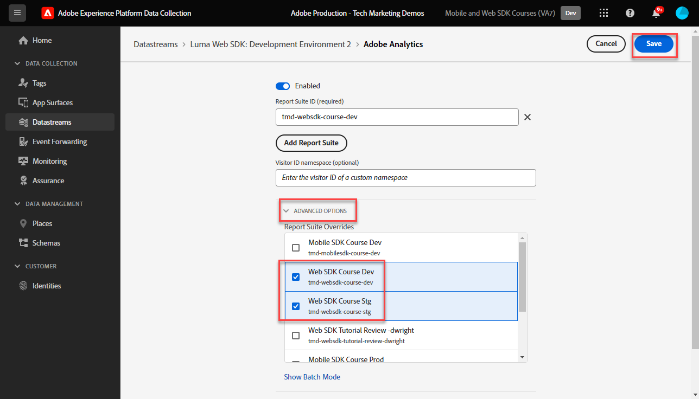
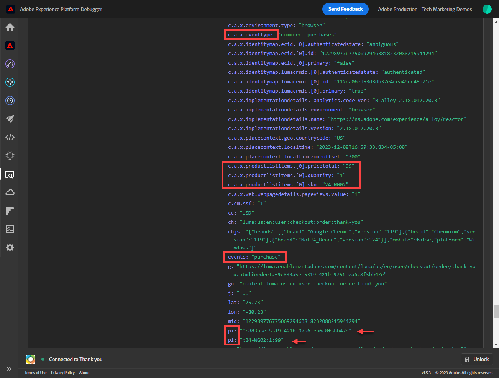

# Configurar o Adobe Analytics com o Adobe Experience Platform Web SDK

Saiba como configurar o Adobe Analytics usando o [Adobe Experience Platform Web SDK](https://experienceleague.adobe.com/en/docs/platform-learn/data-collection/web-sdk/overview), criar regras de tag para enviar dados ao Adobe Analytics e validar se o Analytics está capturando dados conforme esperado.

O [Adobe Analytics](https://experienceleague.adobe.com/en/docs/analytics?lang=pt-BR) é um aplicativo líder do setor que faz você ser capaz de entender seus clientes como pessoas e de orientar seus negócios com informações de inteligência de clientes.

## Objetivos de aprendizagem

No final desta lição, você poderá:

* Configurar um fluxo de dados para ativar o Adobe Analytics
* Saber quais campos XDM padrão são mapeados automaticamente para variáveis do Analytics
* Definir variáveis do Analytics no objeto de dados
* Enviar dados para outro conjunto de relatórios substituindo o fluxo de dados
* Validar variáveis do Adobe Analytics usando o Debugger e o Assurance

## Pré-requisitos

Para concluir esta lição, primeiro você deve:

* Estar familiarizado com o Adobe Analytics e ter acesso a ele.

* Ter pelo menos uma ID de conjunto de relatórios de teste/desenvolvimento. Se você não tiver um conjunto de relatórios de teste/desenvolvimento que pode ser usado para este tutorial, [crie um](https://experienceleague.adobe.com/en/docs/analytics/admin/admin-tools/manage-report-suites/c-new-report-suite/t-create-a-report-suite).

* Conclua as lições anteriores nas seções Configuração inicial e Configuração de tags deste tutorial.

## Configurar o fluxo de dados

O Platform Web SDK envia dados do seu site para o Platform Edge Network. Seu fluxo de dados informa à Platform Edge Network para quais conjuntos de relatórios do Adobe Analytics seus dados devem ser enviados.

1. Ir para a interface [Coleção de Dados](https://experience.adobe.com/#/data-collection){target="blank"}
1. Na navegação à esquerda, selecione **[!UICONTROL Datastreams]**
1. Selecionar a sequência de dados `Luma Web SDK: Development Environment` criada anteriormente

   

1. Selecione **[!UICONTROL Adicionar Serviço]**
   
1. Selecione **[!UICONTROL Adobe Analytics]** como o **[!UICONTROL Serviço]**
1. Digite a **[!UICONTROL ID do Conjunto de relatórios]** do seu conjunto de relatórios de desenvolvimento
1. Selecione **[!UICONTROL Salvar]**

   

   >[!TIP]
   >
   >Adicionar mais conjuntos de relatórios selecionando **[!UICONTROL Adicionar Conjunto de Relatórios]** é equivalente à marcação de vários conjuntos.

>[!WARNING]
>
>Neste tutorial, você só configura o conjunto de relatórios do Adobe Analytics para o seu ambiente de desenvolvimento. Ao criar fluxos de dados para seu próprio site, você deve criar fluxos de dados adicionais e conjuntos de relatórios para seus ambientes de preparo e produção.

## Definir variáveis do Analytics

Há várias maneiras de definir variáveis do Analytics em uma implementação do Web SDK:

1. Mapeamento automático de campos XDM para variáveis do Analytics (automático).
1. Definir campos no objeto `data` (recomendado).
1. Mapear campos XDM para variáveis do Analytics nas regras de processamento do Analytics (não é mais recomendado).
1. Mapear para variáveis do Analytics diretamente no esquema XDM (não é mais recomendado).

A partir de maio de 2024, não será mais necessário criar um esquema XDM para implementar o Adobe Analytics com o Platform Web SDK. O objeto `data` (e o elemento de dados `data.variable` criado na lição [Criar elementos de dados](create-data-elements.md)) pode ser usado para definir todas as variáveis personalizadas do Analytics. Definir essas variáveis no objeto de dados será comum aos clientes existentes do Analytics, é mais eficiente do que usar a interface de regras de processamento e impede que dados desnecessários ocupem espaço nos Perfis de clientes em tempo real (importante se você tiver o Real-Time Customer Data Platform ou o Journey Optimizer).

### Campos mapeados automaticamente

Muitos campos XDM são mapeados automaticamente para variáveis do Analytics. Para obter a lista mais atualizada de mapeamentos, consulte [Mapeamento de variáveis do Analytics na Adobe Experience Edge](https://experienceleague.adobe.com/en/docs/experience-platform/edge/data-collection/adobe-analytics/automatically-mapped-vars).

Isso ocorre se _mesmo que você não tenha definido um esquema personalizado_. O Experience Platform Web SDK coleta alguns dados automaticamente e os envia para o Platform Edge Network como campos XDM. Por exemplo, o Web SDK lê a URL da página atual e a envia como o campo XDM `web.webPageDetails.URL`. Esse campo é encaminhado ao Adobe Analytics e preenche automaticamente os relatórios de URL da página no Adobe Analytics.

Se implementar o Web SDK for Adobe Analytics com um esquema XDM, como você tem neste tutorial, alguns dos campos XDM implementados automaticamente são mapeados para variáveis do Analytics, conforme descrito nesta tabela:

| Variáveis mapeadas automaticamente do XDM para o Analytics | variável do Adobe Analytics |
|-------|---------|
| `identitymap.ecid.[0].id` | mid |
| `web.webPageDetails.name` | s.pageName |
| `web.webPageDetails.server` | s.server |
| `web.webPageDetails.siteSection` | s.channel |
| `commerce.productViews.value` | prodView |
| `commerce.productListViews.value` | scView |
| `commerce.checkouts.value` | scCheckout |
| `commerce.purchases.value` | Aquisição |
| `commerce.order.currencyCode` | s.currencyCode |
| `commerce.order.purchaseID` | s.purchaseID |
| `productListItems[].SKU` | s.products=;nome do produto;;; (principal - consulte a Observação abaixo) |
| `productListItems[].name` | s.products=;nome do produto;;;; (fallback - consulte a Observação abaixo) |
| `productListItems[].quantity` | s.products=;;quantidade do produto;;; |
| `productListItems[].priceTotal` | s.product=;;;preço do produto;; |

As seções individuais da cadeia de caracteres do produto Analytics são definidas por meio de diferentes variáveis XDM no objeto `productListItems`.

>[!NOTE]
>
>A partir de 18 de agosto de 2022, o `productListItems[].SKU` tem prioridade para mapear para o nome do produto na variável s.products.
>&#x200B;>O valor definido como `productListItems[].name` é mapeado para o nome do produto apenas se `productListItems[].SKU` não existir. Caso contrário, ele não será mapeado e estará disponível nos dados de contexto.
>&#x200B;>Não defina uma cadeia vazia ou nula como `productListItems[].SKU`. Isso tem o efeito indesejado de mapear para o nome do produto na variável s.products.

### Definir variáveis no objeto de dados

Mas e quanto a evars, propriedades e eventos? Definir variáveis no objeto `data` é a maneira recomendada de definir essas variáveis do Analytics com o Web SDK. A configuração de variáveis no objeto de dados também pode substituir qualquer variável mapeada automaticamente.

Primeiro, o que é o objeto `data`? Em qualquer evento do Web SDK, você pode enviar dois objetos com dados personalizados, o objeto `xdm` e o objeto `data`. Ambos são enviados para a Platform Edge Network, mas somente o objeto `xdm` é enviado para o conjunto de dados da Experience Platform. As propriedades no objeto `data` podem ser mapeadas no Edge para campos `xdm` usando o recurso Preparação de Dados para Coleção de Dados, mas não são enviadas para o Experience Platform. Isso o torna uma maneira ideal de enviar dados para aplicativos como o Analytics, que não são criados nativamente no Experience Platform.

Estes são os dois objetos em uma chamada genérica do Web SDK:

O Adobe Analytics está configurado para procurar quaisquer propriedades no objeto `data.__adobe.analytics` e usá-las para variáveis do Analytics.

Agora vamos ver como isso funciona. Vamos definir `eVar1` e `prop1` com nosso nome de página e ver como o valor mapeado para XDM pode ser substituído

1. Abrir a regra de marca `all pages - library loaded - set global variables - 1`
1. Adicionar uma nova **[!UICONTROL Ação]**
1. Selecione a extensão **[!UICONTROL Adobe Experience Platform Web SDK]**
1. Selecione o **[!UICONTROL Tipo de ação]** como **[!UICONTROL Atualizar variável]**
1. Selecione `data.variable` como o **[!UICONTROL Elemento de dados]**
1. Selecione o objeto **[!UICONTROL analytics]**
1. Definir `eVar1` como o elemento de dados `page.pageInfo.pageName`
1. Defina `prop1` para copiar o valor de `eVar1`
1. Para testar a substituição de valores mapeados como XDM, na seção **[!UICONTROL Propriedade adicional]**, defina o nome da página como um valor estático `test`
1. Salvar a regra

Agora, precisamos incluir o objeto de dados em nossa regra de evento enviar.

1. Abrir a regra de marca `all pages - library loaded - send event - 50`
1. Abrir a ação **[!UICONTROL Enviar Evento]**
1. Selecione `data.variable` como **[!UICONTROL Dados]**
1. Selecione **[!UICONTROL Manter alterações]**
1. Selecione **[!UICONTROL Salvar]**

<!--

### Map to Analytics variables with processing rules

All fields in the XDM schema become available to Adobe Analytics as Context Data Variables with the following prefix `a.x.`. For example, `a.x.web.webinteraction.region`

In this exercise, you map one XDM variable to a prop. Follow these same steps for any custom mapping that you must do for any `eVar`, `prop`, `event`, or variable accessible via Processing Rules.

1. Go to the Analytics interface
1. Go to [!UICONTROL Admin] > [!UICONTROL Admin Tools] > [!UICONTROL Report Suites ]
1. Select the dev/test report suite that you are using for the tutorial > [!UICONTROL Edit Settings] > [!UICONTROL General] > [!UICONTROL Processing Rules]

       

1. Create a rule to **[!UICONTROL Overwrite value of]** `[!UICONTROL Product SKU (prop1)]` to `a.x.productlistitems.0.sku`. Remember to add a note about why you are creating the rule and name your rule title. Select **[!UICONTROL Save]**

       

    >[!IMPORTANT]
    >
    >The first time you map to a processing rule, the UI does not show you the context data variables from the XDM object. To fix that select any value, Save, and come back to edit. All XDM variables should now appear.

### Map to Analytics variables using the Adobe Analytics field group

An alternative to processing rules is to map to Analytics variables in the XDM schema using the `Adobe Analytics ExperienceEvent Template` field group. This approach has gained popularity because many users find it simpler than configuring processing rules, however, by increasing the size of the XDM payload it could in turn increase the profile size in other applications like Real-Time CDP.

To add the `Adobe Analytics ExperienceEvent Template` field group to your schema:

1. Open the [Data Collection](https://experience.adobe.com/#/data-collection){target="blank"} interface
1. Select **[!UICONTROL Schemas]** from the left navigation
1. Make sure you are in the sandbox you are using from the tutorial
1. Open your `Luma Web Event Data` schema
1. In the **[!UICONTROL Field Groups]** section, select **[!UICONTROL Add]**
1. Find the `Adobe Analytics ExperienceEvent Template` field group and add it to your schema

Now, set a merchandising eVar in the product string. With the `Adobe Analytics ExperienceEvent Template` field group, you are able to map variables to merchandising eVars or events within the product string. This is also known as setting **Product Syntax Merchandising**. 

1. Go back to your tag property

1. Open the rule `ecommerce - library loaded - set product details variables - 20`

1. Open the **[!UICONTROL Set Variable]** action

1. Select to open `_experience > analytics > customDimensions > eVars > eVar1`

1. Set the **[!UICONTROL Value]** to `%product.productInfo.title%`

1. Select **[!UICONTROL Keep Changes]**

    

1. Select **[!UICONTROL Save]** to save the rule

As you just saw, basically all of the Analytics variables can be set in the `Adobe Analytics ExperienceEvent Template` field group.

>[!NOTE]
>
> Notice the `_experience` object under `productListItems` > `Item 1`. Setting any variable under this [!UICONTROL object] sets Product Syntax eVars or Events.

-->

## Enviar dados para um conjunto de relatórios diferente

Talvez você queira alterar para quais dados do conjunto de relatórios do Adobe Analytics são enviados quando os visitantes estão em determinadas páginas. Isso requer uma configuração na sequência de dados e uma regra.

### Configurar a sequência de dados para uma substituição do conjunto de relatórios

Para definir a configuração de substituição do conjunto de relatórios do Adobe Analytics na sequência de dados:

1. Abra a sequência de dados
1. Edite a configuração do **[!UICONTROL Adobe Analytics]** abrindo o menu  e selecionando **[!UICONTROL Editar]**

   

1. Selecione **[!UICONTROL Opções Avançadas]** para abrir **[!UICONTROL Substituições do Conjunto de Relatórios]**

1. Selecione os conjuntos de relatórios que você deseja substituir. Neste caso, `Web SDK Course Dev` e `Web SDK Course Stg`

1. Selecione **[!UICONTROL Salvar]**

   

### Configurar uma regra para substituição do conjunto de relatórios

Vamos criar uma regra para enviar uma chamada de exibição de página adicional para um conjunto de relatórios diferente. Use o recurso de substituição de sequência de dados para alterar o conjunto de relatórios de uma página usando a Ação **[!UICONTROL Enviar Evento]**.

1. Crie uma nova regra, nomeie-a como `homepage - library loaded - AA report suite override - 51`

1. Selecione o sinal de mais em **[!UICONTROL Evento]** para adicionar um novo gatilho

1. Em **[!UICONTROL Extension]**, selecione **[!UICONTROL Core]**

1. Em **[!UICONTROL Tipo de evento]**, selecione **[!UICONTROL Biblioteca carregada (Início da Página)]**

1. Selecione para abrir as **[!UICONTROL Opções Avançadas]**, digite `51`. Isso garante que a regra seja executada após `all pages - library loaded - send event - 50`, que define o XDM da linha de base com o tipo de ação **[!UICONTROL Atualizar variável]**.
1. Selecione **[!UICONTROL Manter alterações]**

   

1. Em **[!UICONTROL Condições]**, selecione **[!UICONTROL Adicionar]**

1. Deixar **[!UICONTROL Tipo Lógico]** como **[!UICONTROL Regular]**

1. Deixar **[!UICONTROL Extensões]** como **[!UICONTROL Núcleo]**

1. Selecione o **[!UICONTROL Tipo de Condição]** como **[!UICONTROL Caminho sem a Cadeia de Caracteres de Consulta]**

1. À direita, deixe a opção **[!UICONTROL Regex]** desativada

1. Em **[!UICONTROL caminho igual a]**, defina `/content/luma/us/en.html`. Para o site de demonstração Luma, ele garante que a regra seja acionada somente na página inicial

1. Selecione **[!UICONTROL Manter alterações]**

   

1. Em **[!UICONTROL Ações]**, selecione **[!UICONTROL Adicionar]**

1. Como a **[!UICONTROL Extensão]**, selecione **[!UICONTROL Adobe Experience Platform Web SDK]**

1. Como o **[!UICONTROL Tipo de ação]**, selecione **[!UICONTROL Enviar evento]**

1. Como os **[!UICONTROL dados XDM]**, selecione o `xdm.variable.content` elemento de dados criado na lição [Criar elementos de dados](create-data-elements.md)

1. Como os **[!UICONTROL Dados]**, selecione o `data.variable` elemento de dados criado na lição [Criar elementos de dados](create-data-elements.md)

   

1. Role para baixo até a seção **[!UICONTROL Substituições das configurações da sequência de dados]**

1. Deixe a guia **[!UICONTROL Desenvolvimento]** selecionada.

   >[!TIP]
   >
   >    Essa guia determina em qual ambiente de tags ocorre a substituição. Para este exercício, você só especifica o ambiente de desenvolvimento, mas quando implantá-lo na produção, lembre-se de também fazê-lo no ambiente de **[!UICONTROL Produção]**.

1. Selecione a **[!UICONTROL Sandbox]** que você está usando para o tutorial
1. Selecione a **[!UICONTROL Sequência de dados]**, neste caso `Luma Web SDK: Development Environment`

1. Em **[!UICONTROL Conjuntos de relatórios]**, selecione o site de relatórios para o qual você deseja usar a substituição. Neste caso, `tmd-websdk-course-stg`.

1. Selecione **[!UICONTROL Manter alterações]**

1. E **[!UICONTROL Salvar]** sua regra

   

## Criar seu ambiente de desenvolvimento

Adicione as regras atualizadas à biblioteca de tags do `Luma Web SDK Tutorial` e recrie o ambiente de desenvolvimento.

Parabéns! A próxima etapa é validar a implementação do Adobe Analytics por meio do Experience Platform Web SDK.

## Validar o Adobe Analytics com o Debugger

Saiba como validar se o Adobe Analytics está capturando a ECID, as exibições de página, a sequência de caracteres do produto e os eventos de comércio eletrônico com o recurso Edge Trace do Experience Platform Debugger.

Na lição [Depurador](validate-with-debugger.md), você aprendeu a inspecionar a solicitação XDM do lado do cliente com o Platform Debugger e o console de desenvolvimento do navegador, que é semelhante à depuração de uma implementação do Analytics `AppMeasurement.js`. Você também aprendeu a validar solicitações do lado do servidor do Platform Edge Network enviadas para aplicativos do Adobe e como visualizar uma carga totalmente processada usando o Assurance.

Para validar se o Analytics está capturando dados corretamente por meio do Experience Platform Web SDK, você deve seguir duas etapas adicionais para:

1. Validar como os dados são processados pelo objeto XDM no Platform Edge Network, usando o recurso Edge Trace do Experience Platform Debugger
1. Validar como os dados são totalmente processados pelo Analytics usando o Adobe Experience Platform Assurance

### Validação da Experience Cloud ID

1. Vá para o [site de demonstração Luma](https://luma.enablementadobe.com/content/luma/us/en.html){target="_blank"}
1. Selecione o botão de logon na parte superior direita e use credenciais u: test@test.com p: test to authenticate
1. Abra o Experience Platform Debugger e [alterne a propriedade da marca no site para sua própria propriedade de desenvolvimento](validate-with-debugger.md#use-the-experience-platform-debugger-to-map-to-your-tags-property)

1. Para habilitar o Edge Trace, vá para o Experience Platform Debugger, na navegação à esquerda, selecione **[!UICONTROL Logs]**, selecione a guia **[!UICONTROL Edge]** e selecione **[!UICONTROL Conectar]**

   

1. Ficará vazio por enquanto

   

1. Atualize a página do Luma e verifique o Experience Platform Debugger novamente. Você deve ver os dados aparecerem. A linha que começa com **[!UICONTROL Mapeamento Automático do Analytics]** é o sinal do Adobe Analytics
1. Selecione para abrir a lista suspensa `[!UICONTROL mappedQueryParams]` e a segunda lista suspensa para exibir as variáveis do Analytics

   

   >[!TIP]
   >
   >A segunda lista suspensa corresponde à ID do conjunto de relatórios do Analytics para a qual você está enviando dados. Ele deve corresponder ao seu próprio conjunto de relatórios, não ao da captura de tela.

1. Role para baixo para encontrar `[!UICONTROL c.a.x.identitymap.ecid.[0].id]`. É uma variável de dados de contexto que captura a ECID
1. Continue rolando para baixo até ver a variável `[!UICONTROL mid]` do Analytics. Ambas as IDs correspondem à Experience Cloud ID do seu dispositivo.
1. No site Luma:

   

   >[!NOTE]
   >
   >Como você está conectado, valide também a ID autenticada `b642b4217b34b1e8d3bd915fc65c4452` para o usuário **`test@test.com`** capturada no `[!UICONTROL c.a.x.identitymap.lumacrmid.[0].id]`

### Validação de substituição do conjunto de relatórios

Acima, você configurou uma substituição de sequência de dados para a [página inicial do Luma](https://luma.enablementadobe.com/content/luma/us/en.html).  Para validar essa configuração

1. Procure uma linha com **[!UICONTROL configuração de sequência de dados após a aplicação da substituição]**. Aqui você encontra o conjunto de relatórios principal e os conjuntos de relatórios adicionais que foram configurados para substituições do conjunto de relatórios.

   

1. Role para baixo até a linha que começa com **[!UICONTROL Mapeamento automático do Analytics]** e verifique se `[!UICONTROL reportSuiteIds]` mostra o conjunto de relatórios especificado nas configurações de substituição

   

### Validação de exibições de página de conteúdo

Vá para uma página de produto como a [página de produto do Didi Sport Watch](https://luma.enablementadobe.com/content/luma/us/en/products/gear/watches/didi-sport-watch.html#24-WG02).  Validar se as exibições de página de conteúdo são capturadas pelo Analytics.

1. Procure por `[!UICONTROL c.a.x.web.webpagedetails.pageviews.value]=1`.
1. Role para baixo para ver a variável `[!UICONTROL gn]`. É a sintaxe dinâmica do Analytics para a variável `[!UICONTROL s.pageName]`. Ele captura o nome da página da camada de dados.

   >[!NOTE]
   >
   > O valor `gn` pode ser `test` se você substituiu o objeto `xdm` pelo objeto `data` no exercício anterior.

   

### Validação de cadeia de caracteres do produto e eventos de comércio eletrônico

Como você já está em uma página de produto, este exercício continua a usar o mesmo Edge Trace para validar se os dados do produto foram capturados pelo Analytics. A sequência de caracteres do produto e os eventos de comércio eletrônico são variáveis XDM mapeadas automaticamente para o Analytics. Desde que você tenha mapeado para a variável XDM `productListItem` adequada ao [configurar um esquema XDM para o Adobe Analytics](setup-analytics.md#configure-an-xdm-schema-for-adobe-analytics), o Platform Edge Network cuida do mapeamento dos dados para as variáveis de análise adequadas.

**Primeiro, valide se `Product String` está definido**

1. Procure por `[!UICONTROL c.a.x.productlistitems.][0].[!UICONTROL sku]`. A variável captura o valor do elemento de dados que você mapeou para o `productListItems.item1.sku` anteriormente nesta lição
1. Procure também por `[!UICONTROL c.a.x.productlistitems.][0].[!UICONTROL _experience.analytics.customdimensions.evars.evar1]`. A variável captura o valor do elemento de dados que você mapeou para `productListItems.item1._experience.analytics.customdimensions.evars.evar1`
1. Role para baixo para ver a variável `[!UICONTROL pl]`. É a sintaxe dinâmica da variável da cadeia de caracteres do produto Analytics
1. Observe que o nome do produto da camada de dados é mapeado para os parâmetros `[!UICONTROL c.a.x.productlistitems.][0].[!UICONTROL sku]` e `[!UICONTROL product]` da cadeia de caracteres de produtos.  Além disso, o título do produto da camada de dados é mapeado para a evar1 de merchandising na string de produtos.

   

   O Edge Trace trata `commerce` eventos de forma um pouco diferente de `productList` dimensões. Você não vê uma Variável de dados de contexto mapeada da mesma forma que vê o nome do produto mapeado para `[!UICONTROL c.a.x.productlistitem.[0].name]` acima. Em vez disso, o Edge Trace mostra o mapeamento automático do evento final na variável `event` do Analytics. O Platform Edge Network mapeia de acordo, desde que você mapeie para a variável XDM `commerce` apropriada ao [configurar o esquema para o Adobe Analytics](setup-analytics.md#configure-an-xdm-schema-for-adobe-analytics); nesse caso, o `commerce.productViews.value=1`.

1. De volta à janela do Experience Platform Debugger, role até a variável `[!UICONTROL events]`, ela está definida como `[!UICONTROL prodView]`

1. Além disso, a observação `[!UICONTROL c.a.x.eventType]` está definida como `commerce.productViews`, pois você está em uma página de produto.

   >[!TIP]
   >
   > A regra `ecommerce - library loaded - set product details variables - 20` está substituindo o valor de `eventType` definido pela regra `all pages - library loaded - set global variables - 1`, pois está definida para disparar posteriormente na sequência

   

**Validar se o restante dos eventos de comércio eletrônico e das cadeias de caracteres do produto estão definidos para o Analytics**

1. Adicionar [Didi Sport Watch](https://luma.enablementadobe.com/content/luma/us/en/products/gear/watches/didi-sport-watch.html#24-WG02) ao carrinho
1. Vá para a [Página de carrinho](https://luma.enablementadobe.com/content/luma/us/en/user/cart.html), verifique o Edge Trace para

   * `eventType` definido como `commerce.productListViews`
   * `[!UICONTROL events: "scView"]` e
   * a cadeia de caracteres do produto está definida

   

1. Prossiga para o check-out, verifique o Edge Trace para

   * `eventType` definido como `commerce.checkouts`
   * `[!UICONTROL events: "scCheckout"]` e
   * a cadeia de caracteres do produto está definida

   

1. Preencha apenas os campos **Nome** e **Sobrenome** do formulário de remessa e selecione **Continuar**. Na próxima página, selecione **Fazer pedido**
1. Na página de confirmação, verifique o Edge Trace para

   * `eventType` definido como `commerce.purchases`
   * Evento de compra sendo definido `[!UICONTROL events: "purchase"]`
   * Variável de código de moeda sendo definida `[!UICONTROL cc: "USD"]`
   * ID de compra sendo definida em `[!UICONTROL pi]`
   * Cadeia de caracteres do produto `[!UICONTROL pl]` definindo nome do produto, quantidade e preço

   

## Validar o Adobe Analytics usando o Assurance

O Adobe Experience Platform Assurance ajuda a inspecionar, testar, simular e validar como você coleta dados ou fornece experiências com seu site e aplicativo móvel.

No exercício anterior, você validou que o Adobe Analytics está capturando a ECID, as exibições de página, a string do produto e os eventos de comércio eletrônico com o recurso Edge Trace do Experience Platform Debugger.  Em seguida, você valida esses mesmos eventos usando o Adobe Experience Platform Assurance, uma interface alternativa para acessar os mesmos dados no Edge Trace.

Conforme você aprendeu na lição [Assurance](validate-with-assurance.md), há várias maneiras de iniciar uma sessão do Assurance. Como o Adobe Experience Platform Debugger já está aberto com uma sessão do Edge Trace iniciada a partir do último exercício, recomendamos acessar o Assurance por meio do Debugger:

No **[!UICONTROL &quot;Tutorial do Web SDK 3&quot;]** Sessão do Assurance, digite **[!UICONTROL &quot;hitdebugger&quot;]** na Barra de Pesquisa de Eventos para filtrar os resultados para os dados pós-processados do Adobe Analytics.

### Validação da Experience Cloud ID

Para validar se o Adobe Analytics está capturando a ECID, selecione um beacon e abra a Carga.  O Fornecedor deste beacon deve ser **[!UICONTROL com.adobe.analytics.hitdebugger]**

Em seguida, role para baixo até **[!UICONTROL mcvisId]** para validar se a ECID foi capturada corretamente

### Validação de exibições de página de conteúdo

Usando o mesmo sinal, valide se as exibições de página de conteúdo estão mapeadas para a variável correta do Adobe Analytics.
Role para baixo até **[!UICONTROL pageName]** para validar se `Page Name` foi capturado corretamente:

    >[!NOTE]
    >
    > O valor `pageName` pode ser `test` se você substituiu o objeto `xdm` pelo objeto `data` no exercício anterior.
    
    

### Validação de cadeia de caracteres do produto e eventos de comércio eletrônico

Após os mesmos casos de uso de validação usados ao validar com o Experience Platform Debugger acima, continue usando o mesmo sinal para validar o `Ecommerce Events` e o `Product String`.

1. Procurar carga na qual os **[!UICONTROL eventos]** contenham `prodView`
   
1. Role para baixo até **[!UICONTROL cadeia de caracteres do produto]** para validar o `Product String`.
   * Anote o `Product SKU` e `Merchandizing eVar1`.
1. Role para baixo e verifique se `prop1`, que você configurou usando as regras de processamento da seção anterior, contém o `Product SKU`\
   

Continue a validar sua implementação revisando o carrinho, o checkout e os eventos de compra.

1. Procure a carga em que os **[!UICONTROL eventos]** contêm `scView` e valide a cadeia de caracteres do produto.
   
1. Procure a carga em que os **[!UICONTROL eventos]** contêm `scCheckout` e valide a cadeia de caracteres do produto.
   
1. Procurar carga na qual os **[!UICONTROL eventos]** contenham `purchase`
   
1. Ao validar o evento `purchase`, observe que `Product String` deve conter `Product SKU`, `Product Quantity` e `Product Total Price`.
1. Além disso, para `purchase`, valide se `purchase-id` e/ou `purchaseId` estão definidos

Parabéns! Você conseguiu! Este é o fim da lição e agora você está pronto para implementar o Adobe Analytics com o Platform Web SDK em seu próprio site.

[Próximo: ](setup-audience-manager.md)

>[!NOTE]
>
>Obrigado por investir seu tempo aprendendo sobre o Adobe Experience Platform Web SDK. Se você tiver dúvidas, quiser compartilhar comentários gerais ou tiver sugestões sobre conteúdo futuro, compartilhe-as nesta [postagem de discussão da Comunidade Experience League](https://experienceleaguecommunities.adobe.com/t5/adobe-experience-platform-data/tutorial-discussion-implement-adobe-experience-cloud-with-web/td-p/444996)
