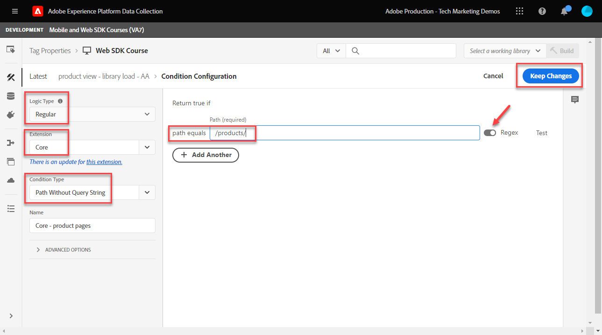
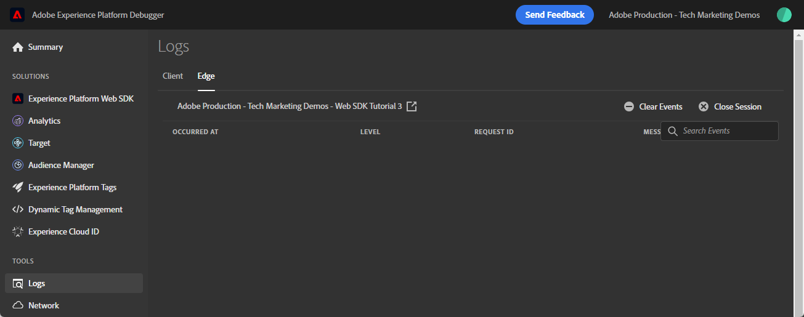

# Configurar o Adobe Analytics com o SDK da Web da plataforma

Saiba como configurar o Adobe Analytics usando [Experience Platform Web SDK](https://experienceleague.adobe.com/docs/platform-learn/data-collection/web-sdk/overview.html), crie regras de tags para enviar dados ao Adobe Analytics e valide se o Analytics está capturando dados conforme esperado.

[Adobe Analytics](https://experienceleague.adobe.com/docs/analytics.html?lang=pt-BR) O é um aplicativo líder do setor que capacita você a entender seus clientes como pessoas e a orientar seus negócios com informações de inteligência de clientes.

## Objetivos de aprendizagem

No final desta lição, você poderá:

* Configure um esquema XDM para Adobe Analytics e entenda a diferença entre variáveis XDM mapeadas automaticamente e mapeadas manualmente para o Analytics
* Configurar um conjunto de dados para ativar o Adobe Analytics
* Mapear elementos de dados de matriz individuais ou inteiros para o objeto XDM
* Capturar exibições de página no Adobe Analytics com o objeto XDM
* Capture dados de comércio eletrônico com o objeto XDM para a string do produto Adobe Analytics
* Validar variáveis do Adobe Analytics são definidas com o objeto XDM usando o Experience Platform Debugger
* Use as regras de processamento do Adobe Analytics para definir variáveis personalizadas
* A validação de dados é capturada pela Adobe Analytics usando os Relatórios em tempo real

## Pré-requisitos

Você está familiarizado com tags, Adobe Analytics e o [Site de demonstração Luma](https://luma.enablementadobe.com/content/luma/us/en.html){target=&quot;_blank&quot;} funcionalidades de logon e compra.

Você precisa de pelo menos uma ID de conjunto de relatórios de teste/desenvolvimento. Se você não tiver um conjunto de relatórios de teste/desenvolvimento que pode ser usado para este tutorial, [crie um](https://experienceleague.adobe.com/docs/analytics/admin/manage-report-suites/new-report-suite/t-create-a-report-suite.html).

Você deve ter concluído todas as etapas das seções anteriores no tutorial:

* Configuração inicial
   * [Configurar permissões](configure-permissions.md)
   * [Configurar um esquema XDM](configure-schemas.md)
   * [Configurar um namespace de identidade](configure-identities.md)
   * [Configurar um conjunto de dados](configure-datastream.md)
* Configuração de tags
   * [Instalar a extensão do SDK da Web](install-web-sdk.md)
   * [Criar elementos de dados](create-data-elements.md)
   * [Criar uma regra de tag](create-tag-rule.md)
   * [Validar com o Adobe Experience Platform Debugger](validate-with-debugger.md)

## Esquemas XDM e variáveis do Analytics

Parabéns! Você já configurou um esquema compatível com o Adobe Analytics na [Configurar um schema](configure-schemas.md) lição!

A implementação do SDK da Web da plataforma deve ser o mais independente possível do produto. Para o Adobe Analytics, o mapeamento de eVars, props e eventos não ocorre durante a criação do esquema, nem durante a configuração das regras de tag, como tem sido feito tradicionalmente. Em vez disso, cada par de valores-chave XDM se torna uma Variável de dados de contexto que mapeia para uma variável do Analytics de uma das duas maneiras:

1. Variáveis mapeadas automaticamente usando campos XDM reservados
1. Variáveis mapeadas manualmente usando as regras de processamento do Analytics

Para entender quais variáveis XDM são mapeadas automaticamente para o Adobe Analytics, consulte [Variáveis mapeadas automaticamente no Analytics](https://experienceleague.adobe.com/docs/experience-platform/edge/data-collection/adobe-analytics/automatically-mapped-vars.html?lang=en). Qualquer variável que não seja mapeada automaticamente deve ser mapeada manualmente.

O schema criado no [Configurar um schema](configure-schemas.md) A lição contém alguns mapeados automaticamente para variáveis do Analytics, conforme descrito nesta tabela:

| Variáveis mapeadas automaticamente do XDM para o Analytics | Variável Adobe Analytics |
|-------|---------|
| `identitymap.ecid.[0].id` | mid |
| `web.webPageDetails.pageViews.value` | uma chamada s.t() de exibição de página |
| `web.webPageDetails.name` | s.pageName |
| `web.webPageDetails.server` | s.server |
| `web.webPageDetails.siteSection` | s.channel |
| `commerce.productViews.value` | prodView |
| `commerce.productListViews.value` | scView |
| `commerce.checkouts.value` | scCheckout |
| `commerce.purchases.value` | Aquisição |
| `commerce.order.currencyCode` | s.currencyCode |
| `commerce.order.purchaseID` | s.purchaseID |
| `productListItems[].SKU` | s.products=;product name;;; (principal - consulte a Nota abaixo) |
| `productListItems[].name` | s.products=;product name;;; (fallback - consulte a Observação abaixo) |
| `productListItems[].quantity` | s.products=;;quantidade do produto;; |
| `productListItems[].priceTotal` | s.product=;;;preço do produto;; |

>[!NOTE]
>
>As seções individuais da cadeia de caracteres do produto Analytics são definidas por diferentes variáveis XDM na variável `productListItems` objeto.
>Em 18 de agosto de 2022, `productListItems[].SKU` tem prioridade para mapear para o nome do produto na variável s.products .
>O valor definido como `productListItems[].name` é mapeado para o nome do produto somente se `productListItems[].SKU` não existe. Caso contrário, ele não será mapeado e estará disponível nos dados de contexto.
>Não defina uma string vazia ou nula como  `productListItems[].SKU`. Isso tem o efeito indesejado de mapear para o nome do produto na variável s.products .


## Configurar o fluxo de dados

O SDK da Web da plataforma envia dados do seu site para a Rede de borda da plataforma. Seu conjunto de dados informa à Rede de borda da plataforma onde encaminhar esses dados, nesse caso, quais dos seus conjuntos de relatórios do Adobe Analytics.

1. Ir para [Coleta de dados](https://experience.adobe.com/#/data-collection)Interface {target=&quot;blank&quot;}
1. Na navegação à esquerda, selecione **[!UICONTROL Datastreams]**
1. Selecione o criado anteriormente `Luma Web SDK` datastream

   

1. Selecionar **[!UICONTROL Adicionar Serviço]**

   
1. Selecionar **[!UICONTROL Adobe Analytics]** como **[!UICONTROL Serviço]**
1. Insira o  **[!UICONTROL ID do conjunto de relatórios]** do conjunto de relatórios de desenvolvimento
1. Selecione **[!UICONTROL Salvar]**

   

   >[!TIP]
   >
   >Adicionar mais report suites selecionando **[!UICONTROL Adicionar conjunto de relatórios]** é equivalente à marcação de vários conjuntos.

>[!WARNING]
>
>Neste tutorial, você só configura o conjunto de relatórios de desenvolvimento do Adobe Analytics. Ao criar conjuntos de dados para seu próprio site, você criaria conjuntos de dados e conjuntos de relatórios adicionais para seus ambientes de preparo e produção.


## Criar elementos de dados adicionais

Em seguida, capture dados adicionais da camada de dados do Luma e envie-os para a Rede de borda da plataforma. Embora a lição se concentre em requisitos comuns do Adobe Analytics, todos os dados capturados podem ser facilmente enviados para outros destinos com base na configuração do conjunto de dados. Por exemplo, se você concluiu a lição do Adobe Experience Platform, os dados adicionais capturados nesta lição também são enviados para a Platform.

### Criar elementos de dados de comércio eletrônico

Durante a lição Criar elementos de dados , você [elementos de dados JavaScript criados](create-data-elements.md#create-data-elements-to-capture-the-data-layer) que capturou o conteúdo e os detalhes de identidade. Agora, você criará elementos de dados adicionais para capturar dados de comércio eletrônico. Porque a variável [Site de demonstração Luma](https://luma.enablementadobe.com/content/luma/us/en.html)O {target=&quot;_blank&quot;} usa diferentes estruturas de camada de dados para páginas e produtos de detalhes do produto no carrinho. Você deve criar elementos de dados para cada cenário. Será necessário criar alguns elementos de dados de código personalizados para capturar o que é necessário na camada de dados do Luma, que pode ou não ser necessária durante a implementação em seu próprio site. Nesse caso, é necessário executar um loop por uma variedade de itens do carrinho de compras para capturar detalhes específicos de cada produto. Use os trechos de código fornecidos abaixo:

1. Abra a propriedade de tag usada para o tutorial
1. Ir para **[!UICONTROL Elementos de dados]**
1. Selecione **[!UICONTROL Adicionar elemento de dados]**
1. Nomeie-o **`product.productInfo.sku`**
1. Use o **[!UICONTROL Código personalizado]** **[!UICONTROL Tipo de elemento de dados]**
1. Deixar caixas de seleção para **[!UICONTROL Forçar valor de minúsculas]** e **[!UICONTROL Texto limpo]** desmarcado
1. Sair `None` como **[!UICONTROL Duração do armazenamento]** configuração , pois esse valor é diferente em cada página
1. Selecione **[!UICONTROL Abrir editor]**

   

1. Copie e cole o seguinte código

   ```javascript
   var cart = digitalData.product;
   var cartItem;
   cart.forEach(function(item){
   cartItem = item.productInfo.sku;
   });
   return cartItem;
   ```

1. Selecionar **[!UICONTROL Salvar]** para salvar o código personalizado

   

1. Selecionar **[!UICONTROL Salvar]** para salvar o elemento de dados

Siga as mesmas etapas para criar esses elementos de dados adicionais:

* **`product.productInfo.title`**

   ```javascript
   var cart = digitalData.product;
   var cartItem;
   cart.forEach(function(item){
   cartItem = item.productInfo.title;
   });
   return cartItem;
   ```

* **`cart.productInfo`**

   ```javascript
   var cart = digitalData.cart.cartEntries;
   var cartItem = [];
   cart.forEach(function(item, index, array){
   var qty = parseInt(item.qty);
   var price = parseInt(item.price);
   cartItem.push({
   "SKU": item.sku,
   "name":item.title,
   "quantity":qty,
   "priceTotal":price
   });
   });
   return cartItem;
   ```

Depois de adicionar esses elementos de dados e ter criado os anteriores na [Criar elementos de dados](create-data-elements.md) lição, você deve ter os seguintes elementos de dados:

| Elementos de dados |
-----------------------------|
| `cart.orderId` |
| `cart.productInfo` |
| `identityMap.loginID` |
| `page.pageInfo.hierarchie1` |
| `page.pageInfo.pageName` |
| `page.pageInfo.server` |
| `product.productInfo.sku` |
| `product.productInfo.title` |
| `user.profile.attributes.loggedIn` |
| `user.profile.attributes.username` |
| `xdm.content` |

>[!IMPORTANT]
>
>Neste tutorial, você criará um objeto XDM diferente para cada evento. Isso significa que você deve remapear variáveis que seriam consideradas &quot;globalmente&quot; disponíveis em cada ocorrência, como nome de página e identityMap. No entanto, você pode [Mesclar objetos](https://experienceleague.adobe.com/docs/experience-platform/tags/extensions/adobe/core/overview.html#merged-objects) ou usar [Mapeamento de tabelas](https://exchange.adobe.com/experiencecloud.details.103136.mapping-table.html) para gerenciar seus objetos XDM com mais eficiência em uma situação real. Para esta lição, as variáveis globais são consideradas como:
>
>* **[!UICONTROL identityMap]** para capturar a ID autenticada de acordo com o [Criar elemento de dados do Mapa de identidade](create-data-elements.md#create-identity-map-data-element) no [Criar elementos de dados](create-data-elements.md) lição.
>* **[!UICONTROL web]** objeto para capturar conteúdo de acordo com o [objeto XDM de conteúdo](create-data-elements.md#map-content-data-elements-to-XDM-Schema-individually) no [Criar elementos de dados](create-data-elements.md) lição sobre cada elemento de dados acima.


### Incrementar visualizações de página

Na lição Criar elementos de dados , você [criado um `xdm.content` elemento de dados](create-data-elements.md#map-content-data-elements-to-xdm-schema-individually) para capturar dimensões de conteúdo. Como você está enviando dados para o Adobe Analytics, também deve mapear um campo XDM extra para indicar que um beacon deve ser processado como uma exibição de página do Analytics.

1. Abra seu `xdm.content` elemento de dados
1. Role para baixo e selecione para abrir até `web.webPageDetails`
1. Selecione para abrir o **[!UICONTROL pageViews]** objeto
1. Definir **[!UICONTROL value]** para `1`
1. Selecione [!UICONTROL **Salvar**]

   

>[!TIP]
>
>Este campo equivale ao envio de um **`s.t()`** beacon de exibição de página para o Analytics usando `AppMeasurement.js`. Para um sinal de clique em link, defina a variável `webInteraction.linkClicks.value` para `1`


### Definir a string do produto

Antes de mapear para a cadeia de caracteres do produto, é importante entender que há dois objetos principais no esquema XDM que são usados para capturar dados de comércio eletrônico que têm relações especiais com o Adobe Analytics:

1. O `commerce` O objeto do define eventos do Analytics como `prodView`, `scView`e `purchase`
1. O `productListItems` O objeto do define dimensões do Analytics como `productID`.

Consulte [Coletar dados de comércio e produtos](https://experienceleague.adobe.com/docs/experience-platform/edge/data-collection/collect-commerce-data.html?lang=en) para obter mais detalhes.

Também é importante entender que você pode **[!UICONTROL fornecer atributos individuais]** para campos XDM individuais ou **[!UICONTROL fornecer um array inteiro]** para um objeto XDM.


### Mapear atributos individuais para um objeto XDM

Você pode mapear para variáveis individuais para capturar dados na página de detalhes do produto do site de demonstração Luma:

1. Crie um **[!UICONTROL Objeto XDM]** **[!UICONTROL Tipo de elemento de dados]** nomeado **`xdm.commerce.prodView`**
1. Selecione a mesma sandbox da Platform e o esquema XDM usados nas lições anteriores
1. Abra o **[!UICONTROL comércio]** objeto
1. Abra o **[!UICONTROL productViews]** objeto e conjunto **[!UICONTROL value]** para `1`

   

   >[!TIP]
   >
   >Esta etapa equivale a definir `prodView` no Analytics


1. Role para baixo até e selecione `productListItems` array
1. Selecionar **[!UICONTROL Fornecer itens individuais]**
1. Selecionar **[!UICONTROL Adicionar item]**

   

   >[!CAUTION]
   >
   >O **`productListItems`** é um `array` para que os dados sejam incluídos como uma coleção de elementos. Devido à estrutura da camada de dados do site de demonstração Luma e por ser possível visualizar apenas um produto por vez no site Luma, você adicionará itens individualmente. Ao implementar o em seu próprio site, dependendo da estrutura da camada de dados, você pode ser capaz de fornecer uma matriz inteira.

1. Selecione para abrir **[!UICONTROL Rubrica 1]**
1. Mapeie as seguintes variáveis XDM para elementos de dados

   * **`productListItems.item1.SKU`** para `%product.productInfo.sku%`
   * **`productListItems.item1.name`** para `%product.productInfo.title%`

   

   >[!IMPORTANT]
   >
   >Antes de salvar este objeto XDM, certifique-se de definir as variáveis &quot;globais&quot; e o incrementador de visualização de página também:
   >

1. Selecione **[!UICONTROL Salvar]**

### Mapear uma matriz inteira para um objeto XDM

Como mencionado anteriormente, o site de demonstração Luma usa uma estrutura de camada de dados diferente para produtos no carrinho. O elemento de dados do código personalizado `cart.productInfo` o elemento de dados criado anteriormente faz o loop pelo `digitalData.cart.cartEntries` objeto de camada de dados e o traduz no esquema de objeto XDM necessário. O novo formato **deve corresponder exatamente** o schema definido pela variável `productListItems` do esquema XDM.

Para ilustrar, consulte a comparação abaixo da camada de dados do site Luma (à esquerda) com o elemento de dados traduzido (à direita):


Comparar o elemento de dados ao `productListItems` estrutura (dica, deve corresponder).

>[!IMPORTANT]
>
>Observe como as variáveis numéricas são traduzidas, com valores de string na camada de dados, como `price` e `qty` reformatada em números no elemento de dados. Esses requisitos de formato são importantes para a integridade dos dados na Platform e são determinados durante o [configurar schemas](configure-schemas.md) etapa. No exemplo, **[!UICONTROL quantidade]** usa a variável **[!UICONTROL Número inteiro]** tipo de dados.
> 

Agora de volta ao mapeamento do objeto XDM para uma matriz inteira. Crie um elemento de dados de objeto XDM para capturar produtos na página do carrinho:

1. Crie um **[!UICONTROL Objeto XDM]** **[!UICONTROL Tipo de elemento de dados]** nomeado **`xdm.commerce.cartView`**
1. Selecione a mesma sandbox da Platform e o mesmo esquema XDM que você está usando neste tutorial
1. Abra o **[!UICONTROL comércio]** objeto
1. Abra o **[!UICONTROL productListViews]** objeto e conjunto `value` para `1`

   >[!TIP]
   >
   >Esta etapa equivale a definir `scView` no Analytics

1. Role para baixo até e selecione **[!UICONTROL productListItems]** array
1. Selecionar **[!UICONTROL Fornecer todo o array]**
1. Mapear para **`cart.productInfo`** elemento de dados

   

   >[!IMPORTANT]
   >
   >Antes de salvar este objeto XDM, certifique-se de definir as variáveis &quot;globais&quot; e o incrementador de visualização de página também:
   >

1. Selecione **[!UICONTROL Salvar]**

Criar outro **[!UICONTROL Objeto XDM]**  **[!UICONTROL Tipo de elemento de dados]** para finalizações chamadas `xdm.commerce.checkout`. Desta vez, defina a variável **[!UICONTROL commerce.checkouts.value]** para `1`, mapa **[!UICONTROL productListItems]** para **`cart.productInfo`** como você acabou de fazer, adicione as variáveis &quot;globais&quot; e o contador de visualização de página.

>[!TIP]
>
>Esta etapa equivale a definir `scCheckout` no Analytics


Há etapas adicionais para capturar a variável `purchase` evento:

1. Criar outro  **[!UICONTROL Objeto XDM]**  **[!UICONTROL Tipo de elemento de dados]** para compras chamadas `xdm.commerce.purchase`
1. Abrir **[!UICONTROL comércio]** objeto
1. Abra o **[!UICONTROL pedido]** objeto
1. Mapa **[!UICONTROL purchaseID]** para `cart.orderId` elemento de dados
1. Definir **[!UICONTROL currencyCode]** para o valor codificado `USD`

   

   >[!TIP]
   >
   >Isso equivale a definir `s.purcahseID` e `s.currencyCode` no Analytics

1. Selecione para abrir o `purchases` objeto e conjunto `value` para `1`
   >[!TIP]
   >
   >Isso equivale a definir `purchase` no Analytics

   >[!IMPORTANT]
   >
   >Antes de salvar este objeto XDM, certifique-se de definir as variáveis &quot;globais&quot; e o incrementador de visualização de página também:
   >

1. Selecione **[!UICONTROL Salvar]**

No final dessas etapas, você deve ter os cinco elementos de dados do objeto XDM a seguir criados:

| Elementos de dados do objeto XDM |
-----------------------------|
| `xdm.commerce.cartView` |
| `xdm.commerce.checkout` |
| `xdm.commerce.prodView` |
| `xdm.commerce.purchase` |
| `xdm.content` |


## Criar regras adicionais para o SDK da Web da plataforma

Com os vários elementos de dados do objeto XDM criados, você está pronto para definir os beacons usando regras. Neste exercício, você cria regras individuais por evento de comércio eletrônico e condições de uso para que as regras sejam acionadas nas páginas certas. Vamos começar com um evento de Exibição de produto.

1. Na navegação à esquerda, selecione **[!UICONTROL Regras]** e depois selecione **[!UICONTROL Adicionar regra]**
1. Nomeie-o  [!UICONTROL `product view - library load - AA`]
1. Em **[!UICONTROL Eventos]**, selecione **[!UICONTROL Biblioteca carregada (início da página)]**
1. Em **[!UICONTROL Condições]**, selecione para **[!UICONTROL Adicionar]**

   

1. Sair **[!UICONTROL Tipo lógico]** as **[!UICONTROL Regular]**
1. Sair **[!UICONTROL Extensões]** as **[!UICONTROL Núcleo]**
1. Selecionar **[!UICONTROL Tipo de condição]** as **[!UICONTROL Caminho sem string de consulta]**
1. À direita, ative a opção **[!UICONTROL Regex]** alternar
1. Em **[!UICONTROL caminho igual]** set `/products/`. Para o site de demonstração Luma, garante que a regra seja acionada somente nas páginas do produto
1. Selecione **[!UICONTROL Manter alterações]**

   

1. Em **[!UICONTROL Ações]** select **[!UICONTROL Adicionar]**
1. Selecionar **[!UICONTROL Adobe Experience Platform Web SDK]** extensão
1. Selecionar **[!UICONTROL Tipo de ação]** as **[!UICONTROL Enviar evento]**
1. O **[!UICONTROL Tipo]** tem uma lista suspensa de valores para escolher. Selecione `[!UICONTROL commerce.productViews]`

   >[!TIP]
   >
   >O valor selecionado aqui não tem efeito sobre como os dados são mapeados para o Analytics, no entanto, é recomendável aplicar cuidadosamente essa variável, pois é usada na interface do construtor de segmentos do Adobe Experience Platform. O valor selecionado está disponível para uso na variável `[!UICONTROL c.a.x.eventtype]` variável de dados de contexto downstream.

1. Em **[!UICONTROL Dados XDM]**, selecione o `[!UICONTROL xdm.commerce.prodView]` Elemento de dados do objeto XDM
1. Selecione **[!UICONTROL Manter alterações]**

   

1. Sua regra deve ser semelhante à abaixo. Selecione **[!UICONTROL Salvar]**

   


Repita o mesmo para todos os outros eventos de comércio eletrônico usando os seguintes parâmetros:

**Nome da regra**: exibição do carrinho - carregamento da biblioteca - AA

* **[!UICONTROL Tipo de evento]**: Biblioteca carregada (início da página)
* **[!UICONTROL Condição]**: /content/luma/us/en/user/cart.html
* **Digite o valor em SDK da Web - Enviar ação**: commerce.productListViews
* **Dados XDM para SDK da Web - Enviar ação:** `%xdm.commerce.cartView%`

**Nome da regra**: check-out - carregamento da biblioteca - AA

* **[!UICONTROL Tipo de evento]**: Biblioteca carregada (início da página)
* **[!UICONTROL Condição]** /content/luma/us/en/user/checkout.html
* **Tipo para SDK da Web - Enviar ação**: commerce.checkouts
* **Dados XDM para SDK da Web - Enviar ação:** `%xdm.commerce.checkout%`

**Nome da regra**: purchase - carregamento de biblioteca - AA

* **[!UICONTROL Tipo de evento]**: Biblioteca carregada (início da página)
* **[!UICONTROL Condição]** /content/luma/us/en/user/checkout/order/thank-you.html
* **Tipo para SDK da Web - Enviar ação**: commerce.purches
* **Dados XDM para SDK da Web - Enviar ação:** `%xdm.commerce.purchase%`

Quando terminar, você verá as seguintes regras criadas.


## Crie seu ambiente de desenvolvimento

Adicione seus novos elementos de dados e regras a `Luma Web SDK Tutorial` biblioteca de tags e recrie o ambiente de desenvolvimento.


## Validar o Adobe Analytics para o SDK da Web da plataforma

No [Debugger](validate-with-debugger.md) lição, você aprendeu a inspecionar o beacon de objeto XDM do lado do cliente com o Platform Debugger e o console do desenvolvedor do navegador, que é semelhante a como depurar um objeto `AppMeasurement.js` Implementação do Analytics. Para validar se o Analytics está capturando dados adequadamente por meio do SDK da Web da plataforma, você deve seguir duas etapas além de:

1. Valide como os dados são processados pelo objeto XDM na Rede de Borda da Plataforma, usando o recurso Rastreamento de Borda do Experience Platform Debugger
1. Valide como os dados são processados pelo Analytics usando Regras de processamento e Relatórios em tempo real.

### Usar o Edge Trace

Saiba como validar se o Adobe Analytics está capturando o ECID, as exibições de página, a sequência de produtos e eventos de comércio eletrônico com o recurso Edge Trace do Experience Platform Debugger.

### Validação da ID de Experience Cloud

1. Vá para o [Site de demonstração Luma](https://luma.enablementadobe.com/content/luma/us/en.html){target=&quot;_blank&quot;} e use o Experience Platform Debugger para [alterne a propriedade da tag no site para sua própria propriedade de desenvolvimento](validate-with-debugger.md#use-the-experience-platform-debugger-to-map-to-your-tags-property)

   >[!WARNING]
   >
   >Antes de continuar, verifique se você está conectado ao site Luma.  Se você não estiver conectado, o site Luma não permitirá que você faça check-out.
   >
   > 1. No Luma, selecione o botão de logon na parte superior direita e use credenciais **u: test@adobe.com p: teste** para autenticar
   >
   > 1. Você será automaticamente redirecionado para a função [Página do produto Didi Sports Watch](https://luma.enablementadobe.com/content/luma/us/en/products/gear/watches/didi-sport-watch.html#24-WG02) no próximo carregamento de página


1. Para ativar o Edge Trace, vá para o Experience Platform Debugger, na navegação à esquerda selecione **[!UICONTROL Logs]**, em seguida, selecione o **[!UICONTROL Edge]** e selecione **[!UICONTROL Connect]**

   

1. Estará vazio por enquanto

   

1. Atualize o [Página do produto Didi Sports Watch](https://luma.enablementadobe.com/content/luma/us/en/products/gear/watches/didi-sport-watch.html#24-WG02) e verifique o Experience Platform Debugger novamente, você deverá ver os dados sendo inseridos. A linha que começa com **[!UICONTROL RSIDs de mapeamento automático do Analytics]** é o beacon do Adobe Analytics
1. Selecione para abrir a `[!UICONTROL mappedQueryParams]` lista suspensa e a segunda lista suspensa para exibir as variáveis do Analytics

   

   >[!TIP]
   >
   >A segunda lista suspensa corresponde à ID de conjunto de relatórios do Analytics para a qual você está enviando dados. Deve corresponder ao seu próprio conjunto de relatórios, não aquele na captura de tela.

1. Role para baixo para encontrar `[!UICONTROL c.a.x.identitymap.ecid.[0].id]`. É uma variável de dados de contexto que captura a ECID
1. Continue rolando para baixo até visualizar o Analytics `[!UICONTROL mid]` variável. Ambas as IDs correspondem à ID de Experience Cloud do dispositivo.

   

   >[!NOTE]
   >
   >Como você está conectado, é necessário validar a ID autenticada `112ca06ed53d3db37e4cea49cc45b71e` para o usuário **test@adobe.com** é capturado também na variável `[!UICONTROL c.a.x.identitymap.lumacrmid.[0].id]`


### Exibições da página de conteúdo

Use o mesmo beacon para validar se as exibições da página de conteúdo são capturadas pelo Analytics.

1. Procure por `[!UICONTROL c.a.x.web.webpagedetails.pageviews.value]=1`. Isso diz que `s.t()` o beacon de exibição de página está sendo enviado para o Analytics
1. Role para baixo para ver o `[!UICONTROL gn]` variável. É a sintaxe dinâmica do Analytics para a variável `[!UICONTROL s.pageName]` variável. Ele captura o nome da página da camada de dados.

   

### Sequência de caracteres do produto e eventos de comércio eletrônico

Como você já está em uma página de produto, este exercício continua a usar o mesmo Edge Trace para validar se os dados do produto são capturados pelo Analytics. A sequência de produtos e os eventos de comércio eletrônico são mapeados automaticamente para as variáveis XDM no Analytics. Contanto que você tenha mapeado para o `productListItem` Variável XDM ao [configuração de um esquema XDM para o Adobe Analytics](setup-analytics.md#configure-an-xdm-schema-for-adobe-analytics), a Platform Edge Network cuida do mapeamento de dados para as variáveis de análise adequadas.

1. Primeiro, valide se a variável `Product String` está definido
1. Procure por `[!UICONTROL c.a.x.productlistitems.][0].[!UICONTROL sku]`. A variável captura o valor do elemento de dados mapeado para a variável `productListItems.item1.sku` anteriormente nesta lição
1. Role para baixo para ver o `[!UICONTROL pl]` variável. É a sintaxe dinâmica da variável da string de produto do Analytics
1. Ambos os valores correspondem ao nome do produto disponível na camada de dados

   

O Edge Trace trata `commerce` eventos ligeiramente diferentes de `productList` dimensões. Você não vê uma variável de dados de contexto mapeada da mesma maneira que vê o nome do produto mapeado para `[!UICONTROL c.a.x.productlistitem.[0].name]` acima. Em vez disso, o Edge Trace mostra o mapeamento automático do evento final no Analytics `event` variável. A Rede de Borda da Plataforma o mapeia adequadamente, desde que você mapeie para o XDM correto `commerce` durante [configuração do schema para Adobe Analytics](setup-analytics.md#configure-an-xdm-schema-for-adobe-analytics); neste caso, o `commerce.productViews.value=1`.

1. De volta à janela do Experience Platform Debugger, role para baixo até o `[!UICONTROL event]` , está definida como `[!UICONTROL prodView]`

   

Valide o restante dos eventos de comércio eletrônico e as cadeias de caracteres do produto são definidas para o Analytics.

1. Adicionar [Didi Sports Watch](https://luma.enablementadobe.com/content/luma/us/en/products/gear/watches/didi-sport-watch.html#24-WG02) ao carrinho
1. Vá para o [Página de carrinho](https://luma.enablementadobe.com/content/luma/us/en/user/cart.html), marque Edge Trace for `[!UICONTROL events: "scView"]` e a string do produto

   

1. Prossiga para o check-out, marque Edge Trace for `[!UICONTROL events: "scCheckout"]` e a string do produto

   

1. Preencha apenas o **Nome** e **Sobrenome** no formulário de entrega e selecione **Continuar**. Na próxima página, selecione **Colocar pedido**
1. Na página de confirmação, marque Edge Trace for

   * Evento de compra definido `[!UICONTROL events: "purchase"]`
   * Variável de código monetário que está sendo definida `[!UICONTROL cc: "USD"]`
   * ID de compra que está sendo definida em `[!UICONTROL pi]`
   * Sequência de caracteres do produto `[!UICONTROL pl]` definição do nome, quantidade e preço do produto

   

## Regras de processamento e relatórios em tempo real

Agora que você validou os beacons do Analytics com o Edge Trace, também pode validar se os dados são processados pelo Analytics usando os Relatórios em tempo real. Antes de verificar os relatórios em tempo real, você deve configurar as Regras de processamento do Analytics `props` conforme necessário.

### Regras de processamento para mapeamentos personalizados do Analytics

Neste exercício, você mapeia uma variável XDM para uma prop para que possa visualizar nos relatórios em tempo real. Siga estas mesmas etapas para qualquer mapeamento personalizado que deve ser feito para qualquer `eVar`, `prop`, `event`ou variável acessível por meio de Regras de processamento.

1. Na interface do usuário do Analytics, acesse [!UICONTROL Administrador] > [!UICONTROL Ferramentas administrativas] > [!UICONTROL Conjuntos de relatórios ]
1. Selecione o conjunto de relatórios dev/test que você está usando para o tutorial > [!UICONTROL Editar configurações] > [!UICONTROL Geral] > [!UICONTROL Regras de processamento]

   

1. Criar uma regra para **[!UICONTROL Substituir valor de]** `[!UICONTROL Product Name (prop1)]` para `a.x.productlistitems.0.name`. Lembre-se de adicionar sua observação sobre o motivo pelo qual você está criando a regra e nomeie o título da regra. Selecione **[!UICONTROL Salvar]**

   

   >[!IMPORTANT]
   >
   >Na primeira vez que você mapeia para uma regra de processamento, a interface do usuário não mostra as variáveis de dados de contexto do objeto XDM. Para corrigir o que seleciona qualquer valor, clique em Salvar e volte para editar. Todas as variáveis XDM agora devem aparecer.

1. Ir para [!UICONTROL Editar configurações] >  [!UICONTROL Tempo real]. Configure todos os três com os seguintes parâmetros mostrados abaixo para que você possa validar exibições de página de conteúdo, exibições de produto e compras

   

1. Repita as etapas de validação e você deve ver que os relatórios em tempo real preenchem os dados de acordo.

   **Page Views**
   

   **Visualizações do produto**
   

   **Compras**
   

1. Na interface do usuário do Workspace, crie uma tabela para exibir o fluxo completo do comércio eletrônico do produto que você comprou

   

Para saber mais sobre como mapear campos XDM para variáveis do Analytics, consulte o vídeo [Mapear variáveis do SDK da Web no Adobe Analytics](https://experienceleague.adobe.com/docs/analytics-learn/tutorials/analysis-use-cases/internal-site-search/map-web-sdk-variables-into-adobe-analytics.html).

Parabéns! Esse é o fim da lição e agora você está pronto para implementar o Adobe Analytics com o SDK da Web da plataforma em seu próprio site.

[Próximo: ](setup-audience-manager.md)

>[!NOTE]
>
>Obrigado por investir seu tempo para aprender sobre o SDK da Web da Adobe Experience Platform. Em caso de dúvidas, desejo compartilhar comentários gerais ou ter sugestões sobre conteúdo futuro, compartilhe-as sobre isso [Posto de discussão da comunidade do Experience League](https://experienceleaguecommunities.adobe.com/t5/adobe-experience-platform-launch/tutorial-discussion-implement-adobe-experience-cloud-with-web/td-p/444996)
