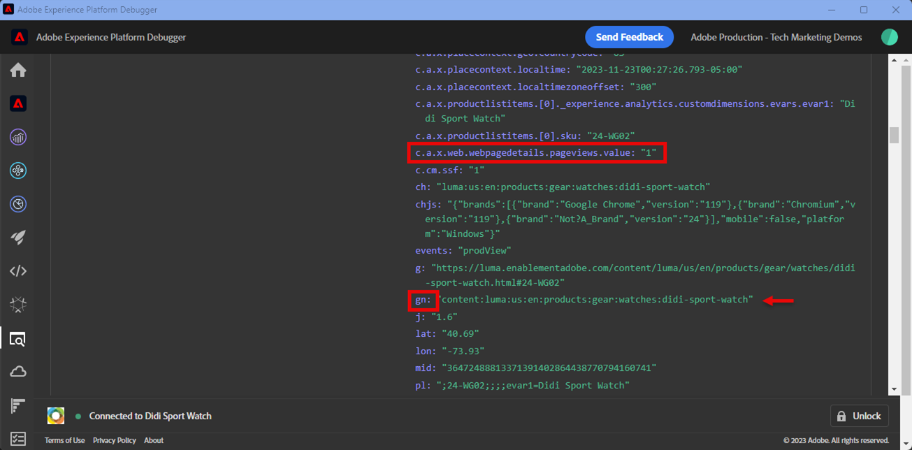

# Configurar o Adobe Analytics com o SDK da Web da Adobe Experience Platform

Saiba como configurar o Adobe Analytics usando o [Adobe Experience Platform Web SDK](https://experienceleague.adobe.com/en/docs/platform-learn/data-collection/web-sdk/overview), crie regras de tag para enviar dados ao Adobe Analytics e valide se o Analytics está capturando dados conforme esperado.

[Adobe Analytics](https://experienceleague.adobe.com/en/docs/analytics?lang=pt-BR) O é um aplicativo líder do setor que faz você ser capaz de entender seus clientes como pessoas e de orientar seus negócios com informações de inteligência de clientes.

## Objetivos de aprendizagem

No final desta lição, você poderá:

* Configurar um fluxo de dados para ativar o Adobe Analytics
* Saber quais campos XDM padrão são mapeados automaticamente para variáveis do Analytics
* Definir variáveis personalizadas do Analytics usando o grupo de campos Modelo de evento de experiência do Adobe Analytics ou regras de processamento
* Enviar dados para outro conjunto de relatórios substituindo o fluxo de dados
* Validar variáveis do Adobe Analytics usando o Debugger e o Assurance

## Pré-requisitos

Para concluir esta lição, primeiro você deve:

* Estar familiarizado com o Adobe Analytics e ter acesso a ele.

* Ter pelo menos uma ID de conjunto de relatórios de teste/desenvolvimento. Se você não tiver um conjunto de relatórios de teste/desenvolvimento que pode ser usado para este tutorial, [crie um](https://experienceleague.adobe.com/en/docs/analytics/admin/admin-tools/manage-report-suites/c-new-report-suite/t-create-a-report-suite).

* Conclua as lições anteriores nas seções Configuração inicial e Configuração de tags deste tutorial.

## Configurar o fluxo de dados

O SDK da Web da Platform envia dados do seu site para o Platform Edge Network. Seu fluxo de dados informa ao Platform Edge Network para quais conjuntos de relatórios do Adobe Analytics seus dados devem ser enviados.

1. Ir para [Coleta de dados](https://experience.adobe.com/#/data-collection){target="blank"} interface
1. Na navegação à esquerda, selecione **[!UICONTROL Datastreams]**
1. Selecione o criado anteriormente `Luma Web SDK: Development Environment` sequência de dados

   

1. Selecionar **[!UICONTROL Adicionar serviço]**
   
1. Selecionar **[!UICONTROL Adobe Analytics]** como o **[!UICONTROL Serviço]**
1. Insira o **[!UICONTROL ID do conjunto de relatórios]** do seu conjunto de relatórios de desenvolvimento
1. Selecionar **[!UICONTROL Salvar]**

   

   >[!TIP]
   >
   >Adicionar mais conjuntos de relatórios selecionando **[!UICONTROL Adicionar conjunto de relatórios]** é equivalente à marcação de vários conjuntos.

>[!WARNING]
>
>Neste tutorial, você só configura o conjunto de relatórios do Adobe Analytics para o seu ambiente de desenvolvimento. Ao criar fluxos de dados para seu próprio site, você deve criar fluxos de dados adicionais e conjuntos de relatórios para seus ambientes de preparo e produção.

## Esquemas XDM e variáveis do Analytics

Parabéns! Você já configurou um esquema compatível com o Adobe Analytics no [Configurar um esquema](configure-schemas.md) lição!

Mas você deve estar se perguntando, como defino todas as minhas propriedades, evars e eventos?

Há várias abordagens, que podem ser usadas simultaneamente:

1. Defina campos XDM padrão e alguns serão mapeados automaticamente para variáveis do Analytics.
1. Mapeie campos XDM adicionais para variáveis do Analytics nas regras de processamento do Analytics.
1. Mapeie para variáveis do Analytics diretamente no esquema XDM.

<!-- Implementing Platform Web SDK should be as product-agnostic as possible. For Adobe Analytics, mapping eVars, props, and events doesn't occur during schema creation, nor during the tag rules configuration as it has been done traditionally. Instead, every XDM key-value pair becomes a Context Data Variable that maps to an Analytics variable in one of two ways: 

1. Automatically mapped variables using reserved XDM fields
1. Manually mapped variables using Analytics Processing Rules

To understand what XDM variables are auto-mapped to Adobe Analytics, please see [Variables automatically mapped in Analytics](https://experienceleague.adobe.com/en/docs/experience-platform/edge/data-collection/adobe-analytics/automatically-mapped-vars). Any variable that is not auto-mapped must be manually mapped. 

 1. **Product-agnostic XDM**: maintain a semantic key-value pair XDM schema and use [Adobe Analytics Processing Rules](https://experienceleague.adobe.com/en/docs/analytics/admin/admin-tools/manage-report-suites/edit-report-suite/report-suite-general/c-processing-rules/processing-rules) to map the XDM fields to eVars, props, and so on. By a semantic XDM schema, we mean that the field names themselves have meaning. For example, the field name `web.webPageDetails.pageName` has more meaning than say `prop1` or `evar3`.

 1. **Analytics-specific XDM**: Use a purpose-built Adobe Analytics field group in the XDM schema called `Adobe Analytics ExperienceEvent Template`
 
The approach Adobe has seen customers prefer is the **Analytics-specific XDM**, because it skips the mapping step in the Adobe Analytics Processing Rules interface. The steps in this lesson use the **Analytics-specific XDM** approach.
-->

### Campos mapeados automaticamente

Muitos campos XDM são mapeados automaticamente para variáveis do Analytics.

O esquema criado na variável [Configurar um esquema](configure-schemas.md) A lição contém algumas variáveis mapeadas automaticamente para o Analytics, conforme descrito nesta tabela:

| Variáveis mapeadas automaticamente do XDM para o Analytics | variável do Adobe Analytics |
|-------|---------|
| `identitymap.ecid.[0].id` | mid |
| `web.webPageDetails.name` | s.pageName |
| `web.webPageDetails.server` | s.server |
| `web.webPageDetails.siteSection` | s.channel |
| `commerce.productViews.value` | prodView |
| `commerce.productListViews.value` | scView |
| `commerce.checkouts.value` | scCheckout |
| `commerce.purchases.value` | Aquisição |
| `commerce.order.currencyCode` | s.currencyCode |
| `commerce.order.purchaseID` | s.purchaseID |
| `productListItems[].SKU` | s.products=;nome do produto;;; (principal - consulte a Observação abaixo) |
| `productListItems[].name` | s.products=;nome do produto;;;; (fallback - consulte a Observação abaixo) |
| `productListItems[].quantity` | s.products=;;quantidade do produto;;; |
| `productListItems[].priceTotal` | s.product=;;;preço do produto;; |

As seções individuais da cadeia de caracteres do produto Analytics são definidas por meio de diferentes variáveis XDM na `productListItems` objeto.
>Em 18 de agosto de 2022, `productListItems[].SKU` tem prioridade para mapear para o nome do produto na variável s.products.
>O valor definido como `productListItems[].name` é mapeado para o nome do produto somente se `productListItems[].SKU` não existe. Caso contrário, ele não será mapeado e estará disponível nos dados de contexto.
>Não defina uma cadeia de caracteres vazia ou nula como `productListItems[].SKU`. Isso tem o efeito indesejado de mapear para o nome do produto na variável s.products.

Para obter a lista mais atualizada de mapeamentos, consulte [Mapeamento de variável do Analytics no Adobe Experience Edge](https://experienceleague.adobe.com/en/docs/experience-platform/edge/data-collection/adobe-analytics/automatically-mapped-vars).

### Mapear para variáveis do Analytics com regras de processamento

Todos os campos no esquema XDM se tornam disponíveis para o Adobe Analytics como Variáveis de dados de contexto com o seguinte prefixo `a.x.`. Por exemplo, `a.x.web.webinteraction.region`

Neste exercício, você mapeia uma variável XDM para uma prop. Siga estas mesmas etapas para qualquer mapeamento personalizado que você deve fazer para qualquer `eVar`, `prop`, `event`ou variável acessível por meio das Regras de processamento.

1. Ir para a interface do Analytics
1. Ir para [!UICONTROL Admin] > [!UICONTROL Ferramentas administrativas] > [!UICONTROL Conjuntos de relatórios]
1. Selecione o conjunto de relatórios de desenvolvimento/teste que você está usando no tutorial > [!UICONTROL Editar configurações] > [!UICONTROL Geral] > [!UICONTROL Regras de processamento]

   

1. Criar uma regra para **[!UICONTROL Substituir valor de]** `[!UICONTROL Product SKU (prop1)]` para `a.x.productlistitems.0.sku`. Lembre-se de adicionar uma observação sobre por que você está criando a regra e nomear seu título de regra. Selecionar **[!UICONTROL Salvar]**

   

   >[!IMPORTANT]
   >
   >Na primeira vez que você mapeia para uma regra de processamento, a interface do usuário não mostra as variáveis de dados de contexto do objeto XDM. Para corrigir isso, selecione qualquer valor, Salve e volte para editar. Todas as variáveis XDM agora devem aparecer.

### Mapear para variáveis do Analytics usando o grupo de campos do Adobe Analytics

Uma alternativa às regras de processamento é mapear para variáveis do Analytics no esquema XDM usando o `Adobe Analytics ExperienceEvent Template` grupo de campos. Essa abordagem ganhou popularidade porque muitos usuários a acham mais simples do que configurar as regras de processamento. No entanto, ao aumentar o tamanho da carga XDM, ele poderia aumentar o tamanho do perfil em outros aplicativos, como o Real-Time CDP.

Para adicionar o `Adobe Analytics ExperienceEvent Template` grupo de campos do esquema:

1. Abra o [Coleta de dados](https://experience.adobe.com/#/data-collection){target="blank"} interface
1. Selecionar **[!UICONTROL Esquemas]** na navegação à esquerda
1. Verifique se você está na sandbox que está usando no tutorial
1. Abra o `Luma Web Event Data` schema
1. No **[!UICONTROL Grupos de campos]** , selecione **[!UICONTROL Adicionar]**
1. Localize o `Adobe Analytics ExperienceEvent Template` grupo de campos e adicione-o ao esquema

Agora, defina um eVar de merchandising na string do produto. Com o `Adobe Analytics ExperienceEvent Template` , é possível mapear variáveis para eVars de merchandising ou eventos na string do produto. Isso também é conhecido como configuração **Merchandising da sintaxe do produto**.

1. Voltar para a propriedade da tag

1. Abra a regra `ecommerce - library loaded - set product details variables - 20`

1. Abra o **[!UICONTROL Definir variável]** ação

1. Selecione para abrir `_experience > analytics > customDimensions > eVars > eVar1`

1. Defina o **[!UICONTROL Valor]** para `%product.productInfo.title%`

1. Selecionar **[!UICONTROL Manter alterações]**

   

1. Selecionar **[!UICONTROL Salvar]** para salvar a regra

Como você acabou de ver, basicamente todas as variáveis do Analytics podem ser definidas no `Adobe Analytics ExperienceEvent Template` grupo de campos.

>[!NOTE]
>
> Observe a `_experience` objeto em `productListItems` > `Item 1`. Definir qualquer variável neste [!UICONTROL objeto] define eVars ou Eventos de sintaxe do produto.

## Enviar dados para um conjunto de relatórios diferente

Talvez você queira alterar para quais dados do conjunto de relatórios do Adobe Analytics são enviados quando os visitantes estão em determinadas páginas. Isso requer uma configuração na sequência de dados e uma regra.

### Configurar a sequência de dados para uma substituição do conjunto de relatórios

Para definir a configuração de substituição do conjunto de relatórios do Adobe Analytics na sequência de dados:

1. Abra a sequência de dados
1. Edite o **[!UICONTROL Adobe Analytics]** configuração, abrindo o  e selecionando **[!UICONTROL Editar]**

   

1. Selecione o **[!UICONTROL Opções avançadas]** para abrir **[!UICONTROL Substituições do conjunto de relatórios]**

1. Selecione os conjuntos de relatórios que você deseja substituir. Nesse caso, `Web SDK Course Dev` e `Web SDK Course Stg`

1. Selecionar **[!UICONTROL Salvar]**

   

### Configurar uma regra para substituição do conjunto de relatórios

Vamos criar uma regra para enviar uma chamada de exibição de página adicional para um conjunto de relatórios diferente. Use o recurso de substituição de fluxo de dados para alterar o conjunto de relatórios de uma página usando o **[!UICONTROL Enviar evento]** Ação.

1. Crie uma nova regra, nomeie-a `homepage - library loaded - AA report suite override - 51`

1. Selecione o sinal de mais em **[!UICONTROL Evento]** para adicionar um novo acionador

1. Em **[!UICONTROL Extensão]**, selecione **[!UICONTROL Núcleo]**

1. Em **[!UICONTROL Tipo de evento]**, selecione **[!UICONTROL biblioteca carregada]**

1. Selecione para abrir **[!UICONTROL Opções avançadas]**, digite `51`. Isso garante que a regra seja executada após a `all pages - library loaded - send event - 50` que define o XDM da linha de base com o **[!UICONTROL Atualizar variável]** tipo de ação.

   

1. Em **[!UICONTROL Condições]**, selecione para **[!UICONTROL Adicionar]**

1. Sair **[!UICONTROL Tipo de lógica]** as **[!UICONTROL Regular]**

1. Sair **[!UICONTROL Extensões]** as **[!UICONTROL Núcleo]**

1. Selecionar **[!UICONTROL Tipo de condição]** as **[!UICONTROL Caminho sem cadeia de caracteres de consulta]**

1. À direita, deixe a janela **[!UICONTROL Regex]** alternância desativada

1. Em **[!UICONTROL caminho igual a]** set `/content/luma/us/en.html`. Para o site de demonstração Luma, ele garante que a regra seja acionada somente na página inicial

1. Selecionar **[!UICONTROL Manter alterações]**

   

1. Em **[!UICONTROL Ações]** selecionar **[!UICONTROL Adicionar]**

1. Como a variável **[!UICONTROL Extensão]**, selecione **[!UICONTROL Adobe Experience Platform Web SDK]**

1. Como a variável **[!UICONTROL Tipo de ação]**, selecione **[!UICONTROL Enviar evento]**

1. Como a variável **[!UICONTROL Tipo]**, selecione `web.webpagedetails.pageViews`

1. Como a variável **[!UICONTROL Dados XDM]**, selecione o `xdm.variable.content` elemento de dados criado na [Criar elementos de dados](create-data-elements.md) lição

   

1. Role para baixo até **[!UICONTROL Substituições das configurações de fluxo de dados]** seção

1. Deixe a **[!UICONTROL Desenvolvimento]** selecionada.

   >[!TIP]
   >
   >    Essa guia determina em qual ambiente de tags ocorre a substituição. Para esse exercício, você só especifica o ambiente de desenvolvimento, mas quando implantá-lo na produção, lembre-se de também fazer isso no **[!UICONTROL Produção]** ambiente.

1. Selecione o **[!UICONTROL Sequência de dados]**, neste caso `Luma Web SDK: Development Environment`

1. Em **[!UICONTROL Conjuntos de relatórios]**, selecione o site de relatório para o qual deseja usar a substituição. Nesse caso, `tmd-websdk-course-stg`.

1. Selecionar **[!UICONTROL Manter alterações]**

1. E **[!UICONTROL Salvar]** sua regra

   

## Criar seu ambiente de desenvolvimento

Adicione os novos elementos de dados e regras à `Luma Web SDK Tutorial` e recriar seu ambiente de desenvolvimento.

Parabéns! A próxima etapa é validar a implementação do Adobe Analytics por meio do SDK da Web do Experience Platform.

## Validar o Adobe Analytics com o Debugger

Saiba como validar se o Adobe Analytics está capturando a ECID, as exibições de página, a sequência de caracteres do produto e os eventos de comércio eletrônico com o recurso Edge Trace do Experience Platform Debugger.

No [Depurador](validate-with-debugger.md) lição, você aprendeu a inspecionar a solicitação XDM do lado do cliente com o Platform Debugger e o console do desenvolvedor do navegador, que é semelhante à depuração de um `AppMeasurement.js` Implementação do Analytics. Você também aprendeu a validar solicitações do lado do servidor do Platform Edge Network enviadas para aplicativos Adobe e a visualizar uma carga útil totalmente processada usando o Assurance.

Para validar se o Analytics está capturando dados corretamente por meio do SDK da Web do Experience Platform, você deve seguir duas etapas adicionais para:

1. Validar como os dados são processados pelo objeto XDM no Edge Network da plataforma usando o recurso Edge Trace do depurador de Experience Platform
1. Validar como os dados são totalmente processados pelo Analytics usando o Adobe Experience Platform Assurance

### Validação da ID do Experience Cloud

1. Vá para a [Site de demonstração Luma](https://luma.enablementadobe.com/content/luma/us/en.html){target="_blank"}
1. Selecione o botão de logon na parte superior direita e use credenciais u: test@adobe.com p: test to authenticate
1. Abra o Depurador de Experience Platform e [alterne a propriedade da tag no site para sua própria propriedade de desenvolvimento](validate-with-debugger.md#use-the-experience-platform-debugger-to-map-to-your-tags-property)

1. Para ativar o Edge Trace, vá para o Experience Platform Debugger, na navegação à esquerda, selecione **[!UICONTROL Logs]**, em seguida, selecione a **[!UICONTROL Edge]** e selecione **[!UICONTROL Conectar]**

   

1. Ficará vazio por enquanto

   

1. Atualize a página do Luma e verifique o Experience Platform Debugger novamente. Você deve ver os dados aparecerem. A linha que começa com **[!UICONTROL Mapeamento automático do Analytics]** é o sinal do Adobe Analytics
1. Selecione para abrir as opções `[!UICONTROL mappedQueryParams]` e a segunda lista suspensa para exibir as variáveis do Analytics

   

   >[!TIP]
   >
   >A segunda lista suspensa corresponde à ID do conjunto de relatórios do Analytics para a qual você está enviando dados. Ele deve corresponder ao seu próprio conjunto de relatórios, não ao da captura de tela.

1. Role para baixo para encontrar `[!UICONTROL c.a.x.identitymap.ecid.[0].id]`. É uma variável de dados de contexto que captura a ECID
1. Continue rolando para baixo até visualizar o Analytics `[!UICONTROL mid]` variável. Ambas as IDs correspondem à ID de Experience Cloud do dispositivo.
1. No site Luma,

   

   >[!NOTE]
   >
   >Depois de fazer logon, valide a ID autenticada `112ca06ed53d3db37e4cea49cc45b71e` para o usuário **`test@adobe.com`** também é capturado na variável `[!UICONTROL c.a.x.identitymap.lumacrmid.[0].id]`

### Validação de substituição do conjunto de relatórios

Acima, você configurou uma substituição de sequência de dados para o [Página inicial do Luma](https://luma.enablementadobe.com/content/luma/us/en.html).  Para validar essa configuração

1. Procurar uma linha com **[!UICONTROL Configuração da sequência de dados após a aplicação da substituição]**. Aqui você encontra o conjunto de relatórios principal e os conjuntos de relatórios adicionais que foram configurados para substituições do conjunto de relatórios.

   

1. Role para baixo até a linha que começa com **[!UICONTROL Mapeamento automático do Analytics]**  e verificar se o `[!UICONTROL reportSuiteIds]` mostra o conjunto de relatórios especificado nas configurações de substituição

   

### Validação de exibições de página de conteúdo

Vá para uma página de produto como a [Página do produto Didi Sport Watch](https://luma.enablementadobe.com/content/luma/us/en/products/gear/watches/didi-sport-watch.html#24-WG02).  Validar se as exibições de página de conteúdo são capturadas pelo Analytics.

1. Procure `[!UICONTROL c.a.x.web.webpagedetails.pageviews.value]=1`.
1. Role para baixo para ver a `[!UICONTROL gn]` variável. É a sintaxe dinâmica do Analytics para a variável `[!UICONTROL s.pageName]` variável. Ele captura o nome da página da camada de dados.

   

### Validação de cadeia de caracteres do produto e eventos de comércio eletrônico

Como você já está em uma página de produto, este exercício continua a usar o mesmo Edge Trace para validar se os dados do produto foram capturados pelo Analytics. A sequência de caracteres do produto e os eventos de comércio eletrônico são variáveis XDM mapeadas automaticamente para o Analytics. Contanto que você tenha mapeado para o `productListItem` Variável XDM enquanto [configuração de um esquema XDM para o Adobe Analytics](setup-analytics.md#configure-an-xdm-schema-for-adobe-analytics), o Edge Network da Platform cuida do mapeamento dos dados para as variáveis de análise adequadas.

**Primeiro, valide se a variável `Product String` está definido**

1. Procure `[!UICONTROL c.a.x.productlistitems.][0].[!UICONTROL sku]`. A variável captura o valor do elemento de dados que você mapeou para o `productListItems.item1.sku` anteriormente nesta lição
1. Procure também `[!UICONTROL c.a.x.productlistitems.][0].[!UICONTROL _experience.analytics.customdimensions.evars.evar1]`. A variável captura o valor do elemento de dados para o qual você mapeou `productListItems.item1._experience.analytics.customdimensions.evars.evar1`
1. Role para baixo para ver a `[!UICONTROL pl]` variável. É a sintaxe dinâmica da variável da cadeia de caracteres do produto Analytics
1. Observe que o nome do produto da camada de dados é mapeado para a variável `[!UICONTROL c.a.x.productlistitems.][0].[!UICONTROL sku]` e a variável `[!UICONTROL product]` parâmetro da cadeia de caracteres products.  Além disso, o título do produto da camada de dados é mapeado para a evar1 de merchandising na string de produtos.

   

   O Edge Trace trata `commerce` eventos ligeiramente diferentes de `productList` dimensões. Você não vê uma variável de dados de contexto mapeada da mesma forma que vê o nome do produto mapeado para `[!UICONTROL c.a.x.productlistitem.[0].name]` acima. Em vez disso, o Edge Trace mostra o mapeamento automático do evento final no Analytics `event` variável. O Platform Edge Network o mapeia adequadamente, desde que você o mapeie para o XDM correto `commerce` enquanto [configuração do esquema para o Adobe Analytics](setup-analytics.md#configure-an-xdm-schema-for-adobe-analytics); neste caso, o `commerce.productViews.value=1`.

1. De volta à janela Experience Platform Debugger, role para baixo até a `[!UICONTROL events]` , está definida como `[!UICONTROL prodView]`

1. Observe também `[!UICONTROL c.a.x.eventType]` está definida como `commerce.productViews` já que você está em uma página de produto.

   >[!TIP]
   >
   > A variável `ecommerce - pdp library loaded - AA (order 20)` a regra está substituindo o valor de `eventType` definido pelo `all pages global content variables - library loaded - AA (order 1)` como está definido para ser acionado posteriormente na sequência

   

**Validar se o restante dos eventos de comércio eletrônico e cadeias de caracteres de produtos estão definidos para o Analytics**

1. Adicionar [Didi Sport Watch](https://luma.enablementadobe.com/content/luma/us/en/products/gear/watches/didi-sport-watch.html#24-WG02) ao carrinho
1. Vá para a [Página de carrinho](https://luma.enablementadobe.com/content/luma/us/en/user/cart.html), verifique o Edge Trace para

   * `eventType` definir como `commerce.productListViews`
   * `[!UICONTROL events: "scView"]`, e
   * a cadeia de caracteres do produto está definida

   

1. Prossiga para o check-out, verifique o Edge Trace para

   * `eventType` definir como `commerce.checkouts`
   * `[!UICONTROL events: "scCheckout"]`, e
   * a cadeia de caracteres do produto está definida

   

1. Preencha apenas o **Nome** e **Sobrenome** no formulário de entrega e selecione **Continuar**. Na próxima página, selecione **Fazer pedido**
1. Na página de confirmação, verifique o Edge Trace para

   * `eventType` definir como `commerce.purchases`
   * Evento de compra sendo definido `[!UICONTROL events: "purchase"]`
   * Variável de código de moeda sendo definida `[!UICONTROL cc: "USD"]`
   * ID de compra sendo definida em `[!UICONTROL pi]`
   * Sequência de caracteres do produto `[!UICONTROL pl]` definição do nome do produto, quantidade e preço

   

## Validar o Adobe Analytics usando o Assurance

O Adobe Experience Platform Assurance ajuda a inspecionar, testar, simular e validar a maneira como você coleta dados ou fornece experiências com seu site e aplicativo móvel.

No exercício anterior, você validou que o Adobe Analytics está capturando a ECID, as exibições de página, a sequência de produtos e os eventos de comércio eletrônico com o recurso Edge Trace do Experience Platform Debugger.  Em seguida, você valida esses mesmos eventos usando o Adobe Experience Platform Assurance, uma interface alternativa para acessar os mesmos dados no Edge Trace.

Como você aprendeu na [Assurance](validate-with-assurance.md) lição, há várias maneiras de iniciar uma sessão do Assurance. Como você já tem o Adobe Experience Platform Debugger aberto com uma sessão de Rastreamento de borda iniciada a partir do último exercício, recomendamos acessar o Assurance por meio do Debugger:

No prazo de **[!UICONTROL &quot;Tutorial 3 do SDK da Web&quot;]** Centro de Sessão do Assurance **[!UICONTROL &quot;hitdebugger&quot;]** na Barra de pesquisa de eventos para filtrar os resultados para os dados Adobe Analytics Post Processed.

### Validação da ID do Experience Cloud

Para validar se o Adobe Analytics está capturando a ECID, selecione um beacon e abra a Carga.  O Fornecedor deste beacon deve ser **[!UICONTROL com.adobe.analytics.hitdebugger]**

Em seguida, role até **[!UICONTROL mcvisId]** para validar se a ECID foi capturada corretamente

### Validação de exibições de página de conteúdo

Usando o mesmo sinal, valide se as exibições de página de conteúdo estão mapeadas para a variável correta do Adobe Analytics.
Role para baixo até **[!UICONTROL pageName]** para validar que o `Page Name` foi capturado corretamente

### Validação de cadeia de caracteres do produto e eventos de comércio eletrônico

Após os mesmos casos de uso de validação usados ao validar com o Experience Platform Debugger acima, continue usando o mesmo sinal para validar o `Ecommerce Events` e a variável `Product String`.

1. Procure carga onde a variável **[!UICONTROL events]** contain `prodView`
   
1. Role para baixo até **[!UICONTROL sequência de caracteres do produto]** para validar o `Product String`.
   * Observe que `Product SKU` e `Merchandizing eVar1`.
1. Role para baixo e valide se `prop1`, que você configurou usando as regras de processamento na seção anterior, contém a variável `Product SKU`\
   

Continue a validar sua implementação revisando o carrinho, o checkout e os eventos de compra.

1. Procure carga onde a variável **[!UICONTROL events]** contain `scView` e validar a cadeia de caracteres do produto.
   
1. Procure carga onde a variável **[!UICONTROL events]** contain `scCheckout` e validar a cadeia de caracteres do produto.
   
1. Procure carga onde a variável **[!UICONTROL events]** contain `purchase`
   
1. Ao validar a variável `purchase` evento, observe que a variável `Product String` deve conter as `Product SKU`, `Product Quantity` , e `Product Total Price`.
1. Além disso, para a `purchase` validar que o `purchase-id` e/ou `purchaseId` estão definidas

Parabéns! Você conseguiu! Este é o fim da lição e agora você está pronto para implementar o Adobe Analytics com o SDK da Web da plataforma em seu próprio site.

[Próximo: ](setup-audience-manager.md)

>[!NOTE]
>
>Obrigado por investir seu tempo aprendendo sobre o Adobe Experience Platform Web SDK. Se você tiver dúvidas, quiser compartilhar feedback geral ou tiver sugestões sobre conteúdo futuro, compartilhe-as nesta [Publicação de discussão da comunidade do Experience League](https://experienceleaguecommunities.adobe.com/t5/adobe-experience-platform-data/tutorial-discussion-implement-adobe-experience-cloud-with-web/td-p/444996)
