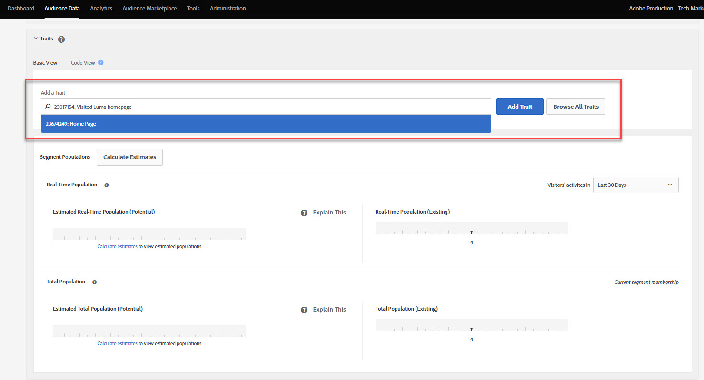
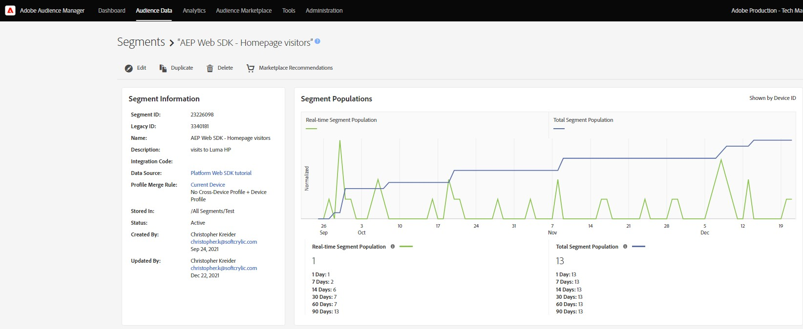
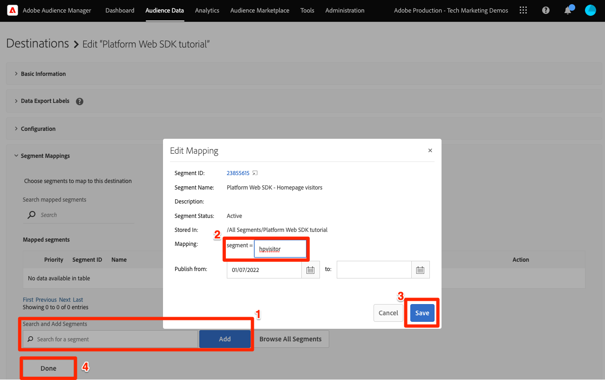

# Configurar o Audience Manager com o Platform Web SDK

Saiba como configurar o Adobe Audience Manager usando o SDK da web da Adobe Experience Platform e validar a implementação usando um destino de cookie.

O [Adobe Audience Manager](https://experienceleague.adobe.com/pt-br/docs/audience-manager) é a solução da Adobe Experience Cloud que fornece tudo o que é necessário para coletar informações comercialmente relevantes sobre os visitantes do site, criar segmentos comercializáveis e veicular publicidade e conteúdo direcionados ao público certo.

## Objetivos de aprendizagem

No final desta lição, você poderá:

* Configurar um fluxo de dados para ativar o Audience Manager
* Ativar um destino de cookie no Audience Manager
* Valide a implementação do Audience Manager confirmando a qualificação do público-alvo com o Adobe Experience Platform Debugger

## Pré-requisitos

Para concluir esta lição, primeiro você deve:

* Conclua as lições anteriores nas seções Configuração inicial e Configuração de tags deste tutorial.
* Ter acesso ao Adobe Audience Manager e às permissões apropriadas para criar, ler e gravar características, segmentos e destinos. Para obter mais informações, reveja o [Controle de Acesso Baseado em Função do Audience Manager](https://experienceleague.adobe.com/pt-br/docs/audience-manager-learn/tutorials/setup-and-admin/user-management/setting-permissions-with-role-based-access-control).

## Configurar o fluxo de dados

A implementação do Audience Manager usando o Platform Web SDK difere da implementação usando o [encaminhamento pelo lado do servidor (SSF)](https://experienceleague.adobe.com/pt-br/docs/analytics/admin/admin-tools/manage-report-suites/edit-report-suite/report-suite-general/server-side-forwarding/ssf). O encaminhamento pelo lado do servidor passa dados de solicitação do Adobe Analytics para o Audience Manager. Uma implementação do Platform Web SDK passa dados XDM enviados para o Platform Edge Network para o Audience Manager. O Audience Manager está habilitado na sequência de dados:

1. Ir para a interface [Coleção de Dados](https://experience.adobe.com/#/data-collection){target="blank"}
1. Na navegação à esquerda, selecione **[!UICONTROL Datastreams]**
1. Selecionar a sequência de dados `Luma Web SDK: Development Environment` criada anteriormente

   

1. Selecione **[!UICONTROL Adicionar Serviço]**
   
1. Selecione **[!UICONTROL Adobe Audience Manager]** como o **[!UICONTROL Serviço]**
1. Confirme se os **[!UICONTROL Destinos de cookies habilitados]** e os **[!UICONTROL Destinos de URL habilitados]** estão selecionados
1. Selecione **[!UICONTROL Salvar]**
   

## Criar uma fonte de dados

Em seguida, crie um [Data Source](https://experienceleague.adobe.com/pt-br/docs/audience-manager/user-guide/features/data-sources/datasources-list-and-settings), uma ferramenta fundamental para organizar os dados no Audience Manager:

1. Ir para a interface [Audience Manager](https://experience.adobe.com/#/audience-manager/)
1. Selecione **[!UICONTROL Dados do público-alvo]** na navegação superior
1. Selecione as **[!UICONTROL Fontes de dados]** no menu suspenso
1. Selecione o botão **[!UICONTROL Adicionar novo]** na parte superior da página de Fontes de dados

   

1. Dê um nome e uma descrição amigáveis à Source de dados. Para a configuração inicial, você pode nomear este `Platform Web SDK tutorial`.
1. Definir **[!UICONTROL Tipo de ID]** como **[!UICONTROL Cookie]**
1. Na seção **[!UICONTROL Controles da Exportação de Dados]**, selecione **[!UICONTROL Sem Restrição]**

   

1. **[!UICONTROL Salvar]** o Data Source

## Criar uma característica

Depois que a Source de dados for salva, configure uma [característica](https://experienceleague.adobe.com/pt-br/docs/audience-manager/user-guide/features/traits/traits-overview). As características são uma combinação de um ou mais sinais no Audience Manager. Crie uma característica para visitantes de página inicial.

>[!NOTE]
>
>Todos os dados XDM são enviados para a Audience Manager se estiverem habilitados na sequência de dados. No entanto, os dados podem levar 24 horas até estarem disponíveis no relatório Sinais não usados. Crie características explícitas para os dados XDM que você deseja usar imediatamente no Audience Manager, conforme descrito neste exercício.

1. Selecione **[!UICONTROL Dados de Público]** > **[!UICONTROL Características]**
1. Selecione **[!UICONTROL Adicionar novo]** > **[!UICONTROL Baseado em regras]** característica

   

1. Dê um nome e uma descrição amigáveis para sua característica, `Luma homepage view`
1. Selecione o **[!UICONTROL Data Source]** criado na seção anterior.
1. **[!UICONTROL Selecione uma Pasta]** na qual salvar sua característica no painel à direita. Talvez você queira criar uma pasta **selecionando o ícone +** ao lado de uma pasta pai existente. Você pode nomear esta nova pasta `Platform Web SDK tutorial`.
1. Expanda o sinal de interpolação **[!UICONTROL Expressão de característica]** e selecione **[!UICONTROL Construtor de expressão]**. Você deve fornecer um par de valores chave que signifique uma visita à página inicial.
1. Abra a [página inicial do Luma](https://newluma.enablementadobe.com) (mapeada para a propriedade da sua marca) e o **Adobe Experience Platform Debugger** e atualize a página.
1. Examine as Solicitações de rede e os detalhes do evento do Platform Web SDK para encontrar a chave e o valor de nome para a página inicial.
   
1. Retorne ao Construtor de Expressões na interface do Audience Manager e insira a chave como **`web.webPageDetails.name`** e o valor de **`content:luma:us:en`**. Essa etapa garante que você acione uma característica sempre que carregar a página inicial.
1. **[!UICONTROL Salve]** a característica.

## Criar um segmento

As próximas etapas são para criar um **segmento** e atribuir sua característica recém-definida a este segmento.

1. Selecione **[!UICONTROL Dados de público]** na navegação superior e selecione **[!UICONTROL Segmentos]**
1. Selecione **[!UICONTROL Adicionar novo]** na parte superior esquerda da página para abrir o construtor de segmentos
1. Dê um nome e uma descrição amigáveis para o seu segmento, como `Platform Web SDK - Homepage visitors`
1. **[!UICONTROL Selecione uma Pasta]** onde seu segmento é salvo no painel à direita. Talvez você queira criar uma pasta **selecionando o ícone +** ao lado de uma pasta pai existente. Você pode nomear esta nova pasta `Platform Web SDK tutorial`.
1. Adicione um código de integração, que, nesse caso, é um conjunto aleatório de números.
1. Na seção **[!UICONTROL Data Source]**, selecione **[!UICONTROL Audience Manager]** e a fonte de dados criada anteriormente
1. Expanda a seção **[!UICONTROL Características]** e procure a característica que você criou
1. Selecione **[!UICONTROL Adicionar Característica]**.
1. Selecione **[!UICONTROL Salvar]** na parte inferior da página

   

   

## Criar um destino

Em seguida, crie um **Destino baseado em cookies** usando o **Construtor de Destinos**. O Construtor de destinos permite criar e gerenciar cookies, URL e destinos de servidor para servidor.

1. Abra o Construtor de Destinos selecionando **[!UICONTROL Destinos]** no menu **Dados de Público** na navegação superior
1. Selecionar **[!UICONTROL Criar Destino]**
1. Digite um nome e uma descrição, `Platform Web SDK tutorial`
1. Como a **[!UICONTROL Categoria]**, selecione **[!UICONTROL Personalizado]**
1. Como o **[!UICONTROL Tipo]**, selecione **[!UICONTROL Cookie]**

   

1. Abra a seção **[!UICONTROL Configuração]** para inserir os detalhes sobre seu destino de cookie
1. Dê um nome amigável ao seu cookie, `platform_web_sdk_tutorial`
1. Como o **[!UICONTROL Domínio de Cookie]**, adicione o domínio do site onde você está planejando a integração, para a entrada do tutorial no domínio Luma, `luma.enablementadobe.com`
1. Como a opção **[!UICONTROL Publicar dados em]**, selecione **[!UICONTROL Somente os domínios selecionados]**
1. Selecione seu domínio se ainda não tiver sido adicionado
1. Como o **[!UICONTROL Formato dos Dados]**, selecione **[!UICONTROL Chave Única]** e dê uma chave ao seu cookie. Para este tutorial, use `segment` como valor de chave.
1. Finalmente, selecione **[!UICONTROL Salvar]** para salvar os detalhes da configuração de destino.

   

<!--
   

   
-->

1. Na seção **[!UICONTROL Mapeamentos de Segmentos]**, use o recurso **[!UICONTROL Pesquisar e Adicionar Segmentos]** para pesquisar o `Platform Web SDK - Homepage visitors` criado anteriormente e selecione **[!UICONTROL Adicionar]**.

1. Depois de adicionar o segmento, uma janela pop-up é aberta, onde você deve fornecer um valor esperado para o cookie. Para este exercício, insira o valor &quot;hpvisitor&quot;.

1. Selecione **[!UICONTROL Salvar]**

1. Selecionar **[!UICONTROL Concluído]**
   

O período de mapeamento de segmento requer algumas horas para ser ativado. Depois de concluído, você pode atualizar a interface do Audience Manager e ver se a lista **Segmentos mapeados** foi atualizada.

## Validar o segmento

Algumas horas após a criação inicial do segmento, você pode validar se ele está funcionando corretamente.

Primeiro, confirme se você pode se qualificar para o segmento

1. Abra a [página inicial do site de demonstração Luma](https://newluma.enablementadobe.com) com ela mapeada para a propriedade de marca para se qualificar para o segmento recém-criado.
1. Abra a guia **Ferramentas do desenvolvedor** > **Rede** do navegador
1. Filtrar para a solicitação do Platform Web SDK usando `interact` como filtro de texto
1. Selecione uma chamada e abra a guia **Visualizar** para exibir os detalhes da resposta
1. Expanda a **carga** para exibir os detalhes do cookie esperado, conforme configurado anteriormente no Audience Manager. Neste exemplo, você verá o nome de cookie esperado `platform_web_sdk_tutorial`.

   

1. Abra a guia **Aplicativo** e abra **Cookies** no menu **Armazenamento**.
1. Selecione o domínio **`https://newluma.enablementadobe.com`** e confirme se seu cookie foi escrito corretamente na lista

   

Finalmente, você deve abrir o segmento na interface do Audience Manager e garantir que as **Populações de segmentos** tenham aumentado:

Agora que concluiu esta lição, você poderá ver como o Platform Web SDK transmite dados para o Audience Manager e definir um cookie próprio específico de segmento com um destino de cookie.

>[!NOTE]
>
>Obrigado por investir seu tempo aprendendo sobre o Adobe Experience Platform Web SDK. Se você tiver dúvidas, quiser compartilhar comentários gerais ou tiver sugestões sobre conteúdo futuro, compartilhe-as nesta [postagem de discussão da Comunidade Experience League](https://experienceleaguecommunities.adobe.com/adobe-experience-platform-18/tutorial-discussion-implement-adobe-experience-cloud-with-web-sdk-tutorial-248848?profile.language=pt)
