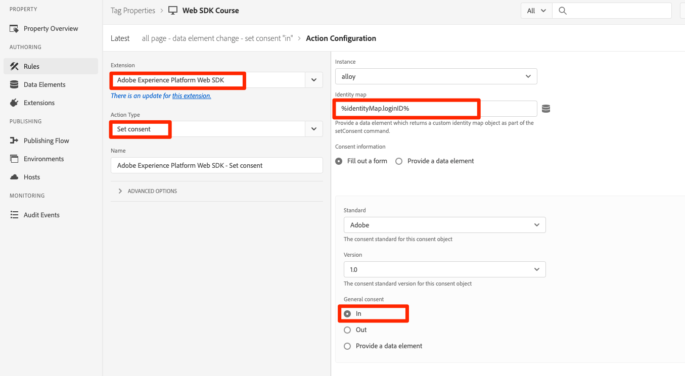

# Configurar consentimento com o SDK da Web da plataforma

Saiba como definir as configurações de privacidade da extensão de tag do Experience Platform Web SDK. Defina o consentimento com base na interação do visitante com um banner de uma Plataforma de gerenciamento de consentimento (CMP).

>[!NOTE]
> 
>Para fins de demonstração, este tutorial usa [Klaro](https://heyklaro.com/) como uma CMP. É bem-vindo que acompanhe o uso do Klaro ou do CMP que utiliza com o seu site.


## Objetivos de aprendizagem

No final desta lição, você poderá:

* Carregar uma CMP usando tags
* Definir configurações de privacidade na extensão de tag do SDK do Experience Platform Web
* Definir consentimento para o SDK da Web do Experience Platform com base na ação do visitante

## Pré-requisitos

Familiarize-se com as tags e as etapas para criar regras, elementos de dados, criar bibliotecas para ambientes e alternar bibliotecas de tags usando o Experience Platform Debugger.

Antes de começar a definir as configurações de privacidade e a criar as regras para definir o consentimento, verifique se você inseriu o script da plataforma de gerenciamento de consentimento no site e se está funcionando corretamente. Uma CMP pode ser carregada diretamente no código-fonte com a ajuda dos desenvolvedores do site ou carregada por meio das próprias tags. Esta lição demonstra esta última abordagem.
>[!NOTE]
> 
>1. Uma Plataforma de gerenciamento de consentimento (ou CMP) é usada por organizações para documentar e gerenciar legalmente as opções de consentimento de um visitante antes de coletar, compartilhar ou vender dados do visitante de fontes online, como sites e aplicativos.
>
>2. A abordagem recomendada para injetar uma CMP é diretamente por meio do código-fonte antes do script do gerenciador de tags.


### Configurar o Klaro

Antes de entrar nas configurações de tags, saiba mais sobre a plataforma de gerenciamento de consentimento usada neste tutorial Klaro.

1. Visita [Klaro](https://heyklaro.com/) e configure uma conta.
1. Ir para **Gerenciador de privacidade** e crie uma instância de acordo com as instruções.
1. Use o **Código de integração** injetar Klaro na propriedade da sua tag (as instruções estão no próximo exercício).
1. Ignore o **Digitalização** , pois detectará a propriedade da tag que está codificada no site de demonstração Luma e não na que você criou para este tutorial.
1. Adicionar um serviço chamado `aep web sdk` e ativar **Estado Padrão do Serviço**. Quando ativado, o valor de consentimento padrão é `true`caso contrário, será `false`. Essa configuração é útil para decidir qual estado de consentimento padrão (antes do consentimento do visitante) será para o aplicativo Web. Por exemplo:
   * Para CCPA, o consentimento padrão geralmente é definido como `true`. Você fará referência a esse cenário como **Aceitação implementada** em todo este tutorial
   * Para o GDPR, o consentimento padrão geralmente é definido como `false`. Você fará referência a esse cenário como **Opção de rejeição aplicada** neste tutorial.

<!--
    This consent value can be verified by returning the JavaScript object ```klaro.getManager().consents``` in the browser's developer console.
-->
    >[!OBSERVAÇÃO]
    >
    >Geralmente, os passos acima mencionados são feitos e tratados pela equipe ou pessoa responsável pelo tratamento da CMP, como o OneTrust ou TrustArc.

## Injetar uma CMP

>[!WARNING]
>
>A prática recomendada para implementar uma Plataforma de gerenciamento de consentimento é normalmente carregar a CMP _before_ carregar seu gerenciador de tags. Para facilitar este tutorial, você carregará o CMP _com_ o gerenciador de tags. Esta lição foi projetada para mostrar como usar os recursos de consentimento no SDK da Web da plataforma e não deve ser usada como um guia para configurar corretamente o Klaro ou qualquer outra CMP.


Agora, depois de concluir as configurações do Klaro, crie uma regra de tag com as seguintes configurações:

* [!UICONTROL Nome]: `all pages - library load - Klaro`
* [!UICONTROL Evento]: [!UICONTROL Biblioteca carregada (início da página)] com [!UICONTROL Opções avançadas] > [!UICONTROL Pedido] definido como 1
* [!UICONTROL Ação]: [!UICONTROL Código personalizado], [!UICONTROL Idioma]: HTML para carregar o script CMP.


O bloco de código personalizado deve ser semelhante ao abaixo:


Agora, salve e crie essa regra na biblioteca de desenvolvimento, valide se o banner de consentimento é exibido, alternando a biblioteca de tags do site Luma para o seu. Você deve ver um banner CMP no site como abaixo. E para verificar a permissão de consentimento do visitante atual, você pode usar o seguinte trecho no console do navegador.

```javascript
    klaro.getManager().consents 
```


Para entrar no modo de depuração, use a seguinte caixa de seleção no Adobe Experience Platform Debugger.


Além disso, você pode ter que limpar os cookies e o armazenamento local várias vezes enquanto passa por este tutorial, já que o valor de consentimento do visitante é armazenado lá. Você pode simplesmente fazer isso conforme abaixo:


## Cenários de consentimento

Os atos de privacidade, como o GDPR, a CCPA e outros, desempenham um papel vital na arquitetura da implementação do consentimento. Nesta lição, você explora como um visitante pode interagir com o banner de consentimento em dois atos de privacidade mais proeminentes.


### Cenário 1: Aceitação Implícita

Aceitação implícita significa que a empresa não precisa obter o consentimento do visitante (ou a &quot;aceitação&quot;) antes de coletar seus dados e, portanto, todos os visitantes do site são tratados como aceitos por padrão. No entanto, o visitante pode rejeitar rejeitando os cookies por meio do banner de consentimento. Esse caso de uso é semelhante à CCPA.

Agora, você configurará e implementará o consentimento para este cenário:

1. No **[!UICONTROL Privacidade]** seção da extensão de tag do SDK da Web do Experience Platform, verifique se  **[!UICONTROL Consentimento padrão]** está definida como **[!UICONTROL Em]** :


   

   >[!NOTE]
   > 
   >Para uma solução dinâmica, selecione a opção &quot;Fornecer um elemento de dados&quot; e passe um elemento de dados que retorne o valor de ```klaro.getManager().consents```
   >
   >Esta opção é utilizada se o CMP for injetado no código-fonte *before* o código incorporado da tag , para que o consentimento padrão esteja disponível antes que a extensão Experience Platform Web SDK comece a carregar. No nosso exemplo, não podemos usar essa opção, pois o CMP é carregado com tags e não antes delas.


2. Salvar e criar essa alteração na biblioteca de tags
3. Carregue sua biblioteca de tags no site de demonstração Luma
4. Ative a depuração de tags no site Luma e recarregue a página. No console do desenvolvedor do seu navegador, você deve ver que defaultConsent é igual a **[!UICONTROL Em]**
5. Com essa configuração, a extensão Experience Platform Web SDK continua a fazer solicitações de rede, a menos que um visitante decida rejeitar os cookies e rejeitar:

   


Se um visitante decidir rejeitar (rejeitar os cookies de rastreamento), você deverá alterar o consentimento para **[!UICONTROL Out]**. Altere a configuração de consentimento seguindo estas etapas:

<!--
1. Create a data element to store the consent value of the visitor. Let's call it `klaro consent value`. Use the code snippet to create a custom code type data element:
    
    ```javascript
    return klaro.getManager().consents["aep web sdk"]
    ```

    


1. Create another custom code data element, `consent confirmed`, with the following snippet which returns ```true``` only after a visitor confirms consent:

    
    ```javascript
    return klaro.getManager().confirmed
    ```

    
-->

1. Criar uma regra que é acionada quando o visitante clica **Eu recuo**.  Nomeie essa regra como: `all pages - click consent banner - set consent "out"`

1. Como **[!UICONTROL Evento]**, use **[!UICONTROL Clique em]** on **[!UICONTROL Elementos correspondentes ao seletor de CSS]** `#klaro .cn-decline`

   

1. Agora, use o SDK da Web do Experience Platform, [!UICONTROL Definir consentimento] [!UICONTROL tipo de ação] para definir o consentimento como &quot;out&quot;:

   

1. Selecionar **[!UICONTROL Salvar na biblioteca e criar]**:

   

Agora, quando um visitante recusa, a regra configurada da maneira acima é acionada e define o consentimento do SDK da Web como **[!UICONTROL Out]**.

Valide acessando o site de demonstração Luma, rejeite cookies e confirme se nenhuma solicitação do SDK da Web é acionada após rejeitar.

### Cenário 2: Opção de rejeição aplicada


A opção de não participação implementada significa que os visitantes devem ser tratados como rejeitados por padrão e os cookies não devem ser definidos. As solicitações do SDK da Web não devem ser acionadas, a menos que os visitantes decidam aceitar manualmente os cookies por meio do banner de consentimento. Você pode ter que lidar com esse caso de uso na região da União Europeia onde o GDPR se aplica.

Veja como configurar um cenário de recusa implícito:

1. Em Klaro, desligue o **Estado Padrão do Serviço** em seu `aep web sdk` e salve a configuração atualizada.

1. Em **[!UICONTROL Privacidade]** seção da extensão Experience Platform Web SDK, definir consentimento padrão para **[!UICONTROL Out]** ou **[!UICONTROL Pending]** conforme necessário.

   

1. **Salvar** a configuração atualizada para sua biblioteca de tags e recrie-a.

   Com essa configuração, o Experience Platform Web SDK garante que nenhuma solicitação seja acionada, a menos que a permissão de consentimento seja alterada para **[!UICONTROL Em]**. Isso pode ocorrer como resultado da aceitação manual dos cookies por um visitante.

1. No Debugger, verifique se o site Luma está mapeado para a propriedade de tag e se o registro do console de tags está ativado.
1. Use o console do desenvolvedor do navegador para **Limpar dados do site** em **Aplicativo** > **Armazenamento**

1. Recarregue o site Luma e você deve ver que `defaultConsent` está definida como **[!UICONTROL Out]** e nenhuma solicitação do SDK da Web foi feita

   

Caso um visitante decida aceitar (aceitar os cookies de rastreamento), é necessário alterar o consentimento e defini-lo como **[!UICONTROL Em]**. Veja como fazer isso com uma regra:

1. Criar uma regra que é acionada quando o visitante clica **Está tudo bem**.  Nomeie essa regra como: `all pages - click consent banner - set consent "in"`

1. Como **[!UICONTROL Evento]**, use **[!UICONTROL Clique em]** on **[!UICONTROL Elementos correspondentes ao seletor de CSS]** `#klaro .cm-btn-success`

   

1. Adicionar uma ação usando o SDK da Web do Experience Platform [!UICONTROL Extensão], **[!UICONTROL Tipo de ação]** de **[!UICONTROL Definir consentimento]**, **[!UICONTROL Consentimento geral]** as **[!UICONTROL Em]**.

   

   Uma coisa a notar aqui é que isto [!UICONTROL Definir consentimento] ação vai ser a primeira solicitação que sai e estabelece identidade. Por isso, pode ser importante sincronizar identidades na própria solicitação. O mapa de identidade pode ser adicionado a [!UICONTROL Definir consentimento] ação passando um elemento de dados de tipo de identidade.

1. Selecionar **[!UICONTROL Salvar na biblioteca e criar]**:

   

1. **[!UICONTROL Salvar]** a regra para sua biblioteca e recrie-a.

Depois que essa regra estiver em vigor, a coleção de eventos deverá começar quando um visitante optar por participar.


Para obter mais informações sobre consentimento no SDK da Web, consulte [Suporte às preferências de consentimento do cliente](https://experienceleague.adobe.com/docs/experience-platform/edge/consent/supporting-consent.html?lang=en).


Para obter mais informações sobre o [!UICONTROL Definir consentimento] ação, consulte [Definir consentimento](https://experienceleague.adobe.com/docs/experience-platform/edge/extension/action-types.html?lang=en#set-consent).

[Próximo: ](setup-event-forwarding.md)

>[!NOTE]
>
>Obrigado por investir seu tempo para aprender sobre o SDK da Web da Adobe Experience Platform. Em caso de dúvidas, desejo compartilhar comentários gerais ou ter sugestões sobre conteúdo futuro, compartilhe-as sobre isso [Posto de discussão da comunidade do Experience League](https://experienceleaguecommunities.adobe.com/t5/adobe-experience-platform-launch/tutorial-discussion-implement-adobe-experience-cloud-with-web/td-p/444996)
