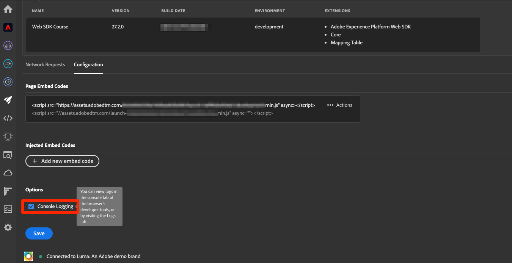

# Configurar consentimento com o Platform Web SDK

Saiba como definir as configurações de privacidade da extensão de tag do Adobe Experience Platform Web SDK. Defina o consentimento com base na interação do visitante com um banner de uma Plataforma de gerenciamento de consentimento (CMP).


>[!NOTE]
> 
>Para fins de demonstração, este tutorial usa o [Klaro](https://klaro.org/) como um CMP. Você pode seguir o Klaro ou o CMP usado com seu site.


## Objetivos de aprendizagem

No final desta lição, você poderá:

* Carregar uma CMP usando tags
* Definir configurações de privacidade na extensão de tag do Experience Platform Web SDK
* Definir o consentimento para o Experience Platform Web SDK com base na ação do visitante

## Pré-requisitos

Você deve estar familiarizado com as tags e as etapas para criar regras, elementos de dados, criar bibliotecas de tags para ambientes e alternar bibliotecas de tags usando o Experience Platform Debugger.

Antes de começar a definir as configurações de privacidade e criar as regras para definir o consentimento, insira o script da plataforma de gerenciamento de consentimento no site e esteja funcionando corretamente. Uma CMP pode ser carregada diretamente no código-fonte com a ajuda de desenvolvedores de site ou carregada por meio de tags. Esta lição demonstra a última abordagem.

>[!NOTE]
> 
>1. Uma Plataforma de gerenciamento de consentimento (ou CMP) é usada pelas organizações para documentar e gerenciar legalmente as opções de consentimento de um visitante antes de coletar, compartilhar ou vender dados do visitante de fontes online, como sites e aplicativos.
>
>2. A abordagem recomendada para inserir um CMP é diretamente por meio do código-fonte, antes do script do gerenciador de tags.

### Configurar o Klaro

Antes de entrar nas configurações de tag, saiba mais sobre a plataforma de gerenciamento de consentimento usada neste tutorial do Klaro.

1. Visite [Klaro](https://klaro.org/) e configure uma conta.
1. Vá para o **Privacy Manager** e crie uma instância de acordo com as instruções.
1. Use o **Código de integração** para injetar Klaro na propriedade da tag (as instruções estão no próximo exercício).
1. Ignore a seção **Verificação**, pois ela detecta a propriedade de tag codificada no site de demonstração do Luma e não a que você criou para este tutorial.
1. Adicione um serviço chamado `aep-web-sdk` e alterne para o **Estado Padrão do Serviço**. Quando ativado, o valor de consentimento padrão é `true`; caso contrário, é `false`. Essa configuração é útil para decidir qual será o estado de consentimento padrão (antes do consentimento do visitante) para o seu aplicativo web. Por exemplo:
   * Para a CCPA, o consentimento padrão geralmente é definido como `true`. Você referenciará este cenário como **Aceitação implícita** neste tutorial
   * Para o GDPR, o consentimento padrão geralmente é definido como `false`. Você referenciará este cenário como **Recusa implícita** neste tutorial.
1. Ativar a configuração
<!--
    This consent value can be verified by returning the JavaScript object ```klaro.getManager().consents``` in the browser's developer console.
-->
    >[!NOTE]
    >
    >Geralmente, as etapas mencionadas acima são executadas e tratadas pela equipe ou indivíduo responsável pela manipulação do CMP, como OneTrust ou TrustArc.

## Injetar um CMP

>[!WARNING]
>
>A prática recomendada para implementar uma Plataforma de Gerenciamento de Consentimento geralmente é carregar o CMP _antes_ de carregar seu gerenciador de tags. Para facilitar este tutorial, você carregará o CMP _com_ o gerenciador de tags. Esta lição foi projetada para mostrar como usar os recursos de consentimento no Platform Web SDK e não deve ser usada como guia para configurar corretamente o Klaro ou qualquer outro CMP.


Agora, depois de concluir as configurações do Klaro, crie regras de tag com as seguintes configurações:

* [!UICONTROL Nome]: `all pages - library load - Klaro`
* [!UICONTROL Evento]: [!UICONTROL Biblioteca Carregada (Início da Página)] com [!UICONTROL Opções Avançadas] > [!UICONTROL Pedido] definido como 1
* [!UICONTROL Ação]: [!UICONTROL Código personalizado], [!UICONTROL Idioma]: HTML para carregar o script CMP.


O bloco de código personalizado deve ser semelhante ao seguinte:


Agora, salve e crie essa regra na biblioteca de desenvolvimento, valide se o banner de consentimento está sendo exibido ao alternar a biblioteca de tags do site Luma para o seu próprio site. Você deve ver um banner CMP no site, conforme abaixo. E para verificar a permissão de consentimento do visitante atual, você pode usar o seguinte trecho no console do navegador.

```javascript
    klaro.getManager().consents 
```


Para entrar no modo de depuração, use a seguinte caixa de seleção no Adobe Experience Platform Debugger.



Além disso, talvez seja necessário limpar os cookies e o armazenamento local várias vezes ao percorrer este tutorial, pois o valor de consentimento do visitante é armazenado lá. Você pode simplesmente fazer isso conforme abaixo:


## Cenários de consentimento

Atos de privacidade como GDPR, CCPA e outros desempenham um papel vital na forma como você arquitetar a implementação do consentimento. Nesta lição, você explora como um visitante pode interagir com o banner de consentimento em dois atos de privacidade mais proeminentes.


### Cenário 1: aceitação implícita

A aceitação implícita significa que a empresa não precisa obter o consentimento do visitante (ou a &quot;aceitação&quot;) antes de coletar seus dados e, portanto, todos os visitantes do site são tratados como aceitos por padrão. No entanto, o visitante pode recusar rejeitando os cookies por meio do banner de consentimento. Esse caso de uso é semelhante à CCPA.

Agora, você configurará e implementará o consentimento para este cenário:

1. Na seção **[!UICONTROL Consentimento]** da extensão de tag do Experience Platform Web SDK, verifique se o **[!UICONTROL Consentimento padrão]** está definido como **[!UICONTROL Em]**:


   

   >[!NOTE]
   > 
   >Para uma solução dinâmica, selecione a opção &quot;Fornecer um elemento de dados&quot; e passe um elemento de dados que retorne o valor de ```klaro.getManager().consents```
   >
   >Essa opção é usada se o CMP for inserido no código-fonte *antes* do código de inserção da marca, de forma que o consentimento padrão fique disponível antes que a extensão do Experience Platform Web SDK comece a ser carregada. No nosso exemplo, não podemos usar essa opção, pois a CMP é carregada com tags e não antes das tags.


2. Salvar e criar essa alteração na biblioteca de tags
3. Carregue sua biblioteca de tags no site de demonstração Luma
4. Ative a depuração de tags no site Luma e recarregue a página. No console do desenvolvedor do seu navegador, você deve ver que defaultConsent é igual a **[!UICONTROL In]**
5. Com essa configuração, a extensão Experience Platform Web SDK faz solicitações de rede para o Platform Edge Network até que um visitante decida rejeitar os cookies e a recusa:

   


Se um visitante decidir recusar (rejeitar os cookies de rastreamento), você deverá alterar o consentimento para **[!UICONTROL Desativar]**. Altere a configuração de consentimento seguindo estas etapas:

<!--
1. Create a data element to store the consent value of the visitor. Let's call it `klaro consent value`. Use the code snippet to create a custom code type data element:
    
    ```javascript
    return klaro.getManager().consents["aep web sdk"]
    ```

    


1. Create another custom code data element, `consent confirmed`, with the following snippet which returns ```true``` only after a visitor confirms consent:

    
    ```javascript
    return klaro.getManager().confirmed
    ```

    
-->

1. Crie uma regra que seja acionada quando o visitante clicar em **Recusar**.  Nomear esta regra como: `all pages - click consent banner - set consent "out"`

1. Como o **[!UICONTROL Evento]**, use **[!UICONTROL Clique]** em **[!UICONTROL Elementos correspondentes ao seletor de CSS]** `#klaro .cn-decline`

   

1. Como a **[!UICONTROL Ação]**, use a extensão do Experience Platform Web SDK, [!UICONTROL Definir consentimento] [!UICONTROL tipo de ação] para definir o consentimento como &quot;out&quot;:

   

1. Salvar e recriar a biblioteca


Agora, quando um visitante recusa, a regra configurada da maneira acima é acionada e define o consentimento da Web SDK como **[!UICONTROL Saída]**.

Valide acessando o site de demonstração Luma, rejeite os cookies e confirme se nenhuma solicitação do Web SDK é acionada após a recusa.

### Cenário 2: recusa implícita


A recusa implícita significa que os visitantes devem ser tratados como recusa por padrão e os cookies não devem ser definidos. As solicitações do Web SDK não devem ser acionadas, a menos que os visitantes decidam aceitar manualmente aceitando os cookies por meio do banner de consentimento. Talvez seja necessário lidar com esse caso de uso na região da União Europeia onde o GDPR se aplica.

Veja como definir a configuração de um cenário de recusa implícita:

1. No Klaro, desative o **Estado Padrão do Serviço** no serviço `aep-web-sdk` e salve a configuração atualizada.

1. Na seção **[!UICONTROL Consentimento]** da extensão do Experience Platform Web SDK, defina o consentimento padrão como **[!UICONTROL Saída]** ou **[!UICONTROL Pendente]**, conforme necessário.

1. **Salve** a configuração atualizada na biblioteca de marcas e recrie-a.

   


   Com essa configuração, o Experience Platform Web SDK garante que nenhuma solicitação seja acionada, a menos que a permissão de consentimento seja alterada para **[!UICONTROL In]**. Isso pode acontecer como resultado de um visitante aceitar manualmente os cookies ao aceitar.

1. No Debugger, verifique se o site Luma está mapeado para a propriedade da tag e se o registro do console de tags está ativado.
1. Use o console do desenvolvedor do seu navegador para **Limpar dados do site** no **Aplicativo** > **Armazenamento**

1. Recarregue o site Luma e você verá que `defaultConsent` está definido como **[!UICONTROL Out]** e nenhuma solicitação do Web SDK foi feita

   

Caso um visitante decida aceitar (aceitar os cookies de rastreamento), você deverá alterar o consentimento e defini-lo como **[!UICONTROL In]**. Veja como fazer isso com uma regra:

1. Crie uma regra que seja acionada quando o visitante clicar em **Tudo bem**.  Nomear esta regra como: `all pages - click consent banner - set consent "in"`

1. Como o **[!UICONTROL Evento]**, use **[!UICONTROL Clique]** em **[!UICONTROL Elementos correspondentes ao seletor de CSS]** `#klaro .cm-btn-success`

   

1. Adicione uma ação usando a [!UICONTROL Extensão] do Experience Platform Web SDK, **[!UICONTROL Tipo de Ação]** de **[!UICONTROL Definir consentimento]**, **[!UICONTROL Consentimento geral]** como **[!UICONTROL Em]**.

   

   Um aspecto a ser observado aqui é que esta ação [!UICONTROL Definir consentimento] será a primeira solicitação que sai e estabelece identidade. Por causa disso, pode ser importante sincronizar identidades na própria primeira solicitação. O mapa de identidade pode ser adicionado à ação [!UICONTROL Definir consentimento] transmitindo um elemento de dados do tipo identidade.

1. **[!UICONTROL Salve]** a regra na biblioteca e recrie-a.

Depois que essa regra estiver em vigor, a coleção de eventos deverá começar quando um visitante optar por entrar.


Para obter mais informações sobre consentimento no Web SDK, consulte [Suporte às preferências de consentimento do cliente](https://experienceleague.adobe.com/pt-br/docs/experience-platform/edge/consent/supporting-consent).

>[!TIP]
>
> Após concluir esta lição, recomendamos desativar as três novas regras.


Para obter mais informações sobre a ação [!UICONTROL Definir consentimento], consulte [Definir consentimento](https://experienceleague.adobe.com/pt-br/docs/experience-platform/tags/extensions/client/web-sdk/action-types#set-consent).

>[!NOTE]
>
>Obrigado por investir seu tempo aprendendo sobre o Adobe Experience Platform Web SDK. Se você tiver dúvidas, quiser compartilhar comentários gerais ou tiver sugestões sobre conteúdo futuro, compartilhe-as nesta [postagem de discussão da Comunidade Experience League](https://experienceleaguecommunities.adobe.com/adobe-experience-platform-18/tutorial-discussion-implement-adobe-experience-cloud-with-web-sdk-tutorial-248848?profile.language=pt)
