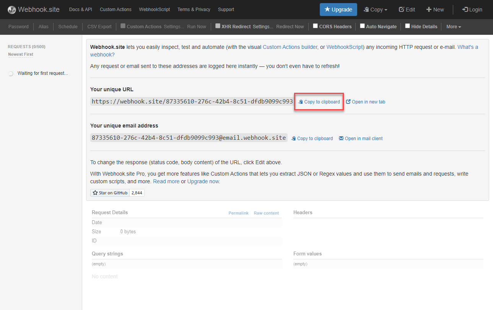
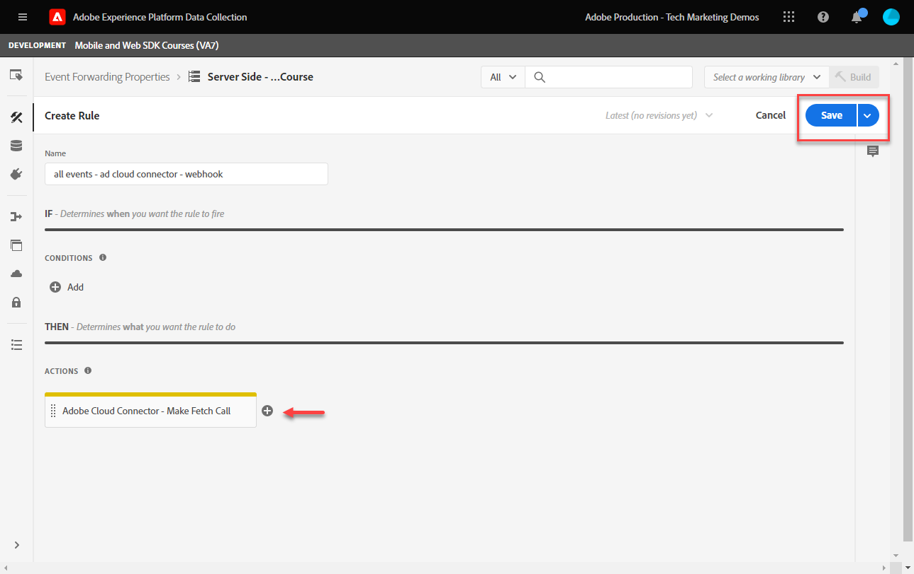
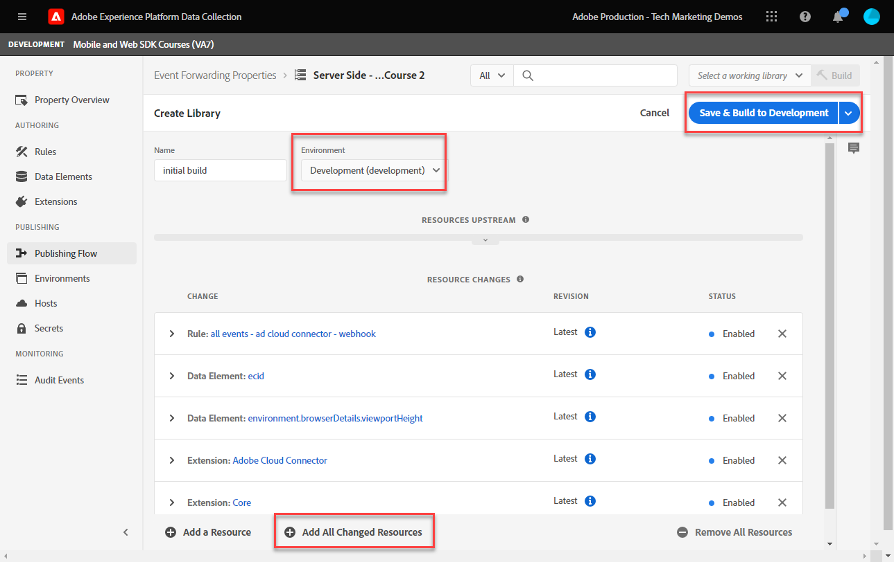

# Configurar uma propriedade de encaminhamento de eventos

Saiba como usar a propriedade de encaminhamento de eventos usando dados do SDK da Web do Experience Platform.

O encaminhamento de eventos é um novo tipo de propriedade disponível na Coleta de dados. O encaminhamento de eventos oferece a capacidade de enviar dados para fornecedores não Adobe de terceiros diretamente da Rede de borda da Adobe Experience Platform, em vez do navegador tradicional do lado do cliente. Saiba mais sobre as vantagens do encaminhamento de eventos no [Visão geral do encaminhamento de eventos](https://experienceleague.adobe.com/docs/experience-platform/tags/event-forwarding/overview.html?lang=en).

Para usar o encaminhamento de eventos no Adobe Experience Platform, os dados devem ser enviados para a Rede de borda da Adobe Experience Platform primeiro usando uma ou mais das três opções a seguir:

* [SDK da Web da Adobe Experience Platform](overview.md)
* [SDK móvel da Adobe Experience Platform](https://aep-sdks.gitbook.io/docs/)
<!--* [Server-to-Server API](https://experienceleague.adobe.com/docs/audience-manager/user-guide/api-and-sdk-code/dcs/dcs-apis/dcs-s2s.html?lang=en)-->

>[!NOTE]
>O SDK da Web da plataforma e o SDK do Platform Mobile não exigem implantação por meio de tags. No entanto, é recomendável usar tags para implantar esses SDKs.

Depois de concluir as lições anteriores neste tutorial, você deve enviar dados para a Platform Edge Network usando o SDK da Web. Quando os dados estiverem na Rede de borda da plataforma, você poderá habilitar o encaminhamento de eventos e usar uma propriedade de encaminhamento de eventos para enviar dados para soluções que não sejam de Adobe.

## Objetivos de aprendizagem

Neste final desta lição, você poderá:

* Criar uma propriedade de encaminhamento de eventos
* Vincular uma propriedade de encaminhamento de eventos a um armazenamento de dados do SDK da Web da plataforma
* Entenda as diferenças entre os elementos e as regras de dados da propriedade de tag e os elementos e regras de dados da propriedade de encaminhamento de eventos
* Criar um elemento de dados de encaminhamento de eventos
* Configurar uma regra de encaminhamento de eventos
* Validar se uma propriedade de encaminhamento de eventos está enviando dados com êxito

## Pré-requisitos

* Uma licença de software que inclui o encaminhamento de eventos. O encaminhamento de eventos é um recurso pago da Coleta de dados. Entre em contato com a equipe de conta do Adobe para obter mais detalhes.
* Encaminhamento de eventos habilitado em sua organização do Experience Cloud.
* Permissão do usuário para o encaminhamento do evento. (Em [Admin Console](https://adminconsole.adobe.com/), em produto Adobe Experience Platform Launch, itens de permissão para[!UICONTROL Plataformas] > [!UICONTROL Edge] e tudo [!UICONTROL Direitos de propriedade]). Uma vez garantido, você deve ver [!UICONTROL Encaminhamento de evento] na navegação à esquerda da interface da Coleta de dados:
   

* Adobe Experience Platform Web ou Mobile SDK configurado para enviar dados para a Edge Network. Você deve ter concluído as seguintes lições deste tutorial:

   * Configuração inicial

      * [Configurar permissões](configure-permissions.md)
      * [Configurar um esquema XDM](configure-schemas.md)
      * [Configurar um namespace de identidade](configure-identities.md)
      * [Configurar um conjunto de dados](configure-datastream.md)
   * Configuração de tags

      * [Instalar a extensão do SDK da Web](install-web-sdk.md)
      * [Criar elementos de dados](create-data-elements.md)
      * [Criar uma regra de tag](create-tag-rule.md)
      * [Validar com o Adobe Experience Platform Debugger](validate-with-debugger.md)

## Criar uma propriedade de encaminhamento de eventos

Comece criando uma propriedade de encaminhamento de eventos:

1. Abra o [Interface da Coleta de dados](https://experience.adobe.com/#/data-collection)
1. Selecionar **[!UICONTROL Encaminhamento de evento]** na navegação à esquerda
1. Selecione **[!UICONTROL Nova propriedade]**.
   

1. Nomeie a propriedade. Nesse caso `Server-Side - Web SDK Course`

1. Selecione **[!UICONTROL Salvar]**.
   

## Configurar o fluxo de dados

Para que o encaminhamento de eventos use os dados enviados para a rede do Edge, é necessário vincular a propriedade de encaminhamento de eventos recém-criada ao mesmo armazenamento de dados usado para enviar dados para as soluções do Adobe.

Para configurar o Target no armazenamento de dados:

1. Ir para [Coleta de dados](https://experience.adobe.com/#/data-collection)Interface {target=&quot;blank&quot;}
1. Na navegação à esquerda, selecione **[!UICONTROL Datastreams]**
1. Selecione o criado anteriormente `Luma Web SDK` datastream

   

1. Selecionar **[!UICONTROL Adicionar Serviço]**

   
1. Selecionar **[!UICONTROL Encaminhamento de evento]** como **[!UICONTROL Serviço]**

1. Em **[!UICONTROL ID da propriedade]** na lista suspensa, selecione o nome que você deu à propriedade de encaminhamento de eventos, nesse caso `Server-Side - Web SDK Course`

1. Em **[!UICONTROL ID do ambiente]** na lista suspensa, selecione o ambiente de tags ao qual você está vinculando o ambiente de encaminhamento de eventos, neste caso `Development`

   >[!TIP]
   >
   >    Para enviar dados para um ambiente de encaminhamento de eventos fora da organização de Adobe, selecione **[!UICONTROL Inserir IDs manualmente]** e colar em uma ID. A ID é fornecida ao criar uma propriedade de encaminhamento de evento.

1. Selecione **[!UICONTROL Salvar]**.

   

Repita essas etapas para armazenamento de dados de armazenamento temporário e produção quando estiver pronto para promover as alterações pelo fluxo de publicação.

## Encaminhar dados da rede de borda da plataforma para uma solução não-Adobe

Neste exercício, você aprenderá a configurar um elemento de dados de encaminhamento de eventos, configurar uma regra de encaminhamento de eventos e validar usando uma ferramenta de terceiros chamada [Webhook.site](https://webhook.site/).

>[!NOTE]
>
>Um webhook é uma maneira de integrar diferentes sistemas em tempo semireal. [Webhook.site](https://webhook.site/) é uma ferramenta de terceiros que permite inspecionar, testar e automatizar facilmente (com o Visual Custom Actions Builder ou WebhookScript) qualquer solicitação ou email HTTP recebido.

>[!IMPORTANT]
>
>Você já deve ter criado e mapeado elementos de dados para um Objeto XDM, bem como regras de tags configuradas e criado essas alterações em uma biblioteca para um ambiente de tags para prosseguir. Caso contrário, consulte o **Configuração de tags** na seção [pré-requisitos](setup-event-forwarding.md#prerequisites) seção. Essas etapas garantem que os dados sejam enviados para a Rede de borda da plataforma e, a partir daí, você pode configurar uma propriedade de encaminhamento de eventos para encaminhar dados para uma solução que não seja de Adobe.

### Criar um elemento de dados de encaminhamento de eventos

O objeto XDM que você configurou anteriormente usando a extensão de tag SDK da Web da plataforma se torna a fonte de dados para elementos de dados em uma propriedade de encaminhamento de eventos. Você usa os mesmos dados já configurados na propriedade da tag como uma fonte de dados para o encaminhamento do evento.

>[!IMPORTANT]
>
>Há uma diferença de sintaxe principal ao referenciar campos XDM no encaminhamento de eventos versus outros contextos. Para fazer referência aos dados em uma propriedade de encaminhamento de eventos, o caminho do elemento de dados deve incluir a variável `arc.event` prefixo:
>
> * `arc` significa Contexto de resposta da Adobe.
> * Por exemplo: `arc.event.xdm.web.webPageDetails.URL`
>
>Se esse caminho for especificado incorretamente, os dados não serão coletados.

Neste exercício, você encaminhará a altura da janela de visualização do navegador e a ID do Experience Cloud do objeto XDM para um webhook. O caminho do campo XDM é determinado pelo esquema XDM criado durante o [Configurar um esquema XDM](configure-schemas.md) lição.

>[!TIP]
>
>Você também pode encontrar o caminho do objeto XDM usando as ferramentas de rede do navegador da Web, filtrando por `/ee` solicitações, abrir o beacon [!UICONTROL **Carga**] e detalhando a variável que você está procurando. Em seguida, clique com o botão direito do mouse e selecione &quot;Copiar caminho de propriedade&quot;. Este é um exemplo da Altura da janela de visualização do navegador:
> 

1. Vá para o **[!UICONTROL Encaminhamento de evento]** propriedade criada recentemente

1. Na navegação à esquerda, selecione **[!UICONTROL Elementos de dados]**

1. Selecione para **[!UICONTROL Criar novo elemento de dados]**

   

1. **** Nomeie o elemento de dados `environment.browserDetails.viewportHeight`

1. Em **[!UICONTROL Extensão]**, sair `CORE`

1. Em **[!UICONTROL Tipo de elemento de dados]**, selecione `Path`

1. Digite o caminho do objeto XDM que contém a Altura da janela de visualização do navegador `arc.event.xdm.environment.browserDetails.viewportHeight`

1. Selecione **[!UICONTROL Salvar]**

   

1. Criar outro elemento de dados

1. **[!UICONTROL Nome]** it `ecid`

1. Em **[!UICONTROL Extensão]**, sair `CORE`

1. Em **[!UICONTROL Tipo de elemento de dados]**, selecione `Path`

1. Digite o caminho do objeto XDM que contém a Experience Cloud ID `arc.event.xdm.identityMap.ECID.0.id`

1. Selecione **[!UICONTROL Salvar]**

   

   >[!CAUTION]
   >
   > Certifique-se de incluir a variável `arc.event.` no caminho. Além disso, certifique-se de seguir as letras maiúsculas e minúsculas exatas como o nome do campo Objeto XDM — o namespace ECID deve estar em maiúsculas.

   >[!TIP]
   Ao trabalhar com seu próprio site, você pode encontrar o caminho do objeto XDM com suas ferramentas de rede do navegador da Web, filtrando por `/ee` solicitações, abrir o beacon [!UICONTROL **Carga**] e detalhando a variável que você está procurando. Em seguida, clique com o botão direito do mouse e selecione &quot;Copiar caminho de propriedade&quot;. Este é um exemplo da Altura da janela de visualização do navegador:
   

### Instalar a extensão do Adobe Cloud Connector

Para enviar dados a locais de terceiros, primeiro instale o [!UICONTROL Conector da nuvem do Adobe] extensão.

1. Selecionar **[!UICONTROL Extensões]** na navegação à esquerda

1. Selecione o **[!UICONTROL Catálogo]** guia

1. Procure a variável **[!UICONTROL Conector da nuvem do Adobe]**, selecione **[!UICONTROL Instalar]**

   

Não há necessidade de configuração de extensão. Com essa extensão, agora é possível encaminhar dados para uma solução não Adobe!

### Criar uma regra de encaminhamento de eventos

Há algumas diferenças principais entre configurar regras em uma propriedade de tag e uma regra em uma propriedade de encaminhamento de eventos:

* **[!UICONTROL Eventos] &amp; [!UICONTROL Condições]**:

   * **Tags**: Todas as regras são acionadas por um Evento que deve ser especificado na regra, por exemplo, `Library Loaded - Page Top`. As condições são opcionais.
   * **Encaminhamento de evento**: Pressupõe-se que cada evento enviado para a Rede de borda da plataforma seja um acionador para o encaminhamento de dados. Portanto, não há [!UICONTROL Eventos] que deve ser selecionado nas regras de encaminhamento de eventos. Para gerenciar quais eventos acionam uma regra de encaminhamento de eventos, você deve configurar as condições.

* **Tokenização do elemento de dados**:

   * **Tags**: Os nomes dos elementos de dados são token com um `%` no início e no fim do nome do elemento de dados, quando usado em uma regra. Por exemplo, `%viewportHeight%`.

   * **Encaminhamento de evento**: Os nomes dos elementos de dados são token com `{{` no início e `}}` no final do nome do elemento de dados, quando usado em uma regra. Por exemplo, `{{viewportHeight}}`.

* **Sequência de ações de regras**:

   * A seção Ações de uma regra de encaminhamento de evento é sempre executada sequencialmente. Certifique-se de que a ordem das ações esteja correta ao salvar uma regra. Essa sequência de execução não pode ser executada de forma assíncrona como pode com tags .

<!--
  * **Tags**: Rule actions can easily be reordered using drag-and-drop functionality.
  * **Event forwarding**: Rule actions are always executed sequentially. Make sure the order of actions is correct when you save a rule.
-->

Para configurar uma regra para encaminhar dados ao seu webhook, primeiro você deve obter seu webhook pessoal:

1. Ir para [Webhook.site](https://webhook.site)

1. Localizar **Seu URL exclusivo**, você usará isso como a solicitação de URL na regra de encaminhamento de eventos

1. Selecionar **[!UICONTROL Copiar para a área de transferência]**

1. Deixe essa janela aberta, pois você poderá validar os dados de encaminhamento do evento em tempo real capturados pelo Webhook

   

1. Voltar **[!UICONTROL Coleta de dados]** > **[!UICONTROL Encaminhamento de evento]** > **[!UICONTROL Regras]** na navegação à esquerda

1. Selecionar **[!UICONTROL Criar nova regra]**

   

1. Nomeie-o `all events - ad cloud connector - webhook`

1. Adicionar uma ação

1. Em **[!UICONTROL Extensão]**, selecione **[!UICONTROL Conector da nuvem do Adobe]**

1. Em **[!UICONTROL Tipo de ação]**, selecione **[!UICONTROL Efetuar chamada de busca]**

1. Cole o URL do Webhook no **[!UICONTROL URL]** campo

   

1. Em **[Params de Consulta]**, você adicionará ambos os elementos de dados criados anteriormente.

1. No **[!UICONTROL Chave]** tipo de coluna em `viewPortHeight`. No **[!UICONTROL Valor]** digite o `{{environment.browserDetails.viewportHeight}}` elemento de dados digitando-o no ícone seletor de elemento de dados ou selecionando-o

1. Selecionar [!UICONTROL **+ Adicionar outro**] para adicionar outro parâmetro de consulta

1. No **[!UICONTROL Chave]** tipo de coluna em `ecid`. Na coluna Value , insira o `{{ecid}}` elemento de dados

1. Selecione **[!UICONTROL Manter alterações]**

   

1. Sua regra deve ter a aparência abaixo

1. Selecione **[!UICONTROL Salvar]**

   

### Criar e criar a biblioteca

Crie uma biblioteca e crie todas as alterações no ambiente de desenvolvimento de encaminhamento de eventos, como você normalmente faria em uma propriedade de tag.

>[!NOTE]
Se você não tiver vinculado as propriedades de encaminhamento de eventos de preparo e produção ao seu armazenamento de dados, você verá o Ambiente de desenvolvimento como a única opção para criar uma biblioteca no .

## Validar regra de encaminhamento de eventos

Agora você pode validar sua propriedade de encaminhamento de eventos usando o Platform Debugger e o Webhook.site:

1. Siga as etapas para [alternar a biblioteca de tags](validate-with-debugger.md#use-the-experience-platform-debugger-to-map-to-your-tag-property) no [Site de demonstração Luma](https://luma.enablementadobe.com/content/luma/us/en/men.html) à propriedade de tag do SDK da Web para a qual você mapeou a propriedade de encaminhamento de eventos no conjunto de dados.

1. Antes de recarregar a página, no Depurador do Experience Platform abra **[!UICONTROL Logs]** na navegação à esquerda

1. Selecione o **[!UICONTROL Edge]** e selecione **[!UICONTROL Connect]** para exibir as solicitações da Rede de borda da plataforma

   

1. Recarregar a página

1. Você verá solicitações adicionais que dão visibilidade às solicitações do lado do servidor que estão sendo enviadas pela Rede de borda da plataforma para o WebHook

1. A solicitação para focar na validação é aquela que mostra o URL totalmente construído sendo enviado pela rede do Edge

   

1. Observe os parâmetros viewPortHeight e ecid da string de consulta

   

1. Eles correspondem aos dados vistos no objeto XDM

   

1. Por fim, valide as correspondências de dados em [Webhook.site](https://webhook.site) também ao visualizar sua janela aberta do Webhook

   

Parabéns! Você configurou o encaminhamento do evento!

[Próximo: ](conclusion.md)

>[!NOTE]
Obrigado por investir seu tempo para aprender sobre o SDK da Web da Adobe Experience Platform. Em caso de dúvidas, desejo compartilhar comentários gerais ou ter sugestões sobre conteúdo futuro, compartilhe-as sobre isso [Posto de discussão da comunidade do Experience League](https://experienceleaguecommunities.adobe.com/t5/adobe-experience-platform-launch/tutorial-discussion-implement-adobe-experience-cloud-with-web/td-p/444996)