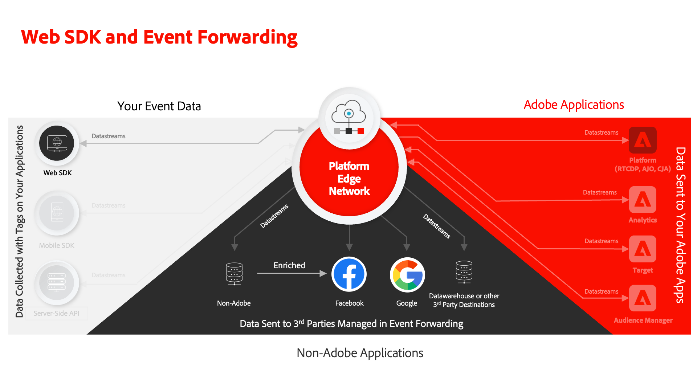
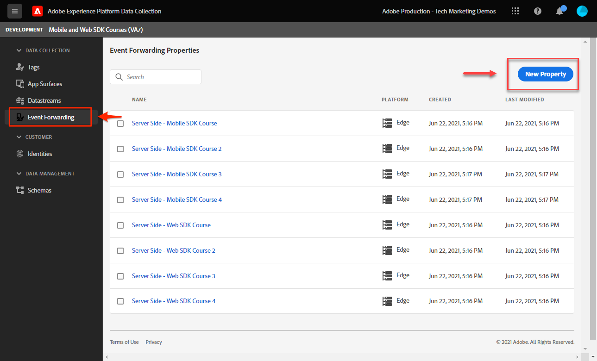

# Configurar o encaminhamento de eventos com dados do Platform Web SDK

Saiba como usar o encaminhamento de eventos com dados do SDK da web da Adobe Experience Platform.

O encaminhamento de eventos é um novo tipo de propriedade disponível em Coleção de dados. O encaminhamento de eventos oferece a capacidade de enviar dados para fornecedores de terceiros que não sejam da Adobe diretamente do Adobe Experience Platform Edge Network, em vez do navegador tradicional do lado do cliente. Saiba mais sobre as vantagens do encaminhamento de eventos na [visão geral do encaminhamento de eventos](https://experienceleague.adobe.com/en/docs/experience-platform/tags/event-forwarding/overview).

Para usar o encaminhamento de eventos no Adobe Experience Platform, os dados devem ser enviados para o Adobe Experience Platform Edge Network primeiro usando uma ou mais das três opções a seguir:

* [SDK da Web da Adobe Experience Platform](overview.md)
* [SDK móvel da Adobe Experience Platform](https://developer.adobe.com/client-sdks/home/)
  <!--* [Server-to-Server API](https://experienceleague.adobe.com/en/docs/audience-manager/user-guide/api-and-sdk-code/dcs/dcs-apis/dcs-s2s)-->

>[!NOTE]
>O Platform Web SDK e o Platform Mobile SDK não exigem implantação por meio de tags. No entanto, é recomendado usar tags para implantar esses SDKs.

Depois de concluir as lições anteriores neste tutorial, você deve enviar dados para o Platform Edge Network usando a Web SDK. Quando os dados estiverem na Platform Edge Network, você poderá ativar o encaminhamento de eventos e usar uma propriedade de encaminhamento de eventos para enviar dados a soluções que não sejam da Adobe.

## Objetivos de aprendizagem

Neste final desta lição, você poderá:

* Criar uma propriedade de encaminhamento de eventos
* Vincular uma propriedade de encaminhamento de eventos a uma sequência de dados do Platform Web SDK
* Entender as diferenças entre as regras e os elementos de dados da propriedade de tag e as regras e os elementos de dados da propriedade de encaminhamento de eventos
* Criar um elemento de dados de encaminhamento de eventos
* Configurar uma regra de encaminhamento de eventos
* Validar se uma propriedade de encaminhamento de eventos está enviando dados com êxito

## Pré-requisitos

* Uma licença de software que inclua encaminhamento de eventos. O encaminhamento de eventos é um recurso pago da Coleção de dados. Entre em contato com a equipe de conta da Adobe para obter mais detalhes.
* O encaminhamento de eventos está ativado em sua organização da Experience Cloud.
* Permissão de usuário para encaminhamento de eventos. (No [Admin Console](https://adminconsole.adobe.com/), sob o produto Adobe Experience Platform Launch, itens de permissão para [!UICONTROL Plataformas] > [!UICONTROL Edge] e todos os [!UICONTROL Direitos de Propriedade]). Depois de concedido, você deve ver [!UICONTROL Encaminhamento de Eventos] na navegação à esquerda da interface da Coleção de Dados:
  

* O Adobe Experience Platform Web ou Mobile SDK está configurado para enviar dados ao Edge Network. Você deve ter concluído as seguintes lições deste tutorial:

   * Configuração inicial

      * [Configurar um esquema XDM](configure-schemas.md)
      * [Configurar um namespace de identidade](configure-identities.md)
      * [Configurar uma sequência de dados](configure-datastream.md)

   * Configuração de tags

      * [Instalação da extensão do SDK da Web](install-web-sdk.md)
      * [Criar elementos de dados](create-data-elements.md)
      * [Criar identidades](create-identities.md)
      * [Criar regras de tag](create-tag-rule.md)
      * [Validar com o Adobe Experience Platform Debugger](validate-with-debugger.md)

## Criar uma propriedade de encaminhamento de eventos

Comece criando uma propriedade de encaminhamento de eventos:

1. Abra a [interface da Coleção de Dados](https://experience.adobe.com/#/data-collection)
1. Selecione **[!UICONTROL Encaminhamento de eventos]** na navegação à esquerda
1. Selecione **[!UICONTROL Nova propriedade]**.
   

1. Nomeie a propriedade. Neste caso, `Server-Side - Web SDK Course`

1. Selecione **[!UICONTROL Salvar]**.
   

## Configurar o fluxo de dados

Para que o encaminhamento de eventos use os dados enviados para o Platform Edge Network, é necessário vincular a propriedade de encaminhamento de eventos recém-criada ao mesmo fluxo de dados usado para enviar dados para soluções da Adobe.

Para configurar o Target na sequência de dados:

1. Ir para a interface [Coleção de Dados](https://experience.adobe.com/#/data-collection){target="blank"}
1. Na navegação à esquerda, selecione **[!UICONTROL Datastreams]**
1. Selecionar a sequência de dados `Luma Web SDK: Development Environment` criada anteriormente

   

1. Selecione **[!UICONTROL Adicionar Serviço]**
   
1. Selecione **[!UICONTROL Encaminhamento de Eventos]** como o **[!UICONTROL Serviço]**

1. Na lista suspensa **[!UICONTROL ID de Propriedade]**, selecione o nome atribuído à propriedade de encaminhamento de eventos, neste caso `Server-Side - Web SDK Course`

1. Na lista suspensa **[!UICONTROL ID de Ambiente]**, selecione o ambiente de marcas ao qual você está vinculando o ambiente de encaminhamento de eventos, neste caso `Development`

   >[!TIP]
   >
   >    Para enviar dados a um ambiente de encaminhamento de eventos fora da organização da Adobe, selecione **[!UICONTROL Inserir IDs]** manualmente e cole uma ID. A ID é fornecida quando você cria uma propriedade de encaminhamento de eventos.

1. Selecione **[!UICONTROL Salvar]**.

   

Repita essas etapas para fluxos de dados de preparo e produção quando estiver pronto para promover as alterações por meio do fluxo de publicação.

## Encaminhar dados do Platform Edge Network para uma solução que não seja da Adobe

Neste exercício, você aprenderá a configurar um elemento de dados de encaminhamento de eventos, configurar uma regra de encaminhamento de eventos e validar o usando uma ferramenta de terceiros chamada [Webhook.site](https://webhook.site/).

>[!NOTE]
>
>Um webhook é uma maneira de integrar sistemas diferentes em tempo semirreal. [Webhook.site](https://webhook.site/) é uma ferramenta de terceiros que permite inspecionar, testar e automatizar facilmente (com o construtor de Ações Personalizadas visuais ou WebhookScript) qualquer solicitação HTTP ou email de entrada.

>[!IMPORTANT]
>
>Você já deve ter criado e mapeado elementos de dados para um objeto XDM, bem como configurado regras de tags e criado essas alterações em uma biblioteca para um ambiente de tags para continuar. Caso contrário, consulte as etapas da **Configuração de tags** na seção [pré-requisitos](setup-event-forwarding.md#prerequisites). Essas etapas garantem que os dados sejam enviados para a Platform Edge Network e, a partir daí, você pode configurar uma propriedade de encaminhamento de eventos para encaminhar dados a uma solução que não seja da Adobe.

### Criar um elemento de dados de encaminhamento de eventos

O objeto XDM configurado anteriormente usando a extensão de tag da Platform Web SDK se torna a fonte de dados dos elementos de dados em uma propriedade de encaminhamento de eventos. Você usa os mesmos dados que já configurou na propriedade de tag como uma fonte de dados para o encaminhamento de eventos.

>[!IMPORTANT]
>
>Há uma diferença importante na sintaxe ao referenciar campos XDM no encaminhamento de eventos em comparação a outros contextos. Para referenciar dados em uma propriedade de encaminhamento de eventos, o caminho do elemento de dados deve incluir o prefixo `arc.event`:
>
> * `arc` significa Contexto de resposta da Adobe.
> * Por exemplo: `arc.event.xdm.web.webPageDetails.URL`
>
>Se esse caminho for especificado incorretamente, os dados não serão coletados.

Neste exercício, você encaminhará a altura da janela de visualização do navegador e a ID do Experience Cloud do objeto XDM para um webhook. O caminho do campo XDM é determinado pelo esquema XDM criado durante a lição [Configurar um esquema XDM](configure-schemas.md).

>[!TIP]
>
>Você também pode encontrar o caminho do objeto XDM usando as ferramentas de rede do navegador da Web, filtrando solicitações de `/ee`, abrindo o sinal [!UICONTROL **Carga**] e aprofundando na variável que você está procurando. Em seguida, clique com o botão direito do mouse e selecione &quot;Copiar caminho da propriedade&quot;. Veja um exemplo de Altura da janela de visualização do navegador:
> 

1. Vá para a propriedade **[!UICONTROL Encaminhamento de Eventos]** criada recentemente

1. Na navegação à esquerda, selecione **[!UICONTROL Elementos de Dados]**

1. Selecione para **[!UICONTROL Criar novo elemento de dados]**

   

1. **[!UICONTROL Nomeie]** o elemento de dados `environment.browserDetails.viewportHeight`

1. Em **[!UICONTROL Extensão]**, saia de `CORE`

1. Em **[!UICONTROL Tipo de Elemento de Dados]**, selecione `Path`

1. Digite o caminho do Objeto XDM que contém a Altura da Porta de Visualização de Navegador `arc.event.xdm.environment.browserDetails.viewportHeight`

1. Selecione **[!UICONTROL Salvar]**

   

1. Criar outro elemento de dados

1. **[!UICONTROL Nomeie]** `ecid`

1. Em **[!UICONTROL Extensão]**, saia de `CORE`

1. Em **[!UICONTROL Tipo de Elemento de Dados]**, selecione `Path`

1. Digite o caminho do objeto XDM que contém a Experience Cloud ID `arc.event.xdm.identityMap.ECID.0.id`

1. Selecione **[!UICONTROL Salvar]**

   

   >[!CAUTION]
   >
   > Certifique-se de incluir o prefixo `arc.event.` no caminho. Além disso, siga o caso exato como o nome do campo Objeto XDM — o namespace da ECID deve estar em maiúsculas.

   >[!TIP]
   >
   >Ao trabalhar com seu próprio site, você pode encontrar o caminho do objeto XDM com as ferramentas de rede do navegador da Web, filtrando por `/ee` solicitações, abrindo o sinal [!UICONTROL **Carga**] e aprofundando na variável que você está procurando. Em seguida, clique com o botão direito do mouse e selecione &quot;Copiar caminho da propriedade&quot;. Veja um exemplo de Altura da janela de visualização do navegador:
   > 

### Instalar a extensão do Adobe Cloud Connector

Para enviar dados a locais de terceiros, primeiro instale a extensão [!UICONTROL Adobe Cloud Connector].

1. Selecione **[!UICONTROL Extensões]** na navegação à esquerda

1. Selecione a guia **[!UICONTROL Catálogo]**

1. Procure o **[!UICONTROL Adobe Cloud Connector]**, selecione **[!UICONTROL Instalar]**

   

Não há configuração de extensão necessária. Com essa extensão, agora é possível encaminhar dados para uma solução que não seja da Adobe.

### Criar uma regra de encaminhamento de eventos

Há algumas diferenças principais entre a configuração de regras em uma propriedade de tag e uma regra em uma propriedade de encaminhamento de eventos:

* **[!UICONTROL Eventos] e [!UICONTROL Condições]**:

   * **Marcas**: todas as regras são acionadas por um Evento que deve ser especificado na regra, por exemplo, `Library Loaded - Page Top`. As condições são opcionais.
   * **Encaminhamento de eventos**: presume-se que cada evento enviado ao Platform Edge Network seja um acionador para encaminhar dados. Portanto, não há [!UICONTROL Eventos] que devam ser selecionados nas regras de encaminhamento de eventos. Para gerenciar quais eventos acionam uma regra de encaminhamento de eventos, você deve configurar condições.

* **Tokenização de elemento de dados**:

   * **Marcas**: os nomes de elementos de dados são tokenizados com um `%` no início e no fim do nome do elemento de dados quando usados em uma regra. Por exemplo, `%viewportHeight%`.

   * **Encaminhamento de eventos**: os nomes dos elementos de dados são tokenizados com `{{` no início e `}}` no fim do nome do elemento de dados quando usados em uma regra. Por exemplo, `{{viewportHeight}}`.

* **Sequência de ações de regra**:

   * A seção Ações de uma regra de encaminhamento de eventos é sempre executada sequencialmente. Verifique se a ordem das ações está correta ao salvar uma regra. Essa sequência de execução não pode ser executada de forma assíncrona como com tags.

<!--
  * **Tags**: Rule actions can easily be reordered using drag-and-drop functionality.
  * **Event forwarding**: Rule actions are always executed sequentially. Make sure the order of actions is correct when you save a rule.
-->

Para configurar uma regra para encaminhar dados para o seu webhook, primeiro obtenha o webhook pessoal:

1. Ir para [Webhook.site](https://webhook.site)

1. Localizar **Seu URL exclusivo**. Use-o como solicitação de URL em sua regra de encaminhamento de eventos

1. Selecionar **[!UICONTROL Copiar para a área de transferência]**

1. Deixe essa janela aberta, pois você poderá validar os dados do encaminhamento de eventos em tempo real que estão sendo capturados pelo Webhook

   

1. Retorne **[!UICONTROL Coleção de dados]** > **[!UICONTROL Encaminhamento de eventos]** > **[!UICONTROL Regras]** da navegação à esquerda

1. Selecione **[!UICONTROL Criar nova regra]**

   

1. Nomeie como `all events - ad cloud connector - webhook`

1. Adicionar uma ação

1. Em **[!UICONTROL Extension]**, selecione **[!UICONTROL Adobe Cloud Connector]**

1. Em **[!UICONTROL Tipo de ação]**, selecione **[!UICONTROL Fazer chamada de busca]**

1. Cole a URL do seu Webhook no campo **[!UICONTROL URL]**

   

1. Em **[Parâmetros de consulta]**, você adicionará ambos os elementos de dados criados anteriormente.

1. No tipo de coluna **[!UICONTROL Chave]** em `viewPortHeight`. Na coluna **[!UICONTROL Value]**, insira o elemento de dados `{{environment.browserDetails.viewportHeight}}`, digitando-o ou selecionando-o no ícone seletor de elemento de dados

1. Selecione [!UICONTROL **+ Adicionar Outro**] para adicionar outro parâmetro de consulta

1. No tipo de coluna **[!UICONTROL Chave]** em `ecid`. Na coluna Value, insira o elemento de dados `{{ecid}}`

1. Selecione **[!UICONTROL Manter alterações]**

   

1. Sua regra deve parecer com abaixo

1. Selecione **[!UICONTROL Salvar]**

   

### Criar a biblioteca

Crie uma biblioteca e crie todas as alterações no ambiente de desenvolvimento do encaminhamento de eventos, como você faria normalmente em uma propriedade de tag.

>[!NOTE]
>
>Se não tiver vinculado as propriedades de encaminhamento de eventos de Preparo e Produção à sequência de dados, você verá o ambiente de desenvolvimento como a única opção para criar uma biblioteca no.

## Validar regra de encaminhamento de eventos

Agora você pode validar sua propriedade de encaminhamento de eventos usando o Platform Debugger e o Webhook.site:

1. Siga as etapas para [alternar a biblioteca de marcas](validate-with-debugger.md#use-the-experience-platform-debugger-to-map-to-your-tag-property) no [site de demonstração da Luma](https://newluma.enablementadobe.com/category-men.html) para a propriedade de marca do Web SDK para a qual você mapeou sua propriedade de encaminhamento de eventos na sequência de dados.

1. Antes de recarregar a página, no Experience Platform Debugger, abra **[!UICONTROL Logs]** pela navegação à esquerda

1. Selecione a guia **[!UICONTROL Edge]** e **[!UICONTROL Connect]** para exibir as solicitações do Platform Edge Network

   

1. Recarregar a página

1. Você verá solicitações adicionais que dão visibilidade das solicitações do lado do servidor enviadas pelo Platform Edge Network para o WebHook

1. A solicitação para focalizar a validação é aquela que mostra o URL totalmente construído que está sendo enviado pela rede Edge

   

1. Observe os parâmetros de cadeia de caracteres de consulta viewPortHeight e ecid

   

1. Eles correspondem aos dados vistos no objeto XDM

   

1. Por fim, valide as correspondências de dados no [Webhook.site](https://webhook.site) e exiba a janela do Webhook aberta

   

Parabéns! Você configurou o encaminhamento de eventos!

>[!NOTE]
>
>Obrigado por investir seu tempo aprendendo sobre o Adobe Experience Platform Web SDK. Se você tiver dúvidas, quiser compartilhar comentários gerais ou tiver sugestões sobre conteúdo futuro, compartilhe-as nesta [postagem de discussão da Comunidade Experience League](https://experienceleaguecommunities.adobe.com/adobe-experience-platform-18/tutorial-discussion-implement-adobe-experience-cloud-with-web-sdk-tutorial-248848)
