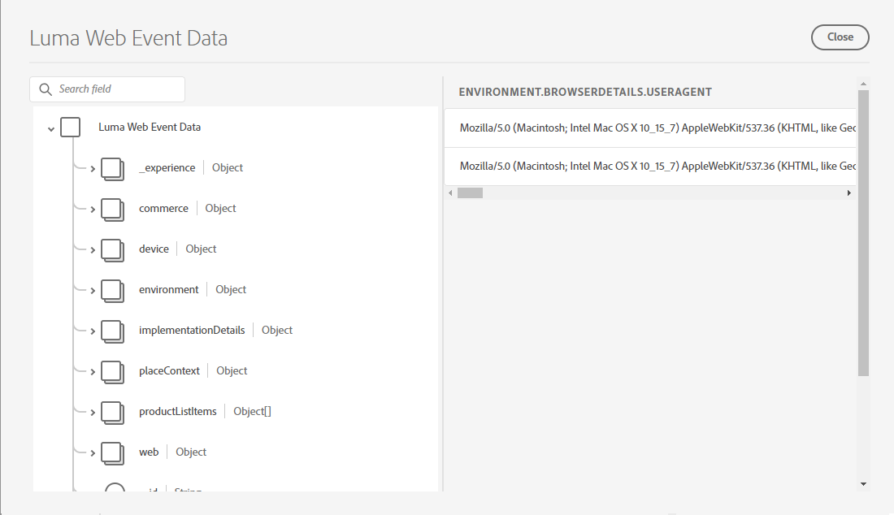

# Transmitir dados para o Experience Platform com o SDK da Web

Saiba como transmitir dados da Web para o Adobe Experience Platform com o SDK da Web da plataforma.

O Experience Platform é a espinha dorsal de todos os novos aplicativos do Experience Cloud, como Adobe Real-time Customer Data Platform, Adobe Customer Journey Analytics e Adobe Journey Optimizer. Esses aplicativos foram projetados para usar o SDK da Web da plataforma como seu método ideal de coleta de dados da Web.

O Experience Platform usa o mesmo esquema XDM criado anteriormente para capturar dados de evento do site Luma. Quando esses dados são enviados para a Rede de borda da plataforma, a configuração do conjunto de dados pode encaminhá-los para o Experience Platform.

## Objetivos de aprendizagem

No final desta lição, você poderá:

* Criar um conjunto de dados no Adobe Experience Platform
* Configure o armazenamento de dados para enviar dados do SDK da Web para o Adobe Experience Platform
* Ativar dados da Web de transmissão para o Perfil do cliente em tempo real
* Valide se os dados chegaram no conjunto de dados da plataforma e no Perfil do cliente em tempo real

## Pré-requisitos

Você já deve ter concluído as seguintes lições:

* O **Configuração inicial** lições:
   * [Configurar permissões](configure-permissions.md)
   * [Configurar um esquema XDM](configure-schemas.md)
   * [Configurar um conjunto de dados](configure-datastream.md)
   * [Configurar um namespace de identidade](configure-identities.md)

* O **Configuração de tags** lições:
   * [Instalar a extensão do SDK da Web](install-web-sdk.md)
   * [Criar elementos de dados](create-data-elements.md)
   * [Criar regras de tag](create-tag-rule.md)

## Criar um conjunto de dados

Todos os dados assimilados com êxito no Adobe Experience Platform são mantidos no lago de dados como conjuntos de dados. A [conjunto de dados](https://experienceleague.adobe.com/docs/experience-platform/catalog/datasets/overview.html?lang=en) é uma construção de armazenamento e gerenciamento para uma coleção de dados, normalmente uma tabela, que contém um schema (colunas) e campos (linhas). Os conjuntos de dados também contêm metadados que descrevem vários aspectos dos dados armazenados.

Neste exercício, você cria um conjunto de dados para rastrear o conteúdo e os detalhes de comércio eletrônico para a variável [Site de demonstração Luma](https://luma.enablementadobe.com/content/luma/us/en.html).

>[!WARNING]
>
>Você já deve ter criado a variável `Luma Web Event Data` schema , conforme instruído na lição anterior, [Configurar um esquema XDM](configure-schemas.md).

1. Vá para o [interface Experience Platform](https://experience.adobe.com/platform/)
1. Confirme se você está na sandbox de desenvolvimento usada para este tutorial
1. Abrir **[!UICONTROL Conjuntos de dados]** na navegação à esquerda
1. Selecionar **[!UICONTROL Criar conjunto de dados]**

   

1. Selecione o **[!UICONTROL Criar conjunto de dados a partir do esquema]** opção

   

1. Selecione o `Luma Web Event Data` criado na [lição anterior](configure-schemas.md) e depois selecione **[!UICONTROL Próximo]**

   

1. Forneça uma **[!UICONTROL Nome]** e opcional **[!UICONTROL Descrição]** para o conjunto de dados. Para este exercício, use `Luma Web Event Data`, em seguida selecione **[!UICONTROL Concluir]**

   

Um conjunto de dados agora está configurado para iniciar a coleta de dados da implementação do SDK da Web da plataforma.

## Configurar o fluxo de dados

Agora você pode configurar a [!UICONTROL datastream] para enviar dados para [!UICONTROL Adobe Experience Platform]. O armazenamento de dados é o link entre a propriedade de tag, a Rede de borda da plataforma e o conjunto de dados do Experience Platform.

1. Abra o [Coleta de dados](https://experience.adobe.com/#/data-collection)Interface {target=&quot;blank&quot;}
1. Selecionar **[!UICONTROL Datastreams]** na navegação à esquerda
1. Abra o armazenamento de dados criado no [Configurar um conjunto de dados](configure-datastream.md) lição, `Luma Web SDK`

   

1. Selecionar **[!UICONTROL Adicionar Serviço]**

   
1. Selecionar **[!UICONTROL Adobe Experience Platform]** como **[!UICONTROL Serviço]**
1. Selecionar `Luma Web Event Data` como **[!UICONTROL Conjunto de dados do evento]**

1. Selecione **[!UICONTROL Salvar]**.

   

À medida que você gera tráfego no [Site de demonstração Luma](https://luma.enablementadobe.com/content/luma/us/en.html) mapeados para a propriedade da tag , os dados preencherão o conjunto de dados no Experience Platform!

## Validar o conjunto de dados

Essa etapa é essencial para garantir que os dados tenham chegado ao conjunto de dados. Há dois aspectos da validação de dados enviados para o conjunto de dados.

* Validar usando [!UICONTROL Experience Platform Debugger]
* Validar usando [!UICONTROL Visualizar conjunto de dados]
* Validar usando [!UICONTROL Serviço de query]

### Experience Platform Debugger

Essas etapas são mais ou menos as mesmas do que você fez na [Lição do Debugger](validate-with-debugger.md). No entanto, como os dados só serão enviados para a Platform depois que você ativá-los no armazenamento de dados, é necessário gerar mais dados de amostra:

1. Abra o [Site de demonstração Luma](https://luma.enablementadobe.com/content/luma/us/en.html) e selecione o [!UICONTROL Experience Platform Debugger] ícone de extensão

1. Configure o Debugger para mapear a propriedade de tag para *your* Ambiente de desenvolvimento, conforme descrito no [Validar com o Debugger](validate-with-debugger.md) lição

   

1. Faça logon no site Luma usando as credenciais `test@adobe.com`/`test`

1. Retorne à [página inicial do Luma](https://luma.enablementadobe.com/content/luma/us/en.html)

1. Dentro dos beacons de rede do SDK da Web da Plataforma mostrados pelo depurador, selecione a linha &quot;events&quot; para expandir detalhes em um pop-up

   

1. Procure o &quot;identityMap&quot; no pop-up. Aqui você deve ver lumaCrmId com três chaves de authenticationState, id e primary
   

Agora, os dados devem ser preenchidos no `Luma Web Event Data` conjunto de dados e pronto para a validação &quot;Visualizar conjunto de dados&quot;.

### Visualizar o conjunto de dados

Para confirmar que os dados chegaram ao lago de dados da Platform, uma opção rápida é usar a variável **[!UICONTROL Visualizar conjunto de dados]** recurso. Os dados do SDK da Web são em microlote no lago de dados e atualizados periodicamente na interface da plataforma. Pode levar de 10 a 15 minutos para ver os dados gerados.

1. No [Experience Platform](https://experience.adobe.com/platform/) , selecione **[!UICONTROL Conjuntos de dados]** na navegação à esquerda para abrir o **[!UICONTROL Conjuntos de dados]** painel.

   O painel lista todos os conjuntos de dados disponíveis para sua organização. Os detalhes são exibidos para cada conjunto de dados listado, incluindo seu nome, o esquema ao qual o conjunto de dados adere e o status da execução de assimilação mais recente.

1. Selecione seu `Luma Web Event Data` conjunto de dados para abrir seu **[!UICONTROL Atividade do conjunto de dados]** tela.

   

   A tela de atividade inclui um gráfico que visualiza a taxa de mensagens que estão sendo consumidas, bem como uma lista de lotes bem-sucedidos e com falha.

1. No **[!UICONTROL Atividade do conjunto de dados]** , selecione **[!UICONTROL Visualizar conjunto de dados]** próximo ao canto superior direito da tela para visualizar até 100 linhas de dados. Se o conjunto de dados estiver vazio, o link de visualização será desativado.

   

   Na janela de pré-visualização, a exibição hierárquica do esquema do conjunto de dados é mostrada à direita.

   

>[!INFO]
>
>O serviço de query da Adobe Experience Platform é um método mais robusto para validar dados no lago, mas está além do escopo deste tutorial. Para obter mais detalhes, consulte [Explorar dados](https://experienceleague.adobe.com/docs/platform-learn/tutorials/queries/explore-data.html?lang=pt-BR) na seção Tutoriais da plataforma .

## Ativar o conjunto de dados e o esquema para o Perfil do cliente em tempo real

A próxima etapa é ativar o conjunto de dados e o esquema para o Perfil do cliente em tempo real. O streaming de dados do SDK da Web será uma das muitas fontes de dados que fluem para o Platform e você deseja unir seus dados da Web a outras fontes de dados para criar perfis de clientes de 360 graus. Para saber mais sobre o Perfil do cliente em tempo real, assista a este pequeno vídeo:

>[!VIDEO](https://video.tv.adobe.com/v/27251?quality=12&learn=on&captions=eng)

>[!CAUTION]
>
>Ao trabalhar com seu próprio site e dados, recomendamos uma validação mais robusta dos dados antes de habilitá-los para o Perfil do cliente em tempo real.

**Para ativar o conjunto de dados:**

1. Abra o conjunto de dados criado, `Luma Web Event Data`

1. Selecione o **[!UICONTROL Alternar perfil]** para ativá-la

   

1. Confirme que deseja **[!UICONTROL Habilitar]** o conjunto de dados

   

**Para ativar o schema:**

1. Abra o schema criado, `Luma Web Event Data`

1. Selecione o **[!UICONTROL Alternar perfil]** para ativá-la

   

1. Selecionar **[!UICONTROL Os dados para esse schema conterão uma identidade primária no campo identityMap .]**

   >[!IMPORTANT]
   >
   >    As identidades primárias são necessárias em cada registro enviado ao Perfil do cliente em tempo real. Normalmente, os campos de identidade são rotulados dentro do esquema. No entanto, ao usar mapas de identidade, os campos de identidade não ficam visíveis no esquema. Essa caixa de diálogo tem o objetivo de confirmar que você tem uma identidade primária em mente e a especificará em um mapa de identidade ao enviar seus dados. Como você sabe, o SDK da Web usa um mapa de identidade, e a ID do Experience Cloud (ECID) é a identidade primária padrão.

1. Selecionar **[!UICONTROL Habilitar]**

   

1. Selecionar **[!UICONTROL Salvar]** para salvar o schema atualizado

Agora, o schema também está ativado para o perfil.

>[!IMPORTANT]
>
>    Depois que um esquema é ativado para o Perfil, ele não pode ser desativado ou excluído. Além disso, os campos não podem ser removidos do schema após esse ponto. Essas implicações são importantes que você deve ter em mente posteriormente ao trabalhar com seus próprios dados no ambiente de produção. Você deve estar usando uma sandbox de desenvolvimento neste tutorial, que pode ser excluída a qualquer momento.
>
>   
> Ao trabalhar com seus próprios dados, recomendamos que você faça as coisas na seguinte ordem:
> 
> * Primeiro, assimile alguns dados em seus conjuntos de dados.
> * Resolver quaisquer problemas que surjam durante o processo de assimilação de dados (por exemplo, problemas de validação ou mapeamento de dados).
> * Ativar os conjuntos de dados e esquemas para Perfil
> * Reingerir os dados

### Validar um perfil

Você pode procurar um perfil de cliente na interface da plataforma (ou na interface da Journey Optimizer) para confirmar que os dados chegaram ao Perfil do cliente em tempo real. Como o nome sugere, os perfis são preenchidos em tempo real, portanto, não há atraso como havia com a validação de dados no conjunto de dados.

Primeiro, você deve gerar mais dados de amostra. Repita as etapas anteriores nesta lição para fazer logon no site Luma quando ele for mapeado para a propriedade de tag. Inspect a solicitação do SDK da Web da plataforma para garantir que envie dados com a variável `lumaCRMId`.

1. No [Experience Platform](https://experience.adobe.com/platform/) , selecione **[!UICONTROL Perfis]** na navegação à esquerda

1. Como **[!UICONTROL Namespace de identidade]** use `lumaCRMId`
1. Copie e cole o valor da variável `lumaCRMId` enviado na chamada que você inspecionou no Experience Platform Debugger (provavelmente `112ca06ed53d3db37e4cea49cc45b71e`).

   

1. Se houver um valor válido no Perfil para `lumaCRMId`, uma ID de perfil é preenchida no console:

   

1. Clique no botão [!UICONTROL ID do perfil] e [!UICONTROL Perfil do cliente] O console é preenchido. Aqui você pode ver todas as identidades vinculadas à variável `lumaCRMId`, como o `ECID`:

   

Agora você ativou o SDK da Web da plataforma para o Experience Platform (e a CDP em tempo real! E Customer Journey Analytics! E Journey Optimizer!)!

[Próximo: ](setup-analytics.md)

>[!NOTE]
>
>Obrigado por investir seu tempo para aprender sobre o SDK da Web da Adobe Experience Platform. Em caso de dúvidas, desejo compartilhar comentários gerais ou ter sugestões sobre conteúdo futuro, compartilhe-as sobre isso [Posto de discussão da comunidade do Experience League](https://experienceleaguecommunities.adobe.com/t5/adobe-experience-platform-launch/tutorial-discussion-implement-adobe-experience-cloud-with-web/td-p/444996)