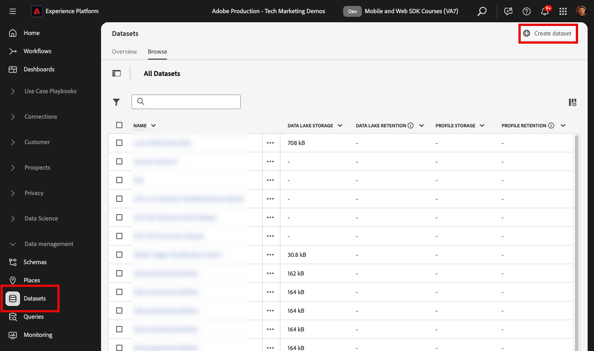
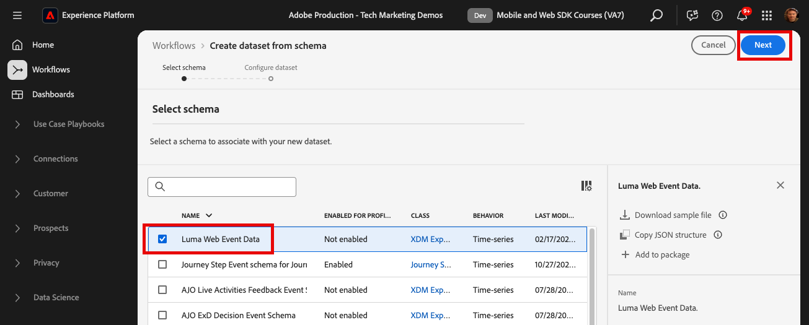
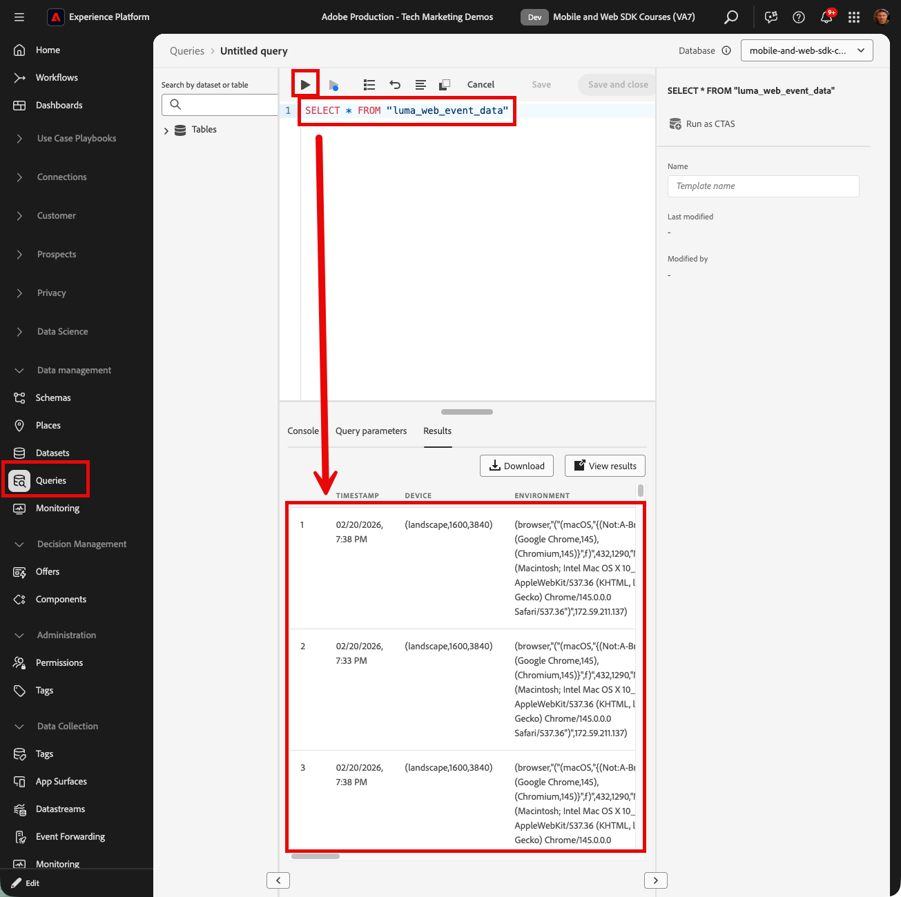

# Transmitir dados para o Experience Platform com o Web SDK

Saiba como transmitir dados da web para a Adobe Experience Platform com o SDK da web da Platform.

O Experience Platform é a espinha dorsal de todos os novos aplicativos da Experience Cloud, como o Adobe Real-Time Customer Data Platform, o Adobe Customer Journey Analytics e o Adobe Journey Optimizer. Esses aplicativos foram projetados para usar o Platform Web SDK como o método ideal de coleta de dados da Web.

O Experience Platform usa o mesmo esquema XDM criado anteriormente para capturar dados do evento do site da Luma. Quando esses dados são enviados para a Platform Edge Network, a configuração da sequência de dados pode encaminhá-los para a Experience Platform.

## Objetivos de aprendizagem

No final desta lição, você poderá:

* Criar um conjunto de dados na Adobe Experience Platform
* Configurar a sequência de dados para enviar dados do Web SDK para o Adobe Experience Platform
* Ativar transmissão de dados da Web para o Perfil do cliente em tempo real
* Validar se os dados chegaram ao conjunto de dados da Plataforma e ao Perfil do cliente em tempo real
* Assimilar dados de amostra do programa de fidelidade na Platform
* Criar um público-alvo simples da Platform

## Pré-requisitos

Para concluir esta lição, primeiro você deve:

* Ter acesso a um aplicativo do Adobe Experience Platform, como Real-Time Customer Data Platform, Journey Optimizer ou Customer Journey Analytics
* Conclua as lições anteriores nas seções Configuração inicial e Configuração de tags deste tutorial.

>[!NOTE]
>
>Se você não tiver aplicativos da Platform, ignore esta lição ou leia tudo.

## Criar um conjunto de dados

Todos os dados assimilados com sucesso na Adobe Experience Platform são mantidos no data lake como conjuntos de dados. Um [conjunto de dados](https://experienceleague.adobe.com/pt-br/docs/experience-platform/catalog/datasets/overview) é uma construção de armazenamento e gerenciamento para uma coleção de dados, geralmente uma tabela que contém um esquema (colunas) e campos (linhas). Os conjuntos de dados também contêm metadados que descrevem vários aspectos dos dados armazenados.

Vamos configurar um conjunto de dados para seus dados de evento da Web do Luma:

1. Ir para a interface [Experience Platform](https://experience.adobe.com/platform/) ou [Journey Optimizer](https://experience.adobe.com/journey-optimizer/)
1. Confirme que você está na sandbox de desenvolvimento que está usando para este tutorial
1. Abra **[!UICONTROL Gerenciamento de dados > Conjuntos de dados]** na navegação à esquerda
1. Selecione **[!UICONTROL Criar conjunto de dados]**

   

1. Selecione a opção **[!UICONTROL Criar conjunto de dados do esquema]**

   

1. Selecione o esquema `Luma Web Event Data` criado na [lição anterior](configure-schemas.md) e selecione **[!UICONTROL Próximo]**

   

1. Forneça um **[!UICONTROL Nome]** e uma **[!UICONTROL Descrição]** opcional para o conjunto de dados. Neste exercício, use `Luma Web Event Data` e selecione **[!UICONTROL Concluir]**

   

Um conjunto de dados agora está configurado para começar a coletar dados da implementação do Platform Web SDK.

## Configurar o fluxo de dados

Agora você pode configurar sua [!UICONTROL sequência de dados] para enviar dados para a [!UICONTROL Adobe Experience Platform]. A sequência de dados é o link entre a propriedade da tag, a Platform Edge Network e o conjunto de dados da Experience Platform.

1. Abrir a interface de [Coleção de Dados](https://experience.adobe.com/#/data-collection){target="blank"}
1. Selecione **[!UICONTROL Datastreams]** na navegação à esquerda
1. Abra a sequência de dados criada na lição [Configurar uma sequência de dados](configure-datastream.md), `Luma Web SDK: Development Environment`

   

1. Selecione **[!UICONTROL Adicionar Serviço]**
   
1. Selecione **[!UICONTROL Adobe Experience Platform]** como o **[!UICONTROL Serviço]**
1. Selecionar **[!UICONTROL Habilitado]**
1. Selecione `Luma Web Event Data` como o **[!UICONTROL Conjunto de Dados do Evento]**

1. Selecione **[!UICONTROL Salvar]**

   

À medida que você gera tráfego no [site de demonstração Luma](https://luma.enablementadobe.com) mapeado para a propriedade da sua tag, os dados preenchem o conjunto de dados na Experience Platform.

## Validar o conjunto de dados

Essa etapa é crítica para garantir que os dados tenham chegado ao conjunto de dados. Há várias maneiras de validar o caminho dos dados enviados para o conjunto de dados.

* Validar usando o [!UICONTROL Experience Platform Debugger]
* Validar usando o [!UICONTROL Experience Platform Assurance]
* Validar usando [!UICONTROL Visualizar Conjunto de Dados]
* Validar usando o [!UICONTROL Serviço de consulta]

### Debugger

Estas etapas são mais ou menos as mesmas que você fez na [Lição de depuração](validate-with-debugger.md). No entanto, como os dados só serão enviados para a Platform depois de ativá-los na sequência de dados, você deve gerar mais alguns dados de amostra:

1. Abra o [site de demonstração do Luma](https://luma.enablementadobe.com) e selecione o ícone de extensão do [!UICONTROL Experience Platform Debugger]

1. Configure o Depurador para mapear a propriedade da tag para o *seu* ambiente de desenvolvimento, conforme descrito na lição [Validar com o Depurador](validate-with-debugger.md)

   

1. Navegue pelo site. Exibir alguns produtos e adicionar alguns ao carrinho de compras

1. No Debugger, abra a linha &quot;eventos&quot; para procurar algumas das variáveis XDM

Você validou que os dados saíram do navegador e foram enviados para o fluxo de dados!

### Assurance

Como agora ativamos um serviço no fluxo de dados, há mais informações que podemos ver no Assurance:

1. Abra sua sessão do Assurance ou inicie uma nova
1. Abrir o evento **[!UICONTROL datastream]**
1. Aqui você pode visualizar a configuração do serviço da Platform, incluindo a ID da sequência de dados criada anteriormente nesta lição.

   

1. Abra o evento **[!UICONTROL genérico]** pertencente ao fornecedor **[!UICONTROL com.adobe.streaming.validation]**. Isso mostra que a solicitação foi enviada para o conjunto de dados com os dados XDM que a acompanham

   

Você validou que a solicitação foi recebida pelo Platform Edge Network e encaminhada para o conjunto de dados da Platform.

### Visualizar o conjunto de dados

Agora, vamos realmente olhar no conjunto de dados! Uma opção rápida é usar o recurso **[!UICONTROL Visualizar conjunto de dados]**. Os dados do Web SDK são microprocessados no data lake e atualizados periodicamente na interface da Platform. Pode levar de 10 a 15 minutos para ver os dados gerados.

1. Na interface do [Experience Platform](https://experience.adobe.com/platform/), selecione **[!UICONTROL Gerenciamento de Dados > Conjuntos de Dados]** na navegação à esquerda para abrir o painel **[!UICONTROL Conjuntos de Dados]**.

   O painel lista todos os conjuntos de dados disponíveis para sua organização. Os detalhes são exibidos para cada conjunto de dados listado, incluindo seu nome, o esquema ao qual o conjunto de dados adere e o status da execução de ingestão mais recente.

1. Selecione seu conjunto de dados `Luma Web Event Data` para abrir sua tela **[!UICONTROL Atividade do conjunto de dados]**.

   

   A tela de atividade inclui um gráfico que visualiza a taxa de mensagens que estão sendo consumidas, bem como uma lista de lotes bem-sucedidos e com falha.
1. Como esse é um novo conjunto de dados, se você vir até mesmo um lote com registros assimilados, isso é um sinal positivo:

1. Na tela **[!UICONTROL Atividade do conjunto de dados]**, selecione **[!UICONTROL Visualizar conjunto de dados]** próximo ao canto superior direito da tela para visualizar até 100 linhas de dados. Se o conjunto de dados estiver vazio, o link de visualização será desativado.

   

1. Uma consulta será executada para obter 100 linhas de dados recentes do conjunto de dados. Você pode detalhar campos XDM individuais, como web.webPageDetails.name:

   

### Consultar os dados

Você pode executar queries personalizados nos dados para validar a assimilação de dados:

1. Na interface do [Experience Platform](https://experience.adobe.com/platform/), selecione **[!UICONTROL Gerenciamento de Dados > Consultas]** na navegação à esquerda para abrir a tela **[!UICONTROL Consultas]**.
1. Selecionar **[!UICONTROL Criar consulta]**
1. Primeiro, execute uma consulta para ver todos os nomes das tabelas no data lake. Insira `SHOW TABLES` no editor de consultas e clique no ícone reproduzir para executar a consulta.
1. Nos resultados, observe como o nome da tabela é `luma_web_event_data`
1. Agora consulte a tabela com uma consulta simples que faz referência à sua tabela (observe que, por padrão, a consulta será limitada a 100 resultados): `SELECT * FROM "luma_web_event_data"`
1. Após alguns minutos, você deverá ver registros de amostra dos seus dados da Web.

   

>[!ERROR]
>
>Se você receber um erro &quot;Tabela não provisionada&quot;, verifique novamente o nome da tabela. Também pode ser que o microlote de dados ainda não tenha caído no data lake. Tente novamente em 10-15 minutos.

>[!INFO]
>
>  O serviço de query é uma ferramenta muito eficiente para engenheiros de dados e analistas. Para obter mais detalhes sobre o serviço de consulta da Adobe Experience Platform, consulte [Explorar dados](https://experienceleague.adobe.com/pt-br/docs/platform-learn/tutorials/queries/explore-data) na seção de tutoriais da Platform.

>[!NOTE]
>
>Obrigado por investir seu tempo aprendendo sobre o Adobe Experience Platform Web SDK. Se você tiver dúvidas, quiser compartilhar comentários gerais ou tiver sugestões sobre conteúdo futuro, compartilhe-as nesta [postagem de discussão da Comunidade Experience League](https://experienceleaguecommunities.adobe.com/adobe-experience-platform-18/tutorial-discussion-implement-adobe-experience-cloud-with-web-sdk-tutorial-248848?profile.language=pt)
