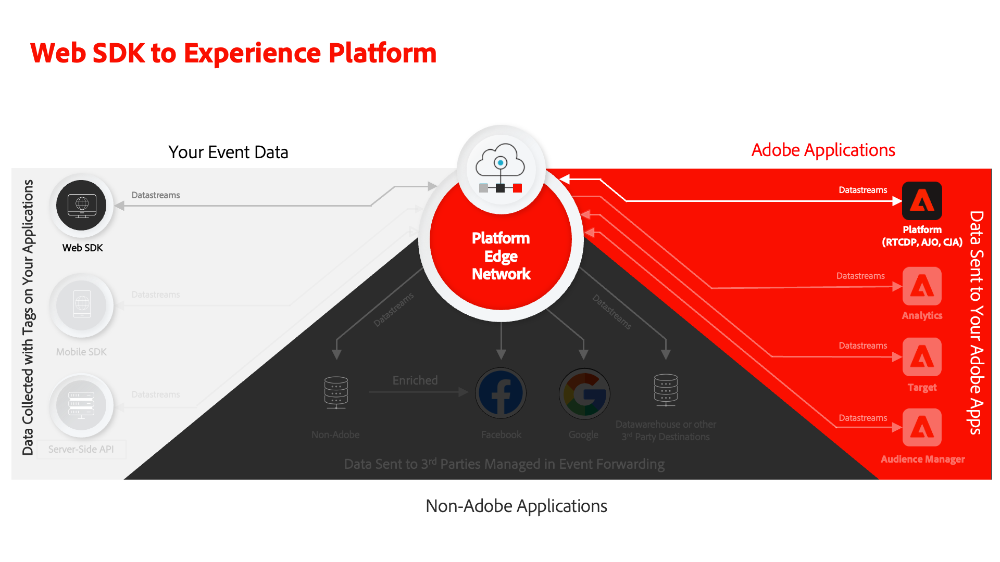

# Transmitir dados para o Experience Platform com o SDK da Web

Saiba como transmitir dados da web para a Adobe Experience Platform com o SDK da web da Platform.

O Experience Platform é o backbone de todos os novos aplicativos Experience Cloud, como o Adobe Real-time Customer Data Platform, Adobe Customer Journey Analytics e Adobe Journey Optimizer. Esses aplicativos foram projetados para usar o SDK da Web da Platform como o método ideal de coleta de dados da Web.

O Experience Platform usa o mesmo esquema XDM criado anteriormente para capturar dados do evento do site da Luma. Quando esses dados são enviados para o Edge Network da plataforma, a configuração do fluxo de dados pode encaminhá-los para o Experience Platform.

## Objetivos de aprendizagem

No final desta lição, você poderá:

* Criar um conjunto de dados na Adobe Experience Platform
* Configurar a sequência de dados para enviar dados do SDK da Web para a Adobe Experience Platform
* Ativar transmissão de dados da Web para o Perfil do cliente em tempo real
* Validar se os dados chegaram ao conjunto de dados da Plataforma e ao Perfil do cliente em tempo real

## Pré-requisitos

Para concluir esta lição, primeiro você deve:

* Ter acesso a um aplicativo do Adobe Experience Platform, como Real-time Customer Data Platform, Journey Optimizer ou Customer Journey Analytics
* Conclua as lições anteriores nas seções Configuração inicial e Configuração de tags deste tutorial.

## Criar um conjunto de dados

Todos os dados assimilados com sucesso na Adobe Experience Platform são mantidos no data lake como conjuntos de dados. A [conjunto de dados](https://experienceleague.adobe.com/en/docs/experience-platform/catalog/datasets/overview) é uma construção de armazenamento e gerenciamento para uma coleção de dados, normalmente uma tabela que contém um esquema (colunas) e campos (linhas). Os conjuntos de dados também contêm metadados que descrevem vários aspectos dos dados armazenados.

Vamos configurar um conjunto de dados para seus dados de evento da Web do Luma:

1. Vá para a [interface de Experience Platform](https://experience.adobe.com/platform/)
1. Confirme que você está na sandbox de desenvolvimento que está usando para este tutorial
1. Abertura **[!UICONTROL Gerenciamento de dados > Conjuntos de dados]** na navegação à esquerda
1. Selecionar **[!UICONTROL Criar conjunto de dados]**

   

1. Selecione o **[!UICONTROL Criar conjunto de dados a partir do esquema]** opção

   

1. Selecione o `Luma Web Event Data` esquema criado na [lição anterior](configure-schemas.md) e selecione **[!UICONTROL Próxima]**

   

1. Forneça um **[!UICONTROL Nome]** e opcional **[!UICONTROL Descrição]** para o conjunto de dados. Para este exercício, use `Luma Web Event Data`e selecione **[!UICONTROL Concluir]**

   

Um conjunto de dados agora está configurado para começar a coletar dados da implementação do SDK da Web da Platform.

## Configurar o fluxo de dados

Agora você pode configurar suas [!UICONTROL sequência de dados] para enviar dados ao [!UICONTROL Adobe Experience Platform]. O fluxo de dados é o link entre a propriedade da tag, o Edge Network da plataforma e o conjunto de dados Experience Platform.

1. Abra o [Coleta de dados](https://experience.adobe.com/#/data-collection){target="blank"} interface
1. Selecionar **[!UICONTROL Datastreams]** na navegação à esquerda
1. Abra o fluxo de dados criado na [Configurar um fluxo de dados](configure-datastream.md) lição, `Luma Web SDK`

   

1. Selecionar **[!UICONTROL Adicionar serviço]**
   
1. Selecionar **[!UICONTROL Adobe Experience Platform]** como o **[!UICONTROL Serviço]**
1. Selecionar `Luma Web Event Data` como o **[!UICONTROL Conjunto de dados do evento]**

1. Selecione **[!UICONTROL Salvar]**.

   

À medida que você gera tráfego no [Site de demonstração da Luma](https://luma.enablementadobe.com/content/luma/us/en.html) mapeados para a propriedade da tag, os dados preenchem o conjunto de dados no Experience Platform.

## Validar o conjunto de dados

Essa etapa é crítica para garantir que os dados tenham chegado ao conjunto de dados. Há dois aspectos da validação dos dados enviados para o conjunto de dados.

* Validar usando o [!UICONTROL Experience Platform Debugger]
* Validar usando o [!UICONTROL Visualizar conjunto de dados]
* Validar usando o [!UICONTROL Serviço de consulta]

### Experience Platform Debugger

Essas etapas são mais ou menos as mesmas do que você fez na [Lição do Debugger](validate-with-debugger.md). No entanto, como os dados só serão enviados para a Platform depois de ativá-los na sequência de dados, você deve gerar mais alguns dados de amostra:

1. Abra o [Site de demonstração Luma](https://luma.enablementadobe.com/content/luma/us/en.html) e selecione o [!UICONTROL Experience Platform Debugger] ícone de extensão

1. Configure o Debugger para mapear a propriedade da tag para *seu* Ambiente de desenvolvimento, conforme descrito na seção [Validar com o Debugger](validate-with-debugger.md) lição

   

1. Faça logon no site Luma usando as credenciais `test@adobe.com`/`test`

1. Retorne à [página inicial do Luma](https://luma.enablementadobe.com/content/luma/us/en.html)

1. Nos beacons de rede do SDK da Web da Platform mostrados pelo depurador, selecione a linha &quot;eventos&quot; para expandir os detalhes em uma janela pop-up

   

1. Procure o &quot;identityMap&quot; na janela pop-up. Aqui você deve ver lumaCrmId com três chaves de authenticatedState, id e primary
   

Agora, os dados devem ser preenchidos na variável `Luma Web Event Data` e pronto para a validação &quot;Visualizar conjunto de dados&quot;.

### Visualizar o conjunto de dados

Para confirmar que os dados chegaram ao data lake da Platform, uma opção rápida é usar o **[!UICONTROL Visualizar conjunto de dados]** recurso. Os dados do SDK da Web são armazenados em microlote no data lake e atualizados periodicamente na interface da Platform. Pode levar de 10 a 15 minutos para ver os dados gerados.

1. No [Experience Platform](https://experience.adobe.com/platform/) , selecione **[!UICONTROL Gerenciamento de dados > Conjuntos de dados]** no painel de navegação esquerdo para abrir a **[!UICONTROL Conjuntos de dados]** painel.

   O painel lista todos os conjuntos de dados disponíveis para sua organização. Os detalhes são exibidos para cada conjunto de dados listado, incluindo seu nome, o esquema ao qual o conjunto de dados adere e o status da execução de ingestão mais recente.

1. Selecione o `Luma Web Event Data` conjunto de dados para abrir seu **[!UICONTROL Atividade do conjunto de dados]** tela.

   

   A tela de atividade inclui um gráfico que visualiza a taxa de mensagens que estão sendo consumidas, bem como uma lista de lotes bem-sucedidos e com falha.

1. No **[!UICONTROL Atividade do conjunto de dados]** , selecione **[!UICONTROL Visualizar conjunto de dados]** próximo ao canto superior direito da tela para visualizar até 100 linhas de dados. Se o conjunto de dados estiver vazio, o link de visualização será desativado.

   

   Na janela de pré-visualização, a visualização hierárquica do esquema do conjunto de dados é mostrada à direita.

   

>[!INFO]
>
>O serviço de query da Adobe Experience Platform é um método mais robusto para validar dados no data lake, mas está além do escopo deste tutorial. Para obter mais detalhes, consulte [Explorar dados](https://experienceleague.adobe.com/en/docs/platform-learn/tutorials/queries/explore-data) na seção Tutoriais da plataforma.

## Ativar o conjunto de dados e o esquema para o Perfil do cliente em tempo real

A próxima etapa é ativar o conjunto de dados e o esquema para o Perfil do cliente em tempo real. A transmissão de dados do SDK da Web será uma das muitas fontes de dados que fluem para a Platform e você deseja unir seus dados da Web a outras fontes de dados para criar perfis de clientes de 360 graus. Para saber mais sobre o Perfil do cliente em tempo real, assista a este vídeo curto:

>[!VIDEO](https://video.tv.adobe.com/v/27251?learn=on&captions=eng)

>[!CAUTION]
>
>Ao trabalhar com seu próprio site e dados, recomendamos uma validação mais robusta dos dados antes de habilitá-los para o Perfil do cliente em tempo real.

**Para habilitar o conjunto de dados:**

1. Abra o conjunto de dados criado, `Luma Web Event Data`

1. Selecione o **[!UICONTROL Alternar perfil]** para ativá-lo

   

1. Confirme se deseja **[!UICONTROL Ativar]** o conjunto de dados

   

**Para ativar o esquema:**

1. Abra o esquema criado, `Luma Web Event Data`

1. Selecione o **[!UICONTROL Alternar perfil]** para ativá-lo

   

1. Selecionar **[!UICONTROL Os dados deste esquema conterão uma identidade principal no campo identityMap.]**

   >[!IMPORTANT]
   >
   >    As identidades primárias são necessárias em todos os registros enviados ao Perfil do cliente em tempo real. Normalmente, os campos de identidade são rotulados no esquema. No entanto, ao usar mapas de identidade, os campos de identidade não ficam visíveis no esquema. Essa caixa de diálogo é para confirmar que você tem uma identidade primária em mente e que você a especificará em um mapa de identidade ao enviar seus dados. Como você sabe, o SDK da Web usa um mapa de identidade e a ID de Experience Cloud (ECID) é a identidade principal padrão.

1. Selecionar **[!UICONTROL Ativar]**

   

1. Selecionar **[!UICONTROL Salvar]** para salvar o esquema atualizado

Agora, o esquema também é ativado para o perfil.

>[!IMPORTANT]
>
>    Depois que um esquema é ativado para o Perfil, ele não pode ser desativado ou excluído. Além disso, os campos não podem ser removidos do esquema após esse ponto. Essas implicações são importantes para ter em mente posteriormente quando você estiver trabalhando com seus próprios dados no ambiente de produção. Você deve usar uma sandbox de desenvolvimento neste tutorial, que pode ser excluída a qualquer momento.
>
>   
> Ao trabalhar com seus próprios dados, recomendamos que você faça as coisas na seguinte ordem:
> 
> * Primeiro, assimile alguns dados em seus conjuntos de dados.
> * Resolva quaisquer problemas que surjam durante o processo de assimilação de dados (por exemplo, problemas de validação ou mapeamento de dados).
> * Ativar seus conjuntos de dados e esquemas para o Perfil
> * Assimilar novamente os dados, se necessário

### Validar um perfil

Você pode procurar um perfil do cliente na interface da Platform (ou na interface da Journey Optimizer) para confirmar se os dados chegaram ao Perfil do cliente em tempo real. Como o nome sugere, os perfis são preenchidos em tempo real, de modo que não há atraso como houve com a validação de dados no conjunto de dados.

Primeiro, você deve gerar mais dados de amostra. Repita as etapas das etapas anteriores nesta lição para fazer logon no site da Luma quando ele for mapeado para a propriedade de tag. Inspect A solicitação do SDK da Web da Platform para garantir que envie dados com o `lumaCRMId`.

1. No [Experience Platform](https://experience.adobe.com/platform/) , selecione **[!UICONTROL Perfis]** no painel de navegação esquerdo

1. Como a variável **[!UICONTROL Namespace de identidade]** use `lumaCRMId`
1. Copie e cole o valor de `lumaCRMId` transmitido na chamada que você inspecionou no Depurador Experience Platform, neste caso `112ca06ed53d3db37e4cea49cc45b71e`.

   

1. Se houver um valor válido no Perfil para `lumaCRMId`, uma ID de perfil é preenchida no console:

   

1. Para visualizar o **[!UICONTROL Perfil do cliente]** para cada ID, selecione o **[!UICONTROL ID do perfil]** na janela principal.

   >[!NOTE]
   >
   >Observação: é possível selecionar o hiperlink da ID do perfil ou, se você selecionar a linha, um menu direito será aberto e você poderá selecionar o hiperlink da ID do perfil
   > 

   Aqui você pode ver todas as identidades vinculadas ao `lumaCRMId`, como o `ECID`.

   

Agora você ativou o SDK da Web da plataforma para Experience Platform (E Real-Time CDP! E o Journey Optimizer! E Customer Journey Analytics!).

### Criar um esquema de fidelidade e assimilar dados de amostra

A conclusão deste exercício é esperada para clientes do Real-time Customer Data Platform e do Journey Optimizer.

Quando os dados do SDK da Web são assimilados na Adobe Experience Platform, eles podem ser enriquecidos por outras fontes de dados assimiladas na Platform. Por exemplo, quando um usuário faz logon no site Luma, um gráfico de identidade é construído no Experience Platform e todos os outros conjuntos de dados habilitados para perfis podem ser unidos para criar Perfis de clientes em tempo real. Para ver isso em ação, crie rapidamente outro conjunto de dados no Adobe Experience Platform com alguns dados de fidelidade de exemplo, para que você possa usar os Perfis de clientes em tempo real com o Real-time Customer Data Platform e o Journey Optimizer. Como você já fez exercícios semelhantes, as instruções serão breves.

Crie o esquema de fidelidade:

1. Criar um novo esquema
1. Escolher **[!UICONTROL Perfil individual]** como o [!UICONTROL classe base]
1. Nomeie o esquema `Luma Loyalty Schema`
1. Adicione o [!UICONTROL Detalhes de fidelidade] grupo de campos
1. Adicione o [!UICONTROL Detalhes demográficos] grupo de campos
1. Selecione o `Person ID` e marque-o como um [!UICONTROL Identidade] e [!UICONTROL Identidade principal] usando o `Luma CRM Id` [!UICONTROL Namespace de identidade].
1. Ativar o esquema para [!UICONTROL Perfil]

   

Para criar o conjunto de dados e assimilar os dados de amostra:

1. Crie um novo conjunto de dados pela `Luma Loyalty Schema`
1. Nomeie o conjunto de dados `Luma Loyalty Dataset`
1. Ativar o conjunto de dados para [!UICONTROL Perfil]
1. Baixe o arquivo de amostra [luma-fidelization-forWeb.json](assets/luma-loyalty-forWeb.json)
1. Arraste e solte o arquivo no seu conjunto de dados
1. Confirme se os dados foram assimilados com êxito

   

### Criar um público-alvo

Os públicos-alvo agrupam perfis em torno de características comuns. Crie um público-alvo rápido que você pode usar em sua campanha da Web:

1. Na interface do Experience Platform, vá para **[!UICONTROL Públicos-alvo]** na navegação à esquerda
1. Selecionar **[!UICONTROL Criar público]**
1. Selecionar **[!UICONTROL Criar regra]**
1. Selecionar **[!UICONTROL Criar]**

   

1. Selecionar **[!UICONTROL Atributos]**
1. Localize o **[!UICONTROL Fidelidade]** > **[!UICONTROL Nível]** e arraste-o para a **[!UICONTROL Atributos]** seção
1. Definir o público-alvo como usuários cujos `tier` é `gold`
1. Nomear o público `Luma Loyalty Rewards – Gold Status`
1. Selecionar **[!UICONTROL Edge]** como o **[!UICONTROL Método de avaliação]**
1. Selecionar **[!UICONTROL Salvar]**

   

Como esse é um público-alvo muito simples, podemos usar o método de avaliação Edge. Os públicos-alvo da borda avaliam a borda, portanto, na mesma solicitação feita pelo SDK da Web para o Platform Edge Network, podemos avaliar a definição do público-alvo e confirmar imediatamente se o usuário se qualificará.

[Próximo: ](setup-analytics.md)

>[!NOTE]
>
>Obrigado por investir seu tempo aprendendo sobre o Adobe Experience Platform Web SDK. Se você tiver dúvidas, quiser compartilhar feedback geral ou tiver sugestões sobre conteúdo futuro, compartilhe-as nesta [Publicação de discussão da comunidade do Experience League](https://experienceleaguecommunities.adobe.com/t5/adobe-experience-platform-data/tutorial-discussion-implement-adobe-experience-cloud-with-web/td-p/444996)
