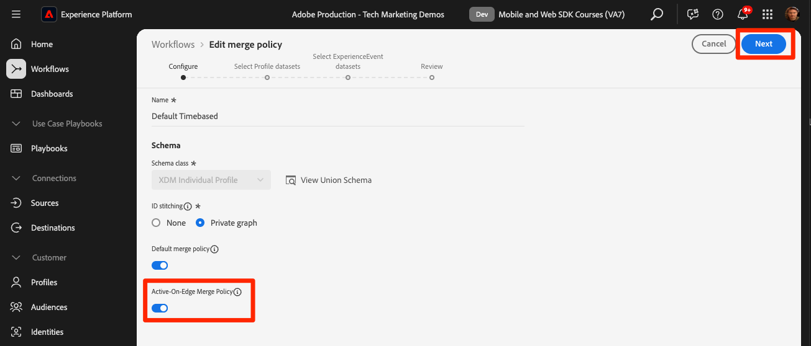

# Transmitir dados para o Experience Platform com o Web SDK

Saiba como transmitir dados da web para a Adobe Experience Platform com o SDK da web da Platform.

O Experience Platform é a espinha dorsal de todos os novos aplicativos da Experience Cloud, como o Adobe Real-Time Customer Data Platform, o Adobe Customer Journey Analytics e o Adobe Journey Optimizer. Esses aplicativos foram projetados para usar o Platform Web SDK como o método ideal de coleta de dados da Web.

O Experience Platform usa o mesmo esquema XDM criado anteriormente para capturar dados do evento do site da Luma. Quando esses dados são enviados para a Platform Edge Network, a configuração da sequência de dados pode encaminhá-los para a Experience Platform.

## Objetivos de aprendizagem

No final desta lição, você poderá:

* Criar um conjunto de dados na Adobe Experience Platform
* Configurar a sequência de dados para enviar dados do Web SDK para o Adobe Experience Platform
* Ativar transmissão de dados da Web para o Perfil do cliente em tempo real
* Validar se os dados chegaram ao conjunto de dados da Plataforma e ao Perfil do cliente em tempo real
* Assimilar dados de amostra do programa de fidelidade na Platform
* Criar um público-alvo simples da Platform

## Pré-requisitos

Para concluir esta lição, primeiro você deve:

* Ter acesso a um aplicativo do Adobe Experience Platform, como Real-Time Customer Data Platform, Journey Optimizer ou Customer Journey Analytics
* Conclua as lições anteriores nas seções Configuração inicial e Configuração de tags deste tutorial.

>[!NOTE]
>
>Se você não tiver aplicativos da Platform, ignore esta lição ou leia tudo.

## Criar um conjunto de dados

Todos os dados assimilados com sucesso na Adobe Experience Platform são mantidos no data lake como conjuntos de dados. Um [conjunto de dados](https://experienceleague.adobe.com/en/docs/experience-platform/catalog/datasets/overview) é uma construção de armazenamento e gerenciamento para uma coleção de dados, geralmente uma tabela que contém um esquema (colunas) e campos (linhas). Os conjuntos de dados também contêm metadados que descrevem vários aspectos dos dados armazenados.

Vamos configurar um conjunto de dados para seus dados de evento da Web do Luma:

1. Ir para a interface [Experience Platform](https://experience.adobe.com/platform/) ou [Journey Optimizer](https://experience.adobe.com/journey-optimizer/)
1. Confirme que você está na sandbox de desenvolvimento que está usando para este tutorial
1. Abra **[!UICONTROL Gerenciamento de dados > Conjuntos de dados]** na navegação à esquerda
1. Selecione **[!UICONTROL Criar conjunto de dados]**

   

1. Selecione a opção **[!UICONTROL Criar conjunto de dados do esquema]**

   

1. Selecione o esquema `Luma Web Event Data` criado na [lição anterior](configure-schemas.md) e selecione **[!UICONTROL Próximo]**

   

1. Forneça um **[!UICONTROL Nome]** e uma **[!UICONTROL Descrição]** opcional para o conjunto de dados. Neste exercício, use `Luma Web Event Data` e selecione **[!UICONTROL Concluir]**

   

Um conjunto de dados agora está configurado para começar a coletar dados da implementação do Platform Web SDK.

## Configurar o fluxo de dados

Agora você pode configurar sua [!UICONTROL sequência de dados] para enviar dados para a [!UICONTROL Adobe Experience Platform]. A sequência de dados é o link entre a propriedade da tag, a Platform Edge Network e o conjunto de dados da Experience Platform.

1. Abrir a interface de [Coleção de Dados](https://experience.adobe.com/#/data-collection){target="blank"}
1. Selecione **[!UICONTROL Datastreams]** na navegação à esquerda
1. Abra a sequência de dados criada na lição [Configurar uma sequência de dados](configure-datastream.md), `Luma Web SDK: Development Environment`

   

1. Selecione **[!UICONTROL Adicionar Serviço]**
   
1. Selecione **[!UICONTROL Adobe Experience Platform]** como o **[!UICONTROL Serviço]**
1. Selecionar **[!UICONTROL Habilitado]**
1. Selecione `Luma Web Event Data` como o **[!UICONTROL Conjunto de Dados do Evento]**
1. Habilitar **[!UICONTROL Segmentação do Edge]**.

1. Selecione **[!UICONTROL Salvar]**.

   

À medida que você gera o tráfego no [Site de demonstração do Luma](https://newluma.enablementadobe.com) mapeado para a propriedade da sua tag, os dados preenchem o conjunto de dados na Experience Platform.

## Validar o conjunto de dados

Essa etapa é crítica para garantir que os dados tenham chegado ao conjunto de dados. Há dois aspectos da validação dos dados enviados para o conjunto de dados.

* Validar usando o [!UICONTROL Experience Platform Debugger]
* Validar usando [!UICONTROL Visualizar Conjunto de Dados]
* Validar usando o [!UICONTROL Serviço de consulta]

### Experience Platform Debugger

Estas etapas são mais ou menos as mesmas que você fez na [Lição de depuração](validate-with-debugger.md). No entanto, como os dados só serão enviados para a Platform depois de ativá-los na sequência de dados, você deve gerar mais alguns dados de amostra:

1. Abra o [site de demonstração Luma](https://newluma.enablementadobe.com) e selecione o ícone de extensão do [!UICONTROL Experience Platform Debugger]

1. Configure o Depurador para mapear a propriedade da tag para o *seu* ambiente de desenvolvimento, conforme descrito na lição [Validar com o Depurador](validate-with-debugger.md)

   

1. Faça logon no site Luma usando as credenciais `test@test.com`/`test` (Se você receber a mensagem &quot;Email ou senha inválidos&quot;, crie uma conta com essas credenciais)

1. Nos beacons de rede do Platform Web SDK mostrados pelo depurador, selecione a linha &quot;eventos&quot; para expandir os detalhes em uma janela pop-up

   

1. Procure o &quot;identityMap&quot; na janela pop-up. Aqui você deve ver lumaCrmId com três chaves de authenticatedState, id e primary
   

Agora, os dados devem ser preenchidos no conjunto de dados `Luma Web Event Data` e estar prontos para a validação &quot;Visualizar conjunto de dados&quot;.

### Visualizar o conjunto de dados

Para confirmar que os dados chegaram ao data lake da Platform, uma opção rápida é usar o recurso **[!UICONTROL Visualizar conjunto de dados]**. Os dados do Web SDK são microprocessados no data lake e atualizados periodicamente na interface da Platform. Pode levar de 10 a 15 minutos para ver os dados gerados.

1. Na interface do [Experience Platform](https://experience.adobe.com/platform/), selecione **[!UICONTROL Gerenciamento de Dados > Conjuntos de Dados]** na navegação à esquerda para abrir o painel **[!UICONTROL Conjuntos de Dados]**.

   O painel lista todos os conjuntos de dados disponíveis para sua organização. Os detalhes são exibidos para cada conjunto de dados listado, incluindo seu nome, o esquema ao qual o conjunto de dados adere e o status da execução de ingestão mais recente.

1. Selecione seu conjunto de dados `Luma Web Event Data` para abrir sua tela **[!UICONTROL Atividade do conjunto de dados]**.

   

   A tela de atividade inclui um gráfico que visualiza a taxa de mensagens que estão sendo consumidas, bem como uma lista de lotes bem-sucedidos e com falha.

1. Na tela **[!UICONTROL Atividade do conjunto de dados]**, selecione **[!UICONTROL Visualizar conjunto de dados]** próximo ao canto superior direito da tela para visualizar até 100 linhas de dados. Se o conjunto de dados estiver vazio, o link de visualização será desativado.

   

   Na janela de pré-visualização, a visualização hierárquica do esquema do conjunto de dados é mostrada à direita.

   

### Consultar os dados

1. Na interface do [Experience Platform](https://experience.adobe.com/platform/), selecione **[!UICONTROL Gerenciamento de Dados > Consultas]** no menu de navegação esquerdo para abrir a tela **[!UICONTROL Consultas]**.
1. Selecionar **[!UICONTROL Criar consulta]**
1. Primeiro, execute uma consulta para ver todos os nomes das tabelas no data lake. Insira `SHOW TABLES` no editor de consultas e clique no ícone reproduzir para executar a consulta.
1. Nos resultados, observe como o nome da tabela é algo como `luma_web_event_data`
1. Agora consulte a tabela com uma consulta simples que faz referência à sua tabela (observe que, por padrão, a consulta será limitada a 100 resultados): `SELECT * FROM "luma_web_event_data"`
1. Após alguns minutos, você deverá ver registros de amostra dos seus dados da Web.

>[!ERROR]
>
>Se você receber um erro &quot;Tabela não provisionada&quot;, verifique novamente o nome da tabela. Também pode ser que o microlote de dados ainda não tenha caído no data lake. Tente novamente em 10-15 minutos.

>[!INFO]
>
>  Para obter mais detalhes sobre o serviço de consulta da Adobe Experience Platform, consulte [Explorar dados](https://experienceleague.adobe.com/en/docs/platform-learn/tutorials/queries/explore-data) na seção de tutoriais da Platform.

## Ativar o conjunto de dados e o esquema para o Perfil do cliente em tempo real

Para clientes do Real-Time Customer Data Platform e do Journey Optimizer, a próxima etapa é ativar o conjunto de dados e o esquema para o Perfil do cliente em tempo real. A transmissão de dados do Web SDK será uma das muitas fontes de dados que fluem para a Platform e você deseja unir seus dados da Web a outras fontes de dados para criar perfis de clientes de 360 graus. Para saber mais sobre o Perfil do cliente em tempo real, assista a este vídeo curto:

>[!VIDEO](https://video.tv.adobe.com/v/27251?learn=on&captions=eng)

>[!CAUTION]
>
>Ao trabalhar com seu próprio site e dados, recomendamos uma validação mais robusta dos dados antes de habilitá-los para o Perfil do cliente em tempo real.

**Para habilitar o conjunto de dados:**

1. Abra o conjunto de dados criado, `Luma Web Event Data`

1. Selecione a **[!UICONTROL Alternância de Perfil]** para ativá-la

   

1. Confirme se deseja **[!UICONTROL Habilitar]** o conjunto de dados

   

**Para habilitar o esquema:**

1. Abrir o esquema criado, `Luma Web Event Data`

1. Selecione a **[!UICONTROL Alternância de Perfil]** para ativá-la

   

1. Selecione **[!UICONTROL Os dados deste esquema conterão uma identidade primária no campo identityMap.]**

   >[!IMPORTANT]
   >
   >    As identidades primárias são necessárias em todos os registros enviados ao Perfil do cliente em tempo real. Normalmente, os campos de identidade são rotulados no esquema. No entanto, ao usar mapas de identidade, os campos de identidade não ficam visíveis no esquema. Essa caixa de diálogo é para confirmar que você tem uma identidade primária em mente e que você a especificará em um mapa de identidade ao enviar seus dados. Como você sabe, o Web SDK usa um mapa de identidade com a Experience Cloud Id (ECID) como a identidade principal padrão e uma ID autenticada como a identidade principal, quando disponível.

1. Selecionar **[!UICONTROL Habilitar]**

   

1. Selecione **[!UICONTROL Salvar]** para salvar o esquema atualizado

Agora, o esquema também é ativado para o perfil.

>[!IMPORTANT]
>
>    Depois que um esquema é ativado para Perfil, ele não pode ser desativado ou excluído sem redefinir ou excluir toda a sandbox. Além disso, os campos não podem ser removidos do esquema após esse ponto.
>
>   
> Ao trabalhar com seus próprios dados, recomendamos que você faça as coisas na seguinte ordem:
> 
> * Primeiro, assimile alguns dados em seus conjuntos de dados.
> * Resolva quaisquer problemas que surjam durante o processo de assimilação de dados (por exemplo, problemas de validação ou mapeamento de dados).
> * Ativar seus conjuntos de dados e esquemas para o Perfil
> * Assimilar novamente os dados, se necessário

### Validar um perfil

Você pode procurar um perfil do cliente na interface da Platform (ou na interface da Journey Optimizer) para confirmar se os dados chegaram ao Perfil do cliente em tempo real. Como o nome sugere, os perfis são preenchidos em tempo real, de modo que não há atraso como houve com a validação de dados no conjunto de dados.

Primeiro, você deve gerar mais dados de amostra. Repita as etapas das etapas anteriores nesta lição para fazer logon no site da Luma quando ele for mapeado para a propriedade de tag. Inspecione a solicitação do Platform Web SDK para verificar se ela envia dados com o `lumaCRMId`.

1. Na interface do [Experience Platform](https://experience.adobe.com/platform/), selecione **[!UICONTROL Cliente]** > **[!UICONTROL Perfis]** no menu de navegação esquerdo

1. Como o **[!UICONTROL Namespace de identidade]** usa `lumaCRMId`
1. Copie e cole o valor do `lumaCRMId` transmitido na chamada que você inspecionou no Experience Platform Debugger, neste caso `f660ab912ec121d1b1e928a0bb4bc61b`.

   

1. Se houver um valor válido no Perfil para `lumaCRMId`, uma ID de Perfil será preenchida no console:

   

1. Para exibir o **[!UICONTROL Perfil do Cliente]** completo para cada ID, selecione a **[!UICONTROL ID do Perfil]** na janela principal.

   >[!NOTE]
   >
   >Observação: é possível selecionar o hiperlink da ID do perfil ou, se você selecionar a linha, um menu direito será aberto e você poderá selecionar o hiperlink da ID do perfil
   > 

   Aqui você pode ver todas as identidades vinculadas ao `lumaCRMId`, como o `ECID`.

   

Agora você ativou o Platform Web SDK para Experience Platform (e o Real-Time CDP! E o Journey Optimizer! E Customer Journey Analytics!).

## Criar um público avaliado pela Edge

A conclusão deste exercício é recomendada para clientes do Real-Time Customer Data Platform e do Journey Optimizer.

Quando os dados do Web SDK são assimilados na Adobe Experience Platform, eles podem ser enriquecidos por outras fontes de dados que você assimilou na Platform. Por exemplo, quando um usuário faz logon no site Luma, um gráfico de identidade é construído no Experience Platform e todos os outros conjuntos de dados habilitados para perfis podem potencialmente ser unidos para criar Perfis de clientes em tempo real. Para ver isso em ação, você criará rapidamente outro conjunto de dados na Adobe Experience Platform com alguns dados de fidelidade de exemplo, para que possa usar Perfis de clientes em tempo real com a Real-Time Customer Data Platform e a Journey Optimizer. Em seguida, você criará um público-alvo com base nesses dados.

### Criar um esquema de fidelidade e assimilar dados de amostra

Como você já fez exercícios semelhantes, as instruções serão breves.

Crie o esquema de fidelidade:

1. Criar um novo esquema
1. Escolha **[!UICONTROL Perfil Individual]** como a [!UICONTROL classe base]
1. Nomeie o esquema `Luma Loyalty Schema`
1. Adicionar o grupo de campos [!UICONTROL Detalhes de fidelidade]
1. Adicionar o grupo de campos [!UICONTROL Detalhes demográficos]
1. Selecione o campo `Person ID` e marque-o como uma [!UICONTROL Identidade] e [!UICONTROL Identidade principal] usando o `Luma CRM Id` [!UICONTROL Namespace de identidade].
1. Habilite o esquema para [!UICONTROL Perfil]. Se não conseguir encontrar o botão de alternância Perfil, tente clicar no nome do esquema no canto superior esquerdo.
1. Salvar o esquema

   

Para criar o conjunto de dados e assimilar os dados de amostra:

1. Crie um novo conjunto de dados a partir do `Luma Loyalty Schema`
1. Nomeie o conjunto de dados `Luma Loyalty Dataset`
1. Habilitar o conjunto de dados para [!UICONTROL Perfil]
1. Baixe o arquivo de amostra [luma-fidelization-forWeb.json](assets/luma-loyalty-forWeb.json)
1. Arraste e solte o arquivo no seu conjunto de dados
1. Confirme se os dados foram assimilados com êxito

   

### Definir uma política de mesclagem ativa no Edge

Todos os públicos-alvo são criados com uma política de mesclagem. As políticas de mesclagem criam &quot;visualizações&quot; diferentes de um perfil, podem conter um subconjunto de conjuntos de dados e prescrevem uma ordem de prioridade quando conjuntos de dados diferentes contribuem com os mesmos atributos de perfil. Para ser avaliado na borda, um público-alvo deve usar uma política de mesclagem com a configuração **[!UICONTROL Política de mesclagem ativa no Edge]**.

>[!IMPORTANT]
>
>Somente uma política de mesclagem por sandbox pode ter a configuração **[!UICONTROL Política de mesclagem ativa na Edge]**

1. Abra a interface do Experience Platform ou do Journey Optimizer e verifique se você está no ambiente de desenvolvimento que está usando para o tutorial.
1. Navegue até a página **[!UICONTROL Cliente]** > **[!UICONTROL Perfis]** > **[!UICONTROL Políticas de Mesclagem]**
1. Abrir a **[!UICONTROL Política de mesclagem padrão]** (provavelmente denominada `Default Timebased`)
   
1. Habilitar a configuração **[!UICONTROL Política de Mesclagem Ativa-na-Edge]**
1. Selecionar **[!UICONTROL Próximo]**

   
1. Continue selecionando **[!UICONTROL Avançar]** para continuar pelas outras etapas do fluxo de trabalho e selecione **[!UICONTROL Concluir]** para salvar suas configurações
   

Agora é possível criar públicos-alvo que serão avaliados na Edge.

### Criar um público-alvo

Os públicos-alvo agrupam perfis em torno de características comuns. Crie um público-alvo simples que você possa usar no Real-Time CDP ou no Journey Optimizer:

1. Na interface do Experience Platform ou da Journey Optimizer, vá para **[!UICONTROL Cliente]** > **[!UICONTROL Públicos-alvo]** na navegação à esquerda
1. Selecione **[!UICONTROL Criar público-alvo]**
1. Selecionar **[!UICONTROL Regra de compilação]**
1. Selecionar **[!UICONTROL Criar]**

   

1. Selecionar **[!UICONTROL Atributos]**
1. Localize o campo **[!UICONTROL Fidelidade]** > **[!UICONTROL Camada]** e arraste-o para a seção **[!UICONTROL Atributos]**
1. Defina a audiência como usuários cujo `tier` é `gold`
1. Nomear a audiência `Luma Loyalty Rewards – Gold Status`
1. Selecione **[!UICONTROL Edge]** como o **[!UICONTROL Método de avaliação]**
1. Selecione **[!UICONTROL Salvar]**

   

>[!NOTE]
>
> Como definimos a política de mesclagem padrão como **[!UICONTROL Política de mesclagem ativa na Edge]**, o público-alvo criado é associado automaticamente a essa política de mesclagem.

Como esse é um público-alvo muito simples, podemos usar o método de avaliação do Edge. Os públicos do Edge avaliam na borda, portanto, na mesma solicitação feita pelo Web SDK ao Platform Edge Network, podemos avaliar a definição do público e confirmar imediatamente se o usuário se qualificará.

>[!NOTE]
>
>Obrigado por investir seu tempo aprendendo sobre o Adobe Experience Platform Web SDK. Se você tiver dúvidas, quiser compartilhar comentários gerais ou tiver sugestões sobre conteúdo futuro, compartilhe-as nesta [postagem de discussão da Comunidade Experience League](https://experienceleaguecommunities.adobe.com/adobe-experience-platform-18/tutorial-discussion-implement-adobe-experience-cloud-with-web-sdk-tutorial-248848)
