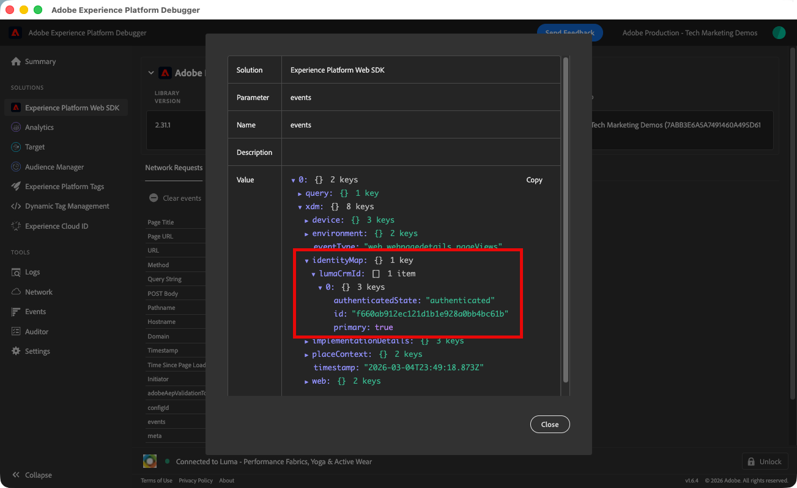
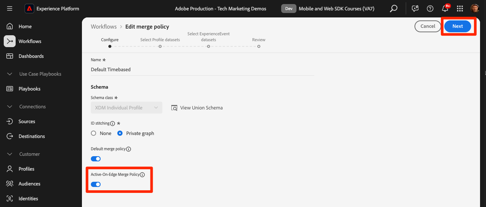

# Segmentação de Perfis de clientes em tempo real e Edge

## Ativar o conjunto de dados e o esquema para o Perfil do cliente em tempo real

Para clientes do Real-Time Customer Data Platform e do Journey Optimizer, a próxima etapa é ativar o conjunto de dados e o esquema para o Perfil do cliente em tempo real. A transmissão de dados do Web SDK será uma das muitas fontes de dados que fluem para a Platform e você deseja unir seus dados da Web a outras fontes de dados para criar perfis de clientes de 360 graus. Para saber mais sobre o Perfil do cliente em tempo real, assista a este vídeo curto:

>[!VIDEO](https://video.tv.adobe.com/v/31686?learn=on&captions=por_br)

>[!CAUTION]
>
>Ao trabalhar com seu próprio site e dados, recomendamos uma validação mais robusta dos dados antes de habilitá-los para o Perfil do cliente em tempo real.

### Ativar o esquema

Para ativar o esquema para o perfil:

1. Abrir o esquema criado, `Luma Web Event Data`

1. Selecione a **[!UICONTROL Alternância de Perfil]** para ativá-la

   

1. Selecione **[!UICONTROL Os dados deste esquema conterão uma identidade primária no campo identityMap.]**

1. Selecionar **[!UICONTROL Habilitar]**

   

   >[!IMPORTANT]
   >
   >    As identidades primárias são necessárias em todos os registros enviados ao Perfil do cliente em tempo real. Cada registro se torna um &quot;fragmento de perfil&quot; e as identidades primárias são as chaves para pesquisar esses fragmentos.
   > 
   > Com alguns tipos de dados, os campos de identidade são rotulados no esquema. No entanto, com dados de evento capturados pelos SDKs da Experience Platform, os mapas de identidade são típicos e os campos de identidade não estão visíveis no esquema.
   >
   > Essa caixa de diálogo é para confirmar que você tem uma identidade primária em mente e que você a especificará em um mapa de identidade ao enviar seus dados, a configurará com regras de vinculação de gráficos de identidade ou ambas. Recomendamos que você faça ambos.
   >
   > Como você sabe, nossa implementação do Luma usa um mapa de identidade com o lumaCrmId autenticado como a identidade principal quando disponível, caso contrário, ele assumirá como padrão a Experience Cloud Id (ECID).

1. Selecione **[!UICONTROL Salvar]** para salvar o esquema atualizado

Agora o esquema é ativado para o perfil.

### Ativar o conjunto de dados

Para habilitar o conjunto de dados:

1. Abra o conjunto de dados criado, `Luma Web Event Data`

1. Selecione a **[!UICONTROL Alternância de Perfil]** para ativá-la

   

1. Confirme se deseja **[!UICONTROL Habilitar]** o conjunto de dados

>[!IMPORTANT]
>
>  Depois que um esquema é ativado para o Perfil e os dados são assimilados no conjunto de dados, ele não pode ser desativado ou excluído sem redefinir ou excluir toda a sandbox. Além disso, os campos que receberam dados não podem ser removidos do esquema após esse ponto.
>
>   
> Ao trabalhar com seus próprios dados, recomendamos que você faça as coisas na seguinte ordem:
> 
> * Primeiro, assimile alguns dados em seus conjuntos de dados.
> * Resolva quaisquer problemas que surjam durante o processo de assimilação de dados (por exemplo, problemas de validação ou mapeamento de dados).
> * Ativar seus conjuntos de dados e esquemas para o Perfil
> * Assimilar novamente os dados, se necessário

### Validar um perfil

Você pode procurar um perfil do cliente na interface da Platform (ou na interface da Journey Optimizer) para confirmar se os dados chegaram ao Perfil do cliente em tempo real. Como o nome sugere, os perfis são preenchidos em tempo real, de modo que não há atraso como houve com a validação de dados no conjunto de dados.

Primeiro, você deve gerar mais dados de amostra no conjunto de dados habilitado para perfil:

1. Abra o [site de demonstração do Luma](https://luma.enablementadobe.com) e selecione o ícone de extensão do [!UICONTROL Experience Platform Debugger]

1. Configure o Depurador para mapear a propriedade da tag para o *seu* ambiente de desenvolvimento, conforme descrito na lição [Validar com o Depurador](validate-with-debugger.md)

   

1. Navegue pelo site. Veja alguns produtos e adicione alguns ao carrinho de compras.

1. Faça logon no site Luma usando as credenciais `test@test.com`/`test` (Se você receber a mensagem &quot;Email ou senha inválidos&quot;, crie uma conta com essas credenciais)

1. Abra a linha &quot;eventos&quot; para procurar algumas de suas variáveis XDM
1. Procure o &quot;identityMap&quot; na janela pop-up. Aqui você deve ver lumaCrmId com três chaves de authenticatedState, id e primary. Observe como o valor de lumaCrmId para este logon é `f660ab912ec121d1b1e928a0bb4bc61b`.

   

Agora vamos procurar nosso perfil no Experience Platform:

1. Na interface do [Experience Platform](https://experience.adobe.com/platform/), selecione **[!UICONTROL Cliente]** > **[!UICONTROL Perfis]** no menu de navegação esquerdo

1. Como o **[!UICONTROL Namespace de identidade]** usa `Luma CRM ID`
1. Copie e cole o valor do `lumaCrmId` transmitido na chamada que você inspecionou no Experience Platform Debugger, neste caso `f660ab912ec121d1b1e928a0bb4bc61b`

1. Se houver um valor válido no Perfil para `lumaCRMId`, uma ID de Perfil será preenchida no console

1. Para exibir o **[!UICONTROL Perfil do Cliente]** completo, selecione **[!UICONTROL Exibir]**:

   

1. Primeiro, você verá um resumo do perfil. Ainda não há muito neste perfil, mas aqui as identidades vinculadas no perfil, o `lumaCRMId` e `ECID`:

   

1. Nesse ponto, a maioria dos dados de perfil disponíveis é constituída dos dados do evento provenientes da atividade da Web. Selecione **[!UICONTROL Eventos]** para ver os dados da sequência de cliques:

   

## Evitar o recolhimento de perfis

Agora vamos ver algo que você nunca quer que aconteça em sua própria implementação: o colapso dos gráficos.

### Compreender o problema

Primeiro, vamos gerar mais alguns dados de amostra para que possamos ver o problema:

1. Sem excluir cookies ou objetos localStorage, abra o [site de demonstração do Luma](https://luma.enablementadobe.com) e selecione o ícone de extensão do [!UICONTROL Experience Platform Debugger]

1. Configure o Depurador para mapear a propriedade da tag para o *seu* ambiente de desenvolvimento, conforme descrito na lição [Validar com o Depurador](validate-with-debugger.md)

   

1. Esperamos que você ainda esteja conectado ao site Luma usando as credenciais `test@test.com`/`test`. Caso contrário, faça logon novamente.

1. Navegue pelo site. Veja alguns produtos e adicione alguns ao carrinho de compras.

1. Agora, saia.

1. Entre novamente, criando uma conta como um usuário diferente (`spouse@test.com/test`). Estamos tentando replicar um cenário de &quot;dispositivo compartilhado&quot;, em que dois usuários compartilham o mesmo navegador da Web, se autenticam no mesmo site e compartilham o mesmo valor `ECID`.
1. Confirme no Debugger que você tem um LumaCrmId diferente, `98d73957f59c67617611d56ba7e8dbaa` para `spouse@test.com/test`.

   

1. Exibir alguns produtos adicionais

Agora, procure o perfil novamente:

1. Procurar `Luma CRM ID` igual a `f660ab912ec121d1b1e928a0bb4bc61b` novamente
1. Observe que o perfil agora está vinculado a duas IDs diferentes do CRM da Luma

1. Selecionar **[!UICONTROL Exibir Gráfico De Identidade]**

   

1. O gráfico de identidade ajuda a visualizar este perfil no qual, devido ao compartilhamento do dispositivo, dois valores `lumaCrmId` são unidos por um valor `ECID` comum.

   

Isso pode ser um grande problema para uma implementação do Experience Platform. Os dados do evento de ambos os usuários não são unidos em um único perfil, mas outros tipos de dados assimilados na Platform usando esses `lumaCrmId` valores também serão mesclados.

### Corrigir com regras de vinculação do gráfico de identidade

Para resolver preventivamente o problema de recolhimento de gráficos, use o recurso de regras de vinculação de gráficos de identidade no Adobe Experience Platform antes de habilitar a implementação do Web SDK.

>[!WARNING]
>
> Essas etapas normalmente são configuradas por um arquiteto de dados que gerencia toda a implementação da Platform. Há muito mais no recurso do que o mostrado aqui e muitos cenários complexos que devem ser cuidadosamente simulados primeiro.
>
> Conclua essas etapas somente se você estiver concluindo este tutorial em uma sandbox de desenvolvimento dedicada que possa ser excluída após a conclusão deste tutorial. Essas alterações na sandbox não podem ser revertidas. Consulte os [tutoriais sobre regras de vinculação de gráfico de identidade](https://experienceleague.adobe.com/pt-br/docs/platform-learn/tutorials/identities/graph-linking-rules/overview) para saber mais.

Para ativar as regras de vinculação do gráfico de identidade:

1. Em qualquer tela de Identidades, abra **[!UICONTROL Configurações]**:

   

1. Revise os avisos no modal e selecione **[!UICONTROL Continuar]**
1. Arraste o `Luma CRM ID` para que seja o namespace de prioridade mais alta na lista
1. Verifique a configuração **[!UICONTROL Exclusivo por gráfico]** para o `Luma CRM ID`
1. Selecionar **[!UICONTROL Próximo]**
   
1. Revise o modal e **[!UICONTROL Confirme]**
1. Selecione **[!UICONTROL Avançar]** para ignorar a etapa de simulação

   >[!WARNING]
   >
   > Novamente, não conclua esse fluxo de trabalho para ativar essas configurações de identidade se não estiver trabalhando em sua própria sandbox de desenvolvimento dedicada.

1. Insira o nome da sandbox e selecione **[!UICONTROL Confirmar]**

   

Volte ao site em 24 horas, faça logon novamente como `test@test.com` ou `spouse@test.com` e veja se os perfis foram separados.

## Criar um público avaliado pela Edge

A conclusão deste exercício é recomendada para clientes do Real-Time Customer Data Platform e do Journey Optimizer.

Quando os dados do Web SDK são assimilados na Adobe Experience Platform, eles podem ser enriquecidos por outras fontes de dados que você assimilou na Platform. Por exemplo, quando um usuário faz logon no site Luma, um gráfico de identidade é construído no Experience Platform e todos os outros conjuntos de dados habilitados para perfis podem potencialmente ser unidos para criar Perfis de clientes em tempo real. Para ver isso em ação, você criará rapidamente outro conjunto de dados na Adobe Experience Platform com alguns dados de fidelidade de exemplo, para que possa usar Perfis de clientes em tempo real com a Real-Time Customer Data Platform e a Journey Optimizer. Em seguida, você criará um público-alvo com base nesses dados.

### Criar um esquema de fidelidade e assimilar dados de amostra

Como você já fez exercícios semelhantes, as instruções serão breves.

Crie o esquema de fidelidade:

1. Criar um novo esquema
1. Escolha **[!UICONTROL Perfil Individual]** como a [!UICONTROL classe base]
1. Nomeie o esquema `Luma Loyalty Schema`
1. Adicionar o grupo de campos [!UICONTROL Detalhes de fidelidade]
1. Adicionar o grupo de campos [!UICONTROL Detalhes demográficos]
1. Selecione o campo `Person ID` e marque-o como uma [!UICONTROL Identidade] e [!UICONTROL Identidade principal] usando o `Luma CRM Id` [!UICONTROL Namespace de identidade].
1. Habilite o esquema para [!UICONTROL Perfil]. Se não conseguir encontrar o botão de alternância Perfil, tente clicar no nome do esquema no canto superior esquerdo.
1. Salvar o esquema

   

Para criar o conjunto de dados e assimilar os dados de amostra:

1. Crie um novo conjunto de dados a partir do `Luma Loyalty Schema`
1. Nomeie o conjunto de dados `Luma Loyalty Dataset`
1. Habilitar o conjunto de dados para [!UICONTROL Perfil]
1. Baixe o arquivo de amostra [luma-fidelization-forWeb.json](assets/luma-loyalty-forWeb.json)
1. Arraste e solte o arquivo no seu conjunto de dados
1. Confirme se os dados foram assimilados com êxito

   

### Definir uma política de mesclagem ativa no Edge

Todos os públicos-alvo são criados com uma política de mesclagem. As políticas de mesclagem criam &quot;visualizações&quot; diferentes de um perfil, podem conter um subconjunto de conjuntos de dados e prescrevem uma ordem de prioridade quando conjuntos de dados diferentes contribuem com os mesmos atributos de perfil. Para ser avaliado na borda, um público-alvo deve usar uma política de mesclagem com a configuração **[!UICONTROL Política de mesclagem ativa no Edge]**.

>[!IMPORTANT]
>
>Somente uma política de mesclagem por sandbox pode ter a configuração **[!UICONTROL Política de mesclagem ativa na Edge]**

1. Abra a interface do Experience Platform ou do Journey Optimizer e verifique se você está no ambiente de desenvolvimento que está usando para o tutorial.
1. Navegue até a página **[!UICONTROL Cliente]** > **[!UICONTROL Perfis]** > **[!UICONTROL Políticas de Mesclagem]**
1. Abrir a **[!UICONTROL Política de mesclagem padrão]** (provavelmente denominada `Default Timebased`)
   
1. Habilitar a configuração **[!UICONTROL Política de Mesclagem Ativa-na-Edge]**
1. Selecionar **[!UICONTROL Próximo]**

   
1. Continue selecionando **[!UICONTROL Avançar]** para continuar pelas outras etapas do fluxo de trabalho e selecione **[!UICONTROL Concluir]** para salvar suas configurações
   

Agora é possível criar públicos-alvo que serão avaliados na Edge.

### Criar um público-alvo

Os públicos-alvo agrupam perfis em torno de características comuns. Crie um público-alvo simples que você possa usar no Real-Time CDP ou no Journey Optimizer:

1. Na interface do Experience Platform ou da Journey Optimizer, vá para **[!UICONTROL Cliente]** > **[!UICONTROL Públicos-alvo]** na navegação à esquerda
1. Selecione **[!UICONTROL Criar público-alvo]**
1. Selecionar **[!UICONTROL Regra de compilação]**
1. Selecionar **[!UICONTROL Criar]**

   

1. Selecionar **[!UICONTROL Atributos]**
1. Localize o campo **[!UICONTROL Fidelidade]** > **[!UICONTROL Camada]** e arraste-o para a seção **[!UICONTROL Atributos]**
1. Defina a audiência como usuários cujo `tier` é `gold`
1. Nomear a audiência `Luma Loyalty Rewards – Gold Status`
1. Selecione **[!UICONTROL Edge]** como o **[!UICONTROL Método de avaliação]**
1. Selecione **[!UICONTROL Salvar]**

   

>[!NOTE]
>
> Como definimos a política de mesclagem padrão como **[!UICONTROL Política de mesclagem ativa na Edge]**, o público-alvo criado é associado automaticamente a essa política de mesclagem.

Como esse é um público-alvo muito simples, podemos usar o método de avaliação do Edge. Os públicos do Edge avaliam na borda, portanto, na mesma solicitação feita pelo Web SDK ao Platform Edge Network, podemos avaliar a definição do público e confirmar imediatamente se o usuário se qualificará.

>[!NOTE]
>
>Obrigado por investir seu tempo aprendendo sobre o Adobe Experience Platform Web SDK. Se você tiver dúvidas, quiser compartilhar comentários gerais ou tiver sugestões sobre conteúdo futuro, compartilhe-as nesta [postagem de discussão da Comunidade Experience League](https://experienceleaguecommunities.adobe.com/adobe-experience-platform-18/tutorial-discussion-implement-adobe-experience-cloud-with-web-sdk-tutorial-248848?profile.language=pt)
